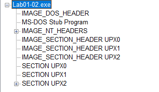

# Lab 1 - Basic Analysis

The purpose of the labs is to give you an opportunity to practice the skills taught in the chapter. In order to simulate realistic malware analysis you will be given little or no information about the program you are analyzing. Like all of the labs throughout this book, the basic static analysis lab files have been given generic names to simulate unknown malware, which typically use meaningless or misleading names.
Each of the labs consists of a malicious file, a few questions, short answers to the questions, and a detailed analysis of the malware. The solutions to the labs are included in Appendix C.
The labs include two sections of answers. The first section consists of short answers, which should be used if you did the lab yourself and just want to check your work. The second section includes detailed explanations for you to follow along with our solution and learn how we found the answers to the questions posed in each lab.


## Lab 1-1

This lab uses the files Lab01-01.exe and Lab01-01.dll. Use the tools and techniques described in the chapter to gain information about the files and answer the questions below.


**1. Upload the files to http://www.VirusTotal.com/ and view the reports. Does either file match any existing antivirus signatures?**

First of all, I checked the SHA256 hashes of both files in VirusTotal before submit them. These are:

```
58898bd42c5bd3bf9b1389f0eee5b39cd59180e8370eb9ea838a0b327bd6fe47 Lab01-01.exe
f50e42c8dfaab649bde0398867e930b86c2a599e8db83b8260393082268f2dba Lab01-01.dll
```

The results of VirusTotal are the following:

40/69 Antivirus detect the file _Lab01-01.exe_ as malicious.
32/69 Antivirus detect the file _Lab01-01.dll_ as malicious.

The descriptions of the antivirus software are quite generic, many of them just say that they are a _Trojan_.

**2. When were these files compiled?**

We can check this value with several tools, in my case I have used VirusTotal and PEviwe:

- Lab01-01.exe: 2010-12-19 16:16:19
- Lab01-01.dll: 2010-12-19 16:16:38

**3. Are there any indications that either of these files is packed or obfuscated? If so, what are these indicators?**

We can check it with _PEview_, by looking for the values of _Virtual Size_ and _Size of Raw Data_  of the _IMAGE SECTION HEADER .text_ header:

- Lab01-01.exe:
	- Virtual Size: 970
	- Size of Raw Data: 1000
- Lab01-01.dll:
	- Virtual Size: 39E
	- Size of Raw Data: 1000


**4. Do any imports hint at what this malware does? If so, which imports are they?**

The imports are one of the main indicator of what a malware does, so it is important to check them:

- Lab01-01.exe:

This file seems to perform same filesystem operations, since it loads several functions to do so. Some of these functions allow the program to search for files and create and copy files.

```
======================
KERNEL32.dll
======================
UnmapViewOfFile
MapViewOfFile
CreateFileMappingA
CreateFileA
FindClose
FindNextFileA
FindFirstFileA
CopyFileA
```

- Lab01-01.dll:

This file seems to perform several network and process operations, like creating a mutex or a new process, based on the imported functions.

```
======================
KERNEL32.dll
======================
Sleep
CreateProcessA
CreateMutexA
OpenMutexA
CloseHandle
======================
WS2_32.dll
======================
socket
WSAStartup
inet_addr
connect
send
shutdown
recv
closesocket
WSACleanup
htons
```

**5. Are there any other files or host-based indicators that you could look for on infected systems?**

We can look for strings and see if there is something interesting within them:

Lab01-01.exe:

```
strings Lab01-01.exe
...
kerne132.dll
kernel32.dll
.exe
C:\*
C:\windows\system32\kerne132.dll
Kernel32.
Lab01-01.dll
C:\Windows\System32\Kernel32.dll
WARNING_THIS_WILL_DESTROY_YOUR_MACHINE
```

This file seems to perform some operation with the file called _Lab01-01.dll_. Also it do something with the library _kernel32.dll_, probably modify it, since we can see another file called _kerne132.dll_, with the letter _L_ changed for the number _1_.

- Lab01-01.dll:

```
strings Lab01-01.dll
...
hello
127.26.152.13
SADFHUHF
...
```

We can see that an IP address is shown, an important network-based indicator. Also, the string _SADFHUHF_ could be the name of the mutex created by the malware.

**6. What network-based indicators could be used to find this malware on infected machines?**

With basic static analysis techniques we can only get one network-based indicator, the IP address _127.26.152.13_.

**7. What would you guess is the purpose of these files?**

After the initial analysis is performed, we can perform some hypotheses regarding the samples:

- Lab01-01.exe: this file seems to copy the file _Lab01-01.dll_ into _C:\windows\system32\\_ with the name _kerne132.dll_ (it changes the _L_ for a _1_).
- Lab01-01.dll: this file seems to execute some process and perform some network requests to the IP address _127.26.152.13_.


## Lab 1-2

Analyze the file Lab01-02.exe.

**1. Upload the Lab01-02.exe file to http://www.VirusTotal.com/. Does it match any existing antivirus definitions?**

First of all, I checked the SHA256 hash of the files in VirusTotal before submit it. These are:

```
c876a332d7dd8da331cb8eee7ab7bf32752834d4b2b54eaa362674a2a48f64a6 Lab01-02.exe
```

The results of VirusTotal are the following:

44/69 Antivirus detect the file _Lab01-02.exe_ as malicious.

The definitions of the Antivirus software are quite generic, many of them just say that the sample is a _Trojan_.

**2. Are there any indications that this file is packed or obfuscated? If so, what are these indicators? If the file is packed, unpack it if possible.**

The file seems to be obfuscated with UPX, based on the headers shown by _PEview_:



Also if we analyze the binary with _PE Detective_ we can also see that it is packed with _UPX v3.0_.

To unpack this binary, we simply use _UPX_ program as so:

```
upx -d Lab01-02.exe
```

To not overwrite the original file, we could execute the following command:

```
upx -d Lab01-02.exe -o Lab01-02_unpacked.exe
```

This gives us the unpacked binary:

```
8bcbe24949951d8aae6018b87b5ca799efe47aeb623e6e5d3665814c6d59aeae Lab01-02.exe
```

This new binary has the following VirusTotal results:

49/71 Antivirus detect the file _Lab01-02.exe_ as malicious.

**3. Do any imports hint at this program’s functionality? If so, which imports are they and what do they tell you?**

The file has some interesting imports like the following:

```
======================
KERNEL32.DLL
======================
SystemTimeToFileTime
GetModuleFileNameA
CreateWaitableTimerA
ExitProcess
OpenMutexA
SetWaitableTimer
WaitForSingleObject
CreateMutexA
CreateThread
======================
ADVAPI32.dll
======================
CreateServiceA
StartServiceCtrlDispatcherA
OpenSCManagerA
======================
WININET.dll
======================
InternetOpenUrlA
InternetOpenA
```

As we can see, it seems to perform some system operations like creating mutexes, also, it seems to have the ability to create a new service in the host, probably to gain persistence. Finally, it also can perform network operations through HTTP.

**4. What host- or network-based indicators could be used to identify this malware on infected machines?**

The strings of the binary shows some interesting IOCs, some of them are.

- Host-based: Malservice (the name of the service create by the binary) and HGL345 (probably the name of the mutex).
- Network-based: http://www.malwareanalysisbook[.]com.


## Lab 1-3

Analyze the file Lab01-03.exe.

**1. Upload the Lab01-03.exe file to http://www.VirusTotal.com/. Does it match any existing antivirus definitions?**

First of all, I checked the SHA256 hash of the files in VirusTotal before submit it. These are:

```
7983a582939924c70e3da2da80fd3352ebc90de7b8c4c427d484ff4f050f0aec Lab01-03.exe
```

The results of VirusTotal are the following:

58/69 Antivirus detect the file _Lab01-03.exe_ as malicious.

The definition of some anitivirus tell us that is a _Packer_, but also many of them have listed as _Spyware_, others simply tell us that is a _Trojan_.

**2. Are there any indications that this file is packed or obfuscated? If so, what are these indicators? If the file is packed, unpack it if possible.**

When we analyze the sample with PEview we can see some red flags that tell us that this malware is probably obfuscated. The first one is the fact that we does not find the regular headers, we only see three headers with the same name _IMAGE_SECTION_HEADER_. The next red flag is the fact that in all of them the _Virtual Size_ is much larger than the _Size of Raw Data_:

- IMAGE_SECTION_HEADER (1):
	- Virtual Size: 3000
	- Size of Raw Data: 0
- IMAGE_SECTION_HEADER (2):
	- Virtual Size: 1000
	- Size of Raw Data: 28C
- IMAGE_SECTION_HEADER (3):
	- Virtual Size: 1000
	- Size of Raw Data: 200

Finally, if we check the _Import Address Table_ of the sample, we only find two imports:

```
======================
KERNEL32.dll
======================
LoadLibraryA
GetProcAddress
```

These functions are used to load a library dinamically.

The last thing we do to try to find out the packer that was used is using _PEid_ or _PE Detective_. Both programs tell us that the sample is packed with _FSG (Fast Simply Good) 1.0 - Dulek/xt_.

At this time we cannot unpack the malware.

**3. Do any imports hint at this program’s functionality? If so, which imports are they and what do they tell you?**

Due to the lack of the unpacked sample, we cannot analyze it.

**4. What host- or network-based indicators could be used to identify this malware on infected machines?**

Due to the lack of the unpacked sample, we cannot analyze it.


## Lab 1-4

Analyze the file Lab01-04.exe.

**1. Upload the Lab01-04.exe file to http://www.VirusTotal.com/. Does it match any existing antivirus definitions?**

First of all, I checked the SHA256 hash of the files in VirusTotal before submit it. These are:

```
0fa1498340fca6c562cfa389ad3e93395f44c72fd128d7ba08579a69aaf3b126 Lab01-04.exe
```

The results of VirusTotal are the following:

55/69 Antivirus detect the file _Lab01-04.exe_ as malicious.

The anitivirus definitions tell us that it could be a _Downloader_, but also many of them have listed as a generic _Trojan_.

**2. Are there any indications that this file is packed or obfuscated? If so, what are these indicators? If the file is packed, unpack it if possible.**

Using _PEview_ we do not see any indicators that the sample has been packed. Also, the _Import Address Table_ does not seem to have been modified. The only indicator we see is the one shown by _PE Detective_ that tell us that _Armadillo v1.71_ could have been used. However, _PEid_ tells that it is not packed.

**3. When was this program compiled?**

The sample seems to have been compiled the following date: 2019-08-30 22:26:59. As far as we know, this date has been modified, since we know thanks to VirusTotal that this sample has been seen since 2011.

**4. Do any imports hint at this program’s functionality? If so, which imports are they and what do they tell you?**

The file have many imports, however, we have listed only the most interesting ones:

```
======================
KERNEL32.dll
======================
GetProcAddress
LoadLibraryA
WinExec
WriteFile
CreateFileA
SizeofResource
CreateRemoteThread
FindResourceA
GetModuleHandleA
GetWindowsDirectoryA
MoveFileA
GetTempPathA
GetCurrentProcess
OpenProcess
CloseHandle
LoadResource
======================
ADVAPI32.dll
======================
OpenProcessToken
LookupPrivilegeValueA
AdjustTokenPrivileges
```

Some of these functions tells us the following information:

- WriteFile, CreateFile, MoveFileA, GetTempPathA, GetWindowsDirectoryA: file system operations, to write a file, create a new one, move one file to a new location, get the temporal directory of the system or get the Windows directory, respectively.
- GetProcAddress, LoadLibraryA: functions used frequently to load libraries dynamically. 
- GetCurrentProcess, OpenProcess, OpenProcessToken, LookupPrivilegeValueA, AdjustTokenPrivileges: system functions, the first one returns a handle to the current process and the second one allows to get access to an existing process. The rest of the functions allow to modify the permissions of a process. All together tell us that the sample possibly uses these functions to manipulate its own permissions.
- CreateRemoteThread: function that allows to create a thread that runs in the virtual space of another process. This function is usually employed to perform some process injection techniques.
- SizeofResource, FindResourceA: these functions returns information about a resource, like a DLL.

All of these functions point out that the sample posibly perform some kind of DLL injection.

**5. What host- or network-based indicators could be used to identify this malware on infected machines?**

Looking at the strings of the sample we can see some interesting IOCs:

- Host-based: \winup.exe, \system32\wupdmgrd.exe, sfc_os.dll
- Network-based: http://www.practicalmalwareanalysis[.]com/updater.exe

Notice that _wupdmgrd.exe_ seems to masquerade the legit _wupdmgr.exe_ program. Also, check how the program seems to have the hability to perform HTTP requests, despite any functions related appears in the _Import Address Table_ (the functions may be dynamically loaded. Finally, highlight the fact that the URL that the binary points out seem to store another _PE_ file, so the definitions that VirusTotal antivirus gave us about the sample, being a _Downloader_ / _Dropper_ Seems to be right.

**6. This file has one resource in the resource section. Use Resource Hacker to examine that resource, and then use it to extract the resource. What can you learn from the resource?**

Using Resource Hacker we can extract one file that seems to be a _PE_ due to its magic number "4D 5A" _MZ_. We extract it and then load it in _PEview_. After analyze it we can conclude that the file is an executable file ".exe". This new binary loads some interesting functions like the following:

```
======================
KERNEL32.dll
======================
WinExec
GetTempPathA
GetWindowsDirectoryA
======================
urlmon.dll
======================
URLDownloadToFileA
```

These functions allow the sample to perform HTTP requests and start processes.

Finally, we analyze the strings to see if there is anything interesting among them.

```
\winup.exe
\system32\wupdmgrd.exe
http://www.practicalmalwareanalysis.com/updater.exe
```

As we can see, these strings seem to belong to this binary and not to the previous one as we have seen.