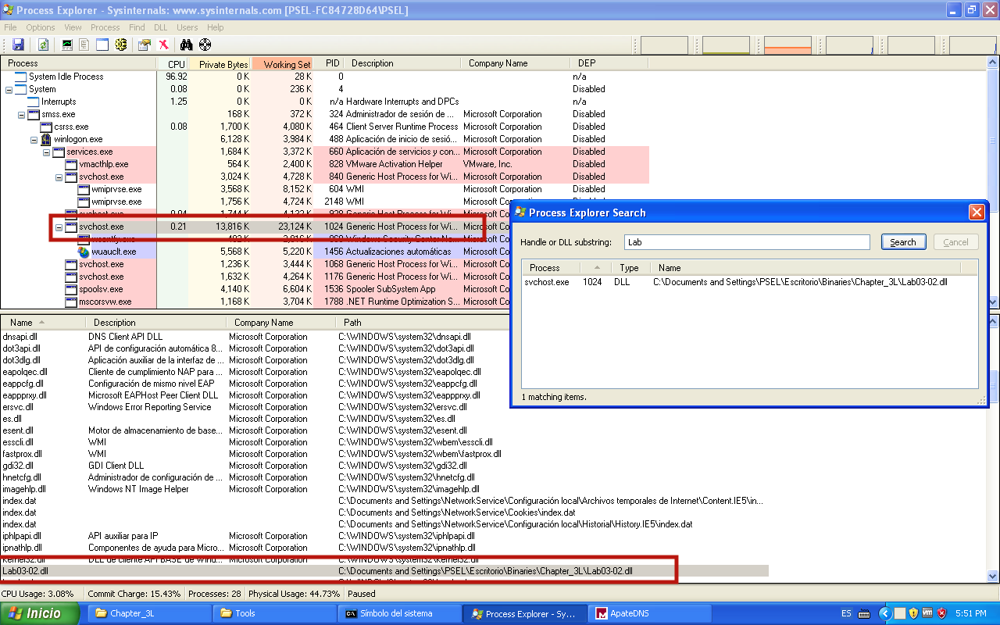

# Lab 3 - Basic Dynamic Analysis

## Lab 3-1

Analyze the malware found in the file _Lab03-01.exe_ using basic dynamic analysis tools.

**1. What are this malware’s imports and strings?**

We can analyze the strings of the sample by using static analysis tools, but in this case we are going to use a bunch of dynamic analysis tools.

First of all, to analyze the strings of the sample we are going to use _Process Explorer_. First, we see the following strings that belongs to the physical image, not to the virtual one.

```
test
www.practicalmalwareanalysis.com
admin
VideoDriver
WinVMX32-
vmx32to64.exe
SOFTWARE\Microsoft\Windows\CurrentVersion\Run
SOFTWARE\Microsoft\Windows\CurrentVersion\Explorer\Shell Folders
``` 
We see some interesting strings like one domain name, some registry values or the name of one binary. Now it is time to check the memory strings.

After check the strings of the sample in the memory, we see that are the same.

The next step is trying to check the imports, to do so, we must use static analysis tools. Using _PEView_ or our own script "get_file_imports.py" we can check the imports:

```
======================
kernel32.dll
======================
ExitProcess
```

Mmmm... The binary seems to be packed, since we cannot see more that one imported function.

**2. What are the malware’s host-based indicators?**

To do so, first we are going to use process explorer and check if the malware creates any mutex. As we can see, the sample creates a mutex called _WinVMX32_.


Next, we can use either _RegShot_ or _Procmon_ to check what changes the malware does to the computer. In this case we are going to use _Regshot_, which we have set up with a whole scan of the "C:\" file system. After executing it, we can see some interesting IOCs of the sample (we only have included the interesting parts of the output):

```
----------------------------------
Values added:3
----------------------------------
HKLM\SOFTWARE\Microsoft\Windows\CurrentVersion\Run\VideoDriver: 43 3A 5C 57 49 4E 44 4F 57 53 5C 73 79 73 74 65 6D 33 32 5C 76 6D 78 33 32 74 6F 36 34 2E 65 78 65 00 00 00 00 00 00 00 00 00 00 00 00 00 00 00 00 00 00 00 00 00 00 00 00 00 00 00 00 00 00 00 00 00 00 00 00 00 00 00 00 00 00 00 00 00 00 00 00 00 00 00 00 00 00 00 00 00 00 00 00 00 00 00 00 00 00 00 00 00 00 00 00 00 00 00 00 00 00 00 00 00 00 00 00 00 00 00 00 00 00 00 00 00 00 00 00 00 00 00 00 00 00 00 00 00 00 00 00 00 00 00 00 00 00 00 00 00 00 00 00 00 00 00 00 00 00 00 00 00 00 00 00 00 00 00 00 00 00 00 00 00 00 00 00 00 00 00 00 00 00 00 00 00 00 00 00 00 00 00 00 00 00 00 00 00 00 00 00 00 00 00 00 00 00 00 00 00 00 00 00 00 00 00 00 00 00 00 00 00 00 00 00 00 00 00 00 00 00 00 00 00 00 00 00 00 00 00 00 00 00 00 00 00 00 00 00 00 00 00 00 00 00
HKU\S-1-5-21-1644491937-1677128483-854245398-1003\Software\Microsoft\Windows\CurrentVersion\Explorer\UserAssist\{75048700-EF1F-11D0-9888-006097DEACF9}\Count\HRZR_EHACNGU:P:\Qbphzragf naq Frggvatf\CFRY\Rfpevgbevb\Ovanevrf\Puncgre_3Y\Yno03-01.rkr: 0D 00 00 00 06 00 00 00 60 1E 56 D3 36 B3 D5 01
HKU\S-1-5-21-1644491937-1677128483-854245398-1003\Software\Microsoft\Windows\ShellNoRoam\MUICache\C:\Documents and Settings\PSEL\Escritorio\Binaries\Chapter_3L\Lab03-01.exe: "Lab03-01"

----------------------------------
Files added:1
----------------------------------
C:\WINDOWS\system32\vmx32to64.exe
```

As we can see, the malware creates one file into the "C:\WINDOWS\system32\" path, probably it is a copy of itself. Also, it adds some new registry values, one that seems encrypted:

```
\HRZR_EHACNGU:P:\Qbphzragf naq Frggvatf\CFRY\Rfpevgbevb\Ovanevrf\Puncgre_3Y\Yno03-01.rkr
	||
	|| ROT 13
	\/
\UEME_RUNPATH:C:\Documents and Settings\PSEL\Escritorio\Binaries\Chapter_3L\Lab03-01.exe
```

Also, we can see how the sample adds another registry value called _VideoDriver_ to startup after every reboot.

```
43 3A 5C 57 49 4E 44 4F 57 53 5C 73 79 73 74 65 6D 33 32 5C 76 6D 78 33 32 74 6F 36 34 2E 65 78 65
	||
	|| HEX to ASCII
	\/
C:\WINDOWS\system32\vmx32to64.exe
```

**3. Are there any useful network-based signatures for this malware? If so, what are they?**

Regarding network-based IOCs, we are going to use _ApateDNS_ to check if the sample does any DNS request.


As we can see, the malware seems to connect to the domain name www.practicalmalwareanalysis.com every minute.


## Lab 3-2

Analyze the malware found in the file _Lab03-02.dll_ using basic dynamic analysis tools.

**1. How can you get this malware to install itself?**

First of all, we analyze the exports that this malware has and see if there is anything interesting among them (we use the script "get_file_exports.py".

```
Install
ServiceMain
UninstallService
installA
uninstallA
```

We can see that it has some functions that relates some "installation" process. To install the sample we can just execute the following command:

```
C:\> rundll32 Lab03-02.dll,installA
```

After that, we will see the following output in _Regshot_ related with the executed binary:

```
----------------------------------
Keys added:63
----------------------------------
...
HKLM\SYSTEM\ControlSet001\Services\IPRIP
HKLM\SYSTEM\ControlSet001\Services\IPRIP\Parameters
HKLM\SYSTEM\ControlSet001\Services\IPRIP\Security
HKLM\SYSTEM\CurrentControlSet\Services\IPRIP
HKLM\SYSTEM\CurrentControlSet\Services\IPRIP\Parameters
HKLM\SYSTEM\CurrentControlSet\Services\IPRIP\Security
...

----------------------------------
Values added:186
----------------------------------
...
HKLM\SYSTEM\ControlSet001\Services\IPRIP\Security\Security: 01 00 14 80 90 00 00 00 9C 00 00 00 14 00 00 00 30 00 00 00 02 00 1C 00 01 00 00 00 02 80 14 00 FF 01 0F 00 01 01 00 00 00 00 00 01 00 00 00 00 02 00 60 00 04 00 00 00 00 00 14 00 FD 01 02 00 01 01 00 00 00 00 00 05 12 00 00 00 00 00 18 00 FF 01 0F 00 01 02 00 00 00 00 00 05 20 00 00 00 20 02 00 00 00 00 14 00 8D 01 02 00 01 01 00 00 00 00 00 05 0B 00 00 00 00 00 18 00 FD 01 02 00 01 02 00 00 00 00 00 05 20 00 00 00 23 02 00 00 01 01 00 00 00 00 00 05 12 00 00 00 01 01 00 00 00 00 00 05 12 00 00 00
HKLM\SYSTEM\ControlSet001\Services\IPRIP\Parameters\ServiceDll: "C:\Documents and Settings\PSEL\Escritorio\Binaries\Chapter_3L\Lab03-02.dll"
HKLM\SYSTEM\ControlSet001\Services\IPRIP\Type: 0x00000020
HKLM\SYSTEM\ControlSet001\Services\IPRIP\Start: 0x00000002
HKLM\SYSTEM\ControlSet001\Services\IPRIP\ErrorControl: 0x00000001
HKLM\SYSTEM\ControlSet001\Services\IPRIP\ImagePath: "%SystemRoot%\System32\svchost.exe -k netsvcs"
HKLM\SYSTEM\ControlSet001\Services\IPRIP\DisplayName: "Intranet Network Awareness (INA+)"
HKLM\SYSTEM\ControlSet001\Services\IPRIP\ObjectName: "LocalSystem"
HKLM\SYSTEM\ControlSet001\Services\IPRIP\Description: "Depends INA+, Collects and stores network configuration and location information, and notifies applications when this information changes."
HKLM\SYSTEM\ControlSet001\Services\IPRIP\DependOnService: 'RpcSs'
HKLM\SYSTEM\CurrentControlSet\Services\IPRIP\Security\Security: 01 00 14 80 90 00 00 00 9C 00 00 00 14 00 00 00 30 00 00 00 02 00 1C 00 01 00 00 00 02 80 14 00 FF 01 0F 00 01 01 00 00 00 00 00 01 00 00 00 00 02 00 60 00 04 00 00 00 00 00 14 00 FD 01 02 00 01 01 00 00 00 00 00 05 12 00 00 00 00 00 18 00 FF 01 0F 00 01 02 00 00 00 00 00 05 20 00 00 00 20 02 00 00 00 00 14 00 8D 01 02 00 01 01 00 00 00 00 00 05 0B 00 00 00 00 00 18 00 FD 01 02 00 01 02 00 00 00 00 00 05 20 00 00 00 23 02 00 00 01 01 00 00 00 00 00 05 12 00 00 00 01 01 00 00 00 00 00 05 12 00 00 00
HKLM\SYSTEM\CurrentControlSet\Services\IPRIP\Parameters\ServiceDll: "C:\Documents and Settings\PSEL\Escritorio\Binaries\Chapter_3L\Lab03-02.dll"
HKLM\SYSTEM\CurrentControlSet\Services\IPRIP\Type: 0x00000020
HKLM\SYSTEM\CurrentControlSet\Services\IPRIP\Start: 0x00000002
HKLM\SYSTEM\CurrentControlSet\Services\IPRIP\ErrorControl: 0x00000001
HKLM\SYSTEM\CurrentControlSet\Services\IPRIP\ImagePath: "%SystemRoot%\System32\svchost.exe -k netsvcs"
HKLM\SYSTEM\CurrentControlSet\Services\IPRIP\DisplayName: "Intranet Network Awareness (INA+)"
HKLM\SYSTEM\CurrentControlSet\Services\IPRIP\ObjectName: "LocalSystem"
HKLM\SYSTEM\CurrentControlSet\Services\IPRIP\Description: "Depends INA+, Collects and stores network configuration and location information, and notifies applications when this information changes."
HKLM\SYSTEM\CurrentControlSet\Services\IPRIP\DependOnService: 'RpcSs'
...
```
It seems that the malware creates some kind of new service called _IPRIP_, something we confirm with the _autoruns_ utility.


**2. How would you get this malware to run after installation?**

To execute the malware we are going to execute the previously created service as follows:

```
C:\> net start IPRIP
```

We can see the created process in the monitor screen of _Process Explorer_ for a few seconds, but then it dissapeared.

**3. How can you find the process under which this malware is running?**

We can use _Process Explorer_ to check where the DLL was loaded. One aproach would be looking at every process imported DLLs (lower pane), but it is more effective using the search DLL feature (CTRL+F), which give us the following output.



As we can see, the malware is stored in the process with a PID of 1024.

**4. Which filters could you set in order to use procmon to glean information?**

We can set up the following filters so as to show the most interesting information about the analyzed malware:

```
Process name IS svchost.exe
PID IS 1024
```

**5. What are the malware’s host-based indicators?**

We have several host-based indicators like the previously explained service _IPRIP_, which shows the name "Intranet Network Awareness (INA+)". Also we have all the registry values that the malware creates so as to create the service.

**6. Are there any useful network-based signatures for this malware?**

We can see by using _ApateDNS_ that the malware makes a requests to practicalmalwareanalysis.com every 10 minutes. Let's configure _Netcat_ so as to capture the redirected traffic of the malware.

```
C:\> nc -v -n -l -p 80
listening on [any] 80 ...
connect to [127.0.0.1] from (UNKNOWN) [127.0.0.1] 1157
GET /serve.html HTTP/1.1
Accept: */*
User-Agent: user-fc84728d64 Windows XP 6.11
Host: practicalmalwareanalysis.com
```

As we can see, the malware tries to get the "/serve.html" file on the mentioned domain by making requests use of a special _User-Agent_ composed by the following structure: `<current user>[ ]<operating system version>`.

## Lab 3-3

Execute the malware found in the file _Lab03-03.exe_ while monitoring it using basic dynamic analysis tools in a safe environment.

**1. What do you notice when monitoring this malware with Process Explorer?**

The malware seems to spawn a new process with the name _svchost.exe_ and then exits, it seems that the malware has performed some kind of process replacement.

**2. Can you identify any live memory modifications?**

If we look at the strings of the process we can check many differences between the "original" strings of the process and the "memory" ones.

**3. What are the malware’s host-based indicators?**

The memory strings of the process contain a few interesting strings like the following:

```
...
practicalmalwareanalysis.log
[SHIFT]
[ENTER]
[BACKSPACE]
BACKSPACE
[TAB]
[CTRL]
[DEL]
[CAPS LOCK]
[CAPS LOCK]
C:\WINDOWS\system32\svchost.exe
abcdefghijklmnopqrstuvwxyz
ABCDEFGHIJKLMNOPQRSTUVWXYZ
...
```

One host-based indicator could be the filename "practicalmalwareanalysis.log".

**4. What is the purpose of this program?**

The strings tells us that the malware probably is a keylogger. Something we can check by looking into the file "practicalmalwareanalysis.log" located in the same folder of the sample.

## Lab 3-4

Analyze the malware found in the file _Lab03-04.exe_ using basic dynamic analysis tools. (This program is analyzed further in the Chapter 9 labs.)

**1. What happens when you run this file?**

When the malware is executed we can see how it is deleted and nothing more. Let's analyze the strings and imports of the malware to try to determine some kind of behaviour.

First of all, we list the strings of the sample:

```
...
Configuration
SOFTWARE\Microsoft \XPS
\kernel32.dll
 HTTP/1.0
GET
'`'`'
`'`'`
NOTHING
CMD
DOWNLOAD
UPLOAD
SLEEP
cmd.exe
 >> NUL
/c del
ups
http://www.practicalmalwareanalysis.com
 Manager Service
.exe
%SYSTEMROOT%\system32\
k:%s h:%s p:%s per:%s
-cc
-re
-in
         (((((                  H
PST
PDT
...
```

As we can see, it seems that the malware perform some kind of HTTP requests to the URL "http://www.practicalmalwareanalysis.com". It also seems to execute the command `cmd.exe /c del` to delete the original file. Also we can see some strings that are like commands for a bot: NOTHING, CMD, DOWNLOAD, UPLOAD, SLEEP.

The imports do not give us to much informations, so we will keep it outside of the exercise.

**2. What is causing the roadblock in dynamic analysis?**

Probably, the malware are waiting for some kind of command to continue the execution.

**3. Are there other ways to run this program?**

We see in the strings that the program seems to execute some "commands". Also, we see the parameters `-cc, -re, -in`.
We try to execute the malware in different ways, but all of them are unfruitful.