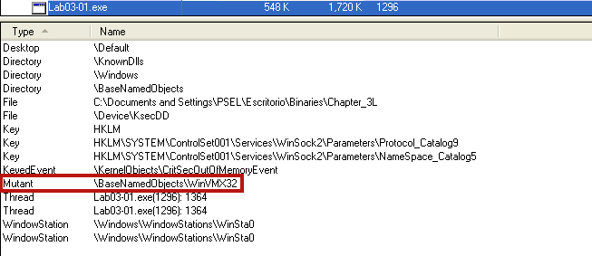
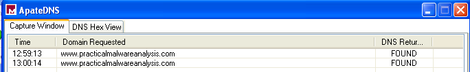

# Lab 3 - Basic Dynamic Analysis

## Lab 3-1

Analyze the malware found in the file _Lab03-01.exe_ using basic dynamic analysis tools.

**1. What are this malware’s imports and strings?**

We can analyze the strings of the sample by using static analysis tools, but in this case we are going to use a bunch of dynamic analysis tools.

First of all, to analyze the strings of the sample we are going to use _Process Explorer_. First, we see the following strings that belongs to the physical image, not to the virtual one.

```
test
www.practicalmalwareanalysis.com
admin
VideoDriver
WinVMX32-
vmx32to64.exe
SOFTWARE\Microsoft\Windows\CurrentVersion\Run
SOFTWARE\Microsoft\Windows\CurrentVersion\Explorer\Shell Folders
``` 
We see some interesting strings like one domain name, some registry values or the name of one binary. Now it is time to check the memory strings.

After check the strings of the sample in the memory, we see that are the same.

The next step is trying to check the imports, to do so, we must use static analysis tools. Using _PEView_ or our own script "get_file_imports.py" we can check the imports:

```
======================
kernel32.dll
======================
ExitProcess
```

Mmmm... The binary seems to be packed, since we cannot see more that one imported function.

**2. What are the malware’s host-based indicators?**

To do so, first we are going to use process explorer and check if the malware creates any mutex. As we can see, the sample creates a mutex called _WinVMX32_.



Next, we can use either _RegShot_ or _Procmon_ to check what changes the malware does to the computer. In this case we are going to use _Regshot_, which we have set up with a whole scan of the "C:\" file system. After executing it, we can see some interesting IOCs of the sample (we only have included the interesting parts of the output):

```
----------------------------------
Values added:3
----------------------------------
HKLM\SOFTWARE\Microsoft\Windows\CurrentVersion\Run\VideoDriver: 43 3A 5C 57 49 4E 44 4F 57 53 5C 73 79 73 74 65 6D 33 32 5C 76 6D 78 33 32 74 6F 36 34 2E 65 78 65 00 00 00 00 00 00 00 00 00 00 00 00 00 00 00 00 00 00 00 00 00 00 00 00 00 00 00 00 00 00 00 00 00 00 00 00 00 00 00 00 00 00 00 00 00 00 00 00 00 00 00 00 00 00 00 00 00 00 00 00 00 00 00 00 00 00 00 00 00 00 00 00 00 00 00 00 00 00 00 00 00 00 00 00 00 00 00 00 00 00 00 00 00 00 00 00 00 00 00 00 00 00 00 00 00 00 00 00 00 00 00 00 00 00 00 00 00 00 00 00 00 00 00 00 00 00 00 00 00 00 00 00 00 00 00 00 00 00 00 00 00 00 00 00 00 00 00 00 00 00 00 00 00 00 00 00 00 00 00 00 00 00 00 00 00 00 00 00 00 00 00 00 00 00 00 00 00 00 00 00 00 00 00 00 00 00 00 00 00 00 00 00 00 00 00 00 00 00 00 00 00 00 00 00 00 00 00 00 00 00 00 00 00 00 00 00 00 00 00 00 00 00
HKU\S-1-5-21-1644491937-1677128483-854245398-1003\Software\Microsoft\Windows\CurrentVersion\Explorer\UserAssist\{75048700-EF1F-11D0-9888-006097DEACF9}\Count\HRZR_EHACNGU:P:\Qbphzragf naq Frggvatf\CFRY\Rfpevgbevb\Ovanevrf\Puncgre_3Y\Yno03-01.rkr: 0D 00 00 00 06 00 00 00 60 1E 56 D3 36 B3 D5 01
HKU\S-1-5-21-1644491937-1677128483-854245398-1003\Software\Microsoft\Windows\ShellNoRoam\MUICache\C:\Documents and Settings\PSEL\Escritorio\Binaries\Chapter_3L\Lab03-01.exe: "Lab03-01"

----------------------------------
Files added:1
----------------------------------
C:\WINDOWS\system32\vmx32to64.exe
```

As we can see, the malware creates one file into the "C:\WINDOWS\system32\" path, probably it is a copy of itself. Also, it adds some new registry values, one that seems encrypted:

```
\HRZR_EHACNGU:P:\Qbphzragf naq Frggvatf\CFRY\Rfpevgbevb\Ovanevrf\Puncgre_3Y\Yno03-01.rkr
	||
	|| ROT 13
	\/
\UEME_RUNPATH:C:\Documents and Settings\PSEL\Escritorio\Binaries\Chapter_3L\Lab03-01.exe
```

Also, we can see how the sample adds another registry value called _VideoDriver_ to startup after every reboot.

```
43 3A 5C 57 49 4E 44 4F 57 53 5C 73 79 73 74 65 6D 33 32 5C 76 6D 78 33 32 74 6F 36 34 2E 65 78 65
	||
	|| HEX to ASCII
	\/
C:\WINDOWS\system32\vmx32to64.exe
```

**3. Are there any useful network-based signatures for this malware? If so, what are they?**

Regarding network-based IOCs, we are going to use _ApateDNS_ to check if the sample does any DNS request.



As we can see, the malware seems to connect to the domain name www.practicalmalwareanalysis.com every minute.


## Lab 3-2

Analyze the malware found in the file Lab03-02.dll using basic dynamic analysis tools.

**1. How can you get this malware to install itself?**
**2. How would you get this malware to run after installation?**
**3. How can you find the process under which this malware is running?**
**4. Which filters could you set in order to use procmon to glean information?**
**5. What are the malware’s host-based indicators?**
**6. Are there any useful network-based signatures for this malware?**

## Lab 3-3

Execute the malware found in the file Lab03-03.exe while monitoring it using basic dynamic analysis tools in a safe environment.

**1. What do you notice when monitoring this malware with Process Explorer?**
**2. Can you identify any live memory modifications?**
**3. What are the malware’s host-based indicators?**
**4. What is the purpose of this program?**

## Lab 3-4

Analyze the malware found in the file Lab03-04.exe using basic dynamic analysis tools. (This program is analyzed further in the Chapter 9 labs.)

**1. What happens when you run this file?**
**2. What is causing the roadblock in dynamic analysis?**
**3. Are there other ways to run this program?**