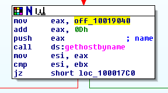
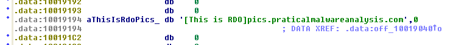
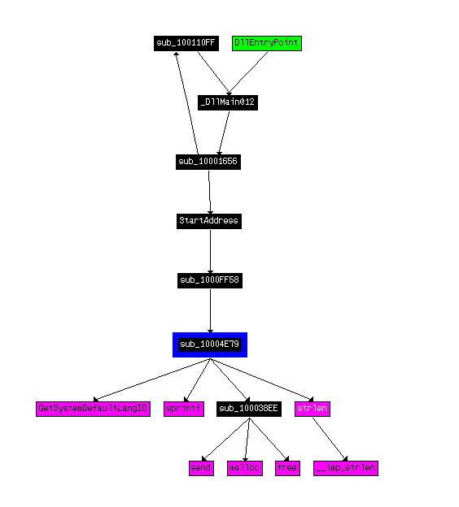
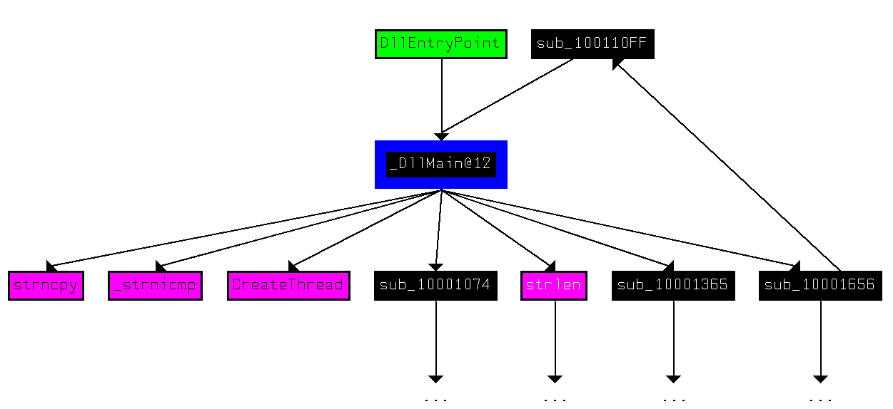

# Lab 5 - _IDA Pro_

## Lab 5-1

Analyze the malware found in the file Lab05-01.dll using only _IDA Pro_. The goal of this lab is to give you hands-on experience with _IDA Pro_. If you’ve already worked with _IDA Pro_, you may choose to ignore these questions and focus on reverse-engineering the malware.


**1. What is the address of DllMain?**

The address is: 0x1000D02E.

**2. Use the Imports window to browse to gethostbyname. Where is the import located?**

In the _idata_ section at 0x100163CC address. The function is called 9 times within the program.

**3. How many functions call gethostbyname?**

In total 5 functions called 9 times the _gethostbyname_ function.

**4. Focusing on the call to gethostbyname located at 0x10001757, can you figure out which DNS request will be made?**

The malware seems to resolve the domain name _pics.praticalmalwareanalysis.com_. In the next pictures we can see how the binary manages the domain name (it cuts the first 13 -0x0D- bytes of string -[This is RDO])






**5. How many local variables has _IDA Pro_ recognized for the subroutine at 0x10001656?**

Seems that _IDA Pro_ have recognized a total of 20 variables.

**6. How many parameters has _IDA Pro_ recognized for the subroutine at 0x10001656?**

The number of parameters that this function have is only one.

**7. Use the Strings window to locate the string \cmd.exe /c in the disassembly. Where is it located?**

The string is located at address 0x10095B34 in a region called _xdoors_d_.

**8. What is happening in the area of code that references \cmd.exe /c?**

The function where this string appears seems to perform a remote shell session opening with some special commands, since we can find several hints that tells so, some of them are:

- The string:

	```
	Hi,Master [%d/%d/%d %d:%d:%d]',0Dh,0Ah
	'WelCome Back...Are You Enjoying Today?',0Dh,0Ah
	0Dh,0Ah
	'Machine UpTime  [%-.2d Days %-.2d Hours %-.2d Minutes %-.2d Secon'
	'ds]',0Dh,0Ah
	'Machine IdleTime [%-.2d Days %-.2d Hours %-.2d Minutes %-.2d Seco'
	'nds]',0Dh,0Ah
	0Dh,0Ah
	'Encrypt Magic Number For This Remote Shell Session [0x%02x]',0Dh,0Ah
	0Dh,0Ah,0
	```

- The use of functions like: CreatePipe, recv, CreateProcess.
- The strings related to commands: `inject, idle, uptime, enmagic, language, robotwork`

**9. In the same area, at 0x100101C8, it looks like dword_1008E5C4 is a global variable that helps decide which path to take. How does the malware set dword_1008E5C4? (Hint: Use dword_1008E5C4’s cross-references.)**

The global variable is set at 0x1001673 as a result of the execution of the function _sub_10003695_, which is a function that mainly calls the function _GetVersionExA_, which returns the version of the operating system. This makes sense, because the comparison is made to decide what binary execute, _cmd.exe_ (Windows 2000 and upper) or _command.exe_ (Windows 95, 98 and ME).

**10. A few hundred lines into the subroutine at 0x1000FF58, a series of comparisons use memcmp to compare strings. What happens if the string comparison to robotwork is successful (when memcmp returns 0)?**

After that, it calls the function _sub_100052A2_, which will open the registry key _SOFTWARE\Microsoft\Windows\CurrentVersion_ and query the value of _WorkTime_ or _WorkTimes_ and sent to the remote shell via the function _sprintf_ and the previously created _pipe_.

**11. What does the export PSLIST do?**

The first thing the export _PSLITS_ does is getting the operating system version, then checks the argument, if it is null, it enumerates the processes and stores the result in a file called _xinstall.dll_. It the argument is not null and it is a number, then it will send the information of the PID that matches the argument.

**12. Use the graph mode to graph the cross-references from sub_10004E79. Which API functions could be called by entering this function? Based on the API functions alone, what could you rename this function?**

As we can see in the following picture, by entering this function the API functions that could be called are: _GetSystemDefaultLangID_, _sprintf_, _strlen_, _send_, _malloc_, _free_ and _\_\_imp_str_len_.



Based on all of the functions called, we can call this function as "Get System Language" or something like this.

**13. How many Windows API functions does DllMain call directly? How many at a depth of 2?**

The function calls that the _DLLMain_ function does directly are: _strncmp_, _\_strnicmp_, _CreateThread_ and _strlen_.



Now, the API calls that the _DLLMain_ does at depth 2 are: _strcpy_, _strncpy_, _memcpy_, _strlen_, _strchr_, _inet_ntoa_, _gethostbyname_, _WinExec_, _Sleep_, _CreateThread_, _inet_addr_, _atoi_, _connect_, _memset_, _ntohs_, _send_, _socket_, _GetTickCount_, _recv_, _CloseHandle_, _WSAStartup_, _GetProcAddress_, _LoadLibrary_ and many more.

**14. At 0x10001358, there is a call to Sleep (an API function that takes one parameter containing the number of milliseconds to sleep). Looking backward through the code, how long will the program sleep if this code executes?**

We can see the following structure in _IDA Pro_.


We can see that the offset _off_10019020_ is stored in _EAX_. This offset stores a reference to the offset string _unk_100192AC_, which stores the text "[This is CTI]30" (in our case we have to convert the numeric value since it was recognized by _IDA Pro_ as code).


After that, we see how the sample adds 0x0D to _EAX_, which is equivalent to shifts the pointer to the 13 position of the array that composes the string. So now eax stores the string value "30". Then is converted with the function _atoi_ and then multiplied by 0x3E8, which is equal to 1000 in decimal notation. Then, the _Sleep_ function is called by loading the value 30000, which is the same as 30 seconds.

**15. At 0x10001701 is a call to socket. What are the three parameters?**

The socket function takes three arguments, the address specification (af), the type and the protocol, in that order (in the code we will se them loaded in the reverse order due to the stack behaviour).

In this case we can see how the function is called using the following values as parameters:
	- AF: 2 (AF_INET), the IPv4 protocol.
	- Type: 1 (SOCK_STREAM).
	- Protocol: 6 (IPPROTO_TCP), the TCP communication protocol.


**16. Using the MSDN page for socket and the named symbolic constants functionality in _IDA Pro_, can you make the parameters more meaningful? What are the parameters after you apply changes?**

We can use the "Standard symbolic constant" functionality to make things clearer.


**17. Search for usage of the in instruction (opcode 0xED). This instruction is used with a magic string VMXh to perform VMware detection. Is that in use in this malware? Using the cross-references to the function that executes the in instruction, is there further evidence of VMware detection?**

To look for the opcode 0xED we go to "Search" and "sequence of bytes..." in _IDA Pro_, then we introduce the value "ED" (without any hexadecimal annotation). After that, we can see many results, but only one that seems interesting at _0x100061DB_:

```
100061DB                 in      eax, dx
```

Before that instruction, we can also see the following block of instructions:

```
.text:100061C7                 mov     eax, 564D5868h
.text:100061CC                 mov     ebx, 0
.text:100061D1                 mov     ecx, 0Ah
.text:100061D6                 mov     edx, 5658h
.text:100061DB                 in      eax, dx
.text:100061DC                 cmp     ebx, 564D5868h
```

Notice that the value _0x564D5868_ means _VMXh_ in ASCII notation (the conversion was made by clicking the key 'R' in _IDA Pro_), the value that we were looking for.

**18. Jump your cursor to 0x1001D988. What do you find?**

At this location we can find an irrelevant block of data.

**19. If you have the IDA Python plug-in installed (included with the commercial version of _IDA Pro_), run Lab05-01.py, an _IDA Pro_ Python script provided with the malware for this book. (Make sure the cursor is at 0x1001D988.) What happens after you run the script?**

After executing the script we can see how the seemly irrelevant block of data were decrypted to something useful, in fact, we can see now the string: "xdoor is this backdoor, string decoded for Practical Malware Analysis Lab".

**20. With the cursor in the same location, how do you turn this data into a single ASCII string?**

We can turn the split string into a single one by pressing the key "A" at the beginning of the string.

**21. Open the script with a text editor. How does it work?**

The executed script is as follows:

```
sea = ScreenEA()

for i in range(0x00,0x50):
        b = Byte(sea+i)
        decoded_byte = b ^ 0x55
        PatchByte(sea+i,decoded_byte)
```

As we can see, first of all takes the value of the cursor by the function _ScreenEA_. Then, it goes through all the bytes between the cursor and the next 0x50 bytes and applies a XOR decryption with the value 0x55. Finally, it patches the code by means of the function _PatchByte_.