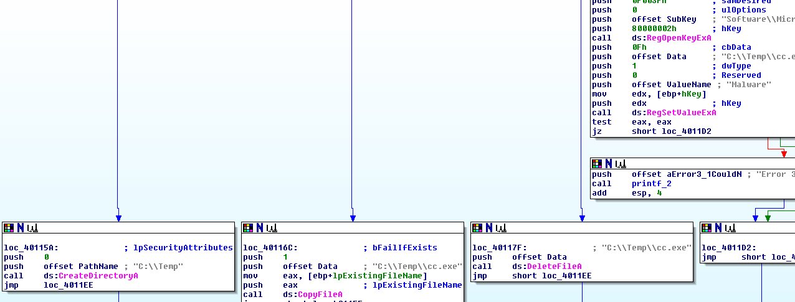

# Lab 6 - Recognizing C Code Constructs in Assembly

The goal of the labs for this chapter is to help you to understand the overall functionality of a program by analyzing code constructs. Each lab will guide you through discovering and analyzing a new code construct. Each lab builds on the previous one, thus creating a single, complicated piece of malware with four constructs. Once you’ve finished working through the labs, you should be able to more easily recognize these individual constructs when you encounter them in malware.

## Lab 6-1

In this lab, you will analyze the malware found in the file Lab06-01.exe.

**1. What is the major code construct found in the only subroutine called by main?**

We can see that in the function _sub_401000_ the main code construct is an _if else_.

**2. What is the subroutine located at 0x40105F?**

The subroutine at this function is a _printf_ interpretation.

**3. What is the purpose of this program?**

The main purpose of the program seems to be checking the Internet connection of a system by means of the _InternetGetConnectedState_ function.

## Lab 6-2

Analyze the malware found in the file Lab06-02.exe.

**1. What operation does the first subroutine called by main perform?**

This subroutine checks whether the sistem has Internet connection or not by means of _InternetGetConnectedState_ API call.

**2. What is the subroutine located at 0x40117F?**

It is a _printf_ interpretation.

**3. What does the second subroutine called by main do?**

The function makes a request to _http://www.practicalmalwareanalysis.com/cc.htm_ URL and reads the downloaded _htm_ document. After reading the document, the malware checks the following string "<!\-\-", which is the way a comment section starts in _HTML_. After that, the malware stores in _EAX_ (return value) the value of an undefined variable. How is this possible?


_IDA Pro_ fails to recognize the size of the Buffer, which is 512 bytes, and then it assumes the existence of a different variable. To solve this issue, we are going to modify the stack variables as follows. In the function, we click the command CTRL+k, which gives us the following screen:


We do a right-click with the mouse in the variable.


And select the 512 bytes length of the array.


After that, we will see that the variable the function returns is the fourth character of the web page.


**4. What type of code construct is used in this subroutine?**

The subroutine uses an _if else_ structure.

**5. Are there any network-based indicators for this program?**

The program has three network based IOC:

```
User agent: Internet Explorer 7.5/pma
URL: http://www.practicalmalwareanalysis.com/cc.htm
Domain: practicalmalwareanalysis.com
```

**6. What is the purpose of this malware?**

The purpose of the malware is reading some kind of command stored in a web page. After that, it prints out the command and then sleeps 1 minute.

## Lab 6-3

In this lab, we’ll analyze the malware found in the file Lab06-03.exe.

**1. Compare the calls in main to Lab 6-2’s main method. What is the new function called from main?**

The new function is located at 0x00401130.

**2. What parameters does this new function take?**

The function takes two parameters, the first one is the read command by means of the previous function and the second one is the name/path of the file, commonly known as _ARGV[0]_ (_argv_ for _IDA Pro_).

**3. What major code construct does this function contain?**

The main construct is a _switch case_.

**4. What can this function do?**

The new function will use the command provided by the previous function to execute some stuff. First of all, the malware will take the command and subtract 0x61 (_a_ letter in ASCII) or 97 and then it will compare against the number 4, if the substracted value is greater than this number, it will terminate. If not, a _switch case_ structure appears so as to organize what the malware can do.


The different tasks that the malware can carry are according the value of the command are:

- 97 (a): create _C:\Temp_ folder by means of _CreateDirectoryA_ API call.
- 98 (b): copy the own file in _C:\Temp\cc.exe_ path by means of _CopyFileA_ API call.
- 99 (c): delete the file _C:\Temp\cc.exe_ by means of _DeleteFileA_ API call.
- 100 (d): set the registry key value _Software\Microsoft\Windows\CurrentVersion\Run_ with the value _C:\Temp\cc.exe_ and the name _Malware_ so as to gain persistence.
- 101 (e): sleep 100 seconds.



**5. Are there any host-based indicators for this malware?**

There are some host based IOCs in the malware. Some of them are:

```
C:\Temp
C:\Temp\cc.exe
Registry KEY: Software\Microsoft\Windows\CurrentVersion\Run, NAME: Malware, VALUE: C:\Temp\cc.exe
```

**6. What is the purpose of this malware?**

The main purpose of this malware is gaining persistence in a system, by means of copying itself and creating registry values that allow the sample to auto-execute.

## Lab 6-4

In this lab, we’ll analyze the malware found in the file Lab06-04.exe.


**1. What is the difference between the calls made from the main method in Labs 6-3 and 6-4?**

**2. What new code construct has been added to main?**

**3. What is the difference between this lab’s parse HTML function and those of the previous labs?**

**4. How long will this program run? (Assume that it is connected to the Internet.)**

**5. Are there any new network-based indicators for this malware?**

**6. What is the purpose of this malware?**
