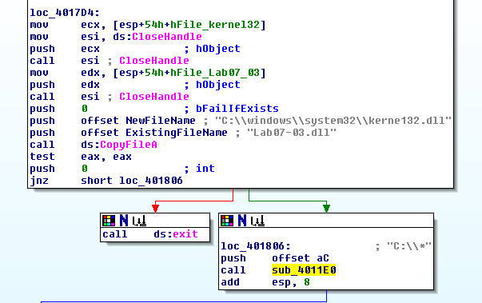
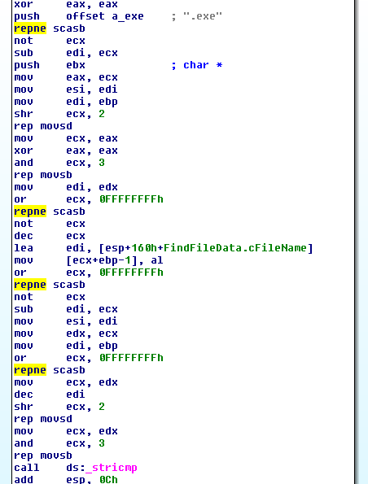
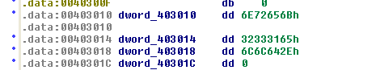
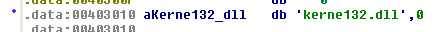
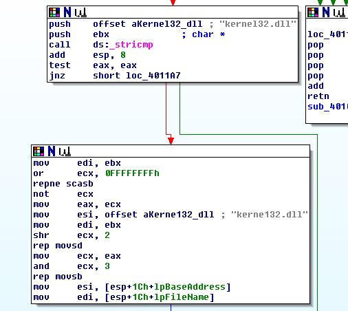
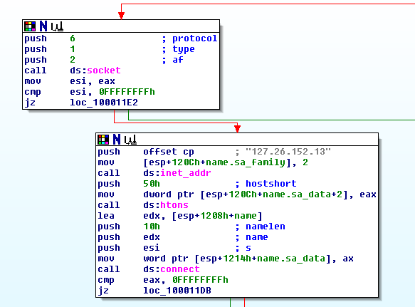
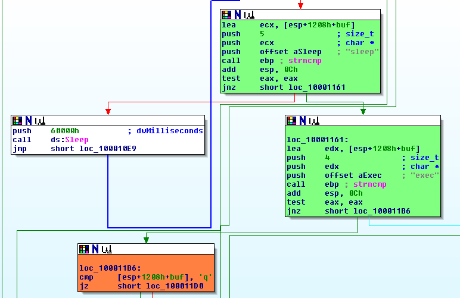
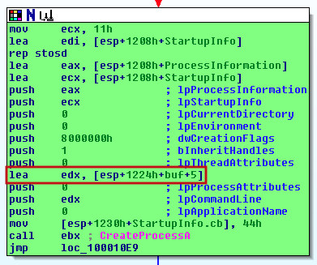

# Lab 7 - Analyzing Malicious Windows Programs

## Lab 7-1

Analyze the malware found in the file Lab07-01.exe.

**1. How does this program ensure that it continues running (achieves persistence) when the computer is restarted?**

The malware creates a new service called _Malservice_ by means of the API call _CreateServiceA_ using the value 0x2 for the _dwStartType_ parameter, which means that the service will start at system startup.

**2. Why does this program use a mutex?**

The malware creates one mutex with the value _HGL345_ so as to check if there is already a malware instance running on the computer.

**3. What is a good host-based signature to use for detecting this program?**

The malware mutex name _HGL345_ is the best host-based IOC, but also the name of the service, _Malservice_.

**4. What is a good network-based signature for detecting this malware?**

We can find one network-based IOC like the URL used by this malware: _http://www.malwareanalysisbook.com/_.

**5. What is the purpose of this program?**

The malware first check if there is already a mutex called _HGL345_, if not, then it creates a service called _Malservice_ that allows this malware to start at system startup. Then, when the malware is running, it will wait until 1st of January of 2100.


After that, the malware create 20 new threads that will make unlimited requests to the URL _http://www.malwareanalysisbook.com/_. This makes us believe that the main purpose of the malware is making DoS attacks against that domain.


**6. When will this program finish executing?**

The malware never terminates if the computer is running, since the main thread will sleep forever.

## Lab 7-2

Analyze the malware found in the file Lab07-02.exe.

**1. How does this program achieve persistence?**

This malware does not seem to have any persistence mechanism.

**2. What is the purpose of this program?**

The first thing the malware does is initializing the _COM_ library so as to perform some actions using the _OleInitialize_ API function. Then, by means of _CoCreateInstance_ API function, loads the CLSID _{0002DF01-0000-0000-C000000000000046}_, which is the one that corresponds to _Internet Explorer_, with the IID _{D30C1661-CDAF-11D0-8A3E00C04FC9E26E}_, which is the _IWebBrowser2_ interface.

```
rclsid          dd 2DF01h
				dw 0
                dw 0
                db 0C0h, 6 dup(0), 46h
    ||
    \/

dd 2DF01h	-> 0002DF01
dw 0 		-> 0000
dw 0 		-> 0000
db 0C0h		-> C0
db 6 dup(0)	-> 00 00 00 00 00 00
db 46h		-> 46

    ||
    \/

CLSID = 0002DF01-0000-0000-C000000000000046 (Internet Explorer)
```


```
riid            dd 0D30C1661h
                dw 0CDAFh
                dw 11D0h
                db 8Ah, 3Eh, 0, 0C0h, 4Fh, 0C9h, 0E2h, 6Eh
    ||
    \/

dd 0D30C1661h	-> D30C1661
dw 0CDAFh	-> CDAF
dw 11D0h	-> 11D0
db 8Ah		-> 8A
db 3Eh		-> 3E
db 0		-> 00
db 0C0h		-> C0
db 4Fh		-> 4F
db 0C9h		-> C9
db 0E2h		-> E2
db 6Eh		-> 6E

    ||
    \/

IID = D30C1661-CDAF-11D0-8A3E00C04FC9E26E (IWebBrowser2)
```


After that, it loads the URL _http://www.malwareanalysisbook.com/ad.html_, which prior to the name of the downloaded document seems to be an advertisement. The HTTP request performed via the _Internet Explorer COM_ object is done by loading the URL using _SysAllocString_ and then, by a call to the _Navigate_ (_2Ch_) function of that object.


To know which function the _2Ch_ offset is, we must include a new structure. To do so, first we go to the _Structures_ panel, where we will press the _INSERT_ of our keyboard (_On-Sreen Keyboard_ OSK could be used). Then, we click on _Add standard structure_, which will show us some common structures.


After that, we select the interface we have previously identified, _IWebBrowser2_, but with the name _IWebBrowser2Vtbl_.


Finally, we right click in the offset _2Ch_ of the program, and select the option "[edx+IWebBrowser2Vtbl.Navigate]"


The final result will be the following.


After poping up the advertisement, the program terminates.

**3. When will this program finish executing?**

The program will run while the user keeps the _Internet Explorer_ process opened.

## Lab 7-3

For this lab, we obtained the malicious executable, Lab07-03.exe, and DLL, Lab07-03.dll, prior to executing. This is important to note because the malware might change once it runs. Both files were found in the same directory on the victim machine. If you run the program, you should ensure that both files are in the same directory on the analysis machine. A visible IP string beginning with 127 (a loopback address) connects to the local machine. (In the real version of this malware, this address connects to a remote machine, but we’ve set it to connect to localhost to protect you.)
This lab may cause considerable damage to your computer and may be difficult to remove once installed. Do not run this file without a virtual machine with a snapshot taken prior to execution.
This lab may be a bit more challenging than previous ones. You’ll need to use a combination of static and dynamic methods, and focus on the big picture in order to avoid getting bogged down by the details.

**1. How does this program achieve persistence to ensure that it continues running when the computer is restarted?**

The file _Lab07-03.exe_ maps the files _kernel32.dll_ and _Lab07-03.dll_ in memory to perform some changes on it. However, we will ignore this changes since they seem quite complicated and time consuming to analyze. After doing so, the malware copies the DLL _Lab07-03.dll_ to a new location and name: _C:\windows\system32\kerne132.dll_ (the 'l' has been substituted with a '1'). After that, if the copy has been successful, it enters in one function located at 0x004011E0 with the string parameter "C:\\\*", something that tells us that the function is related with file system operations.



The first thing the unknown file system function does is listing files by means of _FindFirstFileA_ API call. Then, it checks whether the result is directory or a file. The directory check is done by comparing the structure value _FindFileData.dwFileAttributes_ with the value 0x10, which is the same as _FILE_ATTRIBUTE_DIRECTORY_ constant.


The next step the malware does is checking if the found file is an executable file.



If it is an executable, then enters in the function located at 0x004010A0. This function creates new file mappings, but in this case using the executable file found by the malware. After some instructions, we see something interesting, the malware looks for the value _kernel32.dll_ and changes it with the _dword_ _dword_403010_, something strange. If we look at this variable, we see a value that it has no sense.



To solve this we have to convert this data in a string, since _IDA Pro_ has mislabeled it. To do so, we click in the variable and press the key 'a'.



Now, we can see how the value _kernel32.dll_ is changed with the string _kerne132.dll_ (the malicious DLL) by means of _rep movsd_ instruction, which is similar to _memcpy_. After that, it exits the function and continues looking for executables in a recursive way.



Now, we know the malware will look for all executables in the system and modify them so as to load the malicious _kerne132.dll_ file instead the legit _kernel32.dll_.

**2. What are two good host-based signatures for this malware?**

We can see at least two good host-based IOCs:

```
File: C:\windows\system32\kerne132.dll
Mutex: SADFHUHF
```

**3. What is the purpose of this program?**

The core of the malware can be found within the DLL _Lab07-03.dll_. The first thing it does when it is executed is checking if there is a mutex called _SADFHUHF_, if not, it creates one (this is done to avoid multiple instances of the malware running at the same time in the same machine).

After that, we can see how the malware tries to stablish a connection against the IP address _127.26.152.13_.



After the malware connects to the CnC, it will start receiving commands. However, it only understand three possibilities:

- **sleep**: sleeps for 60 seconds and tries again
- **exec + arg**: executes the arg via command line and tries again
- **q**: quits session
- **default option**: sleeps for 60 seconds and tries again



To understand what the 'exec' command executes, we need to reconfigure the _buf_ variable in _IDA Pro_, since it has a size of 512 bytes. After doing so, we can see how the malware takes the arguments of the 'exec' command to execute it via the command line from the received buffer (notice that 'exec' has 4 letters).



The malware only will terminate when it receives the 'q' command.

**4. How could you remove this malware once it is installed?**

The best way to remove this malware is reinstalling the Operating System, since the malware will modify every single executable.

