# Lab 9 - OllyDbg

## Lab 9-1

Analyze the malware found in the file Lab09-01.exe using OllyDbg and IDA Pro to answer the following questions. This malware was initially analyzed in the Chapter 3 labs using basic static and dynamic analysis techniques.

**1. How can you get this malware to install itself?**

To run the malware we need to insert at least one argument, after that, the malware will enter to a function that will check if the last argument is "abcd".

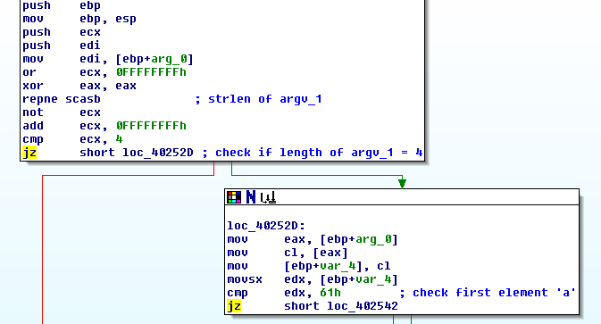

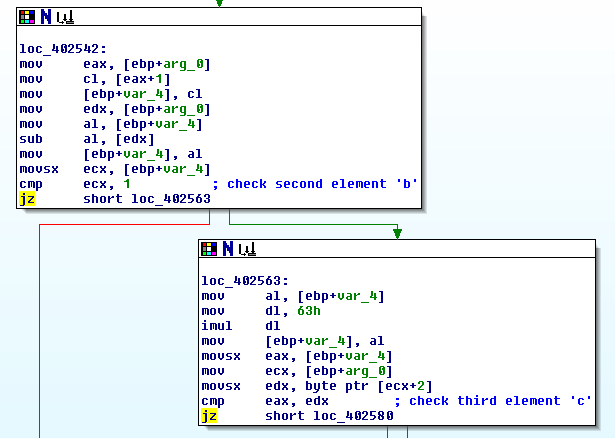

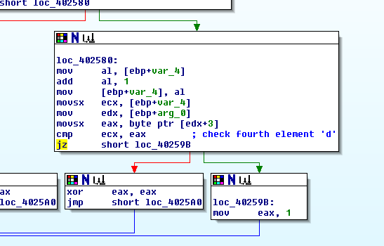

If check fails, it will auto-remove and terminate.

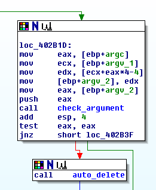

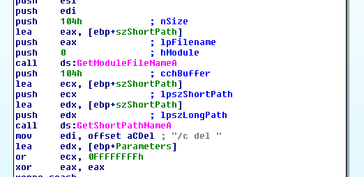

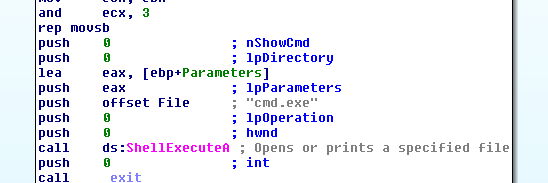

However, if we only insert the argument "abcd", the malware will terminate and auto-remove without doing anything, we need to introduce more arguments. These arguments are:

- -in
- -re
- -c
- -cc

The problem is that these commands needs to be placed in the first place, followed by another command and the argument "abcd" in the last position.

**2. What are the command-line options for this program? What is the password requirement?**

The program can receive the following commands.

**-in (aka: install)**

If the malware receives the command "-in" it will start the installation process.

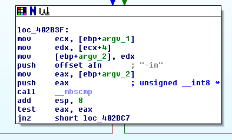

After that, the malware will check if the user has provided another argument so as to set the service name that will create later, if not, it will use the name of the binary.

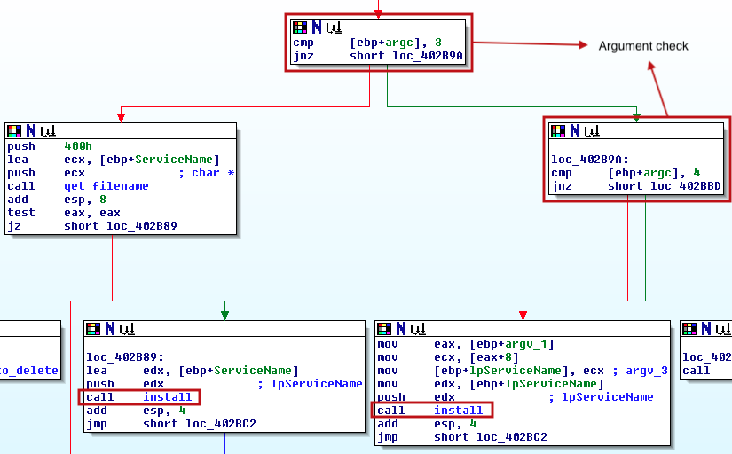

The installation process will consist mainly of creating a new service with the display name "Manager Service" and the internal name specified by the user, if provided, or with the name of the filename (as previously commented).

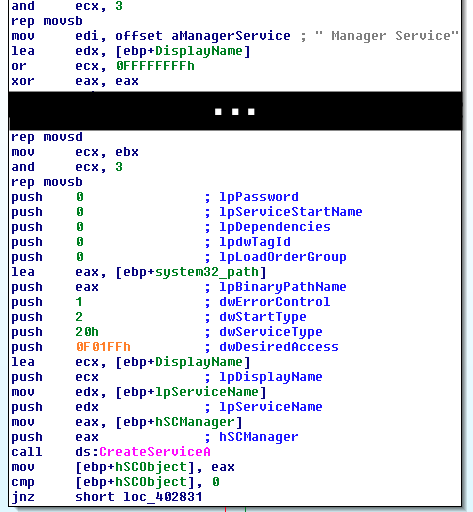

Also, the malware copies itself into the "C:\\Windows\\System32\\" path.

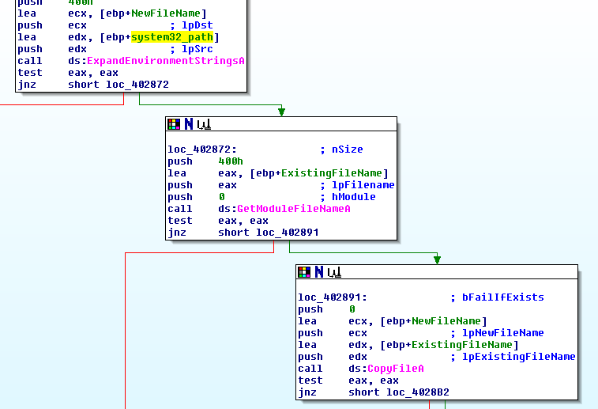

Finally, the malware creates the registry key "SOFTWARE\\\\Microsoft \\\\XPS" with the value name "Configuration" and the values "ups", "http://www.practicalmalwareanalysis.com", "80" and "60". These values will be used later by the malware.

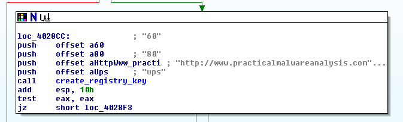

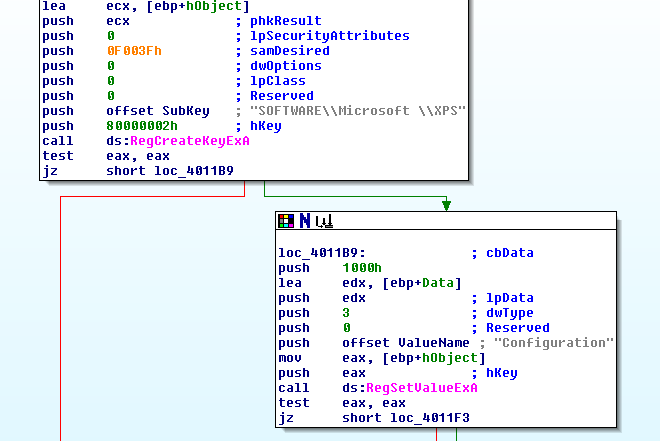

**-re (aka: remove)**

**-c (aka: TODO)**

**-cc (aka: TODO)**

**No arguments**

If the malware does not receive any argument (even the "abcd" key), it will check if it has been previously installed by checking the registry key created during the installation process, "SOFTWARE\\\\Microsoft \\\\XPS" with the value name "Configuration". If does not exist, the malware will auto-remove itself, if it does, then it will initate the communication with the C&C and start waiting for commands.

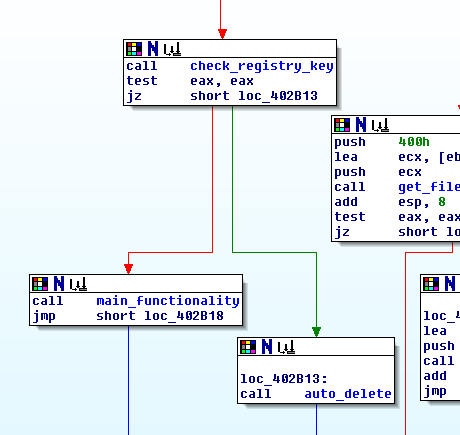

The malware will wait for the following commands:

- SLEEP: the sample will sleep the time in seconds the C&C has established with the second argument of the command (example: SLEEP 10, will sleep 10 seconds).

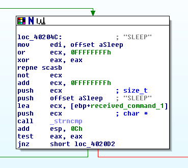

- UPDATE

- DOWNLOAD

- CMD

- NOTHING: the malware will do nothing and wait for the next command.

**3. How can you use OllyDbg to permanently patch this malware, so that it doesn’t require the special command-line password?**

**4. What are the host-based indicators of this malware?**

**5. What are the different actions this malware can be instructed to take via the network?**

**6. Are there any useful network-based signatures for this malware?**

# Lab 9-2

Analyze the malware found in the file Lab09-02.exe using OllyDbg to answer the following questions.

**1. What strings do you see statically in the binary?**

**2. What happens when you run this binary?**

**3. How can you get this sample to run its malicious payload?**

**4. What is happening at 0x00401133?**

**5. What arguments are being passed to subroutine 0x00401089?**

**6. What domain name does this malware use?**

**7. What encoding routine is being used to obfuscate the domain name?**

**8. What is the significance of the CreateProcessA call at 0x0040106E?**

## Lab 9-3

Analyze the malware found in the file Lab09-03.exe using OllyDbg and IDA Pro. This malware loads three included DLLs (DLL1.dll, DLL2.dll, and DLL3.dll) that are all built to request the same memory load location. Therefore, when viewing these DLLs in OllyDbg versus IDA Pro, code may appear at different memory locations. The purpose of this lab is to make you comfortable with finding the correct location of code within IDA Pro when you are looking at code in OllyDbg.

**1. What DLLs are imported by Lab09-03.exe?**

**2. What is the base address requested by DLL1.dll, DLL2.dll, and DLL3.dll?**

**3. When you use OllyDbg to debug Lab09-03.exe, what is the assigned based address for: DLL1.dll, 
DLL2.dll, and DLL3.dll?**

**4. When Lab09-03.exe calls an import function from DLL1.dll, what does this import function do?**

**5. When Lab09-03.exe calls WriteFile, what is the filename it writes to?**

**6. When Lab09-03.exe creates a job using NetScheduleJobAdd, where does it get the data for the second parameter?**

**7. While running or debugging the program, you will see that it prints out three pieces of mystery data. What are the following: DLL 1 mystery data 1, DLL 2 mystery data 2, and DLL 3 mystery data 3?**

**8. How can you load DLL2.dll into IDA Pro so that it matches the load address used by OllyDbg?**
