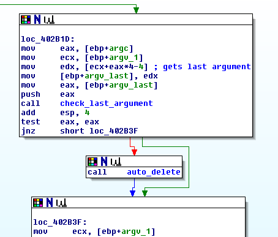
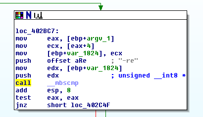
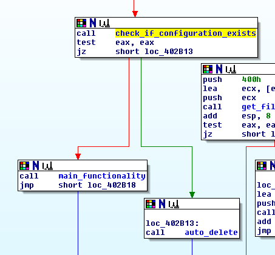
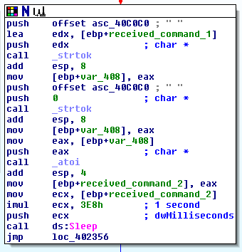
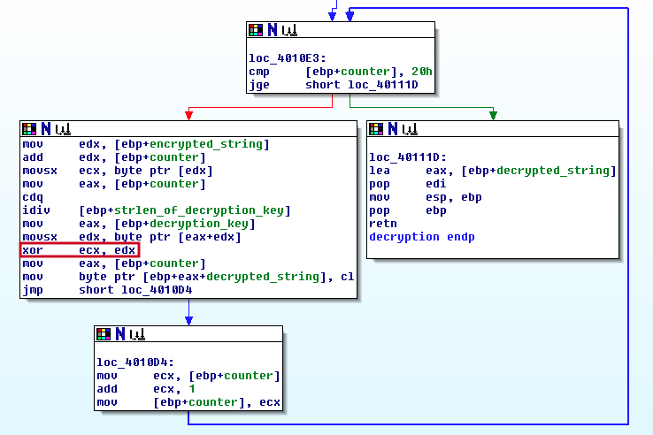

# Lab 9 - OllyDbg

## Lab 9-1

Analyze the malware found in the file Lab09-01.exe using OllyDbg and IDA Pro to answer the following questions. This malware was initially analyzed in the Chapter 3 labs using basic static and dynamic analysis techniques.

**1. How can you get this malware to install itself?**

To run the malware we need to insert at least one argument, after that, the malware will enter to a function that will check if the last argument is "abcd".


If check fails, it will auto-remove and terminate.




However, if we only insert the argument "abcd", the malware will terminate and auto-remove without doing anything, we need to introduce more arguments. These arguments are:

- -in
- -re
- -c
- -cc

The problem is that these commands needs to be placed in the first place, followed by another command and the argument "abcd" in the last position.

**2. What are the command-line options for this program? What is the password requirement?**

The program can receive the following commands.

**-in (aka: install)**

If the malware receives the command "-in" it will start the installation process.


After that, the malware will check if the user has provided another argument so as to set the service name that will create later, if not, it will use the name of the binary.


The installation process will consist mainly of creating a new service with the display name "Manager Service" and the internal name specified by the user, if provided, or with the name of the filename (as previously commented).


Also, the malware copies itself into the "C:\\Windows\\System32\\" path.


Finally, the malware creates the registry key "SOFTWARE\\\\Microsoft \\\\XPS" with the value name "Configuration" and the values "ups", "http://www.practicalmalwareanalysis.com", "80" and "60". These values will be used later by the malware as configuration.


**-re (aka: remove)**

When the malware receives the command "-re" starts the removal process of the malware.



Then, the malware will check if the user has provided another argument in the same way of the installation process. After that, the malware will remove the service, the copied file and the registry key.


**-c (aka: configuration)**

The sample will change the configuration set in the registry key created during the installation process if it receives de argument "-c".


Now, the malware will check if the user has provided 7 commands, which are the filename, the command "-c", the password "abcd" and the configuration parameters, the C&C URL, the numeric values and the last string.


**-cc (aka: configuration check)**

The last parameter the malware understands is "-cc", which will order the malware to check their configuration properties and print them.


**No arguments**

If the malware does not receive any argument (even the "abcd" key), it will check if it has been previously installed by checking the registry key created during the installation process, "SOFTWARE\\\\Microsoft \\\\XPS" with the value name "Configuration". If does not exist, the malware will auto-remove itself, if it does, then it will initate the communication with the C&C and start waiting for commands.



The malware will wait for the following commands:

- SLEEP: the sample will sleep the time in seconds the C&C has established with the second argument of the command (example: SLEEP 10, will sleep 10 seconds).




- UPLOAD: the binary will upload the file specified in the argument to the C&C.


- DOWNLOAD: the malware will download the file specified in the argument to the C&C.


- CMD: the sample will create a pipe, send a command specified in the arguments and send its result to the C&C.


- NOTHING: the malware will do nothing and wait for the next command.


**Incorrect argument/s**

If the malware does not understand the provided arguments, it will auto-remove itself.

**3. How can you use OllyDbg to permanently patch this malware, so that it doesn’t require the special command-line password?**

In this case we are going tot use _Immunity Debugger_ instead of _OllyDbg_. Firstly, we see where the _main_ function is located by means of _IDA Pro_, which tells us that is located at _0x00402AF0_. Now, in _Immunity_ we click on _CTRL+G_ and introduce that value, now, we can see how we are in the main function.


Then, we can start patching the binary so as to remove the password check.

We have to remember that the password check is done only if more than one argument is provided (the first argument is always the binary filename), so we have to edit the code after this check is performed. The easiest way to do so is just modifying the call of the function _check_last_argument_ (0x00402510) by _nop_ instructions (0x90).


This will the malware to accept any word as password, however it will need to have one, since it checks the number of arguments several times.

**4. What are the host-based indicators of this malware?**

There are several host-based indicators like the service or the configuration registry key created by the malware.

```
Service: "Manager Service"
Registry key and value: "SOFTWARE\\Microsoft \\XPS", "Configuration"
```

**5. What are the different actions this malware can be instructed to take via the network?**

Answered in the second exercise in the "No arguments" section.

**6. Are there any useful network-based signatures for this malware?**

We can see one interesting network-based IOC, the url _http://www.practicalmalwareanalysis.com/_.

## Lab 9-2

Analyze the malware found in the file Lab09-02.exe using OllyDbg to answer the following questions.

**1. What strings do you see statically in the binary?**

When we execute the string command we can see a bunch of strings, but no one interesting (there are a many strings related with the imported functions, but no one related with the malware):

```
C:\> strings Lab09-02.exe

...
- not enough space for arguments
R6002
- floating point not loaded
Microsoft Visual C++ Runtime Library
Runtime Error!
Program:
...
<program name unknown>
GetLastActivePopup
GetActiveWindow
MessageBoxA
user32.dll
Y6@
]6@
WaitForSingleObject
CreateProcessA
Sleep
GetModuleFileNameA
KERNEL32.dll
WSASocketA
WS2_32.dll
GetCommandLineA
...
```

May be the strings are encrypted in some way.

**2. What happens when you run this binary?**

When we run this binary, it does not do anything, may be it needs some kind of parameter/password.

If we run this malware via _Immunity Debugger_ we can see how at the main function the binary compares in a unsuccessfully way its own filename with the string "ocl.exe".


In IDA, we can check this easily at the beginning of the binary.


Also, it is interesting mentioning this other string, that seems encrypted or a kind of key: 1qaz2wsx3edc.


**3. How can you get this sample to run its malicious payload?**

We can run this sample by modifying the filename to _ocl.exe_. Also we can patch the binary by means of _Immunity Debugger_ at address _0x00401236_ with the following instruction:

```
mov eax, 0  -> B8 00 00 00 00
```


**4. What is happening at 0x00401133?**

A new variable is being defined, in this case an encrypted one or a key as stated previously at point 2. The string value is "1qaz2wsx3edc".

**5. What arguments are being passed to subroutine 0x00401089?**

Two arguments are passed to the subroutine _0x00401089_. These arguments seems to be the deencryption key "1qaz2wsx3edc" (which seems to be the hostname of the C&C) as _arg_0_ and the encrypted string as _arg_1_.

**6. What domain name does this malware use?**

We can do two things so as to decrypt the string, the first one is by static means, which is much more difficult, the second one is by dynamic means such as debugging or capturing the requests by means of _ApateDNS_, which is far more easy. We are going to do the both of them.

**Static analysis**

The first thing we do is taking a look at the decryption routine so as to know how the algorithm works.



As we can see, the decryption routine consist of a _XOR_ operation between _ECX_ and _EDX_ over a 32 length string. Now, we have to understand where this registers are populated.

```
mov     edx, [ebp+encrypted_string]		-> EDX = array of values that make up the encrypted_string = encrypted_string [0]
add     edx, [ebp+counter]			-> EDX = walks over the array = encrypted_string [0 + counter] 
movsx   ecx, byte ptr [edx]			-> ECX = specific value of the array at the value of the counter = encrypted_string [counter]
mov     eax, [ebp+counter]			-> EAX = counter
cdq						-> EDX = 0x00000000 (extends the sign bit of EAX into the EDX register), counter max value = 0x20 = 32
idiv    [ebp+strlen_of_encrypted_string]	-> [EDX|EAX] / strlen_of_decryption_key -> EAX = result, EDX = reminder 
mov     eax, [ebp+decryption_key]		-> EAX = decryption_key[0]
movsx   edx, byte ptr [eax+edx]			-> EDX = decryption_key[0 + reminder]
xor     ecx, edx				-> ECX ^ EDX = encrypted_string [counter] ^ decryption_key[0 + reminder]
mov     eax, [ebp+counter]			-> EAX = counter
mov     byte ptr [ebp+eax+decrypted_string], cl -> decrypted_string [counter] = CL (result of XOR operation)
```

Then, we need the value of the arrays of the _encrypted_string_ and the _decryption_key_.

```
encrypted_string = [0x46, 0x6, 0x16, 0x54, 0x42, 0x5, 0x12, 0x1B, 0x47, 0x0C, 0x7, 0x2, 0x5D, 0x1C, 0x0, 0x16, 0x45, 0x16, 0x1, 0x1D, 0x52, 0x0B, 0x5, 0x0F, 0x48, 0x2, 0x8, 0x9, 0x1C, 0x14, 0x1C, 0x15]
decryption_key = [1, q, a, z, 2, w, s, x, 3, e, d, c]
```

Now that we understand the algorithm and know the arrays, it's time to write a python script that decrypts the hostname:

```
encrypted_string = bytearray([0x46, 0x6, 0x16, 0x54, 0x42, 0x5, 0x12, 0x1B, 0x47, 0x0C, 0x7, 0x2, 0x5D, 0x1C, 0x0, 0x16, 0x45, 0x16, 0x1, 0x1D, 0x52, 0x0B, 0x5, 0x0F, 0x48, 0x2, 0x8, 0x9, 0x1C, 0x14, 0x1C, 0x15])
decryption_key = ["1", "q", "a", "z", "2", "w", "s", "x", "3", "e", "d", "c"]

decrypted_string = ""

for counter in range(len(encrypted_string)):
	encrypted_char = encrypted_string[counter]
	reminder = counter % len(decryption_key)
	xor_key = decryption_key[reminder]
	decrypted_string = decrypted_string + chr(encrypted_char ^ ord(xor_key))

print("The decrypted string is: " + decrypted_string)
```

Let's execute it and see what we get:

```
$ python3 Scripts/Others/lab_09_2_decryption_hostname.py 

The decrypted string is: www.practicalmalwareanalysis.com
```

Great! We have obtained the hostname of the C&C, **www.practicalmalwareanalysis.com**

**Dynamic analysis**

The dynamic analysis will be divided in two parts, in the first one we are going to use _Immunity Debugger_ so as to perform the analysis, and in the second one we are going to use _ApateDNS_.

_Immunity Debugger_

First of all, we get where the decryption routine takes place with _IDA Pro_, at _0x004012BD_. Let's put a breakpoint there and see what happens when it runs (remember that the program must be renamed to _ocl.exe_ so as to run).


When we _step-over_ (F8) in the binary, we see how it decrypts the hostname as expected.


_ApateDNS_

First, we need to set up _ApateDNS_ so as to capture the DNS requests of the malware.


After that, we simply execute the binary so as to start capturing its DNS requests.


**7. What encoding routine is being used to obfuscate the domain name?**

The encoding used by the malware is known as _XOR_.

**8. What is the significance of the CreateProcessA call at 0x0040106E?**

It creates a _CMD_ process piped over the previously created socket that it is connected to the C&C.


## Lab 9-3

Analyze the malware found in the file Lab09-03.exe using OllyDbg and IDA Pro. This malware loads three included DLLs (DLL1.dll, DLL2.dll, and DLL3.dll) that are all built to request the same memory load location. Therefore, when viewing these DLLs in OllyDbg versus IDA Pro, code may appear at different memory locations. The purpose of this lab is to make you comfortable with finding the correct location of code within IDA Pro when you are looking at code in OllyDbg.

**1. What DLLs are imported by Lab09-03.exe?**

**2. What is the base address requested by DLL1.dll, DLL2.dll, and DLL3.dll?**

**3. When you use OllyDbg to debug Lab09-03.exe, what is the assigned based address for: DLL1.dll, 
DLL2.dll, and DLL3.dll?**

**4. When Lab09-03.exe calls an import function from DLL1.dll, what does this import function do?**

**5. When Lab09-03.exe calls WriteFile, what is the filename it writes to?**

**6. When Lab09-03.exe creates a job using NetScheduleJobAdd, where does it get the data for the second parameter?**

**7. While running or debugging the program, you will see that it prints out three pieces of mystery data. What are the following: DLL 1 mystery data 1, DLL 2 mystery data 2, and DLL 3 mystery data 3?**

**8. How can you load DLL2.dll into IDA Pro so that it matches the load address used by OllyDbg?**
