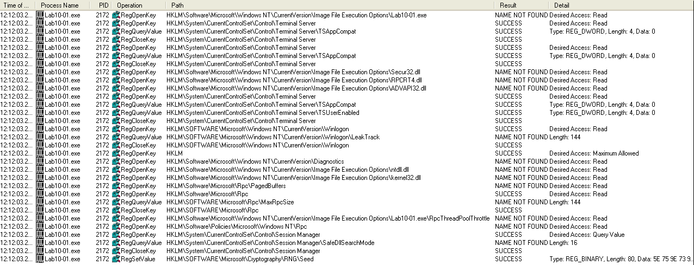
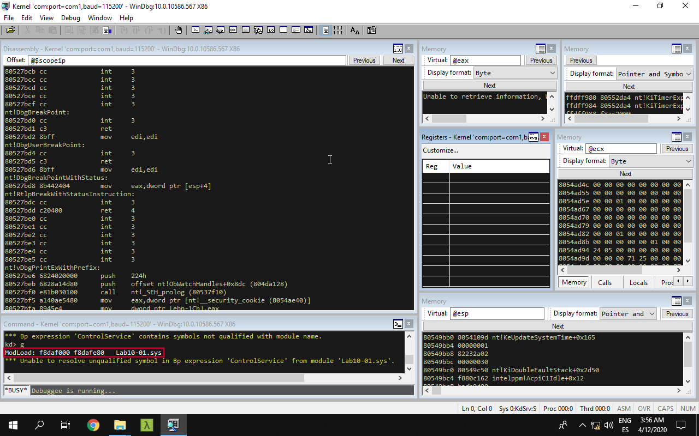
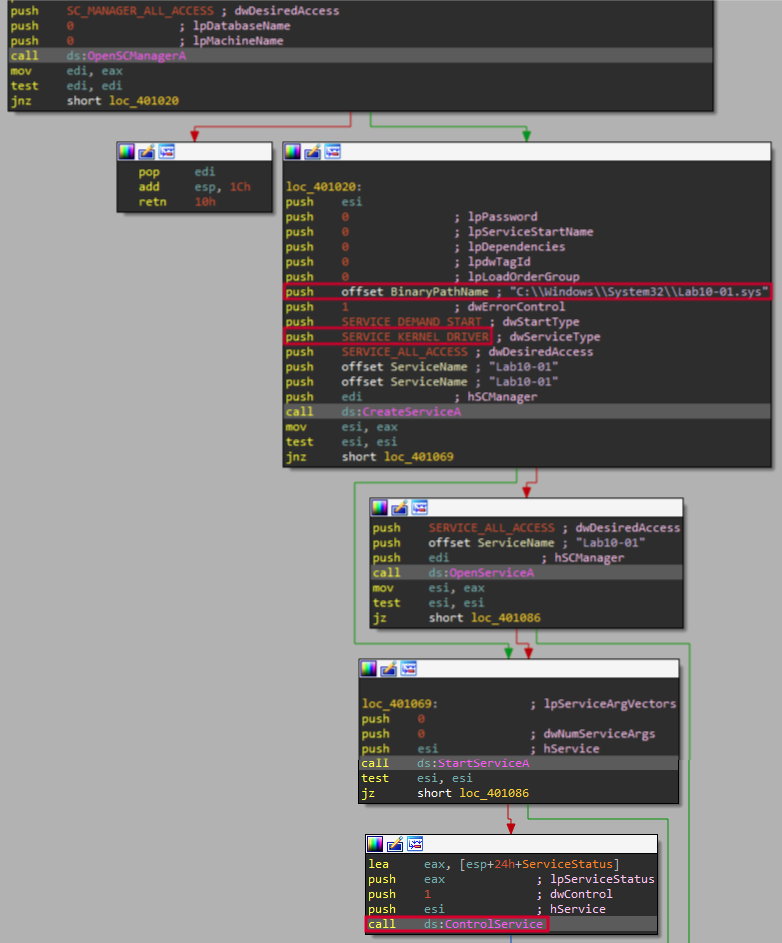
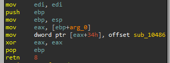
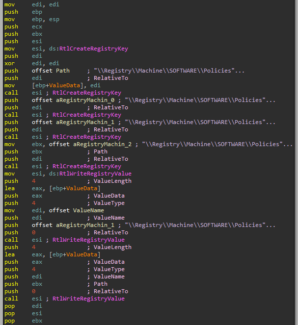

# Lab 10 - Kernel Debugging with WinDBG

## Lab 10-1

This lab includes both a driver and an executable. You can run the executable from anywhere, but in order for the program to work properly, the driver must be placed in the C:\Windows\System32 directory where it was originally found on the victim computer. The executable is Lab10-01.exe, and the driver is Lab10-01.sys.

**1. Does this program make any direct changes to the registry? (Use procmon to check.)**

To do so we place the driver into the _System_ folder ("C:\Windows\System32") and fire up _Process Monitor_. Then, we execute the binary and see what it does.



We can see in this picture how the binary performs some actions within the registry, but only one change over "HKLM\SOFTWARE\Microsoft\Cryptography\RNG\Seed" regsitry key.

**2. The user-space program calls the ControlService function. Can you set a breakpoint with WinDbg to see what is executed in the kernel as a result of the call to ControlService?**

First, we turn off the debugged _Windows XP_ machine. Then, we startup _WinDBG_ in the _Windows 10_ machine and start the kernel debugging option.

Then, we restart the _Windows XP_ machine in the debugging mode and break the execution in _WinDBG_ prior executing the sample.

After that, we set a breakpoint to the _ControlService_ function with the following command.

```
kd> bp ControlService
```

Then we continue execution with the following command:

```
kd> g
```

Now, we execute again the sample to see in it loads some driver object (do not forget to set verbose option).



Great! The expected driver has been loaded. However, the breakpoint has failed! We will have to get the memory address where the driver is loaded by means of _IDA Pro_. So first, we load the "Lab10-01.exe" binary file to see what it does.

What the binary does is simply creating a kernel driver service to load the file "Lab10-01.sys" from "C:\Windows\System32". Also, we can see the call to the _ControlService_ function.



This function is called at _0x00401080_, so we can use this memory location to set a breakpoint in _WinDBG_, but first, let's load the driver in _IDA Pro_ to see what it does.

The driver seems to be quite simple, since only one unknown function is present in it. However, we do not know how this function is executed, since the driver only moves it to a memory location at function _\_DriverEntry@8_.



This function (_sub_10486_) performs some actions over the registry using _RtlCreateRegistryKey_ and _RtlWriteRegistryValue_ functions.



At this moment, we know that _ControlService_ is executed at _0x00401080_, but this memory could be different out of a debugger. So we need to debug the program first by means of a debugger within the virtual machine, like _Immunity Debugger_.  We set a breakpoint at _0x00401080_ in such debugger and see what happens. Also we set _WinDBG_ as kernel debugger to see how the driver is loaded and what it does.

We execute the sample in _Immunity_, it will break at _0x00401080_ and we can check in _WinDBG_ if the driver has been loaded:

```
ModLoad: f8cd4000 f8cd4e80   Lab10-01.sys
```

Great! Now we break execution and check the kernel driver:

```
kd> !drvobj Lab10-01

Driver object (8200fa18) is for:
Loading symbols for f8cd4000     Lab10-01.sys ->   Lab10-01.sys
*** ERROR: Module load completed but symbols could not be loaded for Lab10-01.sys
 \Driver\Lab10-01
Driver Extension List: (id , addr)

Device Object list:

```

The driver object is at _0x8200fa18_, so now we can see its structure using the following command:

```
kd> dt nt!_DRIVER_OBJECT 0x8200fa18

   +0x000 Type             : 0n4
   +0x002 Size             : 0n168
   +0x004 DeviceObject     : (null) 
   +0x008 Flags            : 0x12
   +0x00c DriverStart      : 0xf8cd4000 Void
   +0x010 DriverSize       : 0xe80
   +0x014 DriverSection    : 0x822193b0 Void
   +0x018 DriverExtension  : 0x8200fac0 _DRIVER_EXTENSION
   +0x01c DriverName       : _UNICODE_STRING "\Driver\Lab10-01"
   +0x024 HardwareDatabase : 0x80670ae0 _UNICODE_STRING "\REGISTRY\MACHINE\HARDWARE\DESCRIPTION\SYSTEM"
   +0x028 FastIoDispatch   : (null) 
   +0x02c DriverInit       : 0xf8cd4959     long  +0
   +0x030 DriverStartIo    : (null) 
   +0x034 DriverUnload     : 0xf8cd4486     void  +0
   +0x038 MajorFunction    : [28] 0x804f354a     long  nt!IopInvalidDeviceRequest+0
```

If we take a lool to the driver code we will see the following.

```
mov     eax, [ebp+arg_0]
mov     dword ptr [eax+34h], offset sub_10486
```

Also, we must know what is _arg_0_, so we go back into the code at the _DriverEntry_ function. We see how this function does not calls _\_DriverEntry@8_, but it jumps to it, so the arguments of _DriverEntry_ will be the same of _\_DriverEntry@8_ and thus, _arg_0_ will be _DriverObject_.


So now, if we go to _DriverObject + 0x34_ in the struct, we will see the following:

```
   +0x034 DriverUnload     : 0xf8cd4486     void  +0
```

It points to _DriverUnload_, so we can put a breakpoint at _0xf8cd4486_ and see if we can see the expected function is executed.

```
kd> bp 0xf8cd4486
```

We resume the execution in both debuggers and see how the breakpoint is hit.

```
kd> g

Breakpoint 0 hit
Lab10_01+0x486:
f8cd4486 8bff            mov     edi,edi
```

Now we can see how the function is being executed.


**3. What does this program do?**

The malicious binary will load the kernel driver "Lab10-01.sys", which will create and modify the following registry keys:

```
\Registry\Machine\SOFTWARE\Policies\Microsoft
\Registry\Machine\SOFTWARE\Policies\Microsoft\WindowsFirewall
\Registry\Machine\SOFTWARE\Policies\Microsoft\WindowsFirewall\DomainProfile
\Registry\Machine\SOFTWARE\Policies\Microsoft\WindowsFirewall\StandardProfile
```

The established values are all "0", which will cause to disable the _Windows_ firewall.

## Lab 10-2

The file for this lab is Lab10-02.exe.

**1. Does this program create any files? If so, what are they?**

**2. Does this program have a kernel component?**

**3. What does this program do?**

## Lab 10-3

This lab includes a driver and an executable. You can run the executable from anywhere, but in order for the program to work properly, the driver must be placed in the C:\Windows\System32 directory where it was originally found on the victim computer. The executable is Lab10-03.exe, and the driver is Lab10-03.sys.

**1. What does this program do?**

**2. Once this program is running, how do you stop it?**

**3. What does the kernel component do?**