# Lab 10 - Kernel Debugging with WinDBG

## Lab 10-1

This lab includes both a driver and an executable. You can run the executable from anywhere, but in order for the program to work properly, the driver must be placed in the C:\Windows\System32 directory where it was originally found on the victim computer. The executable is Lab10-01.exe, and the driver is Lab10-01.sys.

**1. Does this program make any direct changes to the registry? (Use procmon to check.)**

To do so we place the driver into the _System_ folder ("C:\Windows\System32") and fire up _Process Monitor_. Then, we execute the binary and see what it does.


We can see in this picture how the binary performs some actions within the registry, but only one change over "HKLM\SOFTWARE\Microsoft\Cryptography\RNG\Seed" regsitry key.

**2. The user-space program calls the ControlService function. Can you set a breakpoint with WinDbg to see what is executed in the kernel as a result of the call to ControlService?**

First, we turn off the debugged _Windows XP_ machine. Then, we startup _WinDBG_ in the _Windows 10_ machine and start the kernel debugging option.

Then, we restart the _Windows XP_ machine in the debugging mode and break the execution in _WinDBG_ prior executing the sample.

After that, we set a breakpoint to the _ControlService_ function with the following command.

```
kd> bp ControlService
```

Then we continue execution with the following command:

```
kd> g
```

Now, we execute again the sample to see in it loads some driver object (do not forget to set verbose option).


Great! The expected driver has been loaded. However, the breakpoint has failed! We will have to get the memory address where the driver is loaded by means of _IDA Pro_. So first, we load the "Lab10-01.exe" binary file to see what it does.

What the binary does is simply creating a kernel driver service to load the file "Lab10-01.sys" from "C:\Windows\System32". Also, we can see the call to the _ControlService_ function.


This function is called at _0x00401080_, so we can use this memory location to set a breakpoint in _WinDBG_, but first, let's load the driver in _IDA Pro_ to see what it does.

The driver seems to be quite simple, since only one unknown function is present in it. However, we do not know how this function is executed, since the driver only moves it to a memory location at function _\_DriverEntry@8_.


This function (_sub_10486_) performs some actions over the registry using _RtlCreateRegistryKey_ and _RtlWriteRegistryValue_ functions.


At this moment, we know that _ControlService_ is executed at _0x00401080_, but this memory could be different out of a debugger. So we need to debug the program first by means of a debugger within the virtual machine, like _Immunity Debugger_.  We set a breakpoint at _0x00401080_ in such debugger and see what happens. Also we set _WinDBG_ as kernel debugger to see how the driver is loaded and what it does.

We execute the sample in _Immunity_, it will break at _0x00401080_ and we can check in _WinDBG_ if the driver has been loaded:

```
ModLoad: f8cd4000 f8cd4e80   Lab10-01.sys
```

Great! Now we break execution and check the kernel driver:

```
kd> !drvobj Lab10-01

Driver object (8200fa18) is for:
Loading symbols for f8cd4000     Lab10-01.sys ->   Lab10-01.sys
*** ERROR: Module load completed but symbols could not be loaded for Lab10-01.sys
 \Driver\Lab10-01
Driver Extension List: (id , addr)

Device Object list:

```

The driver object is at _0x8200fa18_, so now we can see its structure using the following command:

```
kd> dt nt!_DRIVER_OBJECT 0x8200fa18

   +0x000 Type: 0n4
   +0x002 Size: 0n168
   +0x004 DeviceObject     : (null) 
   +0x008 Flags            : 0x12
   +0x00c DriverStart      : 0xf8cd4000 Void
   +0x010 DriverSize       : 0xe80
   +0x014 DriverSection    : 0x822193b0 Void
   +0x018 DriverExtension  : 0x8200fac0 _DRIVER_EXTENSION
   +0x01c DriverName       : _UNICODE_STRING "\Driver\Lab10-01"
   +0x024 HardwareDatabase : 0x80670ae0 _UNICODE_STRING "\REGISTRY\MACHINE\HARDWARE\DESCRIPTION\SYSTEM"
   +0x028 FastIoDispatch   : (null) 
   +0x02c DriverInit       : 0xf8cd4959     long  +0
   +0x030 DriverStartIo    : (null) 
   +0x034 DriverUnload     : 0xf8cd4486     void  +0
   +0x038 MajorFunction    : [28] 0x804f354a     long  nt!IopInvalidDeviceRequest+0
```

If we take a lool to the driver code we will see the following.

```
mov     eax, [ebp+arg_0]
mov     dword ptr [eax+34h], offset sub_10486
```

Also, we must know what is _arg_0_, so we go back into the code at the _DriverEntry_ function. We see how this function does not calls _\_DriverEntry@8_, but it jumps to it, so the arguments of _DriverEntry_ will be the same of _\_DriverEntry@8_ and thus, _arg_0_ will be _DriverObject_.


So now, if we go to _DriverObject + 0x34_ in the struct, we will see the following:

```
+0x034 DriverUnload     : 0xf8cd4486     void  +0
```

It points to _DriverUnload_, so we can put a breakpoint at _0xf8cd4486_ and see if we can see the expected function is executed.

```
kd> bp 0xf8cd4486
```

We resume the execution in both debuggers and see how the breakpoint is hit.

```
kd> g

Breakpoint 0 hit
Lab10_01+0x486:
f8cd4486 8bff            mov     edi,edi
```

Now we can see how the function is being executed.

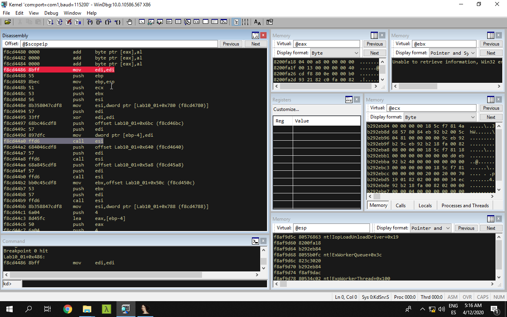

**3. What does this program do?**

The malicious binary will load the kernel driver "Lab10-01.sys", which will create and modify the following registry keys:

```
\Registry\Machine\SOFTWARE\Policies\Microsoft
\Registry\Machine\SOFTWARE\Policies\Microsoft\WindowsFirewall
\Registry\Machine\SOFTWARE\Policies\Microsoft\WindowsFirewall\DomainProfile
\Registry\Machine\SOFTWARE\Policies\Microsoft\WindowsFirewall\StandardProfile
```

The established values are all "0", which will cause to disable the _Windows_ firewall.

## Lab 10-2

The file for this lab is Lab10-02.exe.

**1. Does this program create any files? If so, what are they?**

First, we are going check both strings and imports of the file to see if it has something related with file creation.

```
C:\> strings Lab10-02.exe

...
Failed to start service.
Failed to create service.
486 WS Driver
Failed to open service manager.
C:\Windows\System32\Mlwx486.sys
FILE
...

C:\> python get_file_imports.py Lab10-02.exe

======================
KERNEL32.dll
======================
CreateFileA
SizeofResource
WriteFile
FindResourceA
LoadResource
...
```

As we can see, the file have some functions related with file creation, also one related with resource extraction. Moreover, if we take a look to the strings, we can see a new driver filename at "C:\Windows\System32\" called "Mlwx486.sys", so may the sample will create such file.

If we open the file with _Resource Hacker_, we can see how it contains a binary as a resource file, probably the driver file we see in the strings.


We extract the binary and save it as "Lab10-02.bin".

So now, we are going to open the binary "Lab10-02.exe" file in _IDA Pro_ so as to analyze it in a deeper way.

The first thing the sample will does is loading the resource file "FILE" ("Lab10-02.bin" in our case) and save it as "Mlwx486.sys" at "C:\Windows\System32\", as we have previously foretold.

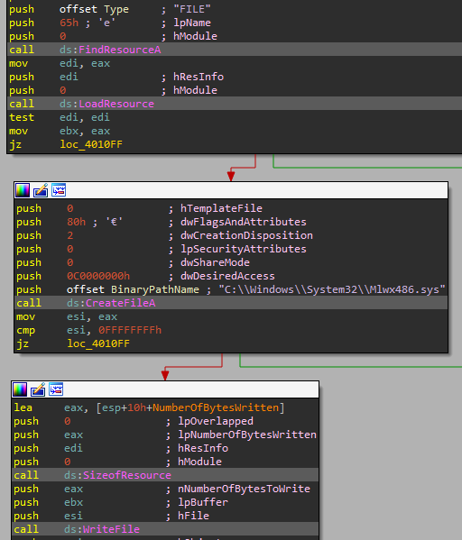

**2. Does this program have a kernel component?**

To check so, we continue analyzing the binary file "Lab10-02.exe".

After creating the driver file "Mlwx486.sys", it will create a new service called "486 WS Driver" that will it as kernel driver.

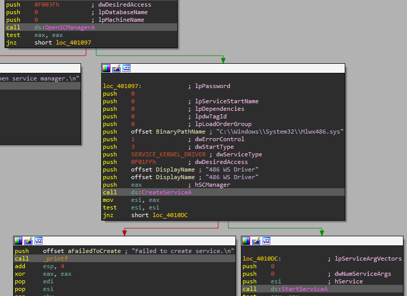

**3. What does this program do?**

So now, it is time to analyze the kernel driver "Lab10-02.bin" in _IDA Pro_.

So first, the kernel driver will jump to _\_DriverEntry@8_ in _DriverEntry_ function.


In such function, it will look for the funtion "N" in the _System Service Descriptor Table_ (SSDT).


As we can see, this does not have any sense, since there is no such function called "N". This is because the string is a _UNICODE_ string, so we have to convert it [ALT + A -> Unicode style].


Now we can see how the malware tries to look for the function _NtQueryDirectoryFile_ in the SSDT.


If everything goes right, it will modify the obtained value at the SSDT for the function at _0x00010486_, that we have renamed to _custom_NtQueryDirectoryFile_.


If we take a look to the _custom_NtQueryDirectoryFile_ function, we can see that it will call the legit _NtQueryDirectoryFile_ at the beginning and it will compare the value of _FileInformationClass_ with _FileBothDirectoryInformation_, which is a _\_FILE_BOTH_DIR_INFORMATION_ structure used to query detailed information for the files in a directory or, in other words, to list files in a directory.


Then, it will iterate over the results of the query and comparying the first 8 bytes of the field at _0x5E_ in the _\_FILE_BOTH_DIR_INFORMATION_ struct of the _FileInformation_ variable (stored at _ESI_) against the _UNICODE_ string "Mlwx", the start of the name of the driver.

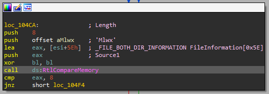

If the _UNICODE_ strings matches, it will overwrite the entry value with the offset of the next entry obtained by means of _NextEntryOffset_ field of _\_FILE_BOTH_DIR_INFORMATION_ struct of the _FileInformation_ variable.


However, we do not know what is stored in:

```
_FILE_BOTH_DIR_INFORMATION FileInformation[0x5E]
```

Let's try to get this information by debugging the kernel of the machine.

First, we start both machines, the _Windows XP_ in debugging mode.

Then, we execute the malicious binary.

Now, we can break the system and analyze the SSDT to see if the sample has modify it as expected.

By executing the following command, we check the bounds of the _NT_ module:

```
kd> lm m nt
start    end        module name
804d7000 806cff00   nt
```

So now we execute the following command to dump the first 100 _dwords_ of the SSDT:

```
kd> dd dwo(nt!KeServiceDescriptorTable) L100
...
80501dbc  8060cb50 8060cb50 8053c02e 80606e68
80501dcc  80607ac8 f8d45486 805b3de0 8056f3ca
80501ddc  806053a4 8056c222 8060c2dc 8056fc46
...
```


As we can see, there is something that is not in the bound of the SSDT, an entry that points to _0xf8d45486_. If we check the offset of such entry we will get:

```
Entry offset - Start offset = result offset
		||
		\/
0x80501DD0 - 0x804D7000 = 0x2ADD0
```

Now, if we check this offset in a non infected machine, we can see the real value of the real function:

```
kd> lm m nt
start    end        module name
804d7000 806cff00   nt

kd> dd dwo(0x804d7000 + 0x2ADD0) L1
8056f074  8b55ff8b

kd> ln 8056f074
(8056f074)   nt!NtQueryDirectoryFile   |  (8056f0da)   nt!NtNotifyChangeDirectoryFile
Exact matches:
    nt!NtQueryDirectoryFile (<no parameter info>)
```

Great! It is the expected function!

So now, we can check to what module belongs the function at _0xf8d45486_. To do so, we execute the following command:

```
kd> lm
...
f8bb2000 f8bb3080   RDPCDD     (deferred)
f8bb8000 f8bb9400   vmusbmouse   (deferred)
f8bba000 f8bbb100   dump_WMILIB   (deferred)
f8d45000 f8d45d80   Mlwx486    (deferred)
f8d74000 f8d74b80   Null       (deferred)
f8ddd000 f8dddd00   dxgthk     (deferred)
f8de3000 f8de3c00   audstub    (deferred)
...
```

As we can see, the function _0xf8d45486_ is within the bounds of _Mlwx486_.

So now we set a breakpoint to the address of the hooked function and waits until the system breaks.

```
kd> bp 0xf8d45486
```

Now, when the breakpoint is hit, we can see the _NtQueryDirectoryFile_ calling in the _custom_NtQueryDirectoryFile_ function.

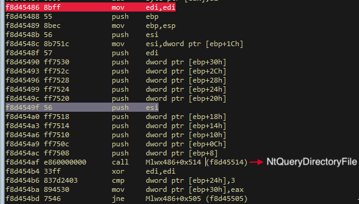

To do so, we set a breakpoint at _0xf8d454ca_, which is one the instructions before the _RtlCompareMemory_ calling.

```
kd> bp 0xf8d454ca
```

And then we continue:

```
kd> g
```

Now we can see what see by executing the following command what is stored at _ESI+0x5E_- 

```
kd> db esi+0x5e
0019b8e6  64 00 65 00 73 00 6b 00-74 00 6f 00 70 00 2e 00  d.e.s.k.t.o.p...
0019b8f6  69 00 6e 00 69 00 00 00-00 00 00 00 00 00 00 00  i.n.i...........
```

As we can see, it stores the filename of the listed files of a directory (it is possible that we have to execute the previous commands several times).

So the function _custom_NtQueryDirectoryFile_ will list all files in a folder, it will look for the first 8 bytes of every filename and compare it against the _UNICODE_ version of "Mlwx", which is how it starts the malicious kernel driver. If this file is found, it will remove it from the list.

## Lab 10-3

This lab includes a driver and an executable. You can run the executable from anywhere, but in order for the program to work properly, the driver must be placed in the C:\Windows\System32 directory where it was originally found on the victim computer. The executable is Lab10-03.exe, and the driver is Lab10-03.sys.

**1. What does this program do?**

First, we are going to analyze the executable in _IDA Pro_

The first thing the binary does is creating and starting a kernel driver service in which the driver "Lab10-03.sys" is loaded.

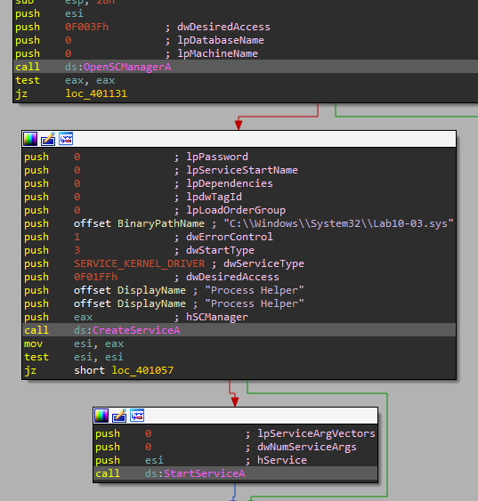

Then, the sample takes a handle to the "\\\\.\\ProcHelper" driver object and sends the data _0xABCDEF01_ as _ControlCode_ to it using _DeviceIoControl_.

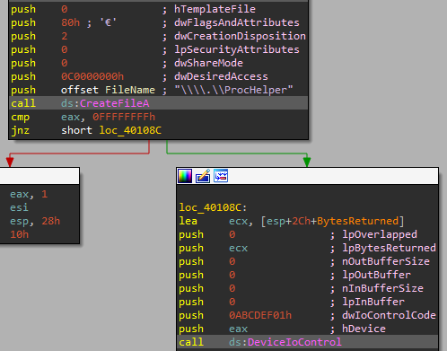

Now, we see how the binary will get a _COM_ object and its associated interface by means of _CoCreateInstance_.

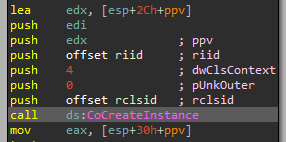

If we check the values of the _CLISD_ and the _IID_ we will see the following.

```
dd 2DF01h
dw 0
dw 0
db 0C0h, 6 dup(0), 46h
	||
	\/
0002DF01-0000-0000-C000000000000046
```

This is the _Internet Explorer_ _CLISD_.

Now, if we analyze the _IID_ value we get:

```
dd 0D30C1661h
dw 0CDAFh
dw 11D0h
db 8Ah, 3Eh, 0, 0C0h, 4Fh, 0C9h, 0E2h, 6Eh
	||
	\/
D30C1661-CDAF-11D0-8A3E00C04FC9E26E
```

This represents the _IWebBrowser2_ interface of the COM object represented by the previous _CLISD_ value.

Then, if everything goes well, the _Navigate_ method of the _IWebBrowser2_ interface will be executed (do not forget to add the _IWebBrowser2vtbl_ struct) using "http://www.malwareanalysisbook.com/ad.html" as _URL_.

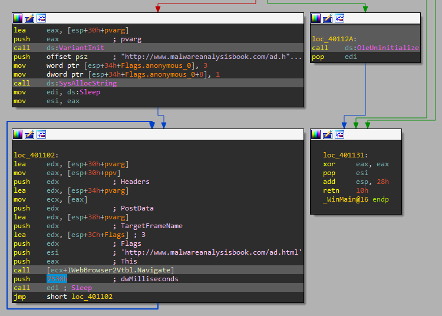

This will be executed every 30 seconds indefinitely.

**2. Once this program is running, how do you stop it?**

If we try to stop it using _Process Explorer_, we can see how the program seems to be stopped.

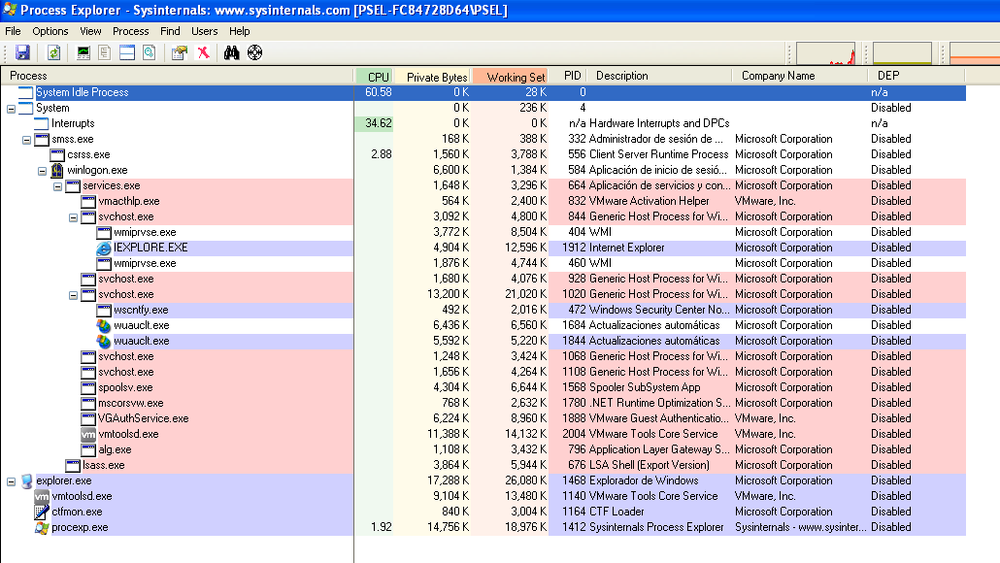

However, it is running as we can see.

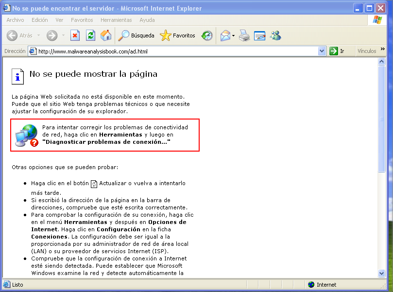

The easiest way to stop the execution of the program is rebooting the system.

**3. What does the kernel component do?**

We load the file _Lab10-03.sys_ in _IDA Pro_ to analyze it.

The first thing we see is that it creates a _DeviceObject_ for use by "\\Device\\ProcHelper" driver, which is the same we saw in the executable.

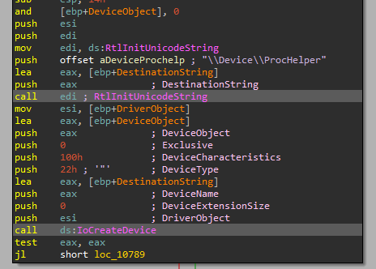

Then it mades some changes to the _DriverObject_ struct. It adds some entrie to the _MajorFunction_ array field and another one to the _DriverUnload_ field.

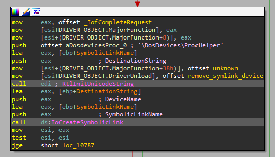

As we can see, the sample will add the pointer to the function _remove_symlink_device_ (_0x0000062A_), which will remove the symbolic link and the driver device.

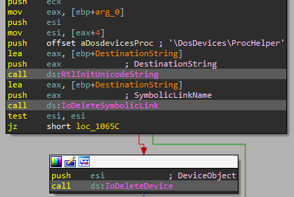

Regarding the _unknown_ function (_0x00000666_), we can what it does.

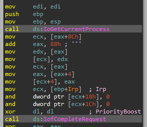

As we can see, it calls to _IoGetCurrentProcess_, which will return the _\_EPROCESS_ struct of the current process. However, we cannot see to what field corresponds the offset _0x8C_ and _0x88_, since _IDA_ does not have such struct definition. We will have to use _WinDBG_ in order to get these values and understand what this function does.

We run both machines and break the _Windows XP_ as soon it has loaded. Then, we execute the following command:

```
kd> dt nt!_EPROCESS
   +0x000 Pcb              : _KPROCESS
   +0x06c ProcessLock      : _EX_PUSH_LOCK
   +0x070 CreateTime       : _LARGE_INTEGER
   +0x078 ExitTime         : _LARGE_INTEGER
   +0x080 RundownProtect   : _EX_RUNDOWN_REF
   +0x084 UniqueProcessId  : Ptr32 Void
   +0x088 ActiveProcessLinks : _LIST_ENTRY
   +0x090 QuotaUsage       : [3] Uint4B
   +0x09c QuotaPeak        : [3] Uint4B
   +0x0a8 CommitCharge     : Uint4B
   +0x0ac PeakVirtualSize  : Uint4B
   +0x0b0 VirtualSize      : Uint4B
   +0x0b4 SessionProcessLinks : _LIST_ENTRY
...
```

As we can see, the values points to _ActiveProcessLinks_ \__LIST_ENTRY_ struct. So now, if we print such struct we will get:

```
kd> dt nt!_LIST_ENTRY
   +0x000 Flink            : Ptr32 _LIST_ENTRY
   +0x004 Blink            : Ptr32 _LIST_ENTRY
```

These entries will point to the forward _\_EPROCESS_ struct (flink) and to the backward _\_EPROCESS_ struct.

So now, we can analyze the code:

```
mov     ecx, [eax+8Ch]		-> ECX = ActiveProcessLinks.Blink
add     eax, 88h ;		-> EAX = ActiveProcessLinks.Flink
mov     edx, [eax]		-> EDX = ActiveProcessLinks.Flink
mov     [ecx], edx		-> [ECX] = ActiveProcessLinks.Blink = ActiveProcessLinks.Flink
mov     ecx, [eax]		-> ECX = ActiveProcessLinks.Flink
mov     eax, [eax+4]	-> EAX = ActiveProcessLinks.Blink
mov     [ecx+4], eax	-> ActiveProcessLinks.Blink = ActiveProcessLinks.Blink
```


