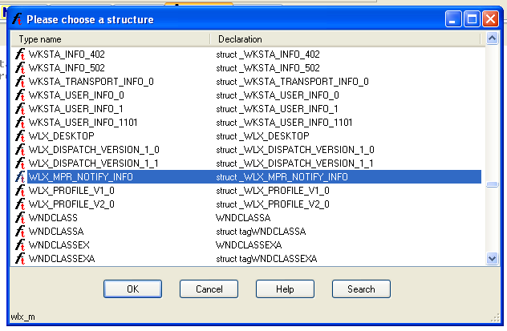
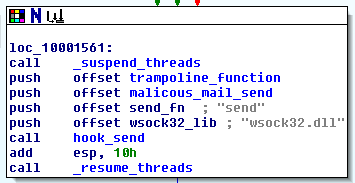
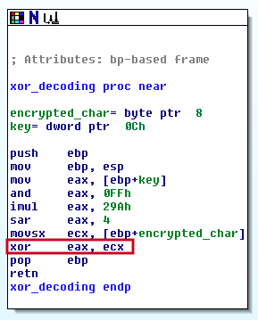

# Lab 11 - Malware Behaviour

## Lab 11-1

Analyze the malware found in Lab11-01.exe.

**1. What does the malware drop to disk?**

To do so we are going to use different tools such as _Resource Hacker_ or _IDA Pro_.

Te first thing we do is using _Resource Hacker_ so as to check if the malware contains any other binary in it.


As we can see, there is some binary inserted in the malware called _TGAD_. Also, it is something we can check in _IDA Pro_ at function that we have called _loadAndDropResource_ at address _0x00401080_.


Also, this binary seems to be dropped to the filesystem, in the same path of the binary, as a _DLL_ called _msgina32.dll_ as we can check in the same routine in _IDA Pro_.


We will need to research deeper in order to know what this module does.

**2. How does the malware achieve persistence?**

The malware creates a registry key called _GinaDLL_ within "SOFTWARE\Microsoft\Windows NT\CurrentVersion\Winlogon" with the value of the path of the "msgina32.dll" binary that was previously dropped at function we have called _persistenceSetup_ at address _0x00401000_. This will lead to _Winlogon_ to load the malicious _DLL_ at startup instead of the legit _msgina.dll_.


**3. How does the malware steal user credentials?**

To know how the malware does this, first, we need to extract the _DLL_ that is stored in it. To do so we use _Resource Hacker_ and the option _Save as..._ when you right-click on the stored binary. Now, we can analyze the _DLL_ in _IDA Pro_.

At first sight, we can see a lot of different exports in the binary. Nevertheless, most of them, the _gina_x_ are the same, they just prints out the result of the _WINAPI_ function _GetProcAddress_ using the number _x_ as parameter and jumps to that function, this is because the malware just want to pass out the execution to the legitimate _msgina.dll_ binary. Also, the rest of the exports are pretty much the same but _WlxLoggedOutSAS_, _DLLRegister_ and _DLLUnregister_.

The _DLLRegister_ and _DLLUnregister_ are methods so as to enable or disable the persistence mechanism. However, the function _WlxLoggedOutSAS_ seems to perform some interesting stuff that we will analyze. First of all, let's see what this function does.

```
Winlogon calls this function when it receives a secure attention sequence (SAS) event while no user is logged on.

int WlxLoggedOutSAS(
  PVOID                pWlxContext,
  DWORD                dwSasType,
  PLUID                pAuthenticationId,
  PSID                 pLogonSid,
  PDWORD               pdwOptions,
  PHANDLE              phToken,
  PWLX_MPR_NOTIFY_INFO pNprNotifyInfo,
  PVOID                *pProfile
);
```

This function is called when the user logs off, but the interesting part of this function is the following:

```
pNprNotifyInfo
A pointer to an WLX_MPR_NOTIFY_INFO structure that contains domain, user name, and password information for the user. Winlogon will use this information to provide identification and authentication information to network providers.
```

Interseting, so the _WLX_MPR_NOTIFY_INFO_ structure contains the information of the user. Let's insert this structure in _IDA Pro_ and modify the variable that uses it.

We select the "Structures" tab, click on _INSERT_ and select "Add standard structure". We search for _WLX_MPR_NOTIFY_INFO_ structure and accept.



Now, on every reference to the structure (in this case it points out to _ESI_) we right-click and select the corresponding structure variable.


Now, we can see how the malware dumps the credentials of the user.


**4. What does the malware do with stolen credentials?**

The credentials of the user are stored in a file called "msutils32.sys" as we can see.


**5. How can you use this malware to get user credentials from your test environment?**

To execute the malware we have to perform the following actions:
	1. Reboot the system (the dll will be executed once the system restarts).
	2. Log out (the malware will get the credentials once the user logs out).
	3. Check the file "C:\Windows\System32\msutil32.sys" with the credentials (notice that the binary _Winlogon_ that loads this DLL is located at "C:\Windows\System32\").


The file will have the following output:

```
01/29/20 17:34:32 - UN PSEL DM PSEL-FC84728D64 PW password OLD (null) 
```

## Lab 11-2

Analyze the malware found in Lab11-02.dll. Assume that a suspicious file named Lab11-02.ini was also found with this malware.

**1. What are the exports for this DLL malware?**

When we open this file with _PEView_ we can see that the _EXPORT Address Table_ has only one function called _installer_ with the ordinal value of "1".

**2. What happens after you attempt to install this malware using rundll32.exe?**

We run first _Regshot_ to register the changes that the malware can perform in the system and then we run the malware as so:

```
C:\> rundll32 Lab11-02.dll,installer
```
At first glance nothing seems to happen, however some modifications have been performed on the system. First of all, one file called _spoolvxx32.dll_ has been dropped to the path "C:\Windows\System32\", probably is the same file of the malware. Also, the value of this _DLL_ has been added to the registry key "HKLM\SOFTWARE\Microsoft\Windows NT\CurrentVersion\Windows\AppInit_DLLs". This will force the system to load, and run, the malicious _DLL_ at system startup.

**3. Where must Lab11-02.ini reside in order for the malware to install properly?**

To ask this question we are going to use _IDA Pro_ to analyze the binary.

When the malware is executed, it checks in the _DLLMain_ the existence of the file _Lab11-02.ini_ int the path "C:\Windows\System32".


**4. How is this malware installed for persistence?**

The malware gains persistence by copying itself to "C:\Windows\System32" with the name _spoolvxx32.dll_ and setting this name as value of "HKLM\SOFTWARE\Microsoft\Windows NT\CurrentVersion\Windows\AppInit_DLLs" registry key (this process is done in reverse order by the malware), as commented in the exercise 2-2. This process is done in the exported function called _installer_ and forces every application that loads _User32.dll_ to load also the malware.


**5. What user-space rootkit technique does this malware employ?**

Once the malware has checked what mail process has loaded it, it suspends all threads, overwrites the legitimate _send_ function of _wsock32.dll_ by a malicious one, so as to force the mail process to send the emails to the malicious email address, and finally resumes all threads again.



**6. What does the hooking code do?**

The hooking code consists of suspending all threads of the current process, replacing the malicious _send_ function in memory and resuming all threads after.

**7. Which process(es) does this malware attack and why?**

The malware only targets three differenct process: _thebat.exe_, _outlook.exe_ and _msimn.exe_.


These process are targeted because of all them are mail clients.

**8. What is the significance of the .ini file?**

The configuration file _Lab11-02.ini_ seems to be encrypted, something we confirm when we see the function located at _0x100010B3_ that we have called _decrypt_file_content_.


There, we can see a function call that we have called _xor_decoding_, since the decryption routine is _XOR_ based.



In the pictures we can see that the function takes two parameters, the first one is one encrypted character of the file content and the second is the _key_ with the value _0x32_. To get the contents of the file in hexadecimal we used the program called _HxD_, which is an hexadecimal editor.

```
encrypted_content = 0x43, 0x48, 0x4D, 0x4D, 0x58, 0x61, 0x4C, 0x40, 0x4D, 0x56, 0x40, 0x53, 0x44, 0x40, 0x4F, 0x40, 0x4D, 0x58, 0x52, 0x48, 0x52, 0x43, 0x4E, 0x4E, 0x4A, 0x0F, 0x42, 0x4E, 0x4C
key = 0x32
```

The meaning of the instructions of the decryption routing are the following:

```
mov     eax, [ebp+key]			-> EAX = 32h = 50
and     eax, 0FFh			-> EAX = 32h = 50
imul    eax, 29Ah			-> EAX = 32h * 29Ah = 50 * 666 = 0x8214 = 33300
sar     eax, 4				-> EAX = 821h = 2081
movsx   ecx, [ebp+encrypted_char]	-> ECX = encrypted_char
xor     eax, ecx			-> EAX = 821h ^ encrypted_char = 2081 ^ encrypted_char
```

Also, we have to take these instruction after this function is executed:

```
mov     ecx, [ebp+Lab11_02_ini_contents]	-> ECX = encrypted_char
mov     [ecx], al				-> encrypted_char [i] = decrypted_char (EAX = decrypted char -> AL = last byte -> EAX = 862h => AL = 62h)
```
This means that we have to keep only the last two elements of the decrypted character, which is the same as using the key _0x21_ instead of _0x821_ or adjusting the decrypted character using the _AND_ operation with the value _0x00FF_. Doing so we have developed the following script so as to decrypt the configuration file.

```
encrypted_string = bytearray([0x43, 0x48, 0x4D, 0x4D, 0x58, 0x61, 0x4C, 0x40, 0x4D, 0x56, 0x40, 0x53, 0x44, 0x40, 0x4F, 0x40, 0x4D, 0x58, 0x52, 0x48, 0x52, 0x43, 0x4E, 0x4E, 0x4A, 0x0F, 0x42, 0x4E, 0x4C])
decryption_key = 0x821

decrypted_string = ""

for counter in range(len(encrypted_string)):
	encrypted_char = encrypted_string[counter]
	decrypted_string = decrypted_string + chr((decryption_key ^ encrypted_char) & 0x00FF)

print("The decrypted string is: " + decrypted_string)
```

Now, when we execute the script will find the decrypted value.

```
$ python3 Scripts/Others/lab_11_2_decryption_config_file.py

The decrypted string is: billy@malwareanalysisbook.com
```

The configuration file seems to contain an email address to use further by the malware. Something we can check in the function located at _0x1000113D_ that we have called _mail_setup_, due to all the email configuration that seems to happen there:


**9. How can you dynamically capture this malware’s activity with Wireshark?**

First of all we have to install the malware by using the _install_ export of the _DLL_. After that, we reboot the system and execute one of the three mail programs that the malware waits. Then we start _Wireshark_ so as to capture all the traffic and finally we send an email to execute the malicious send module of the sample.

## Lab 11-3

Analyze the malware found in Lab11-03.exe and Lab11-03.dll. Make sure that both files are in the same directory during analysis.

**1. What interesting analysis leads can you discover using basic static analysis?**

**2. What happens when you run this malware?**

**3. How does Lab11-03.exe persistently install Lab11-03.dll ?**

**4. Which Windows system file does the malware infect?**

**5. What does Lab11-03.dll do?**

**6. Where does the malware store the data it collects?**
