# Lab 12 - Covert Malware Launching

## Lab 12-1

Analyze the malware found in the file Lab12-01.exe and Lab12-01.dll. Make sure that these files are in the same directory when performing the analysis.

**1. What happens when you run the malware executable?**

Before running the sample, we are going to set up _Process Monitor_ so as to capture all traces of the malware execution, to do so, we create a new filter in which the process name will have to be the name of the malware.

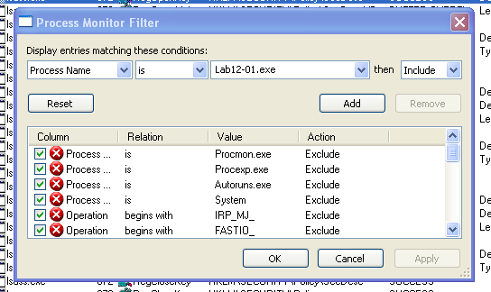

Now, we apply the changes and we are ready to run the sample.

When we run the sample, a pop up that says "Press OK to reboot" appears, this pop up will appears every minute or so, but adding one to X at the title of the window "Practical Malware Analysis X".

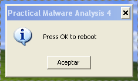

This behaviour is quite anoying, so we save the _Process Monitor_ log file, reboot the machine and revert the snapshot.

Now, we can analyze the file.

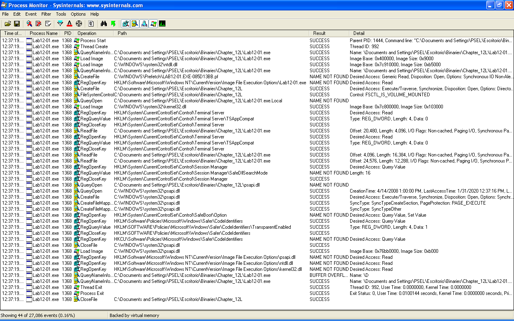

Mmmmm... It seems that _Process Monitor_ does not capture all the execution with this filter. So we add another filter, in this case if the name of the _DLL_ appears in the path column (notice we have disabled the other filter).

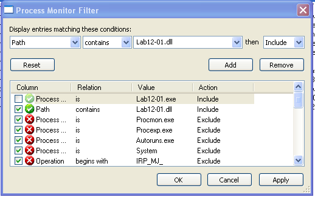

Now, we can see that the malicious _DLL_ has been loaded by...

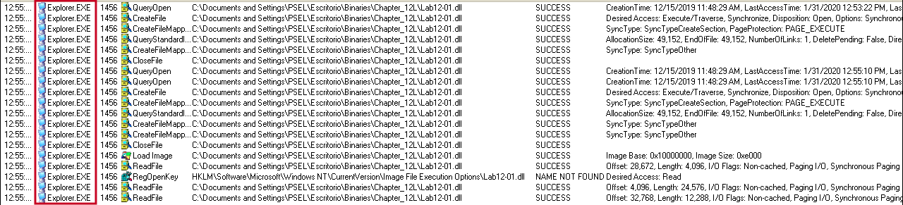

_Explorer.exe_!!! This is clearly an indicator of the usage of a process injection technique!

**2. What process is being injected?**

As we have previously seen in the first exercise, the targeted process seems to be _explorer.exe_, but let's analyze the malware in _IDA Pro_ so as to verify it.

At the beginning of the executable we can see how it loads _EnumProcessModules_, _GetModuleBaseNameA_ and _EnumProcesses_, which are necessary to list processes.

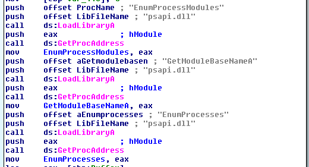

After that, it calls the previously loaded _EnumProcesses_ function, which returns an array of the _PIDs_ of the processes of the system that we have called _processesPIDs_.

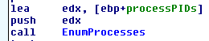

Then, this array is iterated so as to find the PID of _explorer.exe_. Here, we can see where this check is done, in a function we have called _checkExplorerPID_ (_0x00401000_).

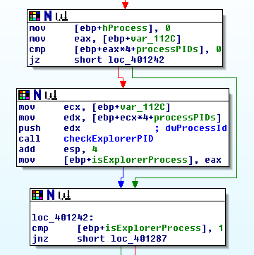

In this function we can see how the malware makes this check.

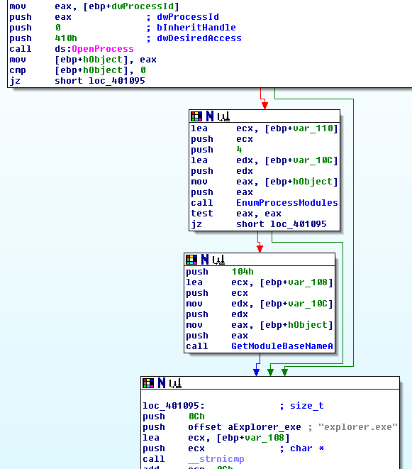

After that, we can see how the malware performs the process injection using the _WINAPI_ functions _VirtualAllocEx_ to allocate memory in the remote process, _WriteProcessMemory_ to write the malicious _DLL_ into the process address space and _CreateRemoteThread_ to call _LoadLibraryA_ from the remote process to load the malicious _DLL_.

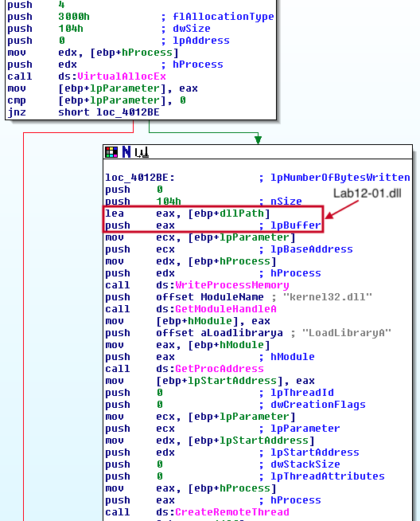

**3. How can you make the malware stop the pop-ups?**

As we can see while analyzing the _DLL_, the pop ups are displayed every minute in a new thread.

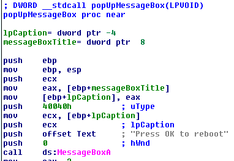

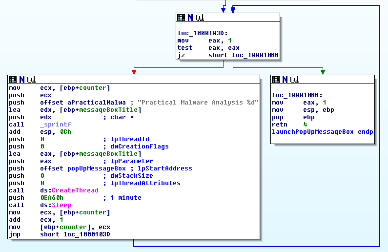

After analyzing the function located at _0x10001030_, we can conclude that it will never stops, since it checks if _EAX_ is equal to 0, but in the previous instruction the malware has set _EAX_ to 1.

This led us to know that the only thing we can do is restarting _explorer.exe_ so as to stop malware execution, this can be done by rebooting the system for example.

**4. How does this malware operate?**

The malware enumerate the processes of the machine to find out the _PID_ of the _explorer.exe_ process, when the malware finds it, it will inject the _DLL_ _Lab12-01.dll_ into _explorer.exe_. Once the _DLL_ is loaded and executed, it will start popping up windows every minute until the user reboots the system or restarts the process _explorer.exe_.

## Lab 12-2

Analyze the malware found in the file Lab12-02.exe.

**1. What is the purpose of this program?**

First, the malware gets the path of the process _svchost.exe_, then, it loads and decrypts the resource file contained in it, this resource is a binary file. After that, the malware injects the binary file into the process _svchost.exe_.

Once the encrypted binary is executing, it starts capturing the keys pressed by the user (_keylogging_), storing the information in a file called _practicalmalwareanalysis.log_.

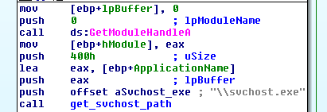

**2. How does the launcher program hide execution?**

The malware executes the malicious payload inside the process _svchost.exe_. This is performed by means of a process injection technique called _Process Hollowing_. This technique consist of the following phases:

1. The malware calls _CreateProcess_ to spawn the legit process _svchost.exe_, but in _suspended_ mode with the argument _dwCreationFlags_ set as 4 or _CREATE_SUSPENDED_.

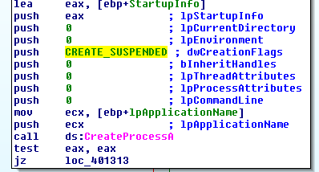

2. The malware calls _NtUnmapViewOfSection_ to unmap the memory address space of the legit process where the malicious one will be placed.

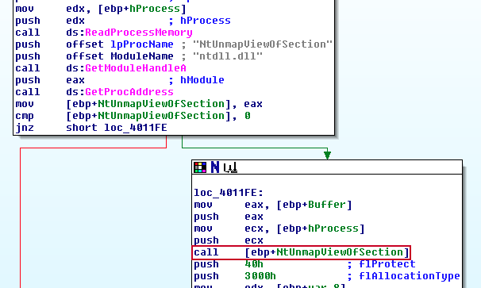

3. The malware writes the malicious process into the legit one (to understand better the writing process the structures _IMAGE_DOS_HEADER_, _IMAGE_NT_HEADERS_, and _IMAGE_SECTION_HEADER_ have been added and set up).

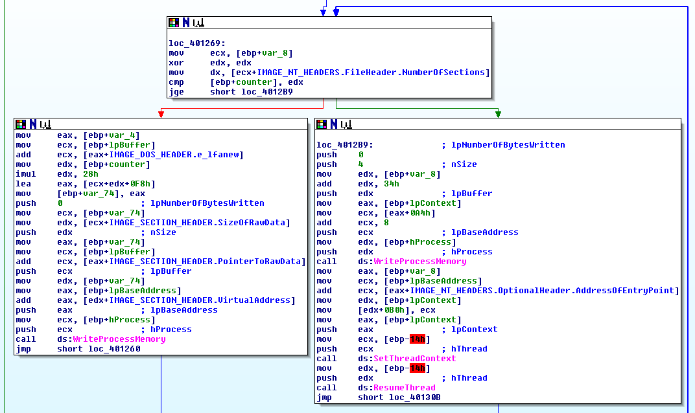

4. When the malware ends the writing process, it resumes the thread so as to execute the delivered payload.

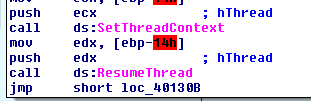

**3. Where is the malicious payload stored?**

The malicious payload is stored in an encrypted way as a resource file within the malware. To extract the malware, we use _Resource Hacker_ and its feature of _save as..._, in our case as _lab12-02_encrypted_payload.ex__.

**4. How is the malicious payload protected?**

The malicious payload is encrypted using the simple _XOR_ algorithm with the key equal to _0x41_ in the routine _decryptionRoutine_ at address _00401000_ as we can see in the following pictures.

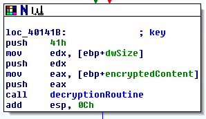

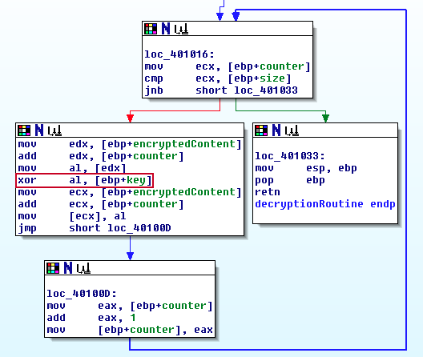

To decrypt the resource, we are going to use the following python script that we have developed:

```
def decrypt_file():
	decrypted_bytes = bytearray()
	key = 0x41

	with open("Scripts/Others/Lab_12/lab12-02_encrypted_payload.ex_", "rb") as encrypted_file:
		encrypted_byte = encrypted_file.read(1)
		while encrypted_byte:
			decrypted_byte = int.from_bytes(encrypted_byte, byteorder="big") ^ key
			decrypted_bytes.append(decrypted_byte)
			encrypted_byte = encrypted_file.read(1)

	return decrypted_bytes

def save_decrypted_file(decrypted_bytes):
	decrypted_file = open("Scripts/Others/Lab_12/lab12-02_decrypted_payload.ex_", "wb")
	decrypted_file.write(decrypted_bytes)

decrypted_bytes = decrypt_file()
save_decrypted_file(decrypted_bytes)
```

Now, we simply execute it as follows:

```
python3 Scripts/Others/Lab_12/lab12_02_decrypt_file.py
```

Voilà! The file has been successfully decrypted!

**5. How are strings protected?**

The payload's strings are also encrypted using the same _XOR_ encryption algorithm commented in the previous exercise, since the malware encoded the whole payload using this technique.

## Lab 12-3

Analyze the malware extracted during the analysis of Lab 12-2, or use the file Lab12-03.exe.

**1. What is the purpose of this malicious payload?**

The purpose of the malware is capturing the keys pressed by the user (_keylogging_), storing the information in a file called _practicalmalwareanalysis.log_.

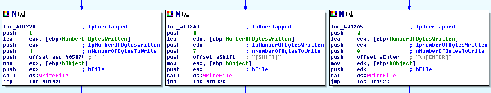

**2. How does the malicious payload inject itself?**

The malware creates a _hook injection_ so as to capture the keystrokes of the keyboard. This _hook_ is done by means of _SetWindowsHookExA_ _WINAPI_ function.

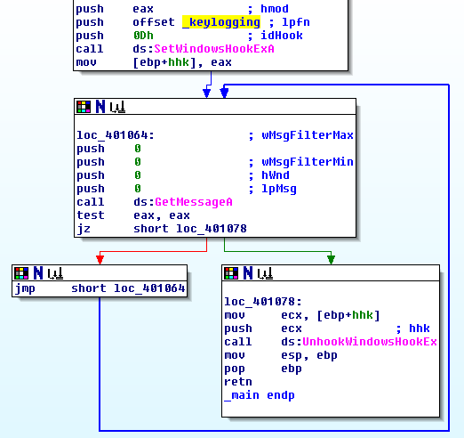

**3. What filesystem residue does this program create?**

The malware creates a file called _practicalmalwareanalysis.log_ that stores the keys pressed by the user.

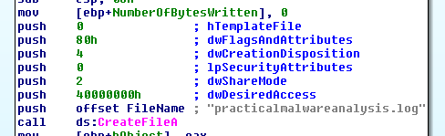

## Lab 12-4

Analyze the malware found in the file Lab12-04.exe.

**1. What does the code at 0x401000 accomplish?**

This function starts with an _OpenProcess_ _WINAPI_ call with the _PID_ provided as argument, after that, it makes a call to an unknown function that we know based on the executed instructions of the _main_ function that it is _EnumProcessModules_. After that, it makes a call to _GetModuleBaseNameA_, which also we know because its address is calculated in the _main_ function.

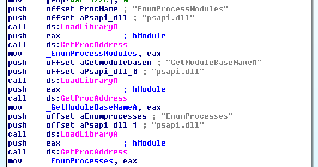

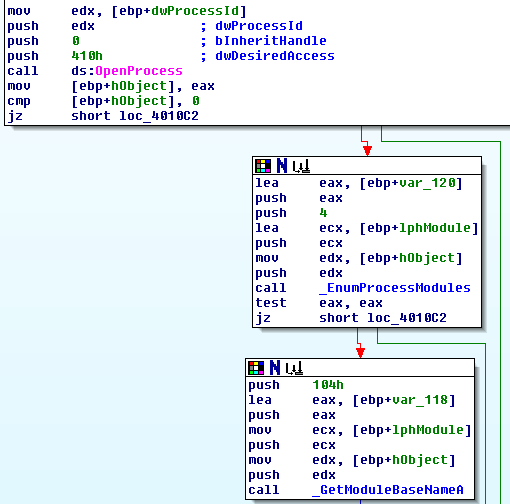

At this moment we know that the malware has listed the modules loaded by the process and has requested the base name of one specific module. The value of the base name will be stored in the variable _var_118_ which stores the value of _dword_403020_ at this time.

Once the malware executes the function _GetModuleBaseNameA_, it will compare the result of _var_118_ with the value of _var_14_, which is equal to _dword_403010_.

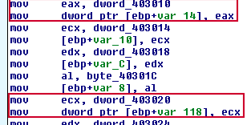

If we take a look at the values of this global variables, we see something confusing. We expected string values!

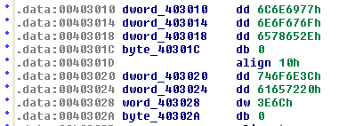

This is because _IDA Pro_ has failed to recognize the varaibles properly, we need to fix them. To do so, we click on the first variable and hit the key 'a', we do the same with the second one. Now we have the following strings: 'winlogon.exe' and '<not real>'.

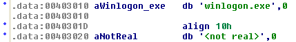

We know that the string '<not real>' will be overwritten when _GetModuleBaseNameA_ will be called, so the one that we care about is 'winlogon.exe', which the name of a process.

It seems that the malware checks the process name of the _PID_ provided as argument, and if it is _winlogon.exe_, it will return '1' (true), but if not, it will return '0' (false).

So we rename this function to _check_winlogon_process_.

**2. Which process has code injected?**

The malware will inject code into _winlogon.exe_ process, based on the previous exercise and the code of the _main_ function.

The injection process takes place at _0x00401174_ and the malware makes the following process so as to execute the process injection:

1. Enable _SeDebugPrivilege_ permission so as to call _CreateRemoteThread_ and manipulate the memory of the remote process.

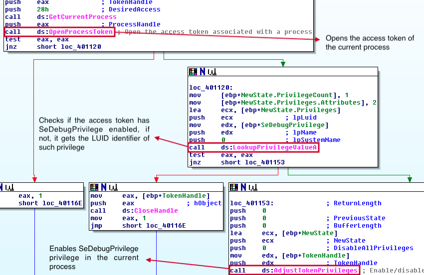

2. Get the address of the exported function with ordinal 2 of _sfc_os.dll_.

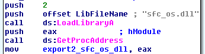

This _DLL_ is a legit one from Windows, so we need to understand what ordinal 2 means. To do so, we load _sfc_os.dll_ in _PEView_ and check the exports of such library. This reveals us that the ordinal 2 is an undocumented function of such _DLL_, we will have to investigate further so as to understand what this function does.

A simple search on Internet reveals that this function could be named as _SfcTerminateWatcherThread_, this means that this function can disable the _System File Checker_ (SFC), also known as _Windows File Protection_, which monitors and prevents programs from replacing critical Windows system files, if its called from _winlogon.exe_. This implementation can be seen in _IDA Pro_ by seting the value _0_ in the key _SfcDisable_ at "\Registry\Machine\Software\Microsoft\Windows NT\CurrentVersion\Winlogon" registry key by means of _NtSetValueKey_ (this is done in the function we have renamed to _NtSetRegistryKey_.

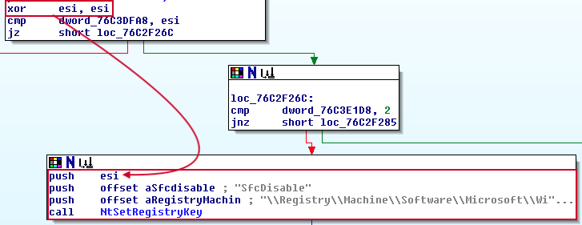

3. Get a handle to the remote process.

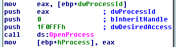

4. Call to _CreateRemoteThread_ to execute _SfcTerminateWatcherThread_ of _sfc_os.dll_ within the remote process address space.

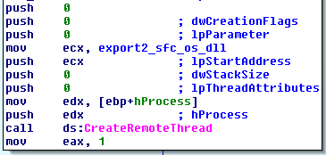

After that, the _SFC Watcher_ will be disabled, allowing the malware to do any change in the filesystem

**3. What DLL is loaded using LoadLibraryA?**

The _DLL_ loaded is _sfc_os.dll_, as explained in the previous exercise.

**4. What is the fourth argument passed to the CreateRemoteThread call?**

This is the memory address of the ordinal function 2, also called _SfcTerminateWatcherThread_, of _sfc_os.dll_.

**5. What malware is dropped by the main executable?**

After the injection has taken place, the malware starts the dropping process of a binary stored in it as a resource file called _BIN_ _101_. This file can be seen by means of _Resource Hacker_.

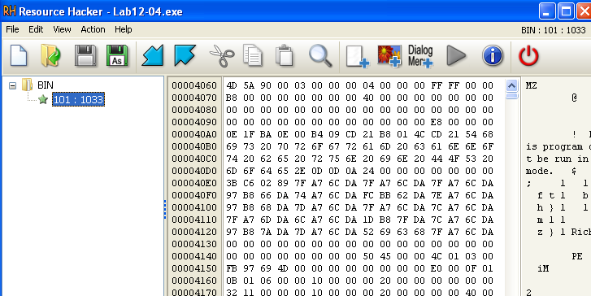

This resource file is loaded and executed in the function at address _0x004011FC_ in a function we have called _load_execute_resource_file_, but let's analyze what happens previously.

Before the resource is loaded, the malware moves the legit _wupdmgr.exe_ binary file (_Windows Update Utility_) located at "C:\Windows\System32" as _winup.exe_ in the temporal path.

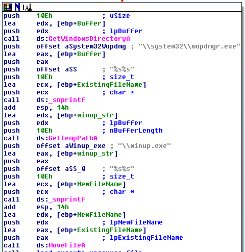

After that, the previously commented _load_execute_resource_file_ function is called. This function will drop the malicious resource binary in the path "C:\Windows\System32" as _wupdmgr.exe_, impersonating the legit _Windows Update Utility_ without raising any alert on the system, because of being disabled the _SFC Watcher_.

**6. What is the purpose of this and the dropped malware?**

Now it is time to analyze the dropped malware. To do so, first we extract the binary by means of _Resource Hacker_, then, we will load it in _IDA Pro_.

The dropped malware will first execute the legit _Windows Update Utility_ located in the temporal path as _winup.exe_.

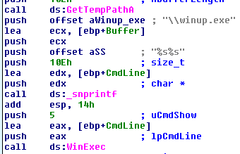

After that, the malware will make a request to _http://www.practicalmalwareanalysis.com/updater.exe_ by means of _URLDownloadToFileA_ to download the file _updater.exe_. This file will be saved in the path "C:\Windows\System32\wupdmgr.exe", this means that the malware will overwrite itself with this new binary. Then, the malware will execute the newly downloaded binary.

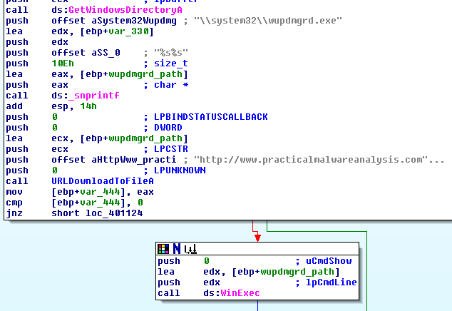