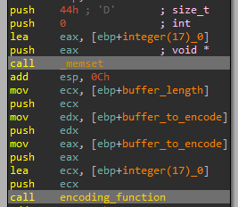
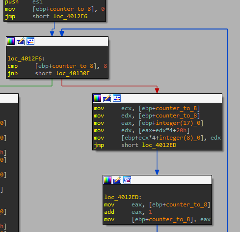
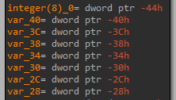
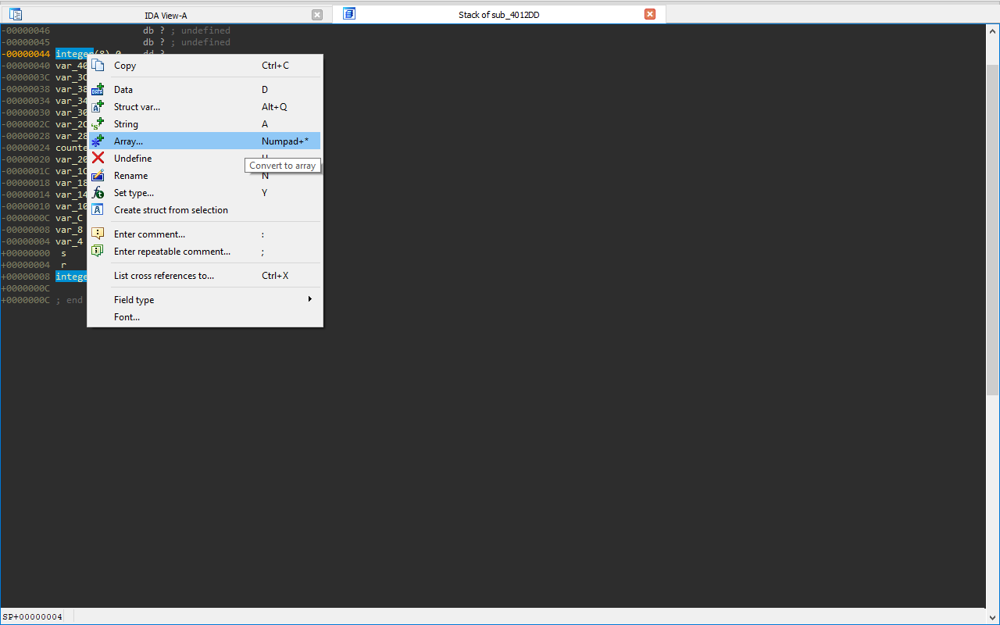
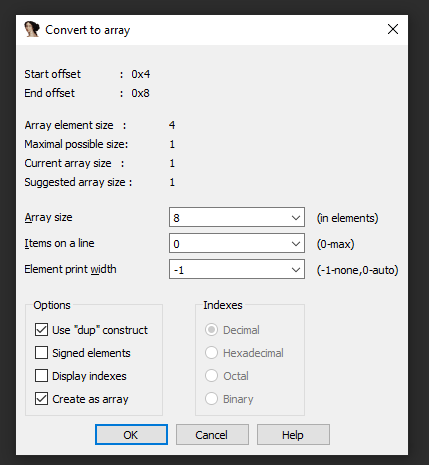
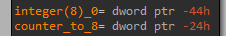

# Lab 13 - Data Encoding

## Lab 13-1

Analyze the malware found in the file Lab13-01.exe.

**1. Compare the strings in the malware (from the output of the strings command) with the information available via dynamic analysis. Based on this comparison, which elements might be encoded?**

When we execute the _strings_ command we only can see a bunch of interesting strings:

```
C:\> strings Lab13-01.exe

...
ABCDEFGHIJKLMNOPQRSTUVWXYZabcdefghijklmnopqrstuvwxyz0123456789+/
...
GetStringTypeW
CloseHandle
7"@
Mozilla/4.0
http://%s/%s/
Could not load exe.
Could not locate dialog box.
Could not load dialog box.
Could not lock dialog box.
...
```

However, the sample seems to lack of strings, probably because of encoding. Let's see if we execute the sample, we can see more strings.

To do so, we execute the sample and then we check the strings by means of _Process Explorer_.

```
...
C:\Documents and Settings\PSEL\Escritorio\Binaries\Chapter_13L\Lab13-01.exe
abcdefghijklmnopqrstuvwxyz
ABCDEFGHIJKLMNOPQRSTUVWXYZ
www.practicalmalwareanalysis.com
...
```

As we can see, the malware has decoded some binaries in execution time.

**2. Use IDA Pro to look for potential encoding by searching for the string xor. What type of encoding do you find?**

After searching the string _XOR_ ([ALT]+[T]) we find out the following operation at function _0x00401190_:

```
xor     eax, 3Bh
```

This seems to be the encoding routine that we were looking for.

**3. What is the key used for encoding and what content does it encode?**

The key of the decryption routine is the hexadecimal value _0x3B_.


The encoded data is given by means of a resource file, which can be seen by means of _Resource Hacker_. This file contains the following data:


```
4C 4C 4C 15 4B 49 5A 58 4F 52 58 5A 57 56 5A 57 4C 5A 49 5E 5A 55 5A 57 42 48 52 48 15 58 54 56
```

If we decode this data using the _XOR_ key we already know, we will see the value of the encrypted data. To do so, we have developed the following _python_ script:

```
encrypted_string = bytearray([0x4C, 0x4C, 0x4C, 0x15, 0x4B, 0x49, 0x5A, 0x58, 0x4F, 0x52, 0x58, 0x5A, 0x57, 0x56, 0x5A, 0x57, 0x4C, 0x5A, 0x49, 0x5E, 0x5A, 0x55, 0x5A, 0x57, 0x42, 0x48, 0x52, 0x48, 0x15, 0x58, 0x54, 0x56])
decryption_key = 0x3B

decrypted_string = ""

for counter in range(len(encrypted_string)):
	encrypted_char = encrypted_string[counter]
	decrypted_string = decrypted_string + chr(decryption_key ^ encrypted_char)

print("The decrypted string is: " + decrypted_string)
```

This wil give us the following output:

```
$ python3 Scripts/Others/Lab_13/lab13_01_decryption_resource_file.py

The decrypted string is: www.practicalmalwareanalysis.com
```

**4. Use the static tools FindCrypt2, Krypto ANALyzer (KANAL), and the IDA Entropy Plugin to identify any other encoding mechanisms. What do you find?**

We try to download and use the suggested _IDA Pro_ plugins, but we couldn't find the way to do it. However, we successfully executed the _KANAL_ plugin of _PEid_.


As we can see, several references to _base64_ have been found.

After that, we tried to use the plugin _findcrypt-yara_ (https://github.com/polymorf/findcrypt-yara) in the full IDA Pro version. After installing the plugin, we could see the following output.


It has detected one coincidence of _base64_ encoding, the same that _KANAL_ detected.

**5. What type of encoding is used for a portion of the network traffic sent by the malware?**

To know the encoding mechanism used by the malware, we need to take into account what the previously used plugins told us. That in the address _0x004050E8_ something related with _base64_ encoding was detected. If we go there, we will see a bunch of bytes that seems to be the alphabet of _base64_ encoding, but _IDA Pro_ has mislabeled, so let's fix it.


We click in the first letter (0x41) or in the variable _byte_4050E8_, and click on the key 'a'.


Now, we can see how this variable is referenced four times in the function at address _0x00401000_, we called _base64_encode_, which is referenced by the function located at _0x004010B1_, which is called just before the _InternetOpen_ _WINAPI_ function call. So we rename the function to _base64_encoding_.

**6. Where is the Base64 function in the disassembly?**

The _base64_ function is located at _0x004010B1_ and we have renamed it as _base64_encoding_. This function is called before the malware calls the function _InternetOpenA_ at function _CnC_communication_ located at _0x0004011C9_.


**7. What is the maximum length of the Base64 encoded data that is sent? What is encoded?**

Before the malware encodes the data, it makes a call to _gethostname_ and after that a _strcpy_ with a size of _0x0C_, which is equal to 12. So the malware will only encode 12 bytes of data.


So the data that it is encoded is the first 12 bytes of the computer hostname.

**8. In this malware, would you ever see the padding characters (= or ==) in the Base64-encoded data?**

Yes, but only if the local hostname have less than 12 characters.

**9. What does this malware do?**

The malware first reads and decrypts the included resource file, it contains the URL of the CnC. After that, it gets the first 12 bytes of the computer's hostname, _base64_ encodes it and uses this value as webpage to make the request, I mean: http://www.practicalmalwareanalysis.com/[base64 encoded hostname]/. After that, the malware sleeps 5 minutes and then exits.

## Lab 13-2

Analyze the malware found in the file Lab13-02.exe.

**1. Using dynamic analysis, determine what this malware creates.**

To do so we are going to use _RegShot_, which only tells us what we have seen, the malware creates 'n' files in the same path where the malware is located. The files seems to be encoded or something, since no _File Signatures_ (_Magic Numbers_) were identified.

We are going to use _Process Monitor_ to understand better what the malware does.


As we can see, just before the malware creates the file, it loads the library _uxtheme.dll_. However, if we take a look into the imports of the sample, we do not see such _DLL_ loaded:

```
======================
KERNEL32.dll
======================
GetStringTypeW
Sleep
LCMapStringW
LCMapStringA
...
======================
USER32.dll
======================
GetDesktopWindow
GetDC
ReleaseDC
GetSystemMetrics
======================
GDI32.dll
======================
CreateCompatibleBitmap
SelectObject
BitBlt
GetObjectA
...
```

**2. Use static techniques such as an xor search, FindCrypt2, KANAL, and the IDA Entropy Plugin to look for potential encoding. What do you find?**

By using _KANAL_ plugin no encoding is found, may be it uses an own encoding routine. This thinking is supported by the _IDA Python_ script called _ida_highlight.py_ located at "/Scripts/IDA/", which highlights specific instructions like _XOR_ with diferent registers/data. After running this script, a total of 24 instructions like this where found. If we take a look to the code, we can see how the function located at _0x00401739_ contains some of these _XOR_ instructions.


**3. Based on your answer to question 1, which imported function would be a good prospect for finding the encoding functions?**

Because the file is encoded, the best option to find the encoding routine is looking for _WriteFile_ function. There is only one cross-reference, the one located in the function _0x00401000_.


**4. Where is the encoding function in the disassembly?**

The encoding function is placed at _0x00401739_ and it is the function where the bunch of _XOR_ instructions where found.




To understand the whole code of the function located at _0x004012DD_, we will have to divide it in four parts.

The first block is quite easy to understand, it will set up the variable _var_44_.



```
mov     ecx, [ebp+counter_to_8]		-> ECX = counter -> max value equal to 8
mov     edx, [ebp+counter_to_8]		-> EDX = counter -> max value equal to 8
mov     eax, [ebp+integer(17)_0]	-> EAX = int ZERO [17] = [0, ..., 0]
mov     edx, [eax+edx*4+20h]		-> EDX = ZERO [EDX * 4 + 32] = ZERO [counter + 8] -> from 8th to 16th position the array
mov     [ebp+ecx*4+var_44], edx		-> int var_44 [8] = [0, ..., 0]
```

As we can see, this variable is an array of 8 elements filled with 0's, so we rename it to _integer(8)_0_.

We see that the function has other 7 variables below the array, _IDA Pro_ has mislabeled this variables, since every of them belongs to the same array. To fix this we click [CTRL+K], click on the arrar and select create array of 8 elements.







Done! Now the variables are correctly shown!



Now that we know what the variables mean, it's time to start with the second block of code:

```
mov     eax, [ebp+integer(17)_0]	-> EAX = int ZERO [17] = [0, ..., 0]
mov     ecx, [eax+40h]				-> ECX = ZERO [16] = 0
mov     edx, [ebp+integer(17)_0]	-> EDX = int ZERO [17] = [0, ..., 0]
mov     eax, [edx+20h]				-> EAX = ZERO [8] = 0
lea     ecx, [eax+ecx+4D34D35Dh]	-> ECX = pointer to ZERO_start + 4D34D35Dh
mov     edx, [ebp+integer(17)_0]	-> EDX = int ZERO [17] = [0, ..., 0]
mov     [edx+20h], ecx				-> ZERO [8] = EXC = pointer to ZERO_start + 4D34D35Dh
mov     eax, [ebp+integer(17)_0]	-> EAX = int ZERO [17] = [0, ..., 0]
mov     ecx, [eax+20h]				-> ECX = ZERO [8] = pointer to ZERO_start + 4D34D35Dh
cmp     ecx, [ebp+integer(8)_0]		-> Comparison between: pointer to ZERO_start + 4D34D35Dh and 0, if 0 >= ECX, CF = 1
sbb     edx, edx					-> EDX = EDX - (EDX - CF) -> if CF=1 -> EDX = 1; else CF=0 -> EDX = 0
neg     edx							-> if EDX = 1 -> EDX = -1
mov     eax, [ebp+integer(17)_0]	-> EAX = int ZERO [17] = [0, ..., 0]
mov     ecx, [eax+24h]				-> ECX = ZERO [9] = 0
lea     edx, [ecx+edx-2CB2CB2Dh]	-> EDX = pointer to ZERO_start + EDX (0 or -1) - 2CB2CB2Dh
mov     eax, [ebp+integer(17)_0]	-> EAX = int ZERO [17] = [0, ..., 0]
mov     [eax+24h], edx				-> ZERO [9] = EDX = pointer to ZERO_start - 2CB2CB2Dh
mov     ecx, [ebp+integer(17)_0]	-> ECX = int ZERO [17] = [0, ..., 0]
mov     edx, [ecx+24h]				-> ECX = ZERO [9] = pointer to ZERO_start - 2CB2CB2Dh
cmp     edx, [ebp+integer(8)_0+4]	-> Comparison between: pointer to ZERO_start - 2CB2CB2Dh and 0, if 0 >= EDX, CF = 1
sbb     eax, eax					-> EAX = EAX - (EAX - CF) -> if CF=1 -> EAX = 1; else CF=0 -> EAX = 0
neg     eax							-> if EAX = 1 -> EAX = -1
mov     ecx, [ebp+integer(17)_0]	-> ECX = int ZERO [17] = [0, ..., 0]
mov     edx, [ecx+28h]				-> EDX = ZERO [10] = 0
lea     eax, [edx+eax+34D34D34h]	-> EAX = pointer to ZERO_start + EAX (0 or -1) + 34D34D34h
mov     ecx, [ebp+integer(17)_0]	-> ECX = int ZERO [17] = [0, ..., 0]
mov     [ecx+28h], eax				-> ZERO [10] = EAX = pointer to ZERO_start + 34D34D34h
mov     edx, [ebp+integer(17)_0]	-> EDX = int ZERO [17] = [0, ..., 0]
mov     eax, [edx+28h]				-> EAX = ZERO [10] = pointer to ZERO_start + 34D34D34h
cmp     eax, [ebp+integer(8)_0+8]	-> Comparison between: pointer to ZERO_start + 34D34D34h and 0, if 0 >= EAX, CF = 1
sbb     ecx, ecx					-> ECX = ECX - (ECX - CF) -> if CF=1 -> ECX = 1; else CF=0 -> ECX = 0
neg     ecx							-> if ECX = 1 -> ECX = -1
mov     edx, [ebp+integer(17)_0]	-> EDX = int ZERO [17] = [0, ..., 0]
mov     eax, [edx+2Ch]				-> EAX = ZERO [11] = 0
lea     ecx, [eax+ecx+4D34D35Dh]	-> ECX = pointer to ZERO_start + ECX (0 or -1) + 4D34D35Dh
mov     edx, [ebp+integer(17)_0]	-> EDX = int ZERO [17] = [0, ..., 0]
mov     [edx+2Ch], ecx				-> ZERO [11] = EXC = pointer to ZERO_start + 4D34D35Dh
mov     eax, [ebp+integer(17)_0]	-> EAX = int ZERO [17] = [0, ..., 0]
mov     ecx, [eax+2Ch]				-> ECX = ZERO [11] = pointer to ZERO_start + 4D34D35Dh
cmp     ecx, [ebp+integer(8)_0+0Ch]	-> Comparison between: pointer to ZERO_start + 4D34D35Dh and 0, if 0 >= ECX, CF = 1
sbb     edx, edx					-> EDX = EDX - (EDX - CF) -> if CF=1 -> EDX = 1; else CF=0 -> EDX = 0
neg     edx							-> if EDX = 1 -> EDX = -1
mov     eax, [ebp+integer(17)_0]	-> EAX = int ZERO [17] = [0, ..., 0]
mov     ecx, [eax+30h]				-> ECX = ZERO [12] = 0
lea     edx, [ecx+edx-2CB2CB2Dh]	-> EDX = pointer to ZERO_start + EDX (0 or -1) - 2CB2CB2Dh
mov     eax, [ebp+integer(17)_0]	-> EAX = int ZERO [17] = [0, ..., 0]
mov     [eax+30h], edx				-> ZERO [12] = EDX = pointer to ZERO_start - 2CB2CB2Dh
mov     ecx, [ebp+integer(17)_0]	-> ECX = int ZERO [17] = [0, ..., 0]
mov     edx, [ecx+30h]				-> EDX = ZERO [12] = pointer to ZERO_start - 2CB2CB2Dh
cmp     edx, [ebp+integer(8)_0+10h]	-> Comparison between: pointer to ZERO_start - 2CB2CB2Dh and 0, if 0 >= EDX, CF = 1
sbb     eax, eax					-> EAX = EAX - (EAX - CF) -> if CF=1 -> EAX = 1; else CF=0 -> EAX = 0
neg     eax							-> if EAX = 1 -> EAX = -1
mov     ecx, [ebp+integer(17)_0]	-> ECX = int ZERO [17] = [0, ..., 0]
mov     edx, [ecx+34h]				-> EDX = ZERO [13] = 0
lea     eax, [edx+eax+34D34D34h]	-> EAX = pointer to ZERO_start + EAX (0 or -1) + 34D34D34h
mov     ecx, [ebp+integer(17)_0]	-> ECX = int ZERO [17] = [0, ..., 0]
mov     [ecx+34h], eax				-> ZERO [13] = EAX = pointer to ZERO_start + 34D34D34h
mov     edx, [ebp+integer(17)_0]	-> EDX = int ZERO [17] = [0, ..., 0]
mov     eax, [edx+34h]				-> EAX = ZERO [13] = pointer to ZERO_start + 34D34D34h
cmp     eax, [ebp+integer(8)_0+14h]	-> Comparison between: pointer to ZERO_start + 34D34D34h and 0, if 0 >= EAX, CF = 1
sbb     ecx, ecx					-> ECX = ECX - (ECX - CF) -> if CF=1 -> ECX = 1; else CF=0 -> ECX = 0
neg     ecx							-> if ECX = 1 -> ECX = -1
mov     edx, [ebp+integer(17)_0]	-> EDX = int ZERO [17] = [0, ..., 0]
mov     eax, [edx+38h]				-> EAX = ZERO [14] = 0
lea     ecx, [eax+ecx+4D34D35Dh]	-> ECX = pointer to ZERO_start + ECX (0 or -1) + 4D34D35Dh
mov     edx, [ebp+integer(17)_0]	-> EDX = int ZERO [17] = [0, ..., 0]
mov     [edx+38h], ecx				-> ZERO [14] = EXC = pointer to ZERO_start + 4D34D35Dh
mov     eax, [ebp+integer(17)_0]	-> EAX = int ZERO [17] = [0, ..., 0]
mov     ecx, [eax+38h]				-> ECX = ZERO [14] = pointer to ZERO_start + 4D34D35Dh
cmp     ecx, [ebp+integer(8)_0+18h]	-> Comparison between: pointer to ZERO_start + 4D34D35Dh and 0, if 0 >= ECX, CF = 1
sbb     edx, edx					-> EDX = EDX - (EDX - CF) -> if CF=1 -> EDX = 1; else CF=0 -> EDX = 0
neg     edx							-> if EDX = 1 -> EDX = -1
mov     eax, [ebp+integer(17)_0]	-> EAX = int ZERO [17] = [0, ..., 0]
mov     ecx, [eax+3Ch]				-> ECX = ZERO [15] = 0
lea     edx, [ecx+edx-2CB2CB2Dh]	-> EDX = pointer to ZERO_start + EDX (0 or -1) - 2CB2CB2Dh
mov     eax, [ebp+integer(17)_0]	-> EAX = int ZERO [17] = [0, ..., 0]
mov     [eax+3Ch], edx				-> ZERO [15] = EDX = pointer to ZERO_start - 2CB2CB2Dh
mov     ecx, [ebp+integer(17)_0]	-> ECX = int ZERO [17] = [0, ..., 0]
mov     edx, [ecx+3Ch]				-> EDX = ZERO [15] = pointer to ZERO_start - 2CB2CB2Dh
cmp     edx, [ebp+integer(8)_0+1Ch]	-> Comparison between: pointer to ZERO_start - 2CB2CB2Dh and 0, if 0 >= EDX, CF = 1
sbb     eax, eax					-> EAX = EAX - (EAX - CF) -> if CF=1 -> EAX = 1; else CF=0 -> EAX = 0
neg     eax							-> if EAX = 1 -> EAX = -1
mov     ecx, [ebp+integer(17)_0]	-> ECX = int ZERO [17] = [0, ..., 0]
mov     [ecx+40h], eax				-> ZERO [16] = EAX = 0 or -1
mov     [ebp+counter_to_8], 0		-> counter_to_8 = 0
```

This big chunk of code simply sets up an array as follows (C pseudo-code):

```
ZERO[8] = *(int*)(ZERO_start + 4D34D35Dh);
ZERO[9] = *(int*)(ZERO_start + num1 - 2CB2CB2Dh);
ZERO[10] = *(int*)(ZERO_start + num2 + 34D34D34h);
ZERO[11] = *(int*)(ZERO_start + num3 + 4D34D35Dh);
ZERO[12] = *(int*)(ZERO_start + num1 - 2CB2CB2Dh);
ZERO[13] = *(int*)(ZERO_start + num2 + 34D34D34h);
ZERO[14] = *(int*)(ZERO_start + num3 + 4D34D35Dh);
ZERO[15] = *(int*)(ZERO_start + num1 - 2CB2CB2Dh);
ZERO[16] = num2;
```

Notice that the value of _num1_, _num2_ and _num3_ can be 0 or -1. We will have to check them by debugging the malware.

Now, let's start with the foyrth chunk of code. This block of code includes a call to a new function that it is used to set up the _var_20_ variable, which seems to be an array.

```
mov     eax, [ebp+counter_to_8]		-> EAX = counter
mov     ecx, [ebp+integer(17)_0]	-> ECX = int ZERO [17] (Notice that this array will not be filled with 0s anymore)
mov     edx, [ecx+eax*4]			-> EDX = ZERO [0 + counter] -> from 0 to 7th position the array
mov     eax, [ebp+counter_to_8]		-> EAX = counter
mov     ecx, [ebp+integer(17)_0]	-> ECX = int ZERO [17]
add     edx, [ecx+eax*4+20h]		-> EDX = ZERO [0 + counter + *(int*)ZERO[8]]
push    edx							-> Puts EDX in the stack (loaded as argument)
call    sub_40128D					-> Call to the function sub_40128D
add     esp, 4						-> Stack adequacy
mov     edx, [ebp+counter_to_8]		-> EDX = counter
mov     [ebp+edx*4+var_20], eax		-> var_20 = result of function sub_40128D
```
So now, we have to dig into the function _sub_40128D_.

```
mov     eax, [ebp+arg_0]
and     eax, 0FFFFh
mov     [ebp+var_4], eax
mov     ecx, [ebp+arg_0]
shr     ecx, 10h
mov     [ebp+var_8], ecx
mov     edx, [ebp+var_4]
imul    edx, [ebp+var_4]
shr     edx, 11h
mov     eax, [ebp+var_4]
imul    eax, [ebp+var_8]
add     edx, eax
shr     edx, 0Fh
mov     ecx, [ebp+var_8]
imul    ecx, [ebp+var_8]
add     edx, ecx
mov     [ebp+var_C], edx
mov     edx, [ebp+arg_0]
imul    edx, [ebp+arg_0]
mov     [ebp+var_10], edx
mov     eax, [ebp+var_C]
xor     eax, [ebp+var_10]
```

Finally, the fourth chunk of code is as follows:

```
push    10h
mov     eax, [ebp+var_4]
push    eax             ; unsigned int
call    __rotl
add     esp, 8
mov     esi, [ebp+var_20]
add     esi, eax
push    10h             ; int
mov     ecx, [ebp+var_8]
push    ecx             ; unsigned int
call    __rotl
add     esp, 8
add     esi, eax
mov     edx, [ebp+integer(17)_0]
mov     [edx], esi
push    8               ; int
mov     eax, [ebp+var_20]
push    eax             ; unsigned int
call    __rotl
add     esp, 8
mov     ecx, [ebp+var_1C]
add     ecx, eax
add     ecx, [ebp+var_4]
mov     edx, [ebp+integer(17)_0]
mov     [edx+4], ecx
push    10h             ; int
mov     eax, [ebp+var_1C]
push    eax             ; unsigned int
call    __rotl
add     esp, 8
mov     esi, [ebp+var_18]
add     esi, eax
push    10h             ; int
mov     ecx, [ebp+var_20]
push    ecx             ; unsigned int
call    __rotl
add     esp, 8
add     esi, eax
mov     edx, [ebp+integer(17)_0]
mov     [edx+8], esi
push    8               ; int
mov     eax, [ebp+var_18]
push    eax             ; unsigned int
call    __rotl
add     esp, 8
mov     ecx, [ebp+var_14]
add     ecx, eax
add     ecx, [ebp+var_1C]
mov     edx, [ebp+integer(17)_0]
mov     [edx+0Ch], ecx
push    10h             ; int
mov     eax, [ebp+var_14]
push    eax             ; unsigned int
call    __rotl
add     esp, 8
mov     esi, [ebp+var_10]
add     esi, eax
push    10h             ; int
mov     ecx, [ebp+var_18]
push    ecx             ; unsigned int
call    __rotl
add     esp, 8
add     esi, eax
mov     edx, [ebp+integer(17)_0]
mov     [edx+10h], esi
push    8               ; int
mov     eax, [ebp+var_10]
push    eax             ; unsigned int
call    __rotl
add     esp, 8
mov     ecx, [ebp+var_C]
add     ecx, eax
add     ecx, [ebp+var_14]
mov     edx, [ebp+integer(17)_0]
mov     [edx+14h], ecx
push    10h             ; int
mov     eax, [ebp+var_C]
push    eax             ; unsigned int
call    __rotl
add     esp, 8
mov     esi, [ebp+var_8]
add     esi, eax
push    10h             ; int
mov     ecx, [ebp+var_10]
push    ecx             ; unsigned int
call    __rotl
add     esp, 8
add     esi, eax
mov     edx, [ebp+integer(17)_0]
mov     [edx+18h], esi
push    8               ; int
mov     eax, [ebp+var_8]
push    eax             ; unsigned int
call    __rotl
add     esp, 8
mov     ecx, [ebp+var_4]
add     ecx, eax
add     ecx, [ebp+var_C]
mov     edx, [ebp+integer(17)_0]
mov     [edx+1Ch], ecx
```

As we can see, this piece of code seems to set up the first eight integer values of the array _ZERO_.

**5. Trace from the encoding function to the source of the encoded content. What is the content?**

**6. Can you find the algorithm used for encoding? If not, how can you decode the content?**

**7. Using instrumentation, can you recover the original source of one of the encoded files?**

## Lab 13-3

Analyze the malware found in the file Lab13-03.exe.

**1. Compare the output of strings with the information available via dynamic analysis. Based on this comparison, which elements might be encoded?**

**2. Use static analysis to look for potential encoding by searching for the string xor. What type of encoding do you find?**

**3. Use static tools like FindCrypt2, KANAL, and the IDA Entropy Plugin to identify any other encoding mechanisms. How do these findings compare with the XOR findings?**

**4. Which two encoding techniques are used in this malware?**

**5. For each encoding technique, what is the key?**

**6. For the cryptographic encryption algorithm, is the key sufficient? What else must be known?**

**7. What does this malware do?**

**8. Create code to decrypt some of the content produced during dynamic analysis. What is this content?**
