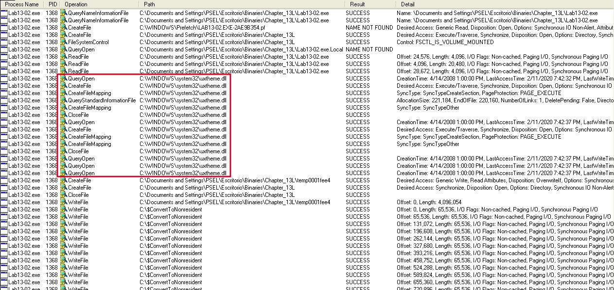
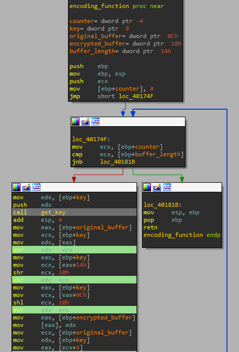

# Lab 13 - Data Encoding

## Lab 13-1

Analyze the malware found in the file Lab13-01.exe.

**1. Compare the strings in the malware (from the output of the strings command) with the information available via dynamic analysis. Based on this comparison, which elements might be encoded?**

When we execute the _strings_ command we only can see a bunch of interesting strings:

```
C:\> strings Lab13-01.exe

...
ABCDEFGHIJKLMNOPQRSTUVWXYZabcdefghijklmnopqrstuvwxyz0123456789+/
...
GetStringTypeW
CloseHandle
7"@
Mozilla/4.0
http://%s/%s/
Could not load exe.
Could not locate dialog box.
Could not load dialog box.
Could not lock dialog box.
...
```

However, the sample seems to lack of strings, probably because of encoding. Let's see if we execute the sample, we can see more strings.

To do so, we execute the sample and then we check the strings by means of _Process Explorer_.

```
...
C:\Documents and Settings\PSEL\Escritorio\Binaries\Chapter_13L\Lab13-01.exe
abcdefghijklmnopqrstuvwxyz
ABCDEFGHIJKLMNOPQRSTUVWXYZ
www.practicalmalwareanalysis.com
...
```

As we can see, the malware has decoded some binaries in execution time.

**2. Use IDA Pro to look for potential encoding by searching for the string xor. What type of encoding do you find?**

After searching the string _XOR_ ([ALT]+[T]) we find out the following operation at function _0x00401190_:

```
xor     eax, 3Bh
```

This seems to be the encoding routine that we were looking for.

**3. What is the key used for encoding and what content does it encode?**

The key of the decryption routine is the hexadecimal value _0x3B_.


The encoded data is given by means of a resource file, which can be seen by means of _Resource Hacker_. This file contains the following data:


```
4C 4C 4C 15 4B 49 5A 58 4F 52 58 5A 57 56 5A 57 4C 5A 49 5E 5A 55 5A 57 42 48 52 48 15 58 54 56
```

If we decode this data using the _XOR_ key we already know, we will see the value of the encrypted data. To do so, we have developed the following _python_ script:

```
encrypted_string = bytearray([0x4C, 0x4C, 0x4C, 0x15, 0x4B, 0x49, 0x5A, 0x58, 0x4F, 0x52, 0x58, 0x5A, 0x57, 0x56, 0x5A, 0x57, 0x4C, 0x5A, 0x49, 0x5E, 0x5A, 0x55, 0x5A, 0x57, 0x42, 0x48, 0x52, 0x48, 0x15, 0x58, 0x54, 0x56])
decryption_key = 0x3B

decrypted_string = ""

for counter in range(len(encrypted_string)):
	encrypted_char = encrypted_string[counter]
	decrypted_string = decrypted_string + chr(decryption_key ^ encrypted_char)

print("The decrypted string is: " + decrypted_string)
```

This wil give us the following output:

```
$ python3 Scripts/Others/Lab_13/lab13_01_decryption_resource_file.py

The decrypted string is: www.practicalmalwareanalysis.com
```

**4. Use the static tools FindCrypt2, Krypto ANALyzer (KANAL), and the IDA Entropy Plugin to identify any other encoding mechanisms. What do you find?**

We try to download and use the suggested _IDA Pro_ plugins, but we couldn't find the way to do it. However, we successfully executed the _KANAL_ plugin of _PEid_.


As we can see, several references to _base64_ have been found.

After that, we tried to use the plugin _findcrypt-yara_ (https://github.com/polymorf/findcrypt-yara) in the full IDA Pro version. After installing the plugin, we could see the following output.


It has detected one coincidence of _base64_ encoding, the same that _KANAL_ detected.

**5. What type of encoding is used for a portion of the network traffic sent by the malware?**

To know the encoding mechanism used by the malware, we need to take into account what the previously used plugins told us. That in the address _0x004050E8_ something related with _base64_ encoding was detected. If we go there, we will see a bunch of bytes that seems to be the alphabet of _base64_ encoding, but _IDA Pro_ has mislabeled, so let's fix it.


We click in the first letter (0x41) or in the variable _byte_4050E8_, and click on the key 'a'.


Now, we can see how this variable is referenced four times in the function at address _0x00401000_, we called _base64_encode_, which is referenced by the function located at _0x004010B1_, which is called just before the _InternetOpen_ _WINAPI_ function call. So we rename the function to _base64_encoding_.

**6. Where is the Base64 function in the disassembly?**

The _base64_ function is located at _0x004010B1_ and we have renamed it as _base64_encoding_. This function is called before the malware calls the function _InternetOpenA_ at function _CnC_communication_ located at _0x0004011C9_.


**7. What is the maximum length of the Base64 encoded data that is sent? What is encoded?**

Before the malware encodes the data, it makes a call to _gethostname_ and after that a _strcpy_ with a size of _0x0C_, which is equal to 12. So the malware will only encode 12 bytes of data.


So the data that it is encoded is the first 12 bytes of the computer hostname.

**8. In this malware, would you ever see the padding characters (= or ==) in the Base64-encoded data?**

Yes, but only if the local hostname have less than 12 characters.

**9. What does this malware do?**

The malware first reads and decrypts the included resource file, it contains the URL of the CnC. After that, it gets the first 12 bytes of the computer's hostname, _base64_ encodes it and uses this value as webpage to make the request, I mean: http://www.practicalmalwareanalysis.com/[base64 encoded hostname]/. After that, the malware sleeps 5 minutes and then exits.

## Lab 13-2

Analyze the malware found in the file Lab13-02.exe.

**1. Using dynamic analysis, determine what this malware creates.**

To do so we are going to use _RegShot_, which only tells us what we have seen, the malware creates 'n' files in the same path where the malware is located. The files seems to be encoded or something, since no _File Signatures_ (_Magic Numbers_) were identified.

We are going to use _Process Monitor_ to understand better what the malware does.



As we can see, just before the malware creates the file, it loads the library _uxtheme.dll_. However, if we take a look into the imports of the sample, we do not see such _DLL_ loaded:

```
======================
KERNEL32.dll
======================
GetStringTypeW
Sleep
LCMapStringW
LCMapStringA
...
======================
USER32.dll
======================
GetDesktopWindow
GetDC
ReleaseDC
GetSystemMetrics
======================
GDI32.dll
======================
CreateCompatibleBitmap
SelectObject
BitBlt
GetObjectA
...
```

**2. Use static techniques such as an xor search, FindCrypt2, KANAL, and the IDA Entropy Plugin to look for potential encoding. What do you find?**

By using _KANAL_ plugin no encoding is found, may be it uses an own encoding routine. This thinking is supported by the _IDA Python_ script called _ida_highlight.py_ located at "/Scripts/IDA/", which highlights specific instructions like _XOR_ with diferent registers/data. After running this script, a total of 24 instructions like this where found. If we take a look to the code, we can see how the function located at _0x00401739_ contains some of these _XOR_ instructions.


**3. Based on your answer to question 1, which imported function would be a good prospect for finding the encoding functions?**

Because the file is encoded, the best option to find the encoding routine is looking for _WriteFile_ function. There is only one cross-reference, the one located in the function _0x00401000_.


**4. Where is the encoding function in the disassembly?**

The encoding function is placed at _0x00401739_ and it is the function where the bunch of _XOR_ instructions where found. This function is renamed as _encoding_function_.

Before this function is executed, one array (probably the key) is innitialized with 68 zeros by means of _memset_.


After that, the _encoding_function_ is called

As we can see, this function will call another function before starting with the _XOR_ encoding process, probably this function will be used to get the key every iteration, so we rename it as _get_key_.



To understand the whole code of the function located at _0x004012DD_, we will have to divide it in four parts and explain it **using the first itaration as example**.

The first block is quite easy to understand, it will set up the variable _var_44_.


```
mov     ecx, [ebp+counter_to_8]		-> ECX = counter -> max value equal to 8
mov     edx, [ebp+counter_to_8]		-> EDX = counter -> max value equal to 8
mov     eax, [ebp+integer(17)_0]	-> EAX = int ZERO [17] = [0, ..., 0]
mov     edx, [eax+edx*4+20h]		-> EDX = ZERO [EDX * 4 + 32] = ZERO [counter + 8] -> from 8th to 16th position the array
mov     [ebp+ecx*4+var_44], edx		-> int var_44 [8] = [0, ..., 0]
```

As we can see, this variable is an array of 8 elements filled with 0's, so we rename it to _integer(8)_0_.

We see that the function has other 7 variables below the array, _IDA Pro_ has mislabeled this variables, since every of them belongs to the same array. To fix this we click [CTRL+K], click on the arrar and select create array of 8 elements.


Done! Now the variables are correctly shown!


Now that we know what the variables mean, it's time to start with the second block of code:

```
mov     eax, [ebp+integer(17)_0]	-> EAX = int ZERO [17] = [0, ..., 0]
mov     ecx, [eax+40h]				-> ECX = ZERO [16] = 0
mov     edx, [ebp+integer(17)_0]	-> EDX = int ZERO [17] = [0, ..., 0]
mov     eax, [edx+20h]				-> EAX = ZERO [8] = 0
lea     ecx, [eax+ecx+4D34D35Dh]	-> ECX = 0 + 0 + 4D34D35Dh = 4D34D35Dh
mov     edx, [ebp+integer(17)_0]	-> EDX = int ZERO [17] = [0, ..., 0]
mov     [edx+20h], ecx				-> ZERO [8] = EXC = 4D34D35Dh
mov     eax, [ebp+integer(17)_0]	-> EAX = int ZERO [17] = [0, ..., 0]
mov     ecx, [eax+20h]				-> ECX = ZERO [8] = 4D34D35Dh
cmp     ecx, [ebp+integer(8)_0]		-> Comparison between: 4D34D35Dh and 0, if 0 >= ECX, CF = 1
sbb     edx, edx					-> EDX = EDX - (EDX - CF) -> CF=0 -> EDX = 0
neg     edx							-> if EDX = 1 -> EDX = -1
mov     eax, [ebp+integer(17)_0]	-> EAX = int ZERO [17] = [0, ..., 0]
mov     ecx, [eax+24h]				-> ECX = ZERO [9] = 0
lea     edx, [ecx+edx-2CB2CB2Dh]	-> EDX = 0 - 2CB2CB2Dh = D34D34D3h (the result will be FFFFD34D34D3h, but only 4 bytes are taken)
mov     eax, [ebp+integer(17)_0]	-> EAX = int ZERO [17] = [0, ..., 0]
mov     [eax+24h], edx				-> ZERO [9] = EDX = D34D34D3h
mov     ecx, [ebp+integer(17)_0]	-> ECX = int ZERO [17] = [0, ..., 0]
mov     edx, [ecx+24h]				-> ECX = ZERO [9] = D34D34D3h
cmp     edx, [ebp+integer(8)_0+4]	-> Comparison between: D34D34D3h and 0, if 0 >= EDX, CF = 1
sbb     eax, eax					-> EAX = EAX - (EAX - CF) -> CF=0 -> EAX = 0
neg     eax							-> if EAX = 1 -> EAX = -1
mov     ecx, [ebp+integer(17)_0]	-> ECX = int ZERO [17] = [0, ..., 0]
mov     edx, [ecx+28h]				-> EDX = ZERO [10] = 0
lea     eax, [edx+eax+34D34D34h]	-> EAX = 34D34D34h
mov     ecx, [ebp+integer(17)_0]	-> ECX = int ZERO [17] = [0, ..., 0]
mov     [ecx+28h], eax				-> ZERO [10] = EAX = 34D34D34h
mov     edx, [ebp+integer(17)_0]	-> EDX = int ZERO [17] = [0, ..., 0]
mov     eax, [edx+28h]				-> EAX = ZERO [10] = 34D34D34h
cmp     eax, [ebp+integer(8)_0+8]	-> Comparison between: 34D34D34h and 0, if 0 >= EAX, CF = 1
sbb     ecx, ecx					-> ECX = ECX - (ECX - CF) -> CF=0 -> ECX = 0
neg     ecx							-> if ECX = 1 -> ECX = -1
mov     edx, [ebp+integer(17)_0]	-> EDX = int ZERO [17] = [0, ..., 0]
mov     eax, [edx+2Ch]				-> EAX = ZERO [11] = 0
lea     ecx, [eax+ecx+4D34D35Dh]	-> ECX = 4D34D35Dh
mov     edx, [ebp+integer(17)_0]	-> EDX = int ZERO [17] = [0, ..., 0]
mov     [edx+2Ch], ecx				-> ZERO [11] = EXC = 4D34D35Dh
mov     eax, [ebp+integer(17)_0]	-> EAX = int ZERO [17] = [0, ..., 0]
mov     ecx, [eax+2Ch]				-> ECX = ZERO [11] = 4D34D35Dh
cmp     ecx, [ebp+integer(8)_0+0Ch]	-> Comparison between: p4D34D35Dh and 0, if 0 >= ECX, CF = 1
sbb     edx, edx					-> EDX = EDX - (EDX - CF) -> CF=0 -> EDX = 0
neg     edx							-> if EDX = 1 -> EDX = -1
mov     eax, [ebp+integer(17)_0]	-> EAX = int ZERO [17] = [0, ..., 0]
mov     ecx, [eax+30h]				-> ECX = ZERO [12] = 0
lea     edx, [ecx+edx-2CB2CB2Dh]	-> EDX = 0 - 2CB2CB2Dh = D34D34D3h
mov     eax, [ebp+integer(17)_0]	-> EAX = int ZERO [17] = [0, ..., 0]
mov     [eax+30h], edx				-> ZERO [12] = EDX = D34D34D3h
mov     ecx, [ebp+integer(17)_0]	-> ECX = int ZERO [17] = [0, ..., 0]
mov     edx, [ecx+30h]				-> EDX = ZERO [12] = D34D34D3h
cmp     edx, [ebp+integer(8)_0+10h]	-> Comparison between: D34D34D3h and 0, if 0 >= EDX, CF = 1
sbb     eax, eax					-> EAX = EAX - (EAX - CF) -> CF=0 -> EAX = 0
neg     eax							-> if EAX = 1 -> EAX = -1
mov     ecx, [ebp+integer(17)_0]	-> ECX = int ZERO [17] = [0, ..., 0]
mov     edx, [ecx+34h]				-> EDX = ZERO [13] = 0
lea     eax, [edx+eax+34D34D34h]	-> EAX = 34D34D34h
mov     ecx, [ebp+integer(17)_0]	-> ECX = int ZERO [17] = [0, ..., 0]
mov     [ecx+34h], eax				-> ZERO [13] = EAX = 34D34D34h
mov     edx, [ebp+integer(17)_0]	-> EDX = int ZERO [17] = [0, ..., 0]
mov     eax, [edx+34h]				-> EAX = ZERO [13] = 34D34D34h
cmp     eax, [ebp+integer(8)_0+14h]	-> Comparison between: 34D34D34h and 0, if 0 >= EAX, CF = 1
sbb     ecx, ecx					-> ECX = ECX - (ECX - CF) -> CF=0 -> ECX = 0
neg     ecx							-> if ECX = 1 -> ECX = -1
mov     edx, [ebp+integer(17)_0]	-> EDX = int ZERO [17] = [0, ..., 0]
mov     eax, [edx+38h]				-> EAX = ZERO [14] = 0
lea     ecx, [eax+ecx+4D34D35Dh]	-> ECX = 4D34D35Dh
mov     edx, [ebp+integer(17)_0]	-> EDX = int ZERO [17] = [0, ..., 0]
mov     [edx+38h], ecx				-> ZERO [14] = EXC = 4D34D35Dh
mov     eax, [ebp+integer(17)_0]	-> EAX = int ZERO [17] = [0, ..., 0]
mov     ecx, [eax+38h]				-> ECX = ZERO [14] = 4D34D35Dh
cmp     ecx, [ebp+integer(8)_0+18h]	-> Comparison between: 4D34D35Dh and 0, if 0 >= ECX, CF = 1
sbb     edx, edx					-> EDX = EDX - (EDX - CF) -> CF=0 -> EDX = 0
neg     edx							-> if EDX = 1 -> EDX = -1
mov     eax, [ebp+integer(17)_0]	-> EAX = int ZERO [17] = [0, ..., 0]
mov     ecx, [eax+3Ch]				-> ECX = ZERO [15] = 0
lea     edx, [ecx+edx-2CB2CB2Dh]	-> EDX = 0 - 2CB2CB2Dh = D34D34D3h
mov     eax, [ebp+integer(17)_0]	-> EAX = int ZERO [17] = [0, ..., 0]
mov     [eax+3Ch], edx				-> ZERO [15] = EDX = D34D34D3h
mov     ecx, [ebp+integer(17)_0]	-> ECX = int ZERO [17] = [0, ..., 0]
mov     edx, [ecx+3Ch]				-> EDX = ZERO [15] = D34D34D3h
cmp     edx, [ebp+integer(8)_0+1Ch]	-> Comparison between: D34D34D3h and 0, if 0 >= EDX, CF = 1
sbb     eax, eax					-> EAX = EAX - (EAX - CF) -> CF=0 -> EAX = 0
neg     eax							-> if EAX = 1 -> EAX = -1
mov     ecx, [ebp+integer(17)_0]	-> ECX = int ZERO [17] = [0, ..., 0]
mov     [ecx+40h], eax				-> ZERO [16] = EAX = 0
mov     [ebp+counter_to_8], 0		-> counter_to_8 = 0
```

This big chunk of code simply sets up an array as follows (C pseudo-code):

```
ZERO[8] = 4D34D35Dh;
ZERO[9] = D34D34D3h;
ZERO[10] = 34D34D34h;
ZERO[11] = 4D34D35Dh;
ZERO[12] = D34D34D3h;
ZERO[13] = 34D34D34h;
ZERO[14] = 4D34D35Dh;
ZERO[15] = D34D34D3h;
ZERO[16] = 0;
```

To check this values we execute the malware in the _Windows XP_ virtual machine, so as to debug the malware remotely. To do so, we copy the file "C:\Program Files\IDA 7.2\dbgsrv\win32_remote.exe" located in the _Windows 10_ to the _Windows XP_ and execute it.


Now, we copy the IP address _172.16.231.131:23946_ that the program shows us. Then, we configure the _Remote Windows Debugger_ option in _IDA Pro_


After that, we configure the _Process options_ so as to point out where the binary is located and the IP address of the remote machine.


In memory we will see the same values, but in reverse order due to _Little Endian_.

Now, let's start with the foyrth chunk of code. This block of code includes a call to a new function that it is used to set up the _var_20_ variable, which seems to be an array.

```
mov     eax, [ebp+counter_to_8]		-> EAX = counter
mov     ecx, [ebp+integer(17)_0]	-> ECX = int ZERO [17] (Notice that this array will not be filled with 0s anymore)
mov     edx, [ecx+eax*4]			-> EDX = ZERO [0 + counter] -> from 0 to 7th position the array
mov     eax, [ebp+counter_to_8]		-> EAX = counter
mov     ecx, [ebp+integer(17)_0]	-> ECX = int ZERO [17]
add     edx, [ecx+eax*4+20h]		-> EDX = ZERO [counter + 8] -> This will load the elements of the array that are arleady set up
push    edx							-> Puts EDX in the stack (loaded as argument)
call    sub_40128D					-> Call to the function sub_40128D
add     esp, 4						-> Stack adequacy
mov     edx, [ebp+counter_to_8]		-> EDX = counter
mov     [ebp+edx*4+var_20], eax		-> ZERO [counter + 8] = result of function sub_40128D
```
So now, we have to dig into the function _sub_40128D_.

```
mov     eax, [ebp+arg_0]	-> EAX = ARG_0 (remeber that ARG_0 = ZERO [8 + counter])
and     eax, 0FFFFh			-> EAX = first 4 bytes of ARG_0 = ARG_0
mov     [ebp+var_4], eax	-> VAR_4 = EAX = first 4 bytes of ARG_0
mov     ecx, [ebp+arg_0]	-> ECX = ARG_0
shr     ecx, 10h			-> ECX = last 4 bytes of ARG_0
	-> ECX = 4D34D35Dh >> 10h = 4D34h
	-> ECX = D34D34D3h >> 10h = D34Dh
	-> ECX = 34D34D34h >> 10h = 34D3h
mov     [ebp+var_8], ecx	-> VAR_8 = ECX = last 4 bytes of ARG_0
mov     edx, [ebp+var_4]	-> EDX = VAR_4 = first 4 bytes of ARG_0
imul    edx, [ebp+var_4]	-> EDX = EDX * VAR_4 = EDX * EDX (Notice that EDX is 4 bytes)
	-> EDX = D35Dh * D35Dh = AE826FC9h
	-> EDX = 34D3h * 34D3h = AE665E9h
	-> EDX = 4D34h * 4D34h = 17485290h
shr     edx, 11h			-> EDX = EDX >> 11h
	-> EDX = AE826FC9h -> EDX = 5741h
	-> EDX = AE665E9h -> EDX = 573h
	-> EDX = 17485290h -> EDX = BA4h
mov     eax, [ebp+var_4]	-> EAX = VAR_4 = ARG_0
imul    eax, [ebp+var_8]	-> EAX = ARG_0 * VAR_8 (last 4 bytes of ARG_0)
	-> EAX = D35Dh * 4D34h = 3FBDE7E4h
	-> EAX = 34D3h * D34Dh = 2B99CC77h
	-> EAX = 4D34h * 34D3h = FEE31DCh
add     edx, eax
	-> EDX = 5741h + 3FBDE7E4h = 3FBE3F25h
	-> EDX = 573h + 2B99CC77h = 2B99D1EAh
	-> EDX = BA4h + FEE31DCh = FEE3D80h
shr     edx, 0Fh
	-> EDX = 3FBE3F25h >> 0Fh = 7F7Ch
	-> EDX = 2B99D1EAh >> 0Fh = 5733h
	-> EDX = FEE3D80h >> 0Fh = 1FDCh
mov     ecx, [ebp+var_8]	-> ECX = VAR_8
	-> ECX = 4D34h
	-> ECX = D34Dh
	-> ECX = 34D3h
imul    ecx, [ebp+var_8]	-> ECX = VAR_8 * VAR_8
	-> ECX = 4D34h * 4D34h = 17485290h
	-> ECX = D34Dh * D34Dh = AE680529h
	-> ECX = 34D3h * 34D3h = AE665E9h
add     edx, ecx			-> EDX = EDX + ECX
	-> EDX = 7F7Ch + 17485290h = 1748D20Ch
	-> EDX = 5733h + AE680529h = AE685C5Ch
	-> EDX = 1FDCh + AE665E9h = AE685C5h
mov     [ebp+var_C], edx	-> VAR_C = EDX
mov     edx, [ebp+arg_0]	-> EDX = ARG_0
imul    edx, [ebp+arg_0]	-> EDX = ARG_0 * ARG_0
	-> EDX = 4D34D35Dh -> EDX * EDX = 1748D20C7E4A6FC9h -> EDX = 7E4A6FC9h
	-> EDX = D34D34D3h -> EDX * EDX = AE685C5CA3D465E9h -> EDX = A3D465E9h
	-> EDX = 34D34D34h -> EDX * EDX = AE685C57B005290h -> EDX = 7B005290h
mov     [ebp+var_10], edx	-> VAR_10 = EDX
mov     eax, [ebp+var_C]	-> EAX = VAR_C
xor     eax, [ebp+var_10]	-> EAX ^ VAR_10 = VAR_C ^ VAR_10
	-> EAX = 1748D20Ch ^ 7E4A6FC9h = 6902BDC5h
	-> EAX = AE685C5Ch ^ A3D465E9h = DBC39B5h
	-> EAX = AE685C5h ^ 7B005290h = 71E6D755h
```
This function will be renamed as _setup_second_array_, because it setups the second array of the function.

Now, we need to repair again the mislabeled variables in _IDA Pro_, since they build this second array.


We have renamed the array variable to _integer(8)_second_.


Now, we know that this second array of 8 elements is as follows:

```
second_array[0] = 6902BDC5h
second_array[1] = DBC39B5h
second_array[2] = 71E6D755h
second_array[3] = 6902BDC5h
second_array[4] = DBC39B5h
second_array[5] = 71E6D755h
second_array[6] = 6902BDC5h
second_array[7] = DBC39B5h
```


Finally, the fourth chunk of code is as follows:

```
push    10h									-> Puts 10h into the stack (second argument of the next function)
mov     eax, [ebp+integer(8)_second+1Ch]	-> EAX = second_array [7] = DBC39B5h 
push    eax             ; unsigned int		-> Puts EAX into the stack (first argument of the next function)
call    __rotl								-> Calls to __rotl = shl eax, 10h = 39B50DBCh
add     esp, 8
mov     esi, [ebp+integer(8)_second]		-> ESI = second_array [0] = 6902BDC5h 
add     esi, eax							-> ESI = 6902BDC5h + 39B50DBCh = A2B7CB81h
push    10h             ; int				-> Puts 10h into the stack (second argument of the next function)
mov     ecx, [ebp+integer(8)_second+18h]	-> ECX = second_array [6] = 6902BDC5h 
push    ecx             ; unsigned int		-> Puts ECX into the stack (first argument of the next function)
call    __rotl								-> Calls to __rotl = shl ecx, 10h (notice the result is stored in eax) = BDC56902 -> EAX = BDC56902h
add     esp, 8
add     esi, eax							-> ESI = A2B7CB81h + BDC56902h = 1607D3483h -> ESI = 607D3483h
mov     edx, [ebp+integer(17)_0]			-> EDX = ZERO [0]
mov     [edx], esi							-> ZERO [0] = 607D3483h
push    8               ; int				-> Puts 8h into the stack (second argument of the next function)
mov     eax, [ebp+integer(8)_second]		-> EAX = second_array [0] = 6902BDC5h
push    eax             ; unsigned int		-> Puts EAX into the stack (first argument of the next function)
call    __rotl								-> Calls to __rotl = shl eax, 8h = 02BDC569h -> EAX = 2BDC569h
add     esp, 8
mov     ecx, [ebp+integer(8)_second+4]		-> ECX = second_array [1] = DBC39B5h
add     ecx, eax							-> ECX = DBC39B5h + 2BDC569h = 1079FF1Eh
add     ecx, [ebp+integer(8)_second+1Ch]	-> ECX = ECX + second_array [7] = 1079FF1Eh + DBC39B5h = 1E3638D3h
mov     edx, [ebp+integer(17)_0]			-> EDX = ZERO[0]
mov     [edx+4], ecx						-> ZERO [1] = 1E3638D3h
push    10h             ; int				-> Puts 10h into the stack (second argument of the next function)
mov     eax, [ebp+integer(8)_second+4]		-> EAX = second_array [1] = DBC39B5h
push    eax             ; unsigned int		-> Puts EAX into the stack (first argument of the next function)
call    __rotl								-> Calls to __rotl = shl eax, 10h = 39B50DBCh
add     esp, 8
mov     esi, [ebp+integer(8)_second+8]		-> ESI = second_array [2] = 71E6D755h
add     esi, eax							-> ESI = 71E6D755h + 39B50DBCh = AB9BE511h
push    10h             ; int				-> Puts 10h into the stack (second argument of the next function)
mov     ecx, [ebp+integer(8)_second]		-> ECX = second_array [0] = 6902BDC5h
push    ecx             ; unsigned int		-> Puts ECX into the stack (first argument of the next function)
call    __rotl								-> Calls to __rotl = shl eax, 10h (notice the result is stored in eax) = BDC56902h -> EAX = BDC56902h
add     esp, 8
add     esi, eax							-> ESI = AB9BE511h + BDC56902h = 169614E13h -> ESI = 69614E13h
mov     edx, [ebp+integer(17)_0]			-> EDX = ZERO[0]
mov     [edx+8], esi						-> ZERO[2] = 69614E13h
push    8               ; int				-> Puts 8h into the stack (second argument of the next function)
mov     eax, [ebp+integer(8)_second+8]		-> EAX = second_array [2] = 71E6D755h
push    eax             ; unsigned int		-> Puts EAX into the stack (first argument of the next function)
call    __rotl								-> Calls to __rotl = shl eax, 8h = E6D75571h -> EAX = E6D75571h
add     esp, 8
mov     ecx, [ebp+integer(8)_second+0Ch]	-> ECX = second_array [3] = 6902BDC5h
add     ecx, eax							-> ECX = 6902BDC5h + E6D75571h = 14FDA1336h -> ECX = 4FDA1336h
add     ecx, [ebp+integer(8)_second+4]		-> ECX = 4FDA1336h + DBC39B5h = 5D964CEBh
mov     edx, [ebp+integer(17)_0]			-> EDX = ZERO[0]
mov     [edx+0Ch], ecx						-> ZERO[3] = 5D964CEBh
push    10h             ; int				-> Puts 10h into the stack (second argument of the next function)
mov     eax, [ebp+integer(8)_second+0Ch]	-> EAX = second_array [3] = 6902BDC5h
push    eax             ; unsigned int		-> Puts EAX into the stack (first argument of the next function)
call    __rotl								-> Calls to __rotl = shl eax, 10h = BDC56902h
add     esp, 8
mov     esi, [ebp+integer(8)_second+10h]	-> ESI = second_array [4] = DBC39B5h
add     esi, eax							-> ESI = DBC39B5h + BDC56902h = CB81A2B7h
push    10h             ; int				-> Puts 10h into the stack (second argument of the next function)
mov     ecx, [ebp+integer(8)_second+8]		-> ECX = second_array [2] = 71E6D755h
push    ecx             ; unsigned int		-> Puts ECX into the stack (first argument of the next function)
call    __rotl								-> Calls to __rotl = shl ecx, 10h (notice the result is stored in eax) = D75571E6h
add     esp, 8
add     esi, eax							-> ESI = CB81A2B7h + D75571E6h = 1A2D7149Dh -> ESI = A2D7149Dh
mov     edx, [ebp+integer(17)_0]			-> EDX = ZERO[0]
mov     [edx+10h], esi						-> ZERO[4] = A2D7149Dh
push    8               ; int				-> Puts 8h into the stack (second argument of the next function)
mov     eax, [ebp+integer(8)_second+10h]	-> EAX = second_array [4] = DBC39B5h
push    eax             ; unsigned int		-> Puts EAX into the stack (first argument of the next function)
call    __rotl								-> Calls to __rotl = shl eax, 8h = BC39B50Dh
add     esp, 8
mov     ecx, [ebp+integer(8)_second+14h]	-> ECX = second_array [5] = 71E6D755h
add     ecx, eax							-> ECX = 71E6D755h + BC39B50Dh = 12E208C62h -> ECX = 2E208C62h
add     ecx, [ebp+integer(8)_second+0Ch]	-> ECX = 2E208C62h + 6902BDC5h = 97234A27h
mov     edx, [ebp+integer(17)_0]			-> EDX = ZERO[0]
mov     [edx+14h], ecx						-> ZERO[5] = 97234A27h
push    10h             ; int				-> Puts 10h into the stack (second argument of the next function)
mov     eax, [ebp+integer(8)_second+14h]	-> EAX = second_array [5] = 71E6D755h
push    eax             ; unsigned int		-> Puts EAX into the stack (first argument of the next function)
call    __rotl								-> Calls to __rotl = shl eax, 10h = D75571E6h
add     esp, 8
mov     esi, [ebp+integer(8)_second+18h]	-> ESI = second_array [6] = 6902BDC5h
add     esi, eax							-> ESI = 6902BDC5h + D75571E6h = 140582FABh -> ESI = 40582FABh
push    10h             ; int				-> Puts 10h into the stack (second argument of the next function)
mov     ecx, [ebp+integer(8)_second+10h]	-> ECX = second_array [4] = DBC39B5h
push    ecx             ; unsigned int		-> Puts ECX into the stack (first argument of the next function)
call    __rotl								-> Calls to __rotl = shl ecx, 10h (notice the result is stored in eax) = 39B50DBCh
add     esp, 8	
add     esi, eax							-> ESI = 40582FABh + 39B50DBCh = 7A0D3D67h
mov     edx, [ebp+integer(17)_0]			-> EDX = ZERO[0]
mov     [edx+18h], esi						-> ZERO[6] = 7A0D3D67h
push    8               ; int				-> Puts 8h into the stack (second argument of the next function)
mov     eax, [ebp+integer(8)_second+18h]	-> EAX = second_array [6] = 6902BDC5h
push    eax             ; unsigned int		-> Puts EAX into the stack (first argument of the next function)
call    __rotl								-> Calls to __rotl = shl eax, 8h = 02BDC569h
add     esp, 8
mov     ecx, [ebp+integer(8)_second+1Ch]	-> ECX = second_array [7] = DBC39B5h
add     ecx, eax							-> ECX = DBC39B5h + 02BDC569h = 1079FF1Eh
add     ecx, [ebp+integer(8)_second+14h]	-> ECX = 1079FF1Eh + 71E6D755h = 8260D673h
mov     edx, [ebp+integer(17)_0]			-> EDX = ZERO[0]
mov     [edx+1Ch], ecx						-> ZERO[7] = 8260D673h
```

So the first part of the array will: 

```
ZERO[0] = 607D3483h;
ZERO[1] = 1E3638D3h;
ZERO[2] = 69614E13h;
ZERO[3] = 5D964CEBh;
ZERO[4] = A2D7149Dh;
ZERO[5] = 97234A27h;
ZERO[6] = 7A0D3D67h;
ZERO[7] = 8260D673h;
```

At this moment we have the whole array that will be used as the key of the encryption process in the first iteration:

```
ZERO[0] = 607D3483h;
ZERO[1] = 1E3638D3h;
ZERO[2] = 69614E13h;
ZERO[3] = 5D964CEBh;
ZERO[4] = A2D7149Dh;
ZERO[5] = 97234A27h;
ZERO[6] = 7A0D3D67h;
ZERO[7] = 8260D673h;
ZERO[8] = 4D34D35Dh;
ZERO[9] = D34D34D3h;
ZERO[10] = 34D34D34h;
ZERO[11] = 4D34D35Dh;
ZERO[12] = D34D34D3h;
ZERO[13] = 34D34D34h;
ZERO[14] = 4D34D35Dh;
ZERO[15] = D34D34D3h;
ZERO[16] = 0;
```

Now that we understand how the key creation process works, we need to replicate it in a python script.


Now, the encryption process will start,

**5. Trace from the encoding function to the source of the encoded content. What is the content?**

**6. Can you find the algorithm used for encoding? If not, how can you decode the content?**

**7. Using instrumentation, can you recover the original source of one of the encoded files?**

## Lab 13-3

Analyze the malware found in the file Lab13-03.exe.

**1. Compare the output of strings with the information available via dynamic analysis. Based on this comparison, which elements might be encoded?**

**2. Use static analysis to look for potential encoding by searching for the string xor. What type of encoding do you find?**

**3. Use static tools like FindCrypt2, KANAL, and the IDA Entropy Plugin to identify any other encoding mechanisms. How do these findings compare with the XOR findings?**

**4. Which two encoding techniques are used in this malware?**

**5. For each encoding technique, what is the key?**

**6. For the cryptographic encryption algorithm, is the key sufficient? What else must be known?**

**7. What does this malware do?**

**8. Create code to decrypt some of the content produced during dynamic analysis. What is this content?**
