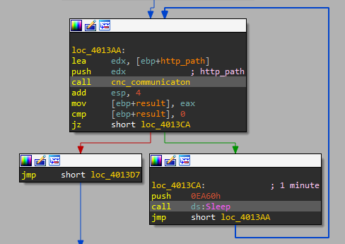

# Lab 14 - Malware-focused Network Signatures

This chapter’s labs focus on identifying the networking components of malware. To some degree, these labs build on Chapter 13, since when developing network signatures, you’ll often need to deal with encoded content.

## Lab 14-1

Analyze the malware found in file Lab14-01.exe. This program is not harmful to your system.

**1. Which networking libraries does the malware use, and what are their advantages?**

To get this information we are going to run the script "get_file_imports.py".

```
C:\> python get_file_imports.py Lab14-01.exe

======================
KERNEL32.dll
======================
Sleep
CreateProcessA
FlushFileBuffers
...
LCMapStringW
GetStringTypeA
CloseHandle
======================
ADVAPI32.dll
======================
GetCurrentHwProfileA
GetUserNameA
======================
urlmon.dll
======================
URLDownloadToCacheFileA
```

As we can see, the malware only uses the _URLDownloadToCacheFileA_ function from _urlmon.dll_ library. The main advantage of using this specific function is that uses the _COM_ interface, so most of the content of its HTTP requests comes from within _Windows_ itself, and therefore cannot be effectively targeted using network signatures.

**2. What source elements are used to construct the networking beacon, and what conditions would cause the beacon to change?**

The first thing the malware does is getting some information from the machine, the _GUID_ (Global Unique IDentifier) and the username.


As we can see, the malware only gets the last 12 characters of the _GUID_ (notice that a the returned value could be something like this `{12340001-4980-1920-6788-123456789012}`).

The information retrieved is concatenated in the following format: "[partial GUID seperated by ':' every two digits]-[username]". For example, if we have a computer with the _GUID_ `{12340001-4980-1920-6788-123456789012}` and the username `jones`, the final string would be: `12:34:56:78:90:12-jones`. This string is then passed as argument to the function _get_http_path_ (the value obtained in this function is then used as path of the _URL_ that the malware requests information) located at _0x004010BB_.


If we take a look to the function we will see that it is quite familiar...


There is also another function being called, which is located at _0x00401000_.


Mmmmm... We expected something different... Wait! Let's see what _byte_4050C0_ contains.


Great! The _base64_ alphabet, just what we were expecting! We convert this to a string (key "A") and rename it.


Ok! But there is something more, let's take a look to the function located at _0x00401000_, where the _base64_ encoding letter is chosen (some variables have been renamed for clarity).


As we can see, this _base64_ implementation substitutes the padding character "=" with the letter "a".

So now, we know what the function _get_http_path_ does, converts the string "[partial GUID seperated by ':' every two digits]-[username]" to base64, so our example would be (notice the replacing of "="):

```
$ echo -n 12:34:56:78:90:12-jones | base64 | tr '=' 'a'
MTI6MzQ6NTY6Nzg6OTA6MTItam9uZXMa
```

Now, we see that this value is being passed as argument to the next function called, _cnc_communicaton_ (_0x004011A3_).



This function will make a _HTTP_ request to the C&C _URL_ by means of _URLDownloadToCacheFileA_, using an _URL_ composed by the previously calculated _base64_ value as path and the last character of such path as name of the requested file plus the extension _PNG_.


Based on our example, the _URL_ would be:

```
http://www.practicalmalwareanalysis.com/MTI6MzQ6NTY6Nzg6OTA6MTItam9uZXMa/a.png
```

**3. Why might the information embedded in the networking beacon be of interest to the attacker?**

The information encoded in the path could be interesting to the attacker for counting purposes, since the _GUID_ of one computer is unique.

**4. Does the malware use standard Base64 encoding? If not, how is the encoding unusual?**

The _base64_ is standard but the padding character, which is "a" instead of "=", as explained in exercise 1.

**5. What is the overall purpose of this malware?**

Once the malware has performed the _HTTP_ request by means of _URLDownloadToCacheFileA_, it will execute the downloaded file, which is not a _PNG_ file like the extension suggests, using _CreateProcessA_.


If the execution fails, it will sleep for one minute and then try it again (including the _HTTP_ request).

**6. What elements of the malware’s communication may be effectively detected using a network signature?**

To create a good signature, we have to take in mind some aspects of the _HTTP_ request the malware executes:

- The domain name: www.practicalmalwareanalysis.com.
- _HTTP_ _GET_ request.
- Own implementation of _base64_ encoding to get the _URL_ path.
- The encoded _URL_ path has a value of "XX:XX:XX:XX:XX:XX-abcdef", being 'X' an hexadecimal value and "abcdef" an _ASCII_ string.
- The downloaded file has the name of the last character of the path, which is the _base64_ encoded strin, and the _PNG_ extension, although it is not a _PNG_ image, but this is irrelevant to create the network signature.

**7. What mistakes might analysts make in trying to develop a signature for this malware?**

The analysts could think that the path and the filename of the _URL_ are predictable, due to most cases the filename would be "a.PNG", since the letter "a" si the padding character of the _base64_ implementation.

**8. What set of signatures would detect this malware (and future variants)?**

The first thing we should do to create our own signature is creating a regular expression that matches the _URL_ that the malware requests. Also, to test it, we use the online webpage REGEX101 (https://regex101.com).

After taking the points mentioned in exercise 6 in mind, we can create the regular expression we are looking for:

```
practicalmalwareanalysis\.com\/(?:[A-Za-z0-9+\/]{4})*(?:[A-Za-z0-9+\/]{2}aa|[A-Za-z0-9+\/]{3}a)?\/\w\.png
```

Also, if we include the domain, the resultant _Snort_ rule would be:

```
alert tcp $HOME_NET any -> $EXTERNAL_NET $HTTP_PORTS (msg:"PM14.1.2"; urilen:>32; uricontent:".png"; pcre:"practicalmalwareanalysis\.com\/(?:[A-Za-z0-9+\/]{4})*(?:[A-Za-z0-9+\/]{2}aa|[A-Za-z0-9+\/]{3}a)?\/.\.png"; sid:20001412; rev:1;)
```

This regular expression will catch every _HTTP_ request that the malware performs. However, it will catch some false possitives like a request in which the name of the file would be "\*.png". Nevertheless, the chance of getting a false possitive like this is quite low.


## Lab 14-2

Analyze the malware found in file Lab14-02.exe. This malware has been configured to beacon to a hardcoded loopback address in order to prevent it from harming your system, but imagine that it is a hardcoded external address.

**1. What are the advantages or disadvantages of coding malware to use direct IP addresses?**

- Advantages:
	- The IP has not to be renewed as domain names.
	- The IP addresses are trickier to analyze during dynamic malware analysis.

- Disadvantages:
	- The atacker could not redirect the traffic of the malware in case it need, so if it lost control over the server, the piece of malware become useless.
	- Using an _IP_ address for _HTTP_ traffic can be flagged as malicious, since it is not common among users.

**2. Which networking libraries does this malware use? What are the advantages or disadvantages of using these libraries?**

To check the libraries the malware employs we use the python script "get_file_imports.py".

```
C:\> python get_file_imports.py Lab14-02.exe

======================
KERNEL32.dll
======================
DisconnectNamedPipe
TerminateProcess
WaitForMultipleObjects
...
GetModuleFileNameA
GetModuleHandleA
GetStartupInfoA
======================
USER32.dll
======================
LoadStringA
======================
SHELL32.dll
======================
SHChangeNotify
ShellExecuteExA
======================
WININET.dll
======================
InternetCloseHandle
InternetOpenUrlA
InternetOpenA
InternetReadFile
======================
MSVCRT.dll
======================
exit
__p__commode
_controlfp
...
_initterm
__setusermatherr
__p__fmode
```

As we can see, the malware uses the library _WININET.dll_, which is included in _WINAPI_. The usage of such library are highly monitored since it is the main method the malware binaries use to communicate with their _C&Cs_.

**3. What is the source of the URL that the malware uses for beaconing? What advantages does this source offer?**

To get the _URL_ that the malware uses, we need to understand the execution flow of it.

First of all, the malware calls the function _LoadStringA_ with the parameter _hInstance_ pointing to the argument of the same name and the _ID_ parameter to 1. If we take a look to the previous function, called _start_, we will see that this argument has the value of a handle to itself, since the function _GetModuleHandleA_ is called with the argument _lpModuleName_ set to _NULL_.


After that, the malware will have loaded the resource string with _ID_ 1, which is the following string extracted with _Resource Hacker_:

```
STRINGTABLE
LANGUAGE LANG_ENGLISH, SUBLANG_ENGLISH_US
{
  1, 	"http://127.0.0.1/tenfour.html"
}
```


We have obtained an _URL_ composed by an _IP_ address! However, we need to dig deeper to see if the malware uses something more.

Then, the malware creates two events, reserve some memory with _malloc_ and copies the _URL_ into the reserved buffer at offset _0x14_ (notice the pointer to the buffer is stored in _EBX_ register).


So the buffer has this aspect at this momment (the remining bytes of the buffer have been ommited):

```
| 0x0 | 0x0 | 0x0 | 0x0 | 0x0 | 0x0 | 0x0 | 0x0 | 0x0 | 0x0 | 0x0 | 0x0 | 0x0 | 0x0 | 0x0 | 0x0 | 0x0 | 0x0 | 0x0 | 0x0 | 'h' | 't' | 't' | 'p' | ':' | '/' | '/' | '1' | '2' | '7' | '.' | '0' | '.' | '0' | '.' | 1' | '/' | 't' | 'e' | 'n' | 'f' | o' | 'u' | 'r' | '.' | 'h' | 't' | 'm' | 'l' | 0x0 | ... |
```

The next thing the sample does is creating two pipes, which read handle of the first pipe and write handle of the second pipe are stored in the buffer:


The buffer will look like (_RH_1_ means read handle of the first pipe and _WH_2_ means write handle of the second pipe):

```
| RH_1 | RH_1 | RH_1 |RH_1 | WH_2 | WH_2 | WH_2 | WH_2 | 0x0 | 0x0 | 0x0 | 0x0 | 0x0 | 0x0 | 0x0 | 0x0 | 0x0 | 0x0 | 0x0 | 0x0 | 'h' | 't' | 't' | 'p' | ':' | '/' | '/' | '1' | '2' | '7' | '.' | '0' | '.' | '0' | '.' | 1' | '/' | 't' | 'e' | 'n' | 'f' | o' | 'u' | 'r' | '.' | 'h' | 't' | 'm' | 'l' | 0x0 | ... |
```

After that, the binary duplicates the write handle of the first pipe and stores this new handle in the _hStdError_ field of the _StartupInfo_ struct. Also, the read handle of second pipe is stored in the field _hStdOutput_ of the _StartupInfo_ struct.


Then, it creates a new process of _CMD_ with the _lpStartupInfo_ argument set to the previously commented _StartupInfo_ struct, which has the _hStdOutput_ and _hStdError_ pointing to the handles of the previous pipes.


Now, if the process is created successfully, it will store the handle to such process into the buffer at offset _0x8_. Also, the pointer to such buffer will be included as _lpParameter_ argument of the _CreateThread_ function, which will execute the first function that connects to the C&C. Finally, once the thread has been created, its handle will be stored into the buffer.


At this momment, the buffer will look like (_PH_ means process handle and _TH_1_ means first thread handle):

```
| RH_1 | RH_1 | RH_1 |RH_1 | WH_2 | WH_2 | WH_2 | WH_2 | PH | PH | PH | PH | TH_1 | TH_1 | TH_1 | TH_1 | 0x0 | 0x0 | 0x0 | 0x0 | 'h' | 't' | 't' | 'p' | ':' | '/' | '/' | '1' | '2' | '7' | '.' | '0' | '.' | '0' | '.' | 1' | '/' | 't' | 'e' | 'n' | 'f' | o' | 'u' | 'r' | '.' | 'h' | 't' | 'm' | 'l' | 0x0 | ... |
```

Let's take a look into _connect_to_cnc_1_ (_0x004014C0_). The first thing it does is copying the buffer (which the argument _lpParameter_ is pointing to) into _EBX_.


Now, the buffer will look like (_TH_2_ means second thread handle):

```
| RH_1 | RH_1 | RH_1 |RH_1 | WH_2 | WH_2 | WH_2 | WH_2 | PH | PH | PH | PH | TH_1 | TH_1 | TH_1 | TH_1 | TH_2 | TH_2 | TH_2 | TH_2 | 'h' | 't' | 't' | 'p' | ':' | '/' | '/' | '1' | '2' | '7' | '.' | '0' | '.' | '0' | '.' | 1' | '/' | 't' | 'e' | 'n' | 'f' | o' | 'u' | 'r' | '.' | 'h' | 't' | 'm' | 'l' | 0x0 | ... |
```

**4. Which aspect of the HTTP protocol does the malware leverage to achieve its objectives?**

**5. What kind of information is communicated in the malware’s initial beacon?**

**6. What are some disadvantages in the design of this malware’s communication channels?**

**7. Is the malware’s encoding scheme standard?**

**8. How is communication terminated?**

**9. What is the purpose of this malware, and what role might it play in the attacker’s arsenal?**

## Lab 14-3

This lab builds on Lab 14-1. Imagine that this malware is an attempt by the attacker to improve his techniques. Analyze the malware found in file Lab14-03.exe.

**1. What hard-coded elements are used in the initial beacon? What elements, if any, would make a good signature?**

**2. What elements of the initial beacon may not be conducive to a longlasting signature?**

**3. How does the malware obtain commands? What example from the chapter used a similar methodology? What are the advantages of this technique?**

**4. When the malware receives input, what checks are performed on the input to determine whether it is a valid command? How does the attacker hide the list of commands the malware is searching for?**

**5. What type of encoding is used for command arguments? How is it different from Base64, and what advantages or disadvantages does it offer?**

**6. What commands are available to this malware?**

**7. What is the purpose of this malware?**

**8. This chapter introduced the idea of targeting different areas of code with independent signatures (where possible) in order to add resiliency to network indicators. What are some distinct areas of code or configuration data that can be targeted by network signatures?**

**9. What set of signatures should be used for this malware?**
