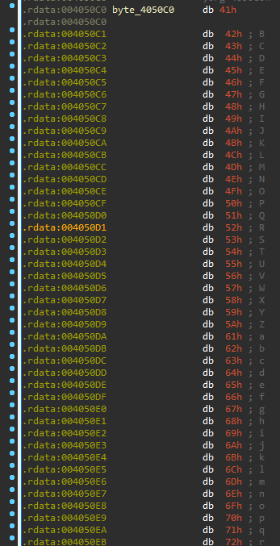
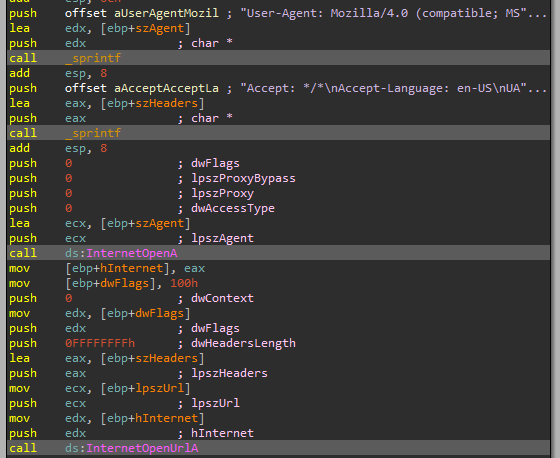
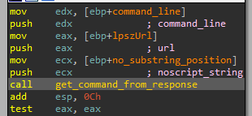

# Lab 14 - Malware-focused Network Signatures

This chapter’s labs focus on identifying the networking components of malware. To some degree, these labs build on Chapter 13, since when developing network signatures, you’ll often need to deal with encoded content.

## Lab 14-1

Analyze the malware found in file Lab14-01.exe. This program is not harmful to your system.

**1. Which networking libraries does the malware use, and what are their advantages?**

To get this information we are going to run the script "get_file_imports.py".

```
C:\> python get_file_imports.py Lab14-01.exe

======================
KERNEL32.dll
======================
Sleep
CreateProcessA
FlushFileBuffers
...
LCMapStringW
GetStringTypeA
CloseHandle
======================
ADVAPI32.dll
======================
GetCurrentHwProfileA
GetUserNameA
======================
urlmon.dll
======================
URLDownloadToCacheFileA
```

As we can see, the malware only uses the _URLDownloadToCacheFileA_ function from _urlmon.dll_ library. The main advantage of using this specific function is that uses the _COM_ interface, so most of the content of its HTTP requests comes from within _Windows_ itself, and therefore cannot be effectively targeted using network signatures.

**2. What source elements are used to construct the networking beacon, and what conditions would cause the beacon to change?**

The first thing the malware does is getting some information from the machine, the _GUID_ (Global Unique IDentifier) and the username.


As we can see, the malware only gets the last 12 characters of the _GUID_ (notice that a the returned value could be something like this `{12340001-4980-1920-6788-123456789012}`).

The information retrieved is concatenated in the following format: "[partial GUID seperated by ':' every two digits]-[username]". For example, if we have a computer with the _GUID_ `{12340001-4980-1920-6788-123456789012}` and the username `jones`, the final string would be: `12:34:56:78:90:12-jones`. This string is then passed as argument to the function _get_http_path_ (the value obtained in this function is then used as path of the _URL_ that the malware requests information) located at _0x004010BB_.


If we take a look to the function we will see that it is quite familiar...


There is also another function being called, which is located at _0x00401000_.


Mmmmm... We expected something different... Wait! Let's see what _byte_4050C0_ contains.



Great! The _base64_ alphabet, just what we were expecting! We convert this to a string (key "A") and rename it.


Ok! But there is something more, let's take a look to the function located at _0x00401000_, where the _base64_ encoding letter is chosen (some variables have been renamed for clarity).


As we can see, this _base64_ implementation substitutes the padding character "=" with the letter "a".

So now, we know what the function _get_http_path_ does, converts the string "[partial GUID seperated by ':' every two digits]-[username]" to base64, so our example would be (notice the replacing of "="):

```
$ echo -n 12:34:56:78:90:12-jones | base64 | tr '=' 'a'
MTI6MzQ6NTY6Nzg6OTA6MTItam9uZXMa
```

Now, we see that this value is being passed as argument to the next function called, _cnc_communicaton_ (_0x004011A3_).


This function will make a _HTTP_ request to the C&C _URL_ by means of _URLDownloadToCacheFileA_, using an _URL_ composed by the previously calculated _base64_ value as path and the last character of such path as name of the requested file plus the extension _PNG_.


Based on our example, the _URL_ would be:

```
http://www.practicalmalwareanalysis.com/MTI6MzQ6NTY6Nzg6OTA6MTItam9uZXMa/a.png
```

**3. Why might the information embedded in the networking beacon be of interest to the attacker?**

The information encoded in the path could be interesting to the attacker for counting purposes, since the _GUID_ of one computer is unique.

**4. Does the malware use standard Base64 encoding? If not, how is the encoding unusual?**

The _base64_ is standard but the padding character, which is "a" instead of "=", as explained in exercise 1.

**5. What is the overall purpose of this malware?**

Once the malware has performed the _HTTP_ request by means of _URLDownloadToCacheFileA_, it will execute the downloaded file, which is not a _PNG_ file like the extension suggests, using _CreateProcessA_.


If the execution fails, it will sleep for one minute and then try it again (including the _HTTP_ request).

**6. What elements of the malware’s communication may be effectively detected using a network signature?**

To create a good signature, we have to take in mind some aspects of the _HTTP_ request the malware executes:

- The domain name: www.practicalmalwareanalysis.com.
- _HTTP_ _GET_ request.
- Own implementation of _base64_ encoding to get the _URL_ path.
- The encoded _URL_ path has a value of "XX:XX:XX:XX:XX:XX-abcdef", being 'X' an hexadecimal value and "abcdef" an _ASCII_ string.
- The downloaded file has the name of the last character of the path, which is the _base64_ encoded strin, and the _PNG_ extension, although it is not a _PNG_ image, but this is irrelevant to create the network signature.

**7. What mistakes might analysts make in trying to develop a signature for this malware?**

The analysts could think that the path and the filename of the _URL_ are predictable, due to most cases the filename would be "a.PNG", since the letter "a" si the padding character of the _base64_ implementation.

**8. What set of signatures would detect this malware (and future variants)?**

The first thing we should do to create our own signature is creating a regular expression that matches the _URL_ that the malware requests. Also, to test it, we use the online webpage REGEX101 (https://regex101.com).

After taking the points mentioned in exercise 6 in mind, we can create the regular expression we are looking for:

```
practicalmalwareanalysis\.com\/(?:[A-Za-z0-9+\/]{4})*(?:[A-Za-z0-9+\/]{2}aa|[A-Za-z0-9+\/]{3}a)?\/\w\.png
```

Also, if we include the domain, the resultant _Snort_ rule would be:

```
alert tcp $HOME_NET any -> $EXTERNAL_NET $HTTP_PORTS (msg:"PM14.2"; urilen:>32; uricontent:".png"; pcre:"(?:[A-Za-z0-9+\/]{4})*(?:[A-Za-z0-9+\/]{2}aa|[A-Za-z0-9+\/]{3}a)?\/.\.png"; sid:20001412; rev:1;)
```

This regular expression will catch every _HTTP_ request that the malware performs. However, it will catch some false possitives like a request in which the name of the file would be "\*.png". Nevertheless, the chance of getting a false possitive like this is quite low, even more if we also match the domain name "practicalmalwareanalysis.com".


## Lab 14-2

Analyze the malware found in file Lab14-02.exe. This malware has been configured to beacon to a hardcoded loopback address in order to prevent it from harming your system, but imagine that it is a hardcoded external address.

**1. What are the advantages or disadvantages of coding malware to use direct IP addresses?**

- Advantages:
	- The IP has not to be renewed as domain names.
	- The IP addresses are trickier to analyze during dynamic malware analysis.

- Disadvantages:
	- The atacker could not redirect the traffic of the malware in case it need, so if it lost control over the server, the piece of malware become useless.
	- Using an _IP_ address for _HTTP_ traffic can be flagged as malicious, since it is not common among users.

**2. Which networking libraries does this malware use? What are the advantages or disadvantages of using these libraries?**

To check the libraries the malware employs we use the python script "get_file_imports.py".

```
C:\> python get_file_imports.py Lab14-02.exe

======================
KERNEL32.dll
======================
DisconnectNamedPipe
TerminateProcess
WaitForMultipleObjects
...
GetModuleFileNameA
GetModuleHandleA
GetStartupInfoA
======================
USER32.dll
======================
LoadStringA
======================
SHELL32.dll
======================
SHChangeNotify
ShellExecuteExA
======================
WININET.dll
======================
InternetCloseHandle
InternetOpenUrlA
InternetOpenA
InternetReadFile
======================
MSVCRT.dll
======================
exit
__p__commode
_controlfp
...
_initterm
__setusermatherr
__p__fmode
```

As we can see, the malware uses the library _WININET.dll_, which is included in _WINAPI_. The usage of such library are highly monitored since it is the main method the malware binaries use to communicate with their _C&Cs_.

Also, the _User-Agent_ must be hard-coded to be provided, and optional headers need to be hard-coded if desired.

One advantage of the such library over the _Winsock API_, for example, is that some elements, such as cookies and caching headers, are provided by the operating system.

**3. What is the source of the URL that the malware uses for beaconing? What advantages does this source offer?**

To get the _URL_ that the malware uses, we need to understand the execution flow of it.

First of all, the malware calls the function _LoadStringA_ with the parameter _hInstance_ pointing to the argument of the same name and the _ID_ parameter to 1. If we take a look to the previous function, called _start_, we will see that this argument has the value of a handle to itself, since the function _GetModuleHandleA_ is called with the argument _lpModuleName_ set to _NULL_.


After that, the malware will have loaded the resource string with _ID_ 1, which is the following string extracted with _Resource Hacker_:

```
STRINGTABLE
LANGUAGE LANG_ENGLISH, SUBLANG_ENGLISH_US
{
  1, 	"http://127.0.0.1/tenfour.html"
}
```


We have obtained an _URL_ composed by an _IP_ address!

The usage of a resource string to store the _URL_ or _IP_ address of the _C&C_ is useful to hide it, since some beginner analysts could failed to locate it.

**4. Which aspect of the HTTP protocol does the malware leverage to achieve its objectives?**

Once we have found the _C&C_ _URL_, we need to dig deeper to see how it uses _HTTP_ communication.

Then, the malware creates two events, reserve some memory with _malloc_ and copies the _URL_ into the reserved buffer at offset _0x14_ (notice the pointer to the buffer is stored in _EBX_ register).


So the buffer has this aspect at this momment (the remining bytes of the buffer have been ommited):

```
| 0x0 | 0x0 | 0x0 | 0x0 | 0x0 | 0x0 | 0x0 | 0x0 | 0x0 | 0x0 | 0x0 | 0x0 | 0x0 | 0x0 | 0x0 | 0x0 | 0x0 | 0x0 | 0x0 | 0x0 | 'h' | 't' | 't' | 'p' | ':' | '/' | '/' | '1' | '2' | '7' | '.' | '0' | '.' | '0' | '.' | 1' | '/' | 't' | 'e' | 'n' | 'f' | o' | 'u' | 'r' | '.' | 'h' | 't' | 'm' | 'l' | 0x0 | ... |
```

The next thing the sample does is creating two pipes, which read handle of the first pipe and write handle of the second pipe are stored in the buffer:


The buffer will look like (_RH_1_ means read handle of the first pipe and _WH_2_ means write handle of the second pipe):

```
| RH_1 | RH_1 | RH_1 |RH_1 | WH_2 | WH_2 | WH_2 | WH_2 | 0x0 | 0x0 | 0x0 | 0x0 | 0x0 | 0x0 | 0x0 | 0x0 | 0x0 | 0x0 | 0x0 | 0x0 | 'h' | 't' | 't' | 'p' | ':' | '/' | '/' | '1' | '2' | '7' | '.' | '0' | '.' | '0' | '.' | 1' | '/' | 't' | 'e' | 'n' | 'f' | o' | 'u' | 'r' | '.' | 'h' | 't' | 'm' | 'l' | 0x0 | ... |
```

After that, the binary duplicates the write handle of the first pipe and stores this new handle in the _hStdError_ field of the _StartupInfo_ struct. Also, the read handle of second pipe is stored in the field _hStdOutput_ of the _StartupInfo_ struct.


Then, it creates a new process of _CMD_ with the _lpStartupInfo_ argument set to the previously commented _StartupInfo_ struct, which has the _hStdOutput_ and _hStdError_ pointing to the handles of the previous pipes.


Now, if the process is created successfully, it will store the handle to such process into the buffer at offset _0x8_. Also, the pointer to such buffer will be included as _lpParameter_ argument of the _CreateThread_ function, which will execute the first function that connects to the C&C. Finally, once the thread has been created, its handle will be stored into the buffer.


At this momment, the buffer will look like (_PH_ means process handle and _TH_1_ means first thread handle):

```
| RH_1 | RH_1 | RH_1 |RH_1 | WH_2 | WH_2 | WH_2 | WH_2 | PH | PH | PH | PH | TH_1 | TH_1 | TH_1 | TH_1 | 0x0 | 0x0 | 0x0 | 0x0 | 'h' | 't' | 't' | 'p' | ':' | '/' | '/' | '1' | '2' | '7' | '.' | '0' | '.' | '0' | '.' | 1' | '/' | 't' | 'e' | 'n' | 'f' | o' | 'u' | 'r' | '.' | 'h' | 't' | 'm' | 'l' | 0x0 | ... |
```

Let's take a look into _connect_to_cnc_1_ (_0x004014C0_). The first thing it does is copying the buffer (which the argument _lpParameter_ is pointing to) to new buffer (created by means of _malloc_), which pointer will be stored by _EBX_.


Then it will call _PeekNamedPipe_ to copy the data of the read handle of the first pipe into _ESI_, which points to a buffer that will be read by means of _ReadFile_.


At this point, it will call a function located at _0x00401000_, which seems to be some encoding routine, since it requires two arguments (one of those is the read data and the other an empty buffer, which seem to be the data to encode and the result) and it is called just before of the function where the _HTTP_ request is done. So we have called this unknown function, _encode_data_.


If we dig into this function, we will see some interesting things...


The variable _byte_403010_ is called several times, let's see what contains.


It seems to be a custom _base64_ alphabet! Let's fix the code so as to see the code better.

```
WXYZlabcd3fghijko12e456789ABCDEFGHIJKL+/MNOPQRSTUVmn0pqrstuvwxyz
```

As we can see, the alphabet is quite different from a standard one, but it really seems to be a _base64_ alphabet. Also, the code of the function _encode_data_ seems to be a different _base64_ implementation comparing with the previously seen.

If we continue analyzing the code, we get to the function _cnc_communicaton_initial_, which is located at _0x00401750_, and, as we can see, it takes two arguments, the known _URL_ and the encoded buffer.


The function _cnc_communicaton_initial_ will use the encoded buffer as _User-Agent_ plus the string "(!<" at the begining when _InternetOpenA_ is called. This seems to be done to confuse the analysts when they see the _User-Agent_, since they will discard _base64_ as encoding routine.


Then, it will call _InternetOpenUrlA_ using the known _URL_.


After that it return to _connect_to_cnc_1_, which executes this process again and again.

**5. What kind of information is communicated in the malware’s initial beacon?**

To understand what the malware communicates, we need to continue analyzing the sample, since at this moment we only know it takes the data from the created pipe.

So now, let's take a look to what the malware does after create the first thread.


It creates another thread! However, in this case calls another function located at _0x004015C0_, which also seems to perform some _HTTP_ requests, hence the name _connect_to_cnc_2_. Also, it includes the buffer where the _URL_ is stored as a parameter of the thread. After creating the thread, this buffer is modified, which will look like (_TH_2_ means second thread handle):

```
| RH_1 | RH_1 | RH_1 |RH_1 | WH_2 | WH_2 | WH_2 | WH_2 | PH | PH | PH | PH | TH_1 | TH_1 | TH_1 | TH_1 | TH_2 | TH_2 | TH_2 | TH_2 | 'h' | 't' | 't' | 'p' | ':' | '/' | '/' | '1' | '2' | '7' | '.' | '0' | '.' | '0' | '.' | 1' | '/' | 't' | 'e' | 'n' | 'f' | o' | 'u' | 'r' | '.' | 'h' | 't' | 'm' | 'l' | 0x0 | ... |
```

Let's analyze the function _connect_to_cnc_2_. The first thing it does is copying the buffer contained in the _lpThreadParameter_ argument into a new buffer and then it will call to a function located at _0x00401800_ that we have called _cnc_communicaton_read_file_.


This new function, _cnc_communicaton_read_file_, will perform an _HTTP_ request to the known _URL_ using the _User-Agent_ "Internet Surf". Then, the result of such request will be returned by the function.


Then the malware will analyze the buffer obtained from the _C&C_ in the _connect_to_cnc_2_ function to check if this one is the same as the one received in the previous request.


If it is not the same, it will compare the received buffer with the string "exit", and if it is true, it will exit. Also, it will copy the received buffer into the one called _previous_request_.


If the received buffer is different from "exit", it will append to it the string "\n" and then write it to the write handle of the second pipe, which indeed it is copying to the _CMD_ process previously commented.


Then, it will repeat this process again and again.

**6. What are some disadvantages in the design of this malware’s communication channels?**

The main problem about the communication channel design is that the incoming commands are not encoded, which may result quite suspicious for a defender.

**7. Is the malware’s encoding scheme standard?**

As explained in the exercise 4, the _base64_ implementation uses a different alphabet.

**8. How is communication terminated?**

The communication is terminated by means of the "exit" command, as explained in the exercise 5.

**9. What is the purpose of this malware, and what role might it play in the attacker’s arsenal?**

The whole program is simply a reverse shell to the command and control _URL_ _http://127.0.0.1/tenfour.html_.

**Network Signatures**

```
alert tcp $HOME_NET any -> $EXTERNAL_NET $HTTP_PORTS (msg:"PM14.3.1"; content:"User-Agent: Internet Surf"; sid:20001402; rev:1;)
```

```
alert tcp $HOME_NET any -> $EXTERNAL_NET $HTTP_PORTS (msg:"PM14.3.1"; pcre:"/User-Agent:\x20\(!<(?:[A-Za-z0-9+\/]{4})*(?:[A-Za-z0-9+\/]{2}aa|[A-Za-z0-9+\/]{3}=)?/"; sid:20001402; rev:1;)
```

## Lab 14-3

This lab builds on Lab 14-1. Imagine that this malware is an attempt by the attacker to improve his techniques. Analyze the malware found in file Lab14-03.exe.

**1. What hard-coded elements are used in the initial beacon? What elements, if any, would make a good signature?**

To find out this information we need to understand what the malware does, so let's analyze it!

The first call that the sample does is to use the function located at _0x00401457_.

This function will look for a file called and located at "C:\\\\autobat.exe".


The sample expects that this file exists, if not, the _INVALID_HANDLE_VALUE_ is given, which will cause a call to function that we have renamed to _write_to_file_ (_0x00401372_). This function takes one argument, in this case an _URL_, probably the one used by the malware as _C&C_.

```
http://www.practicalmalwareanalysis.com/start.htm
```


This new function, will take the argument, the _URL_, and write it into the file that the sample was expecting, "C:\\\\autobat.exe".


So this function simply initializes the configuration file that the sample expects. Then, it will call it again by means of a recursive call. So now, the malware will find the configuration file and read it properly.


Because all of that, we have called this function, _get_url_from_file_.

After that, another function (_0x004011F3_) that receives two arguments, one empty buffer and the obtained _URL_ is called. This function seems to perform some _HTTP_ actions, so we rename it to _cnc_communication_.

The first thing we see that attract our attention is the hard-coded _User-Agent_ and _Headers_ used by the sample.

```
User-Agent: Mozilla/4.0 (compatible; MSIE 7.0; Windows NT 5.1; .NET CLR 3.0.4506.2152; .NET CLR 3.5.30729)
Accept: */*
Accept-Language: en-US
UA-CPU: x86
Accept-Encoding: gzip, deflate
```

But, we have to take in mind that the _WINAPI_ function _InternetOpenA_ will add the _User-Agent_ field into the request, so this sample will perform a particular request composed by two _User-Agent_ fields:

```
User-Agent: User-Agent: Mozilla/4.0 (compatible; MSIE 7.0; Windows NT 5.1; .NET CLR 3.0.4506.2152; .NET CLR 3.5.30729)
```

It also performs an _HTTP_ request against the known _URL_.



**2. What elements of the initial beacon may not be conducive to a longlasting signature?**

Since the malware uses common elements used by other applications like the headers and the _User-Agent_, these elements wouldn't be adequate to create robust signatures.

**3. How does the malware obtain commands? What example from the chapter used a similar methodology? What are the advantages of this technique?**

We are going to continue in the function _cnc_communication_ (_0x004011F3_), after making the initial request, the binary read the response by means of _InternetReadFile_.


Then it will get the position of the substring `<no` in the response (notice this position is a pointer).


After that, another function will be called, the one we have renamed to _get_command_from_response_ (_0x00401000_), since it gets three arguments, the empty buffer, possibly the final command line, the _URL_ and the possition of the substring in the response buffer.



Once into the function, the substring position pointer is incremented in one and the value plus 8 is compared with the character ">", so at this point we know that the binary is looking for the following (the "x" are unknown elements):

```
| < | n | o | x | x | x | x | x | x | > | x | ... |
```


The whole string is revelead in the following loop:


```
| < | n | o | s | c | r | i | p | t | > | x | ... |
```

The sample is looking for the string `<noscript>`!

After that, the sample will look for the _URL_ "http://www.practicalmalwareanalysis.com" into the content after `<noscript>`.

```
| < | n | o | s | c | r | i | p | t | > | x | ... | x | h | t | t | p | : | / | / | w | w | w | . | p | r | a | c | t | i | c | a | l | m | a | l | w | a | r | e | a | n | a | l | y | s | i | s | . | c | o | m | x | ... |
```


Then, it will look for the string `96'` after the known _URL_.

```
| < | n | o | s | c | r | i | p | t | > | x | ... | x | h | t | t | p | : | / | / | w | w | w | . | p | r | a | c | t | i | c | a | l | m | a | l | w | a | r | e | a | n | a | l | y | s | i | s | . | c | o | m | x | ... | x | 9 | 6 | ' | x | ... |
```


Then, it will cut the string response by modifying the value "9" with _0x0_, resulting the string in:

```
| < | n | o | s | c | r | i | p | t | > | x | ... | x | h | t | t | p | : | / | / | w | w | w | . | p | r | a | c | t | i | c | a | l | m | a | l | w | a | r | e | a | n | a | l | y | s | i | s | . | c | o | m | x | ... | x | 0x0 | 6 | ' | x | ... |
```

So now, notice that the _command_ variable points after the substring ".com" in the previous buffer, so the function will return the value of _COMMAND_VALUE_:

```
http://www.practicalmalwareanalysis.com + COMMAND_VALUE + 0x0 + 6'
```


After that, this obtained command will be included in a function call in the _WinMain_ that we have renamed to _tasks_management_ (_0x00401684_).


**4. When the malware receives input, what checks are performed on the input to determine whether it is a valid command? How does the attacker hide the list of commands the malware is searching for?**

Explained in exercise 3.

**5. What type of encoding is used for command arguments? How is it different from Base64, and what advantages or disadvantages does it offer?**

The function located at _0x00401147_ is the responsible for decoding the command arguments, because of that, we have renamed to _decode_arg_.

The main decoding routine needs to be fixed first, and convert the variable called arg_char to an array of two elements, then it will be as follows (the _alphabet_ variable contains the value "/abcdefghijklmnopqrstuvwxyz0123456789:."):

```
mov     ecx, [ebp+var_argument]		-> ECX = ARG[i]
mov     dl, [ecx]			-> DL = ARG[i] == EDX = ARG[i] AND 0xFF
mov     [ebp+arg_char], dl		-> ARG_CHAR = DL = ARG[1] AND 0xFF
mov     eax, [ebp+var_argument]		-> EAX = ARG[i]
mov     cl, [eax+1]			-> CL = ARG[i + 1] == ECX = ARG[i + 1] AND 0xFF
mov     [ebp+arg_char+1], cl		-> ARG_CHAR = CL = ARG[i + 1] AND 0xFF
lea     edx, [ebp+arg_char]		-> EDX = ARG_CHAR = ARG[1] AND 0xFF
push    edx				-> Pass argument to the function
call    _atoi				-> Converts char at EDX to an integer
add     esp, 4
mov     [ebp+char_to_int], eax		-> CHAR_TO_INT = EAX (return value of _atoi)
mov     eax, [ebp+decoded_argument]	-> EAX = DEC_ARG[0]
add     eax, [ebp+counter]		-> EAX = DEC_ARG[counter]
mov     ecx, [ebp+char_to_int]		-> ECX = CHAR_TO_INT
mov     dl, byte ptr ds:alphabet[ecx]	-> DL = alphabet[CHAR_TO_INT]
mov     [eax], dl			-> DEC_ARG[counter] = DL = alphabet[CHAR_TO_INT]
mov     eax, [ebp+var_argument]		-> EAX = ARG[i]
add     eax, 2				-> EAX = EAX + 2 = ARG[i + 2]
mov     [ebp+var_argument], eax		-> ARG[i + 2]
mov     ecx, [ebp+counter]		-> ECX = counter
add     ecx, 1				-> ECX = ECX + 1 = counter + 1
mov     [ebp+counter], ecx		-> counter = counter + 1
```

Now, we can develope a _python_ script that performs this decoding process:

```
import sys

alphabet = "/abcdefghijklmnopqrstuvwxyz0123456789:."

def decode_argument(argument):
	decoded_argument = ""

	for i in range(0, len(argument), 2):
		arg_char = chr(ord(argument[i]) & 0xFF) + chr(ord(argument[i + 1]) & 0xFF)
		char_to_int = int(arg_char)
		decoded_char = alphabet[char_to_int]
		decoded_argument = decoded_argument + decoded_char

	print("The decoded argument is: " + decoded_argument)

if len(sys.argv) == 2:
	decode_argument(sys.argv[1])
else:
	print("Please provide the argument to decode")
```

So if the sample received the argument "1313243108", the result would be:

```
$ python3 Scripts/Others/Lab_14/lab14_03_decode_argument.py 1313243108
The decoded argument is: mmx4h
```

The main advantage of using this kind of decoding routine is that the analyst must analyze its algorithm in order to know how to decode an argument command, while in a _base64_ the algorithm is already known.

**6. What commands are available to this malware?**

We need to analyze the function _tasks_management_ (_0x00401684_) to get all the possible commands.

As we can see, the first thing the sample does is splitting the command line received using the character "/" as reference. The variables obtained are used as the main command and the argument of such command. Then, it will get the first character of the main command and subtract _0x64_, this will produce a four size array of integers used by the _switch case_.


This will get us the initial letter of the commands that the sample expects:

```
Case 100 = 0 + 0x64 = 0x64 = d
Case 110 = 10 + 0x64 = 0x6E = n
Case 114 = 14 + 0x64 = 0x72 = r
Case 115 = 15 + 0x64 = 0x73 = s
```


The purpose of such commands is the following:

- d (download)

Executes the function at _0x00401565_ taking the command argument as argument of the function.

In the function we can see how the binary first calls a function (_0x00401147_) that seems to decode the argument received, this function is called _decode_arg_ (this function is analyzed in exercise 5). This decoded argument is then used in a _HTTP_ request using _URLDownloadToCacheFileA_. Then the sample will execute the received data by means of _CreateProcessA_. So we rename this function to _download_and_execute_.


Since the argument is used as _URL_ when calling _URLDownloadToCacheFileA_, the encoded value of such argument will start with "08202016370000" or "082020161937000000", since the correspond to:

```
$ python3 Scripts/Others/Lab_14/lab14_03_decode_argument.py 08202016370000
The decoded argument is: http://
$ python3 Scripts/Others/Lab_14/lab14_03_decode_argument.py 0820201619370000
The decoded argument is: https://
```

We need to take this in mind when we create the required signatures.

So the function located at _0x00401565_ has been renamed to _download_and_execute_.

- n (exit)

In this case, it simply modifies to _true_ one boolean variable, which is then returned.


If we track this returned value, we can see how this value is used to check whether the sample must terminate or not.


- s (sleep)

This command will execute the function located at _0x00401613_ with the command argument as its argument. This function will sleep for 20 seconds if any argument is provided or 'n' seconds, meaning 'n' the number provided by the argument. So this function has been renamed to _sleep_.


- r (reload configuration)

The last command will call to the function at _0x00401651_, which will decode the argument of the command provided and write it to the configuration file at "C:\\\\autobat.exe". We have rename this function to _change_config_.


**7. What is the purpose of this malware?**

The main purpose of the malware is downloading and executing a binary from Internet, specified in the commands that the sample would receive
.

**8. This chapter introduced the idea of targeting different areas of code with independent signatures (where possible) in order to add resiliency to network indicators. What are some distinct areas of code or configuration data that can be targeted by network signatures?**

We can elaborate network signatures for the initial _HTTP_ request that the sample performs and for the response of such requests, since the commands of the response could spotted.

**9. What set of signatures should be used for this malware?**

- Request rule:

```
alert tcp $HOME_NET any -> $EXTERNAL_NET $HTTP_PORTS (msg:"PM14.3.1"; content:"User-Agent: User-Agent: Mozilla/4.0 (compatible; MSIE 7.0; Windows NT 5.1; .NET CLR 3.0.4506.2152; .NET CLR 3.5.30729)"; content:"Accept: */*";  content:"Accept-Language: en-US; content:"UA-CPU: x86";  content:"Accept-Encoding: gzip, deflate"; sid:20001413; rev:1;)
```

- Response rule:

```
alert tcp $EXTERNAL_NET $HTTP_PORTS -> $HOME_NET any (msg:"PM14.3.2"; content:"<noscript>"; content: "http://"; distance: 0; within: 512; content:"96'"; distance: 4; within: 512; sid:20001414; rev:1;)
```

```
alert tcp $EXTERNAL_NET $HTTP_PORTS -> $HOME_NET any (msg:"PM14.3.3"; content:"<noscript>"; content: "https://"; distance: 0; within: 512; content:"96'"; distance: 4; within: 512; sid:20001415; rev:1;)
```

We can also create a rule to identify two possible commands, since the commands "d" and "r" will receive an _URL_ that starts with the protocol (_HTTP_ and _HTTPS_ respectively):

```
alert tcp $EXTERNAL_NET $HTTP_PORTS -> $HOME_NET any (msg:"PM14.3.4 HTTP d and r commands"; content:"<noscript>"; content: "http://"; distance: 0; within: 512; content: "/08202016370000"; distance: 4; within: 512; content:"96'"; distance: 4; within: 512; pcre:"/\/[dr][^\/]*\/08202016370000/"; sid:20001416; rev:1;)
```

```
alert tcp $EXTERNAL_NET $HTTP_PORTS -> $HOME_NET any (msg:"PM14.3.5 HTTPS d and r commands"; content:"<noscript>"; content: "http://"; distance: 0; within: 512; content: "/0820201619370000"; distance: 4; within: 512; content:"96'"; distance: 4; within: 512; pcre:"/\/[dr][^\/]*\/08202016370000/"; sid:20001417; rev:1;)
```

Finally, for the sleep command we will see something like this:


```
alert tcp $EXTERNAL_NET $HTTP_PORTS -> $HOME_NET any (msg:"PM14.3.4 sleep command"; content:"<noscript>"; content: "http://"; distance: 0; within: 512; content: "/08202016370000"; distance: 4; within: 512; content:"96'"; distance: 4; within: 512; pcre:"/\/s[^\/]*\/[0-9]+/"; sid:20001418; rev:1;)
```