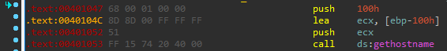
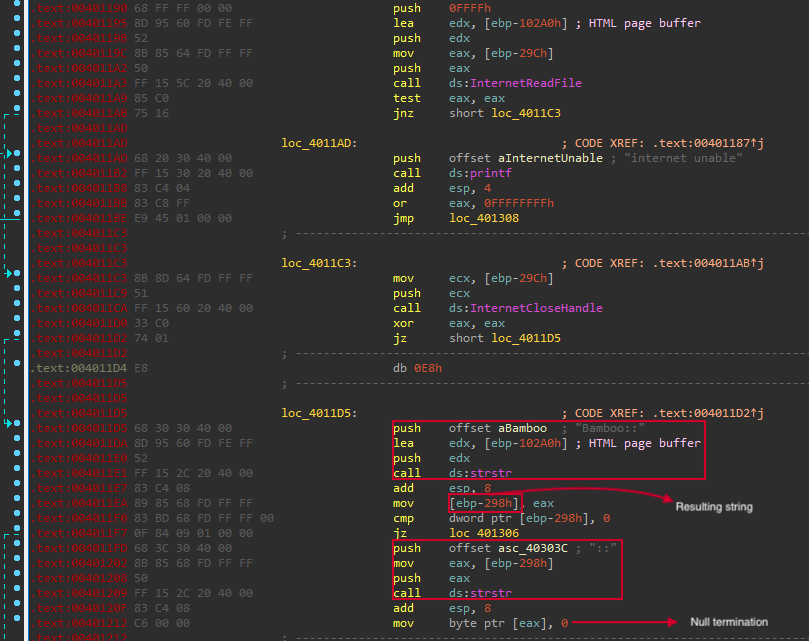
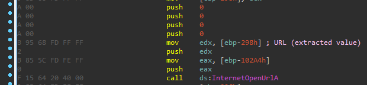
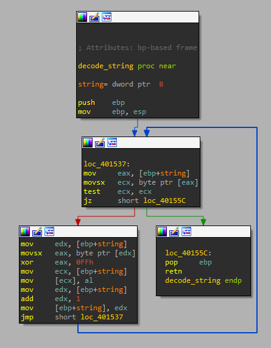

# Lab 15 - Anti-Disassembly

## Lab 15-1

Analyze the sample found in the file Lab15-01.exe. This is a command-line program that takes an argument and prints “Good Job!” if the argument matches a secret code.

**1. What anti-disassembly technique is used in this binary?**

When we load the bianry in _IDA Pro_ we notice how _IDA_ cannot show us the graphic version, telling us that there is something strange within the code, let's dig into it.

To analyze the code better, we are going to set up _IDA Pro_ in order to show the _opcodes_ of each operation, this can be configured in "Options -> General -> Number of opcode bytes" and setting 7 bytes. This will be displayed as follows:


Now, we can start analyzing the sample. As we can see in the following output, there are several _call_ instructions that their targets are nonsensical. Also, before every _call_ instruction, there is _jz_ (jump if zero) instruction which is always true, since before every _jz_ instruction, there is a _xor eax, eax_ instruction, which will always set the _ZERO FLAG_ to _true_.


We have to notice that the _jump_ instructions, jumps to the _call_ instructions plus one byte. We are going to explain with the following example:

```
0040100C 33 C0                                xor     eax, eax
0040100E 74 01                                jz      short near ptr loc_401010+1	-> Jumps to the address of the call instruction plus 1

                      loc_401010:
00401010 E8 8B 45 0C 8B                       call    near ptr 8B4C55A0h		-> The jump will go to loc_401011, not to 00401010
```

This means that the _jump_ instruction will go to the opcode _8B 45 0C 8B_, and not to _E8 8B 45 0C 8B_. This means, that the malware will execute other instruction than _call_, to be precise, it will execute:

```
8B 45 0C mov    eax, DWORD PTR [ebp+0Ch]
```

Let's repair this piece of code in _IDA Pro_, to do so, we click on key 'D' to convert the instruction in _data_ and then, we select the bytes we want to convert back to code and click on key 'C'.


We repeat all necessary times so as to fully fix the code.


**2. What rogue opcode is the disassembly tricked into disassembling?**

As mentioned in the first exercise, the malware use the _call_ instruction opcode (_0xE8_) to trick the disassembler.

**3. How many times is this technique used?**

The malware use this technique a total of 5 times! Innitially, we thought there were only 4, but one of the tricks was hidden in the instructions and only could be discovered when we started fixing the code.

**4. What command-line argument will cause the program to print “Good Job!”?**

To print "Good Job!" we need to introduce the key "pdq" as argument as we can see in the disassembled code.


To verify this key, we execute the program as follows:


## Lab 15-2

Analyze the malware found in the file Lab15-02.exe. Correct all anti-disassembly countermeasures before analyzing the binary in order to answer the questions.

**1. What URL is initially requested by the program?**

If we take a look at the strings, we do not see any _URL_ or _IP_ address.

```
...
not enough name
internet unable
Bamboo::
```

This possibly means that the _URL_ is obfuscated or disguised within the code.

When we start _IDA Pro_ we can see that the binary cannot be showed by means of graphical view, meaning that some kind of anti-disassembly method has been applied.

Firts, if we take a look to the _main_ function, we can see some callings to _WINAPI_ functions.


However, as we move forward into the code, que starting to see some things that must be fixed to understand the code in a better way.

If we scroll down the _IDA View_ panel we will find the following piece of data that draw our attention:


As we can see, there are one _jmp_ instruction that has no sense. Also, the previous jump points out to the nonsensical _jmp_ plus 1 byte.

```
.text:0040115C 75 01                                jnz     short near ptr loc_40115E+1
.text:0040115E
.text:0040115E                      loc_40115E:
.text:0040115E E9 6A 00 6A 00                       jmp     near ptr 0AA11CDh
```

So the expected opcode instruction would be "6A 00 6A 00" instead of "E9".

To fix this code we click on "D" key to convert to data and then "C" on to convert the bytes we want to code. This will result in the following piece of code:


We also see the following block of code being mislabeled.


So, for the first highlighted piece of code, we follow the previous approach to fix it, resulting in:


In the case of the second highlighted code, we must follow other approach, since the instruction:

```
.text:00401215 EB FF                                jmp     short near ptr loc_401215+1
```

Will jump to itself plus one. So we need to convert to data and then to code, but also stating that the sample took a jump here.


After that, we see another disassembly technique that derives in the previously mentioned _jmp address+1_ technique:


In this case, we have two consecutive conditional jumps that together form an unconditional jump. After fixing the code we will see the following:


Then, another disassembly trick is shown us as follows:


We have another jump in the middle instruction, as previously did, we are going to fix the code, referencing that previously this piece of code was executed:

```
mov     ax, 5EBh
xor     eax, eax
jz      short near ptr loc_4012E6+2
```


Let's stop here and see what _URL_ the malware uses, to do so, we need to go back where the function _InternetOpenUrlA_ is called.


As we can see, the function _sub_401386_ is called before calling _InternetOpenUrlA_. If go to that function, we will see the following:


As we can see, the function will copy the URL _http://www.practicalmalwareanalysis.com/bamboo.html_ to the return value, so we can rename this function to _get_URL_.

**2. How is the User-Agent generated?**

The _User-Agent_ is set up by the malware when it calls to the _InternetOpenA_ _WINAPI_ function.


As we can see, the _User-Agent_ is introduced as argument by means of the variable _EBP-100h_, so if we look for this variable, we will find where the malware set up the _User-Agent_.

If we go back in the sample, we see how at the beginning, the malware set up the variable _EBP-100h_ by means of _gethostname_.



After that, this variable is modified by incrementing each letter and number in one value, for example _0x41_ (A), will be _0x42_ (B), but if the number is equal to letters "Z", "z" or "9", it will be converted in "A", "a" and "0", respectively.


**3. What does the program look for in the page it initially requests?**

Once the malware has performed the _HTTP_ request, it will read the file by means of _InternetReadFile_ and then it will look for the string "Bamboo::". After that, it will search again but this time for the first occurrence of "::" and replacing value of the search by a null value _0x0_, indicating the end of the string. This will result in a string between the strings "Bamboo::" and ":"



**4. What does the program do with the information it extracts from the page?**

After extracting the interesting information (will call it _extracted_info_), the malware will call the function _sub_40130F_, which will get the string "Accounts.Summary.xls.exe".


So we can rename this function to _get_backdoor_name_.

Then, the malware will make another requests to _extracted_info_ as URL.



Then, with the retrieved information, it will dump it into the file "Accounts.Summary.xls.exe".


## Lab 15-3

Analyze the malware found in the file Lab15-03.exe. At first glance, this binary appears to be a legitimate tool, but it actually contains more functionality than advertised.

**1. How is the malicious code initially called?**

To get how the malware executes the malicious code we need to know first where it is located. To do so, we enter in the text view of _IDA Pro_ (click space bar) and start digging into the code.

After scrolling down a bunch of addresses, we find what a call to the functions _URLDownloadToFileA_ and _WinExec_.


We also see anti-disassembly code that needs to be addressed. After fixing, we see that _Winexec_ will execute some command stored in the variable _unk_403040_.


No we need to know how and when this chunk of code is called.

Going backwards in the code, we see another anti-disassembly trick that needs to be fixed.


Also, we need to fix another chunk of code that _IDA Pro_ couldn't recognize.


After fixing all of that, we can see some interesting things about the code.


As we can see, the malware will abuse _SEH_ so as to execute the malicious code, this code will be called by means of executing the invalid operation `number / 0`. Howerver, we still need to know how the malware calls this piece of code.

To do so, we take in mind the starting address of the covert code, _0x0040148C_, and start analyzing the main code. After reading the first instructions, we see something interesting in the beginning of the _main_ function.


As we can see, the malware will calculate the or operation between _0x00400000_ and _0x0000148C_, which will result in _0x0040148C_, the starting address of the covert code, and then, it will overwrite the value of _[EBP + 4]_, which is the return address of the _main_ function. So when the _main_ function ends, the malware will execute the covert code, which will abuse the _SEH_ chain to covert the execution flow even more.

**2. What does the malicious code do?**

The malicious code will download one file from internet and execute it by means of _WinExec_ as shown in the next picture:


**3. What URL does the malware use?**

To know that, we need to decode the URL stored in the malware. The decoding routine is called just before the malware calls _URLDownloadToFileA_. We have called this function _decode_string_.


This function, located at _0x00401534_, looks like this.



As we can see, this function just does a _XOR_ encoding using the value _0xFF_ as key.

To decode the _URL_ we have developed the following python script.

```
encrypted_url = bytearray([0x97, 0x8B, 0x8B, 0x8F, 0xC5, 0xD0, 0xD0, 0x88, 0x88, 0x88, 0xD1, 0x8F, 0x8D, 0x9E, 0x9C, 0x8B, 0x96, 0x9C, 0x9E, 0x93, 0x92, 0x9E, 0x93, 0x88, 0x9E, 0x8D, 0x9A, 0x9E, 0x91, 0x9E, 0x93, 0x86, 0x8C, 0x96, 0x8C, 0xD1, 0x9C, 0x90, 0x92, 0xD0, 0x8B, 0x8B, 0xD1, 0x97, 0x8B, 0x92, 0x93])
decryption_key = 0xFF

decrypted_url = ""

for counter in range(len(encrypted_url)):
	encrypted_char = encrypted_url[counter]
	decrypted_url = decrypted_url + chr(decryption_key ^ encrypted_char)

print("The decrypted URL is: " + decrypted_url)
```

This give us the following output:

```
$ python3 Scripts/Labs/Lab_15/lab15_03_decrypt_strings.py 
The decrypted URL is: http://www.practicalmalwareanalysis.com/tt.html
```

**4. What filename does the malware use?**

To know that, we need to decode the filename stored in the malware. The decoding routine is called just before the malware calls _URLDownloadToFileA_.


This decoding routine is the same as the one used to decode the URL, so we simply modify the previously created script to decode the filename instead of the URL.

```
encrypted_filename = bytearray([0x8C, 0x8F, 0x90, 0x90, 0x93, 0x8C, 0x8D, 0x89, 0xD1, 0x9A, 0x87, 0x9A])
decryption_key = 0xFF

decrypted_filename = ""

for counter in range(len(encrypted_filename)):
	encrypted_char = encrypted_filename[counter]
	decrypted_filename = decrypted_filename + chr(decryption_key ^ encrypted_char)

print("The decrypted filename is: " + decrypted_filename)
```

This give us the following output:

```
$ python3 Scripts/Labs/Lab_15/lab15_03_decrypt_strings.py 
The decrypted filename is: spoolsrv.exe
```