# Lab 16 - Anti-Debugging

## Lab 16-1

Analyze the malware found in Lab16-01.exe using a debugger. This is the same malware as Lab09-01.exe, with added anti-debugging techniques.

**1. Which anti-debugging techniques does this malware employ?**

The first thing we do is loading the binary in _IDA Pro_ and execute the script _ida_highlight.py_ to see if there is any _anti-debugging_ technique within the code.

```
Number of potential Anti-Debugging instructions: 0
```

Mmmm... Any anti-debugging technique has been detected, we have to check them manually.

The first anti-debugging technique we see is the one in which the malware checks the _BeingDebugged_ flag of the _PEB_. This is done by checking the second byte of the _PEB_ struct, which is accessed via instruction _fs:30h_.

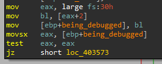

After that, the malware also checks the _ProcessHeap_ (_PEB_ + _0x18_) _ForceFlags_ (_ProcessHeap_ + _0x10_ -_Windows XP_-) value of the _PEB_, since this field is used to tell the kernel if the heap was created within a debugger.

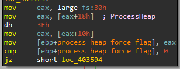

Then, the malware will check the field _0x68_ of the _PEB_, which points to the _NTGlobalFlag_. If this value of this flag is equal to _0x70_, the process will be running in a debugger.

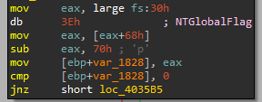

These techniques are used in many different locations within the code, so as to hindering the debugging process.

**2. What happens when each anti-debugging technique succeeds?**

When an anti-debugging technique succeeds, the malware auto-removes itself.

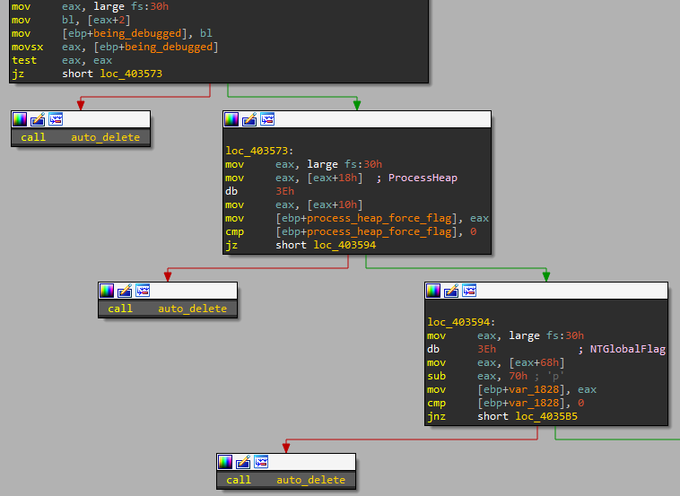

**3. How can you get around these anti-debugging techniques?**

Since the malware checks several times if the process is being debugged, it is easier for us to change the queried values of the _PEB_.

To do so, we set a breakpoint at _0x0040355A_, after the _PEB_ struct address was loaded in _EAX_. Then, we go to the _PEB_ struct address (stored in _EAX_) in the hexadecimal memory dump container.

We also could access to the _PEB_ struct by executing the following command:

```
dump fs:[30]
```

Now, we can start modifying the values by means of _CTRL+E_ or _right-click -> Binary -> Edit_.

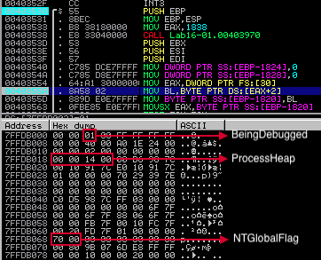

In the case of _ProcessHeap_, we go to the address _0x00140000_ and select the offset _+0x10_, which points to _ForceFlags_ value that has a value of _0x40000060_ in this case.

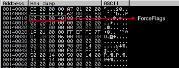

So, we modify _BeingDebugged_ to _0x0_, _ForceFlags_ to _0x00000000_ and _NTGlobalFlag_ to any other value than _0x0070_, _0x0000_ in our case.

After that, we can check how the malware executes as expected.

**4. How do you manually change the structures checked during runtime?**

Explained in the previous exercise.

**5. Which OllyDbg plug-in will protect you from the anti-debugging techniques used by this malware?**

We can execute the following command in _Immunity_ so as to prevent the _PEB_ anti-debugging techniques the malware applies:

```
!hidedebug peb
```

## Lab 16-2

Analyze the malware found in Lab16-02.exe using a debugger. The goal of this lab is to figure out the correct password. The malware does not drop a malicious payload.

**1. What happens when you run Lab16-02.exe from the command line?**

When we try to execute the malware from the command line, it happens the following:

```
C:\> Lab16-02.exe
usage: Lab16-02.exe <4 character password>
```

It needs a password!

**2. What happens when you run Lab16-02.exe and guess the command-line parameter?**

If we introduce some "password" as parameter, the binary will do the following:

```
C:\> Lab16-02.exe abcd

Incorrect password, Try again.
``` 

**3. What is the command-line password?**

To run the sample, first we have to know the password. To do so, we first load the binary in _IDA Pro_.

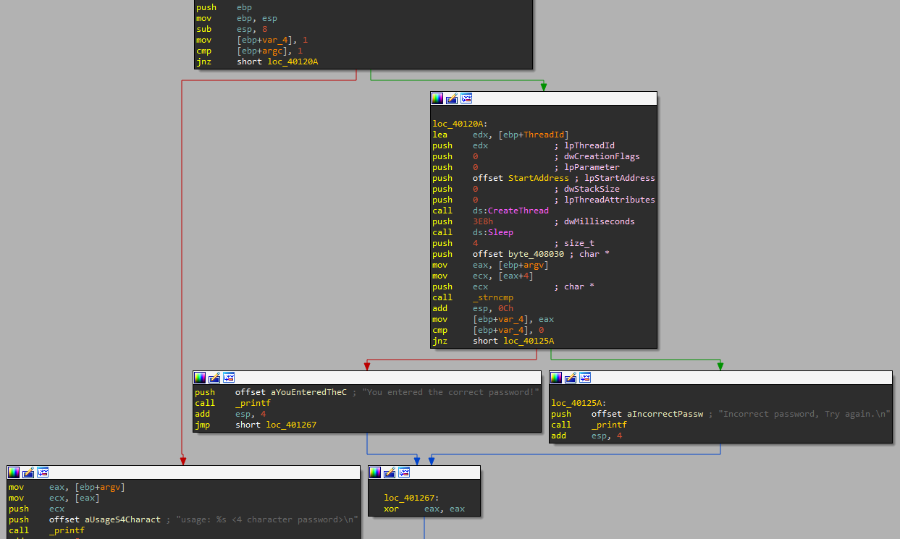

As we can see, the binary can take three paths, if no argument is provided, it exits printing the sentence "usage: Lab16-02.exe <4 character password>". If some argument has included, it will create a new thread and print "Incorrect password, Try again.", if the argument does not match with the expected password, or "You entered the correct password!", if the argument matches.

If we take a look where the binary compares the argument (_0x0040123A_), it takes the value stored in _byte_408030_ as reference.

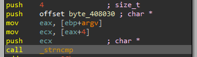

So if we take a look to the value of such variable we will see the following:

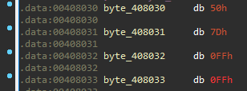

Mmmm... It seems that the value of the variable is not printable. May be the previously created thread have something to say what is the real password.

But first, we are going to convert these variables into a string of size 4 and rename it as password.

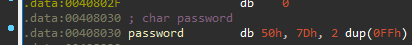

Now, we can take a look to the function called by _CreateThread_.

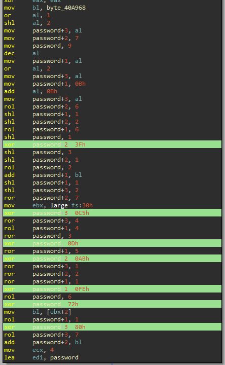


It definitely modifies the variable of the password.

Also, we see how this function checks the _BeingDebugged_ flag of the _PEB_ and modifies the password according to that.

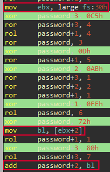

Taking all of this in mind, let's start debugging the sample with _Immunity Debugger_, don't forget to set one dummy string as argument of the binary (Debug -> Arguments).


We set up one breakpoint at the comparison instruction (_0x0040123A_) and run the sample.

If we do not use the _hidedebug_ plguing, the password we will get is: `bzqr`.

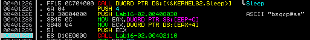

Notice that despite the fact that the string is "bzqrp@ss", the sample only compares the 4 first characters.

Now, if we execute the following command to prevent the malware from knowing it is running in a debugger, we should see the rigth password the next time.

```
!hidedebug peb
```

Now, the new password is: `bzrr`.

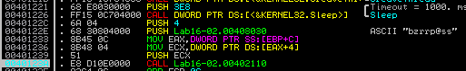

Let's see if it is correct!

```
C:\> Lab16-02.exe bzrr

Incorrect password, Try again.
``` 

Mmmm... It failed again, may be we missed something.

If we go back to the decoding function, we see some global variable used to modify one of the bytes of the password:

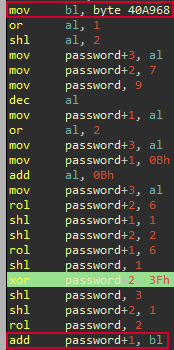

If we analyze this global variable, we see that it has cross-references to other functions, one in which it modifies the value of the variable.

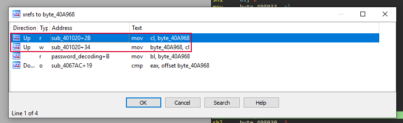

This function, located at _0x00401020_ and renamed to _check_debugging_, calls _OutputDebugStringA_ and _GetLastError_ to check if the sample is being debugged.

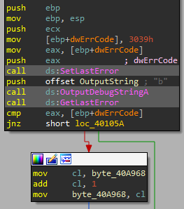

This function is called by a _TLS_ (Thread Local Storage) _callback_ in which it checks if the sample is running in the context of _OllyDBG_ and if so, it exits (we overcome this situation by executing the sample with _Immunity_).

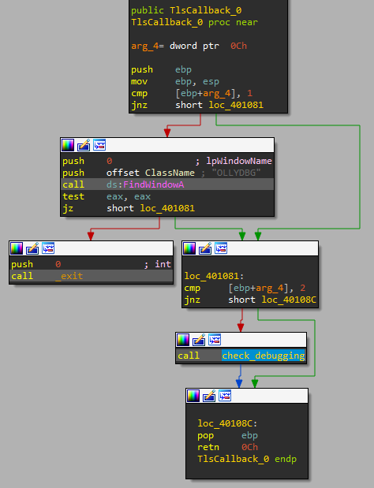

So to solve our problem we can simply _NOP-out_ the instruction `add     cl, 1` (_0x00401051_) and executing again the sample.

Now, the password we have obtained is: `byrr`.

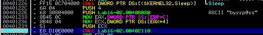

Let's try it...

```
C:\> Lab16-02.exe byrr

You entered the correct password!
```

Great! We found it!

**4. Load Lab16-02.exe into IDA Pro. Where in the main function is strncmp found?**

As commented in the previous exercise, it is located at _0x0040123A_ address, just after the _CreateThread_ calling.

**5. What happens when you load this malware into OllyDbg using the default settings?**

It exits as explained in exercise 3.

**6. What is unique about the PE structure of Lab16-02.exe?**

After opening the file into _PEView_, we see a section called _.tls_ with a header called _IMAGE_TLS_DIRECTORY_.

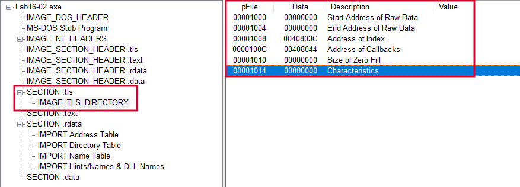

**7. Where is the callback located? (Hint: Use CTRL-E in IDA Pro.)**

If we go to _IDA Pro_ and click [CTRL+E] we will see all the entry points of the malware, including the _TLS_ callback described in exercise 3.

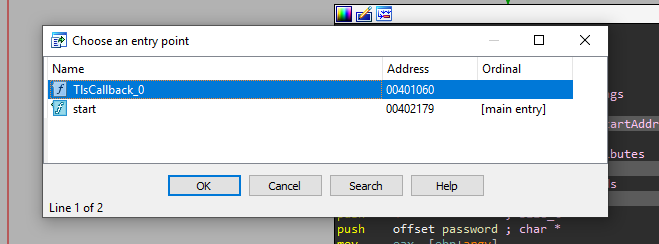

As we can see, it is located at _0x00401060_.

**8. Which anti-debugging technique is the program using to terminate immediately in the debugger and how can you avoid this check?**

As commented in the exercise 3, if the sample finds it is being executed by _OllyDBG_, it will terminate it. This is done by means of _FindWindowA_ _WINAPI_ function.


We can avoid this issue by using another debugger like _Immunity_ or _IDA Pro_. However, if we only have _OllyDBG_, we can use the plugin _PhantOm_ or patching the binary so as to check other random string value.

**9. What is the command-line password you see in the debugger after you disable the anti-debugging technique?**

Explained in the exercise 3.

**10. Does the password found in the debugger work on the command line?**

Explained in the exercise 3.

**11. Which anti-debugging techniques account for the different passwords in the debugger and on the command line, and how can you protect against them?**

Explained in the exercise 3.

## Lab 16-3

Analyze the malware in Lab16-03.exe using a debugger. This malware is similar to Lab09-02.exe, with certain modifications, including the introduction of anti-debugging techniques. If you get stuck, see Lab 9-2.

**1. Which strings do you see when using static analysis on the binary?**

To do so, we execute the _strings_ command within the binary.

```
C:\> strings Lab16-03.exe

...
GetStringTypeA
GetStringTypeW
/,@
cmd
cmd.exe
 >> NUL
/c del
xS@
...

```

As we can see, not too much interesting strings were found, only some related with command line execution to delete some file, may be the binary itself.

**2. What happens when you run this binary?**

If we execute the binary, we can check with _Process Explorer_ how the binary seems to not run properly, since no evidence of execution was found.

**3. How must you rename the sample in order for it to run properly?**

Let's analyze it with _IDA Pro_ to solve this challenge.

First, we load the _IDAPython_ script _ida_highlight.py_ to see if there is something relevant in the sample.

```
Number of calls and sub functions: 224
Number of potential Anti-VM instructions: 0
Number of potential Anti-Debugging instructions: 2
Anti-Debugging potential at 401323
Anti-Debugging potential at 40136d
Number of push/ret instructions: 0
Number of xor: 16
```

Mmmm... Interesting, the sample seems to perform some anti-debugging techniques and encoding tasks.

If we take a look at the beginning of the _main_ function, we will see two splitted strings.

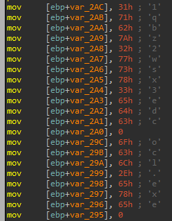

To see them better, we convert these variables into arrays.

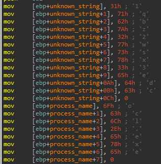

Now, we can see them in a better way, the strings that the binary innitialize are:

```
1qbz2wsx3edc
ocl.exe
```

As we can see, the first one is completely unknown, but the second one seems to be a process name.

The process name string is passed as argument in the next function, located at _0x004011E0_.

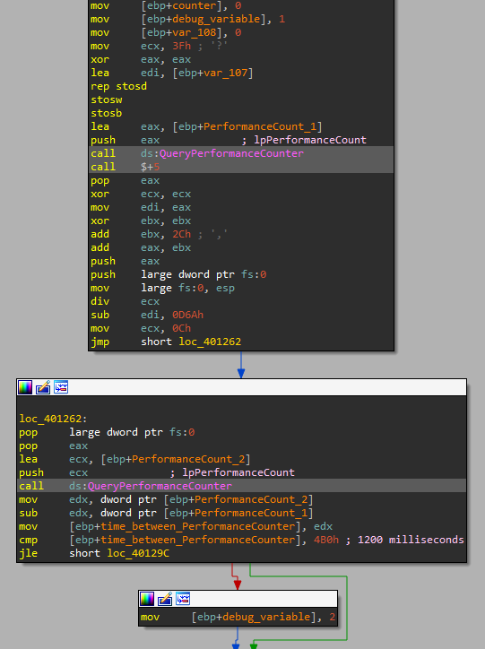

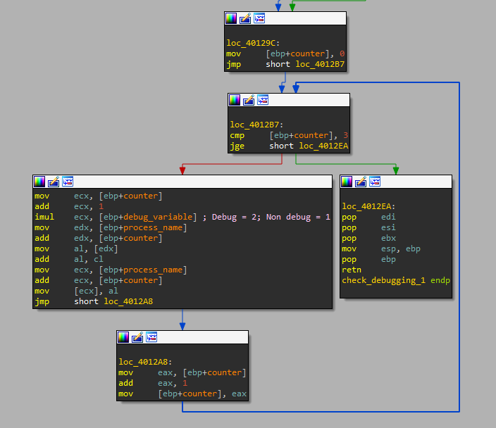

This function calls two times the _WINAPI_ function _QueryPerformanceCounter_, doing other stuff meanwhile. Then, it checks the time between the two calls and if it is greater than 1200 milliseconds, it modifies the argument passed, which is the string "ocl.exe", in a way, and if not, it modifies in another way. So we have rename this function to _check_debugging_1_.

This function is important, since it will determine the valid execution name of the sample.

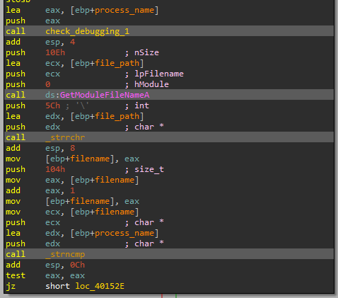

Let's start the sample in _Immunity_ and see what name the sample should have while debugging and while it is being executed in a regular way.

So we set up several _breakpoints_ at _0x00401518_ (where the string comparison takes place) and _0x0040122D_ (in the middle of the two _QueryPerformanceCounter_ callings). Now, we run it and see what happens.


Notice that a division by zero took place while we were debugging, this is done to stop execution and force the value between the two _QueryPerformanceCounter_ calls being much higher than 1200 milliseconds. After the exception, just press [SHIFT + F9] and the program will continue as normally.

So, we have found that the sample waits the name _qgr.exe_ while the sample is being executed in a debugger.

Let's find out what name will wait if the sample executes in a regular environment. To simulate so, we modify the instruction at _0x00401292_ as follows:

```
mov     [ebp+debug_variable], 2
	||
	\/
mov     [ebp+debug_variable], 1
```

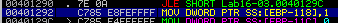

Then, if we execute the sample we will see how it returns the value of the sample in a real environment.

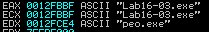

The filename will be _peo.exe_.

**4. Which anti-debugging techniques does this malware employ?**

We have discussed one of the anti-debugging techines in the previous exercise, however, it employes another two more.

The first one can be seen at _0x00401584_, where the malware employs two calls to _GetTickCount_, which returns the milliseconds that have elapsed since the system was started, and another call to an unknown function in the middle, this function has been renamed to _check_debugging_2_.

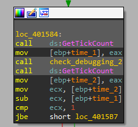

The function _check_debugging_2_ simply performs a division by zero like the analyzed in the previous exercise to stop execution during debugging.

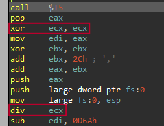

So when the sample is being debugged, the difference between the two _API_ calls to _GetTickCount_ will be greater than 1 millisecond due to the exception raised.

Finally, the last anti-debugging trick the malware employs is located at function renamed to _decode_data_ (_0x00401300_). In this function takes place the decoding of some encoded data stored within the malware, prior to calling _gethostbyname_.


In the _decode_data_ we can see how the function executes two times the instruction `rdtsc`, which will return the count of the number of ticks since the last system reboot, and if the difference between the two executions of _rdtsc_ is greater than 500.000, it will call the _auto_delete_ function. If it is not the case, it will decode the decoded content.

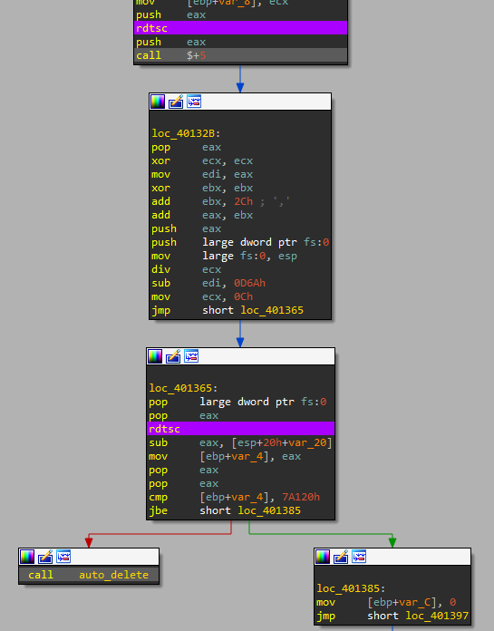

Since the malware performs another division by zero, an exception will raise as in the previous cases, generating more ticks than normally.

**5. For each technique, what does the malware do if it determines it is running in a debugger?**

In the first case, it will not execute if the malware has not the correct name.

In the second case, also the same, it won't execute.

In the last case, in the _decode_data_ function, the malware will auto-remove itself.

**6. Why are the anti-debugging techniques successful in this malware?**

Explained in the previous exercises.

**7. What domain name does this malware use?**

The decoding function is as follows:

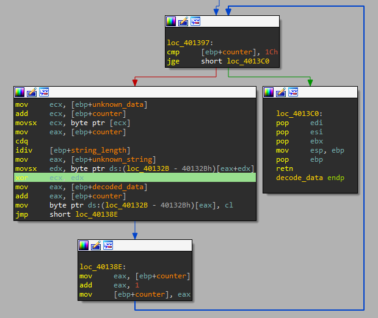

We are going to use _Immunity_ to try to decode the function, but first, don't forget to change the name of the binary to _qgr.exe_, since despite we are going to disable all anti-debugging tricks with the following command, the function _QueryPerformanceCounter_ is not patched.

```
!hidedebug All_debug
```

We also setup two breakpoints, one when the jump to the decoding procedure is taking in the _decode_data_ function at _0x0040137E_ address and the other one when the function exits at _0x004015DA_.

Then, when the binary gets to the _jbe_ instruction, we modify the _Carrier Flag_ (_CF_) to 1 and run the sample until it returns from the function.

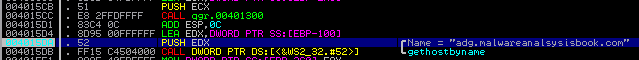

As we can see, the malware will use the domain name: _adg.malwareanalysisbook.com_.
