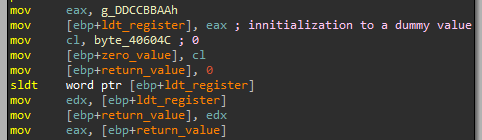
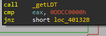
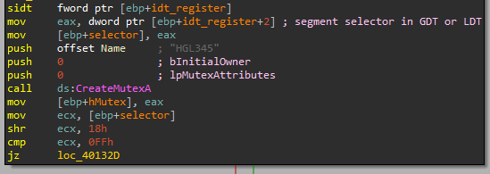
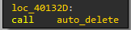
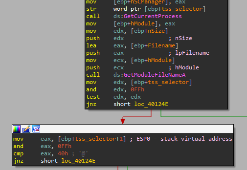
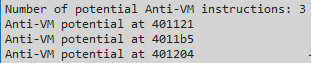

	# Lab 17 - Anti-Virtual Machine Techniques

## Lab 17-1
Analyze the malware found in Lab17-01.exe inside VMware. This is the same malware as Lab07-01.exe, with added anti-VMware techniques.

_NOTE The anti-VM techniques found in this lab may not work in your environment._

**1. What anti-VM techniques does this malware use?**

Analyzing the code we have found a total of three instructions related with anti-VM techniques. We have found the usage of the following instructions:

```
.text:00401121                 sldt    word ptr [ebp+var_8]

.text:004011B5                 sidt    fword ptr [ebp+var_428]

.text:00401204                 str     word ptr [ebp+var_418]
```

This instructions give different results in a virtualization environment than in a real PC, so they are frequently used by malware to check whether the binary is being executed in a real machine or not.

Let's analyze all of them to see what the malware checks.

The first instruction, _sldt_ (used in an anti-VM technique is known as _No Pill_), located at _0x00401121_, is executed in a function called by the _main_ function.



As we can see, the function simply locates where the _Local Descriptor Table_ is located, so we rename this function to _\_getLDT_. After that, the malware compares this value with _0xDDCC0000_, if it is the same, the malware will continue its execution, if not, it will exit.



Now, the second instruction, _sidt_ (used in an anti-VM technique known as _Red Pill_), will be used to get the _Interrupt Descriptor Table_ and it is called during _main_ execution.



In this case, after executing the instruction, the malware stores the value of the _IDT_ plus 2 bytes in a variable, this corresponds with the segment selector in _GDT_ or _LDT_. After that, the malware applies a _shift right of 0x18_, which will get the most significant bytes, to this value and then compares the result against _0xFF_ (_VMWare_ signature), if it is equal, it calls a function to auto-delete itself.



The last instruction, _str_, retrieves the segment selector from the task register, which points to the _Task State Segment_ (_TSS_) of the current task.



Here, the malware will first get the value returned by _str_ and applying an _AND_ operation on it, then checks if the value is equal to zero or not. If it is equal to zero it will get the value returned by _str_ plus 1 byte, which points to a value known as _ESP0_, which is the stack virtual address to be precise. Then, it will make an _AND_ operation against _0xFF_ and compare the value with _0x40_ (_VMWare_ signature), if they are the same, the malware will call the auto-delete function that we commented before.

**2. If you have the commercial version of IDA Pro, run the IDA Python script from Listing 17-4 in Chapter 17 (provided here as findAntiVM.py). What does it find?**

The script will find the three instructions we have previously analyzed.



**3. What happens when each anti-VM technique succeeds?**

It has been commented in the first exercise.

**4. Which of these anti-VM techniques work against your virtual machine?**

The anti-VM technique known as _Red Pill_, _sidt_, have not worked against the virtualized _Windows XP_. Also, the technique _str_ have not worked to determine if my machine is a VM. Finally, the last technique, the one that uses _sldt_, have failed against my machine.

**5. Why does each anti-VM technique work or fail?**

The anti-VM techinque known as _Red Pill_, _sidt_, has failed because we are executing the sample in a multi-processor computer. The other techniques failed because the expected values by the malware for a virtualized environment didn't match.

**6. How could you disable these anti-VM techniques and get the malware to run?**

We can _NOP-out_ the instructions used by the malware to detect a virtualized environment, if they had succeeded.

## Lab 17-2

Analyze the malware found in the file Lab17-02.dll inside VMware. After answering the first question in this lab, try to run the installation exports using rundll32.exe and monitor them with a tool like procmon. The following is an example command line for executing the DLL:
rundll32.exe Lab17-02.dll,InstallRT (or InstallSA/InstallSB)

**1. What are the exports for this DLL?**

**2. What happens after the attempted installation using rundll32.exe?**

**3. Which files are created and what do they contain?**

**4. What method of anti-VM is in use?**

**5. How could you force the malware to install during runtime?**

**6. How could you permanently disable the anti-VM technique?**

**7. How does each installation export function work?**

## Lab 17-3

Analyze the malware Lab17-03.exe inside VMware. This lab is similar to Lab12-02.exe, with added anti-VMware techniques.

**1. What happens when you run this malware in a virtual machine?**

**2. How could you get this malware to run and drop its keylogger?**

**3. Which anti-VM techniques does this malware use?**

**4. What system changes could you make to permanently avoid the anti-VM techniques used by this malware?**

**5. How could you patch the binary in OllyDbg to force the anti-VM techniques to permanently fail?**
