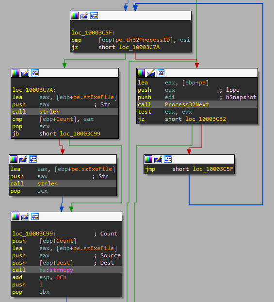
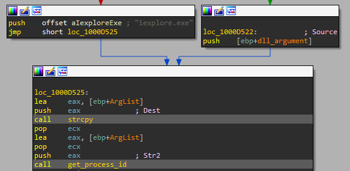
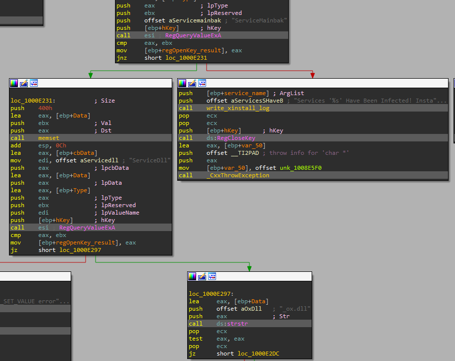
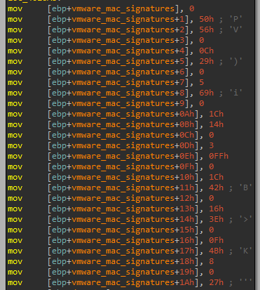

	# Lab 17 - Anti-Virtual Machine Techniques

## Lab 17-1
Analyze the malware found in Lab17-01.exe inside VMware. This is the same malware as Lab07-01.exe, with added anti-VMware techniques.

_NOTE The anti-VM techniques found in this lab may not work in your environment._

**1. What anti-VM techniques does this malware use?**

Analyzing the code we have found a total of three instructions related with anti-VM techniques. We have found the usage of the following instructions:

```
.text:00401121                 sldt    word ptr [ebp+var_8]

.text:004011B5                 sidt    fword ptr [ebp+var_428]

.text:00401204                 str     word ptr [ebp+var_418]
```

This instructions give different results in a virtualization environment than in a real PC, so they are frequently used by malware to check whether the binary is being executed in a real machine or not.

Let's analyze all of them to see what the malware checks.

The first instruction, _sldt_ (used in an anti-VM technique is known as _No Pill_), located at _0x00401121_, is executed in a function called by the _main_ function.


As we can see, the function simply locates where the _Local Descriptor Table_ is located, so we rename this function to _\_getLDT_. After that, the malware compares this value with _0xDDCC0000_, if it is the same, the malware will continue its execution, if not, it will exit.


Now, the second instruction, _sidt_ (used in an anti-VM technique known as _Red Pill_), will be used to get the _Interrupt Descriptor Table_ and it is called during _main_ execution.


In this case, after executing the instruction, the malware stores the value of the _IDT_ plus 2 bytes in a variable, this corresponds with the segment selector in _GDT_ or _LDT_. After that, the malware applies a _shift right of 0x18_, which will get the most significant bytes, to this value and then compares the result against _0xFF_ (_VMWare_ signature), if it is equal, it calls a function to auto-delete itself.


The last instruction, _str_, retrieves the segment selector from the task register, which points to the _Task State Segment_ (_TSS_) of the current task.


Here, the malware will first get the value returned by _str_ and applying an _AND_ operation on it, then checks if the value is equal to zero or not. If it is equal to zero it will get the value returned by _str_ plus 1 byte, which points to a value known as _ESP0_, which is the stack virtual address to be precise. Then, it will make an _AND_ operation against _0xFF_ and compare the value with _0x40_ (_VMWare_ signature), if they are the same, the malware will call the auto-delete function that we commented before.

**2. If you have the commercial version of IDA Pro, run the IDA Python script from Listing 17-4 in Chapter 17 (provided here as findAntiVM.py). What does it find?**

The script will find the three instructions we have previously analyzed.


**3. What happens when each anti-VM technique succeeds?**

It has been commented in the first exercise.

**4. Which of these anti-VM techniques work against your virtual machine?**

The anti-VM technique known as _Red Pill_, _sidt_, have not worked against the virtualized _Windows XP_. Also, the technique _str_ have not worked to determine if my machine is a VM. Finally, the last technique, the one that uses _sldt_, have failed against my machine.

**5. Why does each anti-VM technique work or fail?**

The anti-VM techinque known as _Red Pill_, _sidt_, has failed because we are executing the sample in a multi-processor computer. The other techniques failed because the expected values by the malware for a virtualized environment didn't match.

**6. How could you disable these anti-VM techniques and get the malware to run?**

We can _NOP-out_ the instructions used by the malware to detect a virtualized environment, if they had succeeded.

## Lab 17-2

Analyze the malware found in the file Lab17-02.dll inside VMware. After answering the first question in this lab, try to run the installation exports using rundll32.exe and monitor them with a tool like procmon. The following is an example command line for executing the DLL:

`rundll32.exe Lab17-02.dll,InstallRT (or InstallSA/InstallSB)`

**1. What are the exports for this DLL?**

To check the exports of this binary, we use the script _get_file_exports.py_ located in "Scripts/Others/General/".

```
C:\> python get_file_exports.py Lab17-02.dll

######################
EXPORTS
######################
InstallRT
InstallSA
InstallSB
PSLIST
ServiceMain
StartEXS
UninstallRT
UninstallSA
UninstallSB
```

There are quite a few exports, three related with installation routines, other three with uninstallation routines and the other three with different functions related with services or start up.

**2. What happens after the attempted installation using rundll32.exe?**

If we execute the sample by means of _rundll32.exe_, the sample will exit. Since in the function located at _0x10001000_, which is called several times withing the code, will check if the process which has load it is _rundll32.exe_ o _rundll64.exe_.




Also, the program creates two files, _xinstall.log_ and _vmselfdel.bat_

**3. Which files are created and what do they contain?**

When we try to install the binary in the virtual machine and the installation process fails, it will create two files. The first one is a log file called _xinstall.log_ that will contain some strings, one of them will be "Found Virtual Machine,Install Cancel.".


The second file is a script file that will stop the execution of the malware and also will remove it from disk. The content of such file is the following:

```
@echo off\r\n
:selfkill\r\n
attrib -a -r -s -h \"%s\"\r\n
del \"%s\"\r\n
if exist \"%s\" goto selfkill\r\n
del %%0\r\n
```

**4. What method of anti-VM is in use?**

The malware uses a technique by means of querying the I/O communication port, which is used by _VMWare_ to communicate with the host machine, during the installation process.


As we can see, the malware will load first the value _VMXh_ in _EAX_, then it will set _EBX_ to zero, since this register will get the reply value of _VMWare_. After that, it will set _ECX_ to _0xA_, which is the value of 'get VMware version type' method. Finally, it will load the value _VX_ in _EDX_ to specify the I/O communication port of _VMWare_.

After the malware executes the _in_ instruction, it will compare the value returned in _EBX_ with the value _VMXh_ (_VMWare_ signature) and set the result value to 0 or 1 (false or true).

We have called this function _check_virtual_machine_.

**5. How could you force the malware to install during runtime?**

We can _NOP-out_ the call to the function _check_virtual_machine_ or simply the instruction _in_.

**6. How could you permanently disable the anti-VM technique?**

As commented previously, we can patch the binary by _NOPing-out_ the call to the function _check_virtual_machine_. Also, we realize that the malware will jump to the installation routine directly if the innitial string would be "[This is DVM]0" intead of "[This is DVM]5".


So if we patch this string, the malware will install itself without checking if the system is a virtual machine.

**7. How does each installation export function work?**

In the following lines, we are going to explain every installation process.

**InstallRT**

This installataion routine will relly on process injection to "install" the binary.

First, the malware will copy itself to the system directory.


Then, it will look for the process ID (_PID_) of _iexplorer.exe_ (_Internet Explorer_) or the process specified as argument in the command line.



After that, if everything was ok, the malware will enable _SeDebugPrivilege_ permission so as to call _CreateRemoteThread_ and manipulate the memory of the remote process and then inject the previously copied _DLL_ into the selected process by means of _WINAPI_ functions _VirtualAllocEx_, to allocate memory in the remote process, _WriteProcessMemory_, to write the malicious _DLL_ into the process address space, and _CreateRemoteThread_, to call _LoadLibraryA_ from the remote process to load the malicious _DLL_.


**InstallSA**

The _installSA_ subroutine inside of _InstallSA_ export will execute the following steps.

First, the malware will open the registry key "SOFTWARE\Microsoft\Windows NT\CurrentVersion\Svchost" and get the value of the _netsvcs_ subkey.


Then, the value of the subkey _netsvcs_ obtained in the previous operation is compared against the string "Irmon" or the string introduced as argument of the _DLL_, this string will be called _service_name_ from now on. The point is checking if _service_name_ is within the subkey _netsvcs_, this will indicate that the service already exists.


After that, it will create or modify the service specified in _service_name_ by calling _CreateServiceA_ _WINAPI_ function with the _lpBinaryPathName_ argument pointing to "%SystemRoot%\System32\svchost.exe -k netsvcs".


Then, creates the key _Parameters_ under "SYSTEM\CurrentControlSet\Services\" in the registry.


After that, it will get the full path of the binary to set up the value _ServiceDLL_ of the _Parameters_ key and then it will start the previously created service.


Finally, it will modify the file time of the _win.ini_ file and set the value _Completed_ to the key "SoftWare\MicroSoft\Internet Connection Wizard\".

**InstallSB**

First, the malware will call a function located at 0x10005A0A.

This function will first enable _SeDebugPrivilege_ within the current process. Then, it will look for process _winlogon.exe_ from which it will execute the function _SfcTerminateWatcherThread_ of _sfc_os.dll_ to stop the _System File Checker_ (SFC) of the system by means of _CreateRemoteThread_.


So we rename this function to _disable_SFC_.

After _disable_SFC_ is executed, the function located at _0x1000DF22_ is called.

This function will first check if the service _NtmsSvc_ or the one provided as argument of the DLL, _service_name_ from now on, is configured to _AUTO_START_ and, if not, it will change this value to the expected. Also, it will stop this service if its running.


Then it will check the value _netsvcs_ of the key "SOFTWARE\Microsoft\Windows NT\CurrentVersion\Svchost".


After that, it will check if the value of _service_name_ exist in the _Svchost_ key and if so, it creates the key _Parameters_ under "SYSTEM\CurrentControlSet\Services\" in the registry. Then, it will call _RegQueryValueExA_ to get the value of _ServiceMainbak_ to check if the malware has already been installed. Then it will check the value of _ServiceDll_ key also by means of _RegQueryValueExA_. The value obtained will be checked against the string _\_ox.dll_, to see if the malware has been already installed.



Then, if the malware has not been installed, it will look for the module retrieved from _ServiceDll_, _ntmssvc.dll_ by default, in a specified process, _svchost.exe_. Also, it will check if the module exists within the previous process, something that its quite redundant.


Now, whether the previous check is successful or wrong, the program will execute two different paths.

If the check is successful, first, the malware will get the path of itself, since the handle to the module is null. Then, it will copy the module located at "C:\Windows\System32\ntmssvc.dll" to "C:\Windows\System32\ntmssvc.dll.obak", creating a backup of the original module.


After that, it will copy the malicious binary to "C:\Windows\System32\ntmssvc.dll", replacing the previous module.


Also, the malicious file is copied to the path "C:\Windows\System32\dllcache\ntmssvc.dll".

After that, it will get the value of _ServiceMain_ of the key registry "SYSTEM\\CurrentControlSet\\Services\\Parameters" and will create another one with the value of such parameter (if exists) called _ServiceMainbak_, creating a backup. Then, it will modify the original registry key value to point out to _ServiceMain_.


Now, if the malware does not find the expected module in a process, first, it will copy the binary to the path "C:\Windows\System32\\\_ox.dll"


Now, it will set the value of the parameter _ServiceDLL_ of the key "SYSTEM\CurrentControlSet\Services\".


Then, it will do the same as the previous path in which creating a backup of _ServiceMain_ registry key parameter.

After that, it will call the function _inject_process_ seen in the _InstallRT_ process with the _PID_ of _svchost.exe_ obtained before and the _DLL_ _\_ox.dll_, which is the malware itself.


Finally, if everything was correct, both paths converge into a function that will start the previously created service. Also, it will modify the file time of the _win.ini_ file and set the value _Completed_ to the key "SoftWare\MicroSoft\Internet Connection Wizard\" as seen in _InstallSA_.


## Lab 17-3

Analyze the malware Lab17-03.exe inside VMware. This lab is similar to Lab12-02.exe, with added anti-VMware techniques.

**1. What happens when you run this malware in a virtual machine?**

When we run it in _VMWare_, we can see how the malware does not create the file _practicalmalwareanalysis.log_ that we know it should create (this is where the _keylogger_ will drop the logged keystrokes), since its has the same functionality of _Lab12-02.exe_. So we can conclude that the malware does not execute in the virtual machine.

**2. How could you get this malware to run and drop its keylogger?**

First, we need to see where the malware checks if a it has been executed in a virtual machine. To do so, we load the binary in _IDA Pro_ and executes the script _ida_highlight.py_.

As starting point, we decide to compare the main function of both functions and see what we find:


The first function the malware calls is new and it is located at _0x00401A80_, let's dive in it to see what it does.

This function seems to be the responsible for performing the _VMWare_ checking, as it seems at simple view. So we rename it to _check_virtual_machine_1_.


However, since the malware introduces more changes, we need to analyze them so as to verify there is no more virtual machine checks.

The next called function, located at _0x004011C0_, checks the information of registry key value "SYSTEM\CurrentControlSet\Control\DeviceClasses" by means of _RegQueryInfoKeyA_ and then gets the subkeys of that key with _RegEnumKeyExA_. This information is iterated to look for the string value "vmware".


This function is renamed to _check_virtual_machine_2_.

Finally, after calling those functions, the malware will load the library _Iphlpapi.dll_ and get the address of _GetAdaptersInfo_. This function will be called later in the function located at _0x00401670_, which is the one responsible for loading and decoding the resource file that will be injected later or. The function _GetAdaptersInfo_ could be used to determine whether the host is a virtual machine or not, by retrieving the network adapters of the machine.

The malware will call _GetAdaptersInfo_ twice, the first time it will do it with a buffer length of '0', to check if there are network adapters in the machine, if not, it will exit.


The second time this function is called, is to determine if the machine has an ethernet adapter and if the _MAC_ address of such adapter has the _signature_ of _VMWare_.


The signatures of _VMWare_ are stored in an array at the beginning of the function (we have to re-labeled since _IDA Pro_ failed to do so).



Some of the known _VMWare_ sigatures are:

```
00:50:56	VMWare	VMware vSphere, VMware Workstation, VMware ESX Server
00:50:56:80:00:00 → 00:50:56:BF:FF:FF	VMWare	VMware vSphere managed by vCenter Server
00:0C:29	VMWare	Standalone VMware vSphere, VMware Workstation, VMware Horizon
00:05:69	VMWare	VMware ESX, VMware GSX Server
00:1C:14	VMWare	VMWare
```

The last anti-virtual machine technique used by the malware can be found in the function that we have called _inject_process_ (_0x00401400_), where an unknown function (_0x00401130_) is called with some parameters.


In this function, we can see how the malware lists the processes of the machine and calls another unknown function located at _0x00401000_ prior to compare the first argument.


If we dig into that function, we see that it is some kind of _hashing_ routine that we will need to crack in order to know what _0x0F30D12A5_ means.


As we can see, the routine is formed by loop that iterates over the string the number of times specified in the argument, in this case 6. This means that the malware will only hash the first 6 characters of the process name.

If we look at the hashing routine, we will se the following instructions:

```
mov     ecx, [ebp+result]			-> ECX = RESULT (in the first iteration it will be 0)
shl     ecx, 5						-> ECX = RESULT << 5
mov     edx, [ebp+result]			-> EDX = RESULT
shr     edx, 1Bh					-> EDX = RESULT >> 0x1B
or      ecx, edx					-> ECX = ECX | EDX = (RESULT << 5) | (RESULT >> 0x1B)
mov     eax, [ebp+processName]		-> EAX = PROCESS_NAME[]
add     eax, [ebp+counter]			-> EAX = PROCESS_NAME[counter]
movsx   edx, byte ptr [eax]			-> EDX = PROCESS_NAME[counter]
add     ecx, edx					-> ECX = ECX + EDX = (RESULT << 5) | (RESULT >> 0x1B) + PROCESS_NAME[counter]
mov     [ebp+result], ecx			-> RESULT = ECX = (RESULT << 5) | (RESULT >> 0x1B) + PROCESS_NAME[counter]
```

Now we can try to create the same _hashing_ function in a _Python_ script and try to crack the hash we already have using some wordlist of common _Windows_ processes, in our case we have dumped the process list of our _Windows XP_ machine via the _tasklist_ command.

```
System Idle Process
System
smss.exe
csrss.exe
winlogon.exe
services.exe
lsass.exe
vmacthlp.exe
svchost.exe
svchost.exe
svchost.exe
svchost.exe
svchost.exe
explorer.exe
spoolsv.exe
VGAuthService.exe
vmtoolsd.exe
wmiprvse.exe
wscntfy.exe
alg.exe
vmtoolsd.exe
ctfmon.exe
wuauclt.exe
cmd.exe
wuauclt.exe
tasklist.exe
```

So the _Python_ script will look like the following:

```
import os
import sys

HASH_VALUE = 0x0F30D12A5

def hash(process_name):
	result = 0
	counter = 0
	while (counter < 6) and (counter < len(process_name)):
		result = ((result << 5) | (result >> 0x1B)) + ord(process_name[counter])
		counter = counter + 1

	return result

def check_hash(process_name):
	return hash(process_name) == HASH_VALUE

# Reads the file
def read_file(file):
	found = False
	with open(file, "r") as wordlist:
		process_name = wordlist.readline()
		while process_name and not found:
			found = check_hash(process_name)
			if not found:
				process_name = wordlist.readline()

		if found:
			print("Occurrence found! The decrypted hash value is: " + process_name)
		else:
			print("No occurrence found!")

# Gets file from args
def get_file_from_args():
	if len(sys.argv) == 2:
		filename = sys.argv[1]
		if os.path.exists(filename):
			return filename

file = get_file_from_args()
if file:
	read_file(file)
else:
	print("Please provide a file to decrypt")
```

Now, if we execute the script as follows, it should gave us what we are waiting for:

```
$ python3 Scripts/Others/Lab_17/lab17_03_hash_cracking.py Scripts/Others/Lab_17/processes.txt 
No occurrence found!
```

Mmmmm... The process the malware expected was not there. Well, since we think the malware are looking for some virtualization process, we are going to create a wordlist specially crafted based on this.

```
vboxservice.exe
vboxtray.exe
vmtoolsd.exe
vmwaretray.exe
vmwareuser
VGAuthService.exe
vmacthlp.exe
```

Let's try now!

```
$ python3 Scripts/Others/Lab_17/lab17_03_hash_cracking.py Scripts/Others/Lab_17/vm_processes.txt 
Occurrence found! The decrypted hash value is: vmwaretray.exe
```

Great! This means that the malware looks for one process that starts with the word _vmware_.

So now that we have discovered all the anti-virtual machines mechanisms, we can try to avoid them. To do so, we can simply force the binary to jump to the code we want to execute in the case of the first anti-vm routines, then, we can modify the _MAC_ address of our network adapter and, finally, remove the component _VMWareTray.exe_, which is part of _VMWareTools_ of the virtual machine (in our case we do not have this component). Doing so, the malware will execute as normally.

**3. Which anti-VM techniques does this malware use?**

All of them where mentioned in the previous exercise.

**4. What system changes could you make to permanently avoid the anti-VM techniques used by this malware?**

We could remove or modify the value "vmware" from "SYSTEM\CurrentControlSet\Control\DeviceClasses" registry key. Also, as previously said, modify the _MAC_ address of the network adapter and removing the _VMWareTools_ of the virtual machine. Also, we can use other virtualization software like _Virtual Box_, _Parallels_ or _QEMU_.

**5. How could you patch the binary in OllyDbg to force the anti-VM techniques to permanently fail?**

We load the binary in _Immunity_ so as to perform the patching process. First, we put a breakpoint on _0x00401990_, since it is where the _main_ function starts.

If we take a look to _IDA Pro_, we see where the malware checks if taking one way or another.


If we take a look to _Immunity_ we will see these instructions and the _opcodes_ that made them.


As we can see, the highlighted instruction is composed of two bytes:

```
85C0 == test eax, eax
```

The same as the following instruction:

```
31C0 == xor eax, eax
```

Also, this instruction will give us the chance to always foce the malware to take the path we want.

So, to edit the instructions, we right-click on the instruction and select "Binary -> Edit".


Then we should have something like this:


Then, to avoid the _MAC_ address check, we can do the following:

1. _NOP-out_ the function calls to _LoadLibraryA_ and _GetProcAddress_.

2. Modify the instruction _0x00401732_ to load the number "1" instead of "0":

```
mov     [ebp+var_40], 0
	||
	\/
mov     [ebp+var_40], 1
```


Another aproach would be just modifying the instruction at _0x0040183D_ as follows:

```
837DC000 == cmp [ebp+var_40], 0
909031C0 == nop
			nop
			xor eax, eax
```


Finally, we have to modify the hash _0x0F30D12A5_ to a dummy value like _0xFEDA8976_.


Now, if we execute the sample, everything should work as expected.