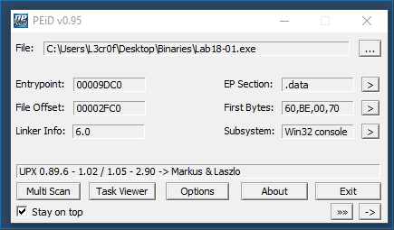
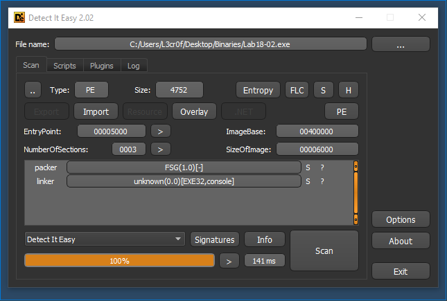
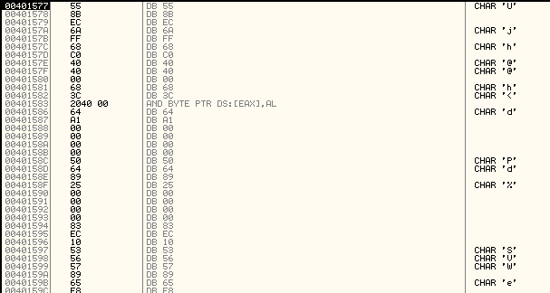
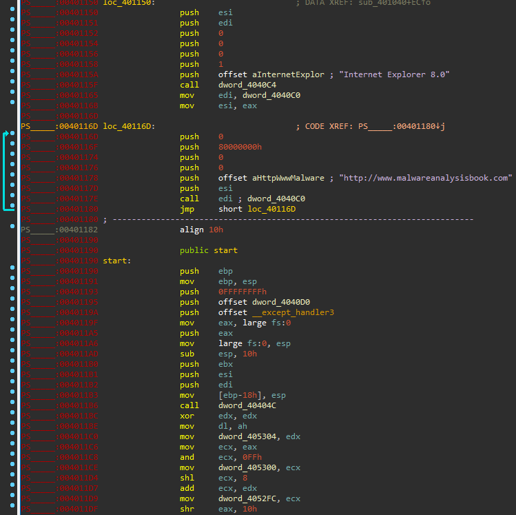

# Lab 18 - Packers and Unpacking

Your goal for the labs in this chapter is simply to unpack the code for further analysis. For each lab, you should try to unpack the code so that other static analysis techniques can be used. While you may be able to find an automated unpacker that will work with some of these labs, automated unpackers won’t help you learn the skills you need when you encounter custom packers. Also, once you master unpacking, you may be able to manually unpack a file in less time than it takes to find, download, and use an automated unpacker.

Each lab is a packed version of a lab from a previous chapter. Your task in each case is to unpack the lab and identify the chapter in which it appeared. The files are Lab18-01.exe through Lab18-05.exe.

## Lab 18-1

The first we do is loading the sample in a tool such as _PEView_ and see what it cointains.


At first sight we can see that the sample seems to be packed with _UPX_. Let's verify it with _PEiD_.



Great! It is packed with _UPX_. We can follow two approaches, the first and easiest one is running the following command:

```
C:\> upx -d Lab18-01.exe -o Lab18-01_unpacked.exe

upx: Lab18-01.exe: NotPackedException: not packed by UPX
```

Mmmm... Interesting, the file has not been packed with _UPX_ or at least with the regular one, we will have to dig in it to unpack it, something we had done in the second approach.

We load the binary in _IDA Pro_ and start looking for the last _jump_ instruction, which is located at _0x00409F43_.


Now, we load the sample into _OllyDBG_ and set a breakpoint at this memory location


We run the sample until there (F9) and then we press either _Step into_ (F7) or _Step over_ (F8).


Great! We are now into the unpacked code of the sample!

So now, click on "Plugins -> OllyDump -> Dump debugged process


After that, click ok and _Olly_ will do the rest (_OllyDBG_ will get the current _EIP_ as entry point).


Let's see if the dumped process has been successfully unpacked.


As we can see, the malware has been successfully unpacked! Now, we need to identify which sample is.

The first thing we see that draw our attention is the string `http://www.practicalmalwareanalysis.com/%s/%c.png`, which was seen in a the sample _Lab14-01.exe_.

## Lab 18-2

In this case, the first thing we do is using a tool called _Detect It Easy (DIE)_. This tool wil allow us to detect if some packer has been used to protect the sample.



As we can see, the tool has detected the usage of the _FSG 1.0_ packer. Something that _PEiD_ has also detected.


We load the binary into _IDA Pro_, but we cannot see where the sample calls the unpacked code, we only can see a routine that makes changes to memory.

We decide to use the _OllyDBG_ plugin _OllyDump_ and its function "Find OEP by Section Hop (trace over)".


We see that the program has run until it reaches the address _0x00401090_, which is _0x90_ bytes after the common start of _PE_ files.


Since _OllyDBG_ failed to detect this section of data as code, we can try to execute the _OllyDBG_ function "Analyse Code" (right click -> Analysis -> Analyse Code) to try to get the assemly code (if this not work, execute the opposite function "Remove analysis from selection".


As we can see, the code now seems the beginning of the function.


Also, if we scroll up we can see the code where the malware uses _CoCreateInstance_, which allows it to use the function _Navigate_ of the _IWebBrowser2_ interface, to execute _Internet Explorer_ to open the webpage "http://www.malwareanalysisbook.com/ad.html".


Now, we can dump the process if we want to analyze it in _IDA Pro_.

Also, we can do the same process with the _IDA Pro_ plugin _Universal PE Unpacker_.


This plugin will request the _Start address_ and the _End address_, which will be calculated automatically. However, we can also get this values if we look at the beginning of the packed sample.


When we run the sample, we will see how it will be perfectly unpacked (do not forget to previosuly set up the debugger).


This malware sample is the one called _Lab07-02.dll_.

## Lab 18-3

This new sample is first analyzed using both _Detect It Easy (DIE)_ and _PEiD_.


As we can see, both applications have detected _PECompact (1.68 - 1.84)_ as the packer used by the malware.

In this case, we opened the sample in _OllyDBG_ and try another approach, setting a breakpoint after every loop. This method is quite exhausting, but effective, since we arrive to the expected _OEP_.



Also, we need to fix this code by executing "Analyse Code" as in the previous exercise.


Then we dump the process and check in _IDA Pro_ if it has been succesfully unpacked.


Another way to get the _OEP_ of the sample, which also is more efficient, is as follows.

We see at the entry point of the packed sample that it executes these instructions:

```
pushfd	-> saves the state of flags in the stack
pushad	-> saves the state of registers in the stack
```


These instructions will save the state of registers and flags in the stack, so it is possible that at the end of the unpacking routine the opposite instructions (_popfd_ and _popad_) will be executed, so as to restore the stack.

The approach will be the following, we will see what data is pushed to the stack and add a memory access breakpoint to the last element pushed in the stack by the _pushad_ instruction.

So first we run the sample until it executes the instruction _pushad_ and get the value of _ESP_.


We go to that address (_0x0012FFA0_) in the memory dump (right click on _ESP_ and click on "Follow in dump").


Now, we right click on the first element and select "Breakpoint -> Hardware, on access -> DWORD" (since a regular memory access breakpoint will result in an unhandled exception).


Now, we execute the sample until it hits our breakpoint.


Finally we step over the sample until the next return, which will the one that takes us to the _OEP_.

The unpacked sample is the one called _Lab09-02.exe_.

## Lab 18-4

As we did in the previous exercises, we load the sample in _PEiD_ and _Detect It Easy (DIE)_.


We can see how this sample is packed using _ASPack(2.12)_ or _ASPack(2.12 - 2.42)_.

We load this sample in _OllyDBG_ to see what it does. The first thing we see is the known _pushad_ instruction seen in the previous exercise, so... Let's try the same technique!


We execute the sample until it reaches the instruction after the _pushad_ instruction and we check what value has the _ESP_ register.


So we set a _DWORD_ memory access breakpoint at the first value of the stack, and execute the sample.


Then, we step over until it returns and we will see the _OEP_ (if _OllyDBG_ failed to recognize the code, click on _Analyse code_).


We dump the binary with _OllyDump_ and then we load it in _IDA Pro_.


As we can see, the sample is the one known as _Lab09-01.exe_.

## Lab 18-5

First, we check what kind of packing algorithm the sample used:


The packer seems to be _(Win)Upack 0.39_, let's analyze the sample deeper to unpack it.

In this case, we will follow another approach. We will search where the function _LoadLibraryA_ and _LoadLibraryW_ are loaded (these functions will be used by the unpacking procedure to restore the _IAT_) and add a breakpoint to it. We use this function because, usually, the number of calls to _LoadLibraryA_ and _LoadLibraryW_ is quite smaller that the one to _GetProcAddress_.

To locate the _LoadLibraryA_ and _LoadLibraryW_ functions, we click in the modules panel (letter "E") and double click on the module name, this will led us to the code section of such library. Then, we press _CTRL+G_ (Enter expression to follow) and introduce "LoadLibraryA" and "LoadLibraryW", this will take us to these functions.


We set up a breakpoint at the beginning of such function and begin the execution.

Doing so how the sample loads the following libraries:

```
KERNEL32.DLL
ADVAPI32.DLL
WININET.DLL
advapi32.dll
kernel32.dll
advapi32.dll
comctl32.dll
```


Then, the sample continues running, so we need to execute the sample until it reaches the last call to _LoadLibraryA_ or _LoadLibraryW_ (in this case the second one) and then repeat the same procedure with _GetProcAddress_.

```
...
InternetOpenUrlA
InternetOpenA
```

We get to _InternetOpenA_ as the last function to be called using _GetProcAddress_. After that, we step over some instructions until we reach to the program _OEP_.


We dump the binary with _OllyDump_ and open it in _IDA Pro_ to analyze it.




Mmmm... It seems _IDA Pro_ failed to recognize some things, like the imported functions. However, we can repair by viewing the address of the called function in _OllyDBG_. However, in this case we only have to identify the binary, since we know we have previously analyzed.

The binary is the one called _Lab07-01.exe_.
