# Lab 20 - C++ Analysis

## Lab 20-1

The purpose of this first lab is to demonstrate the usage of the _this_ pointer. Analyze the malware in Lab20-01.exe.

**1. Does the function at 0x401040 take any parameters?**

This function does not take any parameters, since any push instruction prior the _call_ instruction is executed. However, the function uses the _this_ pointer set before the function call is made.


**2. Which URL is used in the call to URLDownloadToFile?**

The sample will load the _URL_ _http://www.practicalmalwareanalysis.com/cpp.html_ into the address pointed by the _this_ pointer in the _WinMain_ function. Then, in the function at _0x00401040_, this address will be accessed by means of _this_ pointer. This process is better explained in the following picture:

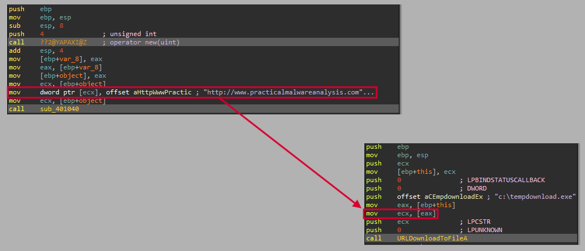

**3. What does this program do?**

The program will execute the function _URLDownloadToFileA_ to download the file _http://www.practicalmalwareanalysis.com/cpp.html_ and save it to ·"c:\tempdownload.exe".

## Lab 20-2

The purpose of this second lab is to demonstrate virtual functions. Analyze the malware in Lab20-02.exe.

_NOTE This program is not dangerous to your computer, but it will try to upload possibly sensitive files from your machine._

**1. What can you learn from the interesting strings in this program?**

To do so, first, we execute the _strings_ command:

```
C:\> strings Lab20-02.exe

...
.pdf
.doc
%s-%d.pdf
pdfs
ftp.practicalmalwarenalaysis.com
Home ftp client
%s-%d.doc
docs
C:\*
...
```

Mmmm... Interesting! It seems that this sample performs some actions regarding _FTP_ communication and documents (_PDF_ and _DOC_).

**2. What do the imports tell you about this program?**

To get the imports of the binary we use the _Python_ script "Scripts/General/get_file_imports.py" as follows:

```
C:\> python get_file_imports.py Lab20-02.exe

######################
IMPORTS
######################
======================
KERNEL32.dll
======================
FindNextFileA
FindClose
FindFirstFileA
FlushFileBuffers
GetStringTypeW
GetStringTypeA
LCMapStringW
LCMapStringA
MultiByteToWideChar
SetStdHandle
LoadLibraryA
GetProcAddress
HeapAlloc
GetModuleHandleA
GetStartupInfoA
GetCommandLineA
GetVersion
ExitProcess
HeapDestroy
HeapCreate
VirtualFree
HeapFree
VirtualAlloc
HeapReAlloc
TerminateProcess
GetCurrentProcess
UnhandledExceptionFilter
GetModuleFileNameA
FreeEnvironmentStringsA
FreeEnvironmentStringsW
WideCharToMultiByte
GetEnvironmentStrings
GetEnvironmentStringsW
SetHandleCount
GetStdHandle
GetFileType
RtlUnwind
WriteFile
GetLastError
SetFilePointer
GetCPInfo
GetACP
GetOEMCP
CloseHandle
======================
WININET.dll
======================
InternetCloseHandle
FtpPutFileA
InternetOpenA
InternetConnectA
FtpSetCurrentDirectoryA
======================
WS2_32.dll
======================
WSAStartup
gethostname
```

All these imports tells us several interesting things about the sample like:

- It performs some Internet connection.
- It performs some _FTP_ connection.
- It performs file operations.

**3. What is the purpose of the object created at 0x4011D9? Does it have any virtual functions?**

This object _var_15_ (which is located in a function called _main_code_ located at _0x00401000_) have a total of two virtual functions as we can see in the following picture:

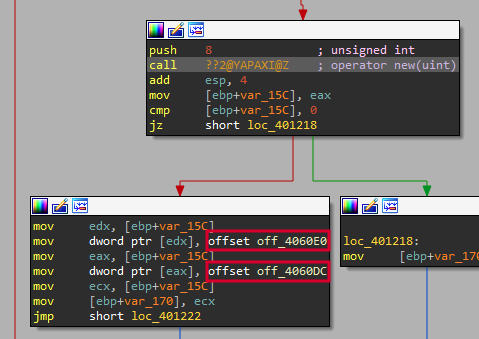

This virtual functions point to two functions located at _0x00401370_ and _0x00401440_.

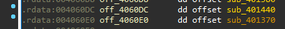

Let's analyze them to see what it hides.

The first one, located at _0x00401370_, seems to be a routine that sets the _this_ pointer to a variable located at _EBP-4_. This routine may have been generated by the compiler in an unoptimized way. However, we have called this function _set_this_.

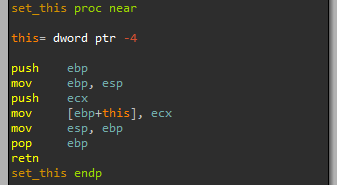

Then, regarding the function at _0x00401440_, it seems to be where de communication with the _C&C_ takes place.

First, it initializes the connection by means of _InternetOpenA_, using the user agent "Home ftp client". Then, it stablish the connection to _ftp.practicalmalwarenalaysis.com_ using _InternetConnectA_. As we can see, it uses the _FTP_ protocol to do so.

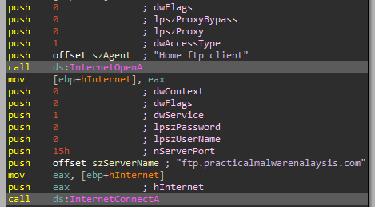

After that, the sample changes the _FTP_ directory to "docs" using _FtpSetCurrentDirectoryA_.

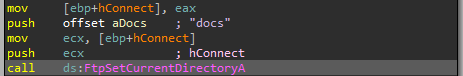

Then, we can see how the name of a document is created. However, if we take a look to the global variable used to do so, we can see how both are a composed by _null_ values. These variables must be set in other parts of the code.

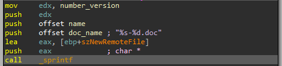

If we take a look to the _xrefs_, we can see how the variable that we have called _number_version_ is only incremented by one once some operations have been completed.

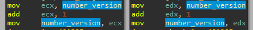

In the case of the _name_ variable, we can see how this variable is set by means of _gethostbyname_ at _WinMain_.

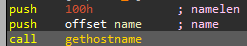

So the name of the file will have the following format: `<hostname>-<version>.doc -> bottlemax-10.doc`

After that, we can see how a file referenced by the _this_ pointer plus 4 will be put to the _FTP_ with the previous name to the server by means of _FtpPutFileA_.

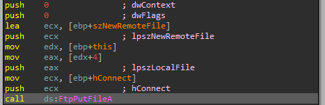

So this routine have been renamed to _put_doc_to_ftp_.

We also have modified the pointers of such routines by adding the _ptr__ prefix and the object _var_15_ that we have previously seen to _ftp_1_ and its copies to _ftp_1_x_, being 'x' a numeric value.

**4. Which functions could possibly be called by the call [edx] instruction at 0x401349?**

To do so, we have to analyze also the previous objects created by the code. At first glance, there seems to be only one, created at _0x0040126A_, that have two virtual functions, one of them has been previously analyzed.

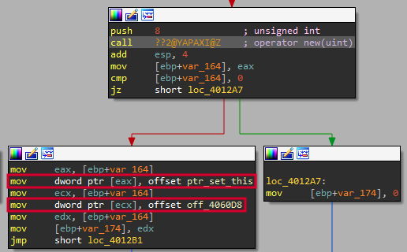

If we take a look to the function referenced by the pointer _off_4060D8_, located at _0x00401380_, we can see how it is the same _FTP_ function that we have previously analyzed, but with a different _FTP_ directory and filename format.

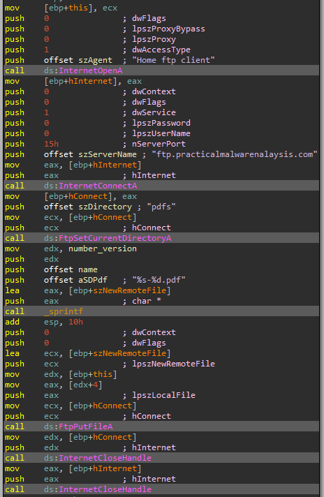

It uses the directory "pdfs" and the file format: `<hostname>-<version>.pdf -> bottlemax-10.pdf`

So we rename this function to _put_pdf_to_ftp_ and its pointers as previously done.

Now, we have a more accurate vission of what these objects does.

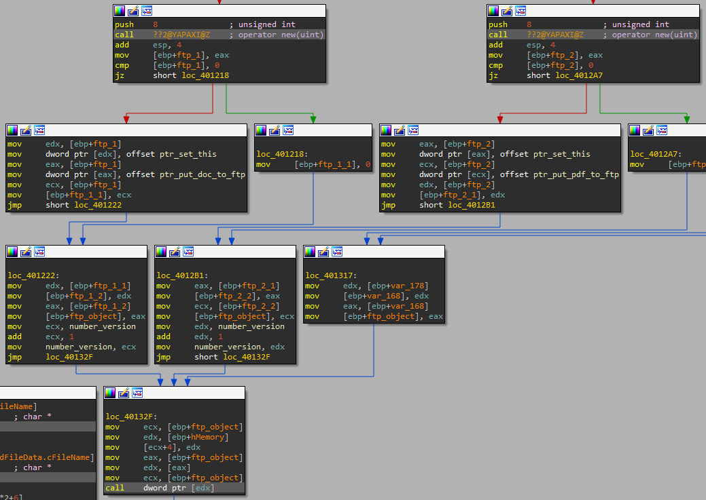

As we can see, the call instruction access the memory location at _EDX_, which points to the _FTP_ object previously created, so it will call either _put_doc_to_ftp_ or _put_pdf_to_ftp_. However, we have to see how the variable _hMemory_ is put at _FTP_ object plus 4, which is where the function _FtpPutFileA_ gets its argument _lpszLocalFile_, which is the local filename to put to the _FTP_ server. This is explained in the following picture:

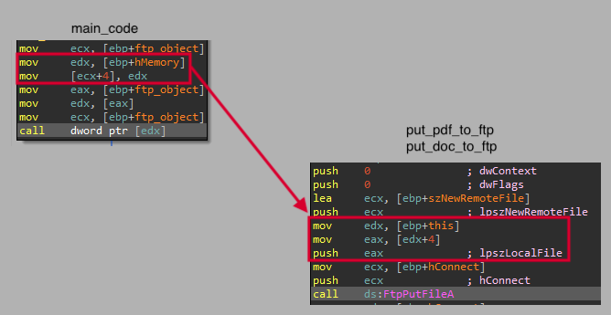

This is also confirmed when we see where the variable _hMemory_ is set:

First, the program will call the function in the _WinMain_ using the root path as argument "C:\\", this variable will be called _path_ in the _main_code_ function, and a numeric variable with the value set to 0, this variable will be called _depth_ in the _main_code_ function.

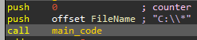

Then, the _path_ variable will be used to list all files of the system in a recursive way using _FindFirstFileA_, if the _depth_ variable is greater than 7, it will exit.

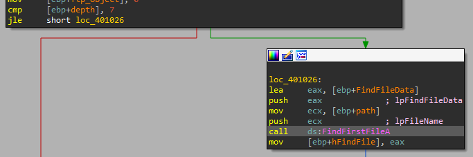

The path of the listed files is then stored in the _hMemory_ variable.

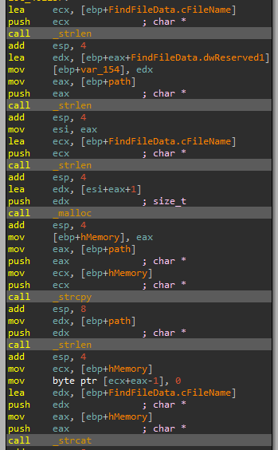

We rename this variable to _filepath_.

Now, the sample will check whether the file is a ".doc" file or a ".pdf" file.

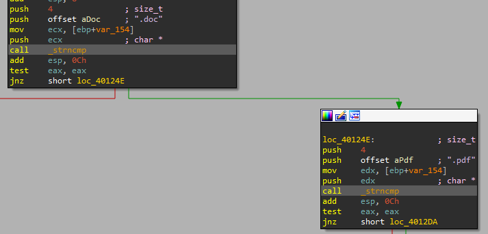

Finally, if the file have the expected extension, it will be sent to the _FTP_ server as we have previously seen.

**5. How could you easily set up the server that this malware expects in order to fully analyze the malware without connecting it to the Internet?**

To do so, we have to use _ApateDNS_ to redirect the _FTP_ to our localhost and install and _FTP_ server such as the one included in _XAMPP_.

Then we run the sample and wait the expected files.

**6. What is the purpose of this program?**

Explained in exercise 4.

**7. What is the purpose of implementing a virtual function call in this program?**

This allows the sample to use different upload options to the _FTP_ server based on the file extension.

## Lab 20-3

This third lab is a longer and more realistic piece of malware. This lab comes with a configuration file named config.dat that must be in the same directory as the lab in order to execute properly. Analyze the malware in Lab20-03.exe.

**1. What can you learn from the interesting strings in this program?**

**2. What do the imports tell you about this program?**

**3. At 0x4036F0, there is a function call that takes the string Config error, followed a few instructions later by a call to CxxThrowException. Does the function take any parameters other than the string? Does the function return anything? What can you tell about this function from the context in which it’s used?**

**4. What do the six entries in the switch table at 0x4025C8 do?**

**5. What is the purpose of this program?**
