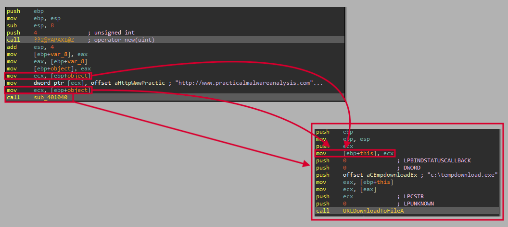

# Lab 20 - C++ Analysis

## Lab 20-1

The purpose of this first lab is to demonstrate the usage of the _this_ pointer. Analyze the malware in Lab20-01.exe.

**1. Does the function at 0x401040 take any parameters?**

This function does not take any parameters, since any push instruction prior the _call_ instruction is executed. However, the function uses the _this_ pointer set before the function call is made.



**2. Which URL is used in the call to URLDownloadToFile?**

The sample will load the _URL_ _http://www.practicalmalwareanalysis.com/cpp.html_ into the address pointed by the _this_ pointer in the _WinMain_ function. Then, in the function at _0x00401040_, this address will be accessed by means of _this_ pointer. This process is better explained in the following picture:


**3. What does this program do?**

The program will execute the function _URLDownloadToFileA_ to download the file _http://www.practicalmalwareanalysis.com/cpp.html_ and save it to ·"c:\tempdownload.exe".

## Lab 20-2

The purpose of this second lab is to demonstrate virtual functions. Analyze the malware in Lab20-02.exe.

_NOTE This program is not dangerous to your computer, but it will try to upload possibly sensitive files from your machine._

**1. What can you learn from the interesting strings in this program?**

To do so, first, we execute the _strings_ command:

```
C:\> strings Lab20-02.exe

...
.pdf
.doc
%s-%d.pdf
pdfs
ftp.practicalmalwarenalaysis.com
Home ftp client
%s-%d.doc
docs
C:\*
...
```

Mmmm... Interesting! It seems that this sample performs some actions regarding _FTP_ communication and documents (_PDF_ and _DOC_).

**2. What do the imports tell you about this program?**

To get the imports of the binary we use the _Python_ script "Scripts/General/get_file_imports.py" as follows:

```
C:\> python get_file_imports.py Lab20-02.exe

######################
IMPORTS
######################
======================
KERNEL32.dll
======================
FindNextFileA
FindClose
FindFirstFileA
FlushFileBuffers
GetStringTypeW
GetStringTypeA
LCMapStringW
LCMapStringA
MultiByteToWideChar
SetStdHandle
LoadLibraryA
GetProcAddress
HeapAlloc
GetModuleHandleA
GetStartupInfoA
GetCommandLineA
GetVersion
ExitProcess
HeapDestroy
HeapCreate
VirtualFree
HeapFree
VirtualAlloc
HeapReAlloc
TerminateProcess
GetCurrentProcess
UnhandledExceptionFilter
GetModuleFileNameA
FreeEnvironmentStringsA
FreeEnvironmentStringsW
WideCharToMultiByte
GetEnvironmentStrings
GetEnvironmentStringsW
SetHandleCount
GetStdHandle
GetFileType
RtlUnwind
WriteFile
GetLastError
SetFilePointer
GetCPInfo
GetACP
GetOEMCP
CloseHandle
======================
WININET.dll
======================
InternetCloseHandle
FtpPutFileA
InternetOpenA
InternetConnectA
FtpSetCurrentDirectoryA
======================
WS2_32.dll
======================
WSAStartup
gethostname
```

All these imports tells us several interesting things about the sample like:

- It performs some Internet connection.
- It performs some _FTP_ connection.
- It performs file operations.

**3. What is the purpose of the object created at 0x4011D9? Does it have any virtual functions?**

This object _var_15_ (which is located in a function called _main_code_ located at _0x00401000_) have a total of two virtual functions as we can see in the following picture:


This virtual functions point to two functions located at _0x00401370_ and _0x00401440_.


Let's analyze them to see what it hides.

The first one, located at _0x00401370_, seems to be a routine that sets the _this_ pointer to a variable located at _EBP-4_. This routine may have been generated by the compiler in an unoptimized way. However, we have called this function _set_this_.


Then, regarding the function at _0x00401440_, it seems to be where de communication with the _C&C_ takes place.

First, it initializes the connection by means of _InternetOpenA_, using the user agent "Home ftp client". Then, it stablish the connection to _ftp.practicalmalwarenalaysis.com_ using _InternetConnectA_. As we can see, it uses the _FTP_ protocol to do so.


After that, the sample changes the _FTP_ directory to "docs" using _FtpSetCurrentDirectoryA_.


Then, we can see how the name of a document is created. However, if we take a look to the global variable used to do so, we can see how both are a composed by _null_ values. These variables must be set in other parts of the code.


If we take a look to the _xrefs_, we can see how the variable that we have called _number_version_ is only incremented by one once some operations have been completed.


In the case of the _name_ variable, we can see how this variable is set by means of _gethostbyname_ at _WinMain_.


So the name of the file will have the following format: `<hostname>-<version>.doc -> bottlemax-10.doc`

After that, we can see how a file referenced by the _this_ pointer plus 4 will be put to the _FTP_ with the previous name to the server by means of _FtpPutFileA_.


So this routine have been renamed to _put_doc_to_ftp_.

We also have modified the pointers of such routines by adding the _ptr__ prefix and the object _var_15_ that we have previously seen to _ftp_1_ and its copies to _ftp_1_x_, being 'x' a numeric value.

**4. Which functions could possibly be called by the call [edx] instruction at 0x401349?**

To do so, we have to analyze also the previous objects created by the code. At first glance, there seems to be only one, created at _0x0040126A_, that have two virtual functions, one of them has been previously analyzed.


If we take a look to the function referenced by the pointer _off_4060D8_, located at _0x00401380_, we can see how it is the same _FTP_ function that we have previously analyzed, but with a different _FTP_ directory and filename format.


It uses the directory "pdfs" and the file format: `<hostname>-<version>.pdf -> bottlemax-10.pdf`

So we rename this function to _put_pdf_to_ftp_ and its pointers as previously done.

Now, we have a more accurate vission of what these objects does.


As we can see, the call instruction access the memory location at _EDX_, which points to the _FTP_ object previously created, so it will call either _put_doc_to_ftp_ or _put_pdf_to_ftp_. However, we have to see how the variable _hMemory_ is put at _FTP_ object plus 4, which is where the function _FtpPutFileA_ gets its argument _lpszLocalFile_, which is the local filename to put to the _FTP_ server. This is explained in the following picture:


This is also confirmed when we see where the variable _hMemory_ is set:

First, the program will call the function in the _WinMain_ using the root path as argument "C:\\", this variable will be called _path_ in the _main_code_ function, and a numeric variable with the value set to 0, this variable will be called _depth_ in the _main_code_ function.


Then, the _path_ variable will be used to list all files of the system in a recursive way using _FindFirstFileA_, if the _depth_ variable is greater than 7, it will exit.


The path of the listed files is then stored in the _hMemory_ variable.


We rename this variable to _filepath_.

Now, the sample will check whether the file is a ".doc" file or a ".pdf" file.


Finally, if the file have the expected extension, it will be sent to the _FTP_ server as we have previously seen.

**5. How could you easily set up the server that this malware expects in order to fully analyze the malware without connecting it to the Internet?**

To do so, we have to use _ApateDNS_ to redirect the _FTP_ to our localhost and install and _FTP_ server such as the one included in _XAMPP_.

Then we run the sample and wait the expected files.

**6. What is the purpose of this program?**

Explained in exercise 4.

**7. What is the purpose of implementing a virtual function call in this program?**

This allows the sample to use different upload options to the _FTP_ server based on the file extension.

## Lab 20-3

This third lab is a longer and more realistic piece of malware. This lab comes with a configuration file named config.dat that must be in the same directory as the lab in order to execute properly. Analyze the malware in Lab20-03.exe.

**1. What can you learn from the interesting strings in this program?**

To check so we execute the following command:

```
strings Lab20-03.exe

...
Encoding Args Error
/srv.html
/put.html
/get.html
/response.html
/info.html
/index.html
.?AUBackdoorClientParentError@@
.?AUBackdoorClientError@@
Beacon response Error
Caught exception during pollstatus: %s
Polling error
%s?id=%s
.?AUCmdParseError@@
Arg parsing error
%s %s "%s"
Error uploading file
Error downloading file
user=%s, host=%s, Major Version=%d, Minor Version=%d, Locale=%d
Error conducting machine survey
Create Process Failed
;computer=
volsn=
victim;
Failed to gather victim information
...
Error sending Http get
GET %s HTTP/1.1
HOST: %s
User-Agent: %s
Accept: text/html
Accept-Language: en-uk,en
Accept-Charset: utf-8
Connection: close
data=
.?AUPostError@@
POST %s HTTP/1.1
HOST: %s
User-Agent: %s
Content-Length: %d
Content-Type: application/x-www-form-urlencoded
Error sending Http post
.?AUWsaStartupError@@
Failed to initialize WSA
...
```

It seems that this sample is an info-stealer that tries to gather as much information about the system where is being executed. It seems to have _HTTP_ communication capabilities and the possibility of uploading and downloading files.

**2. What do the imports tell you about this program?**

To get the imports of the binary we use the _Python_ script "Scripts/General/get_file_imports.py" as follows:

```
C:\> python get_file_imports.py Lab20-03.exe

######################
IMPORTS
######################
======================
KERNEL32.dll
======================
CloseHandle
GetFileSize
CreateFileA
WriteFile
ReadFile
GetVersionExA
GetComputerNameA
CreateProcessA
GetLastError
GetSystemDefaultLCID
Sleep
SetStdHandle
LoadLibraryA
GetProcAddress
GetOEMCP
GetACP
GetCPInfo
...
GetEnvironmentStringsW
SetHandleCount
GetStdHandle
GetFileType
GetStartupInfoA
SetFilePointer
FlushFileBuffers
======================
ADVAPI32.dll
======================
GetUserNameA
======================
WS2_32.dll
======================
WSAStartup
WSACleanup
send
recv
inet_addr
gethostbyname
WSAGetLastError
closesocket
htons
socket
connect
```

We can learn the following about this piece of malware based on its imports:

- It can communicate through Internet.
- It can perform file operations.
- It gets information about the system.

**3. At 0x4031C1, there is a function call that takes the string Config error, followed a few instructions later by a call to CxxThrowException. Does the function take any parameters other than the string? Does the function return anything? What can you tell about this function from the context in which it’s used?**

This call executes the function at _0x004036F0_, which receives one argument and the _pExceptionObject_ pointer at _ECX_ register, which in the called function will be represented by the _this_ pointer.


The function at _0x004036F0_ seems to be quite large and with different calls to unknowns functions within it. However, based on the context we can see that this function prepares the error message before calling _\_CxxThrowException_, so we can call it _parse_error_1_ (since it can be more functions like this one).

**4. What do the six entries in the switch table at 0x4025C8 do?**

To know what these switch table entries does, we need to know the context first.

This switch statement is executed in a function at _0x00402410_, which is called by the function at _0x00403BE0_, called _main_code_ since it is the only function called by _\_main_ function.


The function _0x00402410_ called by _main_code_ is executed within a _sleep_ loop, which may indicate that _C&C_ communication is being performed.


Once in that function, we can see that a call instruction is executed, it executes the function at _0x00403D50_, which seems to perform some socket and connection innitialization, so we rename it to _connection_setup_.

This function first calls a function that calls _WSAStartup_ (renamed to _\_WSAStartup_) using the hostname `Internet Explorer 10.0`, which is quite unusual.


Then, a function at _0x004042C0_ is called, this function has been renamed to _host_lookup_. It is there where we can see where the _IP_ address or domain name of the _C&C_ is checked by means of _cp_ pointer using _inet_addr_ and _gethostbyname_.


If we go backwards, we will see how this info is obtained at function _0x00401EE0_, which is the one that loads the file _config.dat_ based on its argument, so it has been renamed to _load_config_ (this function will be later analyzed).


Back to the _connection_setup_ function, it terminates to configure the Internet communication and exits.


Then, it configures the _URL_ path and its options of the _HTTP_ get request that will perform later:


As we can see, the format of the _URL_ path and its options would be as follows:

```
str1: string from "config.dat" at 0x4
str2: string from "config.dat" at 0x14

<str1>?id=<str2>
```

Then, a function at _0x0040_ that we have called _perform_http_get_ is called, this one will perform an _HTTP GET_ request using the information extracted from the _config.dat_ file.


The headers will be something like this:

```
GET <URL path and options> HTTP/1.1
HOST: <str1>
User-Agent: Internet Explorer 10.0
Accept: text/html
Accept-Language: en-uk,en
Accept-Charset: utf-8
Connection: close
```

The function with the name _http_request_ will perform an _HTTP_ request (_GET_ or _POST_ based on the argument) by means of _send_ function.

After that, the function that we have renamed to _parse_http_response_ (_0x00404B10_) is executed. This will be the responsible for parsing the _HTTP_ response received from the server.

This function also will call _recv_http_response_ (_0x004048E0_), which will use the function _recv_ to receive the response from the server, several times. Also, the function _parse_http_response_ will check some headers of the response, so as to check the validity of it.


After that, the function _parse_http_response_ will parse the last response in order to get the expected information, which is composed by the _content-length_ and a buffer.


Then, the sample will execute the function at _0x004015C0_, which has been renamed to _decode_response_, since it seems to perform some decoding routine. However, despite it has a _base64_ alphabet, it seems that the routine does a permutation over the response based on two alphabets.

```
PLMOKNIJBUHVYGTFCRDXESZWAQzaqxswcdevfrbgtnhymjukilop
	||
	\/
ABCDEFGHIJKLMNOPQRSTUVWXYZabcdefghijklmnopqrstuvwxyz
```


This set of function calls are as follows:


Then, the sample will execute the _switch case_ (switch table at _0x004025C8_ address) based on the fourth element of the response.


This _switch_ statement is composed of 6 element, all of them executes a function, but the first one:

**a (nothing)**

Exits

**b (sleep)**

It will sleep "x" milliseconds based on the value at 5th possition of the http response (function _sleep_x_ at _0x004025E0_).


**c (Create process)**

It will execute some process based on the value at 5th possition of the http response (function _execute_process_ at _0x00402F80_).

**d (Download)**

It will execute the function _download_file_ at _0x00402BA0_, which will execute the one at _0x00402A20_, which will download a file and save it to the disk.


**e (Extract data)**

The function at _0x00402C70_ will upload a file to the server, because of that it has been renamed to _upload_file_.

**f (exFiltrate**

It will call the function _exfiltrate_data_ (_0x00402D30_), which will send the username, the computer's name and other stuff to the _C&C_.


We have renamed the function at _0x00402410_ to _execute_commands_.

**5. What is the purpose of this program?**

We know almost everything about the sample but the execution flow prior the execution of the _execute_commands_ function.

The first function the _main_code_ routine executes is the one at _0x00401EE0_, which based on the argument _config.dat_ was renamed to _load_config_ (as previously stated).

This function will call the oen a _0x00403180_, which will read the file and call the function at _0x004034D0_, which will decode de data applying _XOR_ with key _0x4E_, thus this function was renamed to _decode_data_.


We developed the following _Python_ script that will do the job:

```
def decrypt_file():
	decrypted_data = ""
	decryption_key = 0x4E

	with open("Scripts/Labs/Lab_20/config.dat", "rb") as encrypted_file:
		encrypted_byte = encrypted_file.read(1)
		while encrypted_byte:
			decrypted_char = int.from_bytes(encrypted_byte, byteorder="big") ^ decryption_key
			if decrypted_char == 0x0:
				decrypted_char = 0x20
			decrypted_data = decrypted_data + chr(decrypted_char)
			encrypted_byte = encrypted_file.read(1)

	return decrypted_data

decrypted_data = decrypt_file()
print("The decrypted config file is: " + decrypted_data)
```

When we execute the script we see the following:

```
$ python3 Scripts/Labs/Lab_20/lab20_03_decryption_config_file.py

The decrypted config file is: CBAF127.0.0.1 \ C P P _ L a x5 O t xa5 r . e x e   x5 øùúûüýþ   P   127.0.0.1 5 ?      !   B ˆ Ò  5 Ð      °þ P‘@ P5 x5
```

As we can see, some data is still unreadable, but we can read some interesting things like the _IP_ address of the _C&C_.

Also, the first four characters "CBAF" are checked after the encoding routine, so we can conclude that this string is just for checking purposes.


We modify the script to print the information in hexadecimal bytes, since the string is not as precise as it should be:

```
$ python3 Scripts/Labs/Lab_20/lab20_03_decryption_config_file.py

The decrypted config file is: 0x43 0x42 0x41 0x46 0x31 0x32 0x37 0x2e 0x30 0x2e 0x30 0x2e 0x31 0x0 0x5c 0x0 0x43 0x0 0x50 0x0 0x50 0x0 0x5f 0x0 0x4c 0x0 0x61 0x0 0x78 0x1 0x35 0x0 0x4f 0x0 0x74 0x0 0x78 0x61 0x35 0x0 0x72 0x0 0x2e 0x0 0x65 0x0 0x78 0x0 0x65 0x0 0x0 0x0 0x78 0x1 0x35 0x0 0xf8 0xf9 0xfa 0xfb 0xfc 0xfd 0xfe 0xff 0x8 0x0 0x0 0x0 0x50 0x0 0x0 0x0 0x31 0x32 0x37 0x2e 0x30 0x2e 0x30 0x2e 0x31 0x0 0x35 0x0 0x3f 0x0 0x0 0x0 0x1 0x0 0x0 0x0 0x21 0x0 0x0 0x0 0x28 0x8 0x42 0x0 0x88 0x1e 0x14 0x0 0xd2 0x3 0x0 0x0 0xdc 0x8 0x35 0x0 0xd0 0x7 0x0 0x0 0x0 0x0 0x0 0x0 0xb0 0xfe 0x12 0x0 0x50 0x91 0x40 0x0 0x50 0x6 0x35 0x0 0x78 0x1 0x35 0x0 0x5a 0x0 0x0 0x0 0x1 0x0 0x0 0x0
```

Now we can see all the decoded information.

The variables of the routine are not correctly identified, since the buffer has a length of 144 elements, not 4 as it says. We can see now how the sample checks some things about the decoded configuration.


```
buffer[0x04] = 0x31 = "1"
buffer[0x44] = 0x50 = "P"
buffer[0x8C] = 0x01
```

Then, it will copy the buffer to a new one as follows


```
// Length of 64 bytes
final_buffer [260] = 0x31 0x32 0x37 0x2e 0x30 0x2e 0x30 0x2e 0x31 0x0 0x5c 0x0 0x43 0x0 0x50 0x0 0x50 0x0 0x5f 0x0 0x4c 0x0 0x61 0x0 0x78 0x1 0x35 0x0 0x4f 0x0 0x74 0x0 0x78 0x61 0x35 0x0 0x72 0x0 0x2e 0x0 0x65 0x0 0x78 0x0 0x65 0x0 0x0 0x0 0x78 0x1 0x35 0x0 0xf8 0xf9 0xfa 0xfb 0xfc 0xfd 0xfe 0xff 0x8 0x0 0x0 0x0

// Length of 4 bytes
final_buffer [324] = 0x50 0x0 0x0 0x0

// Length of 64 bytes
final_buffer [328] = 0x31 0x32 0x37 0x2e 0x30 0x2e 0x30 0x2e 0x31 0x0 0x35 0x0 0x3f 0x0 0x0 0x0 0x1 0x0 0x0 0x0 0x21 0x0 0x0 0x0 0x28 0x8 0x42 0x0 0x88 0x1e 0x14 0x0 0xd2 0x3 0x0 0x0 0xdc 0x8 0x35 0x0 0xd0 0x7 0x0 0x0 0x0 0x0 0x0 0x0 0xb0 0xfe 0x12 0x0 0x50 0x91 0x40 0x0 0x50 0x6 0x35 0x0 0x78 0x1 0x35 0x0

// Length of 4 bytes
final_buffer [396] = 0x5a 0x0 0x0 0x0

// Length of 4 bytes
final_buffer [400] = 0x1 0x0 0x0 0x0
```

Now we can understand the different parameters related with the configuration file and checked in the _execute_commands_ routine.

This whole routine was renamed to _read_and_decode_file_.

After the function exits, some modifications regarding the decoded string are performed:


After that, the function will exit and the routine at _0x00401F80_ is called. This function seems to be the responsible for sending the innitial beacon to the server, so we have renamed to _initial_beacon_.


