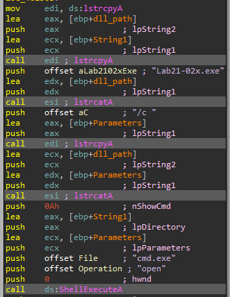

# Lab 21 - 64-Bit Malware

You’ll need a 64-bit computer and a 64-bit virtual machine in order to run the malware for these labs, as well as the advanced version of IDA Pro in order to analyze the malware.

## Lab 21-1

Analyze the code in Lab21-01.exe. This lab is similar to Lab 9-2, but tweaked and compiled for a 64-bit system.

**1. What happens when you run this program without any parameters?**

Our lab machine is a _x86 Windows XP_, so we cannot execute the sample. However, we can analyze it by means of _IDA Pro_ and see what would happen.

In the _main_ function we can see the following piece of code at the beginning.


As we can see, some unknown data is included in an array called _encoded_data_, since we cannot determine its content. Also, we see the string "1qaz2wsx3edc" that is included in a string tht we have called _key_, since we already have "encoded" content. Then, it gets the filename "ocl.exe" (_expected_filename_) and the full path of the binary via _GetModuleFileNameA_, from which extracts the filename by means of _strrchr_.

Then, the binary will perform some modifications on the _expected_filename_ string as follows.


Let's analyze what this piece of code does:

```
.text:00000001400011B0 loc_1400011B0:
.text:00000001400011B0                 movzx   ecx, byte ptr [rbp+rdi+260h+expected_filename]		-> ECX = expected_filename[RDI] (RDI works as counter)
.text:00000001400011B8                 mov     eax, 4EC4EC4Fh			-> EAX = 0x4EC4EC4F
.text:00000001400011BD                 sub     cl, 61h ; 'a'			-> CL = CL - 0x61 = expected_filename[RDI] - 0x61
.text:00000001400011C0                 movsx   ecx, cl				-> ECX = expected_filename[RDI] - 0x61
.text:00000001400011C3                 imul    ecx, ecx				-> ECX = ECX * ECX
.text:00000001400011C6                 sub     ecx, 5				-> ECX = ECX - 0x5
.text:00000001400011C9                 imul    ecx				-> EDX|EAX = ECX * EAX = ECX * 0x4EC4EC4F
.text:00000001400011CB                 sar     edx, 3				-> EDX = EDX >> 3 (EDX = 0x5C in the first iteration)
.text:00000001400011CE                 mov     eax, edx				-> EAX = EDX
.text:00000001400011D0                 shr     eax, 1Fh				-> EAX = EAX >> 0x1F = EDX >> 0x1F
.text:00000001400011D3                 add     edx, eax				-> EDX = EDX + EAX = EDX + (EDX >> 0x1F)
.text:00000001400011D5                 imul    edx, 1Ah				-> EDX = EDX * 0x1A = (EDX + (EDX >> 0x1F)) * 0x1A
.text:00000001400011D8                 sub     ecx, edx				-> ECX = ECX - EDX
.text:00000001400011DA                 test    cl, cl				-> CL == 0 ? -> if CL < 0 -> SF = 1
.text:00000001400011DC                 jns     short loc_1400011E1			-> JUMP to loc_1400011E1 if not sign (SF)
.text:00000001400011DE                 add     cl, 1Ah				-> ECX = ECX + 0x1A
.text:00000001400011E1
.text:00000001400011E1 loc_1400011E1:
.text:00000001400011E1                 add     cl, 61h ; 'a'		-> ECX = ECX + 0x61
.text:00000001400011E4                 inc     rdi				-> RDI = RDI + 1 (counter incremented)
.text:00000001400011E7                 mov     [rbp+rdi+260h+var_181], cl		-> VAR_181 + RDI = expected_filename[RDI - 1] = CL
.text:00000001400011EE                 cmp     rdi, 3				-> RDI == 3
.text:00000001400011F2                 jl      short loc_1400011B0		-> If the counter is less than 3, it will jump to loc_1400011B0
```

So now we can translate this piece of code to a _Python_ script.

```
MAX_VALUE_1 = 0xFF
MAX_VALUE_2 = 0xFFFFFFFF

def sar_32(byte, width):
	sign = byte & 0x80000000
	byte &= 0x7FFFFFFF
	byte >>= width
	byte |= sign
	return byte

def decode_filename(filename):
	name = ""
	extension = filename[3:]

	for counter in range(3):
		character = ord(filename[counter])
		constant = 0x4EC4EC4F

		character = (character & MAX_VALUE_1) - 0x61
		character = (character * character) & MAX_VALUE_2
		character = character - 0x5
		value = ((character * constant) & 0xFFFFFFFF00000000) >> 0x20

		value = sar_32(value, 3)
		aux_value = (value >> 0x1F) & MAX_VALUE_2
		value = (value + aux_value) & MAX_VALUE_2
		value = (value * 0x1A) & MAX_VALUE_2
		character = character - value 

		if character < 0:
			character = (character & MAX_VALUE_1) + 0x1A
		character = (character & MAX_VALUE_1) + 0x61

		name = name + chr(character)

	expected_filename = name + extension
	return expected_filename

filename = "ocl.exe"
expected_filename = decode_filename(filename)

print("The expected filename is: " + expected_filename)
```

When we execute the script, we obtain the following result:

```
$ python3 Scripts/Labs/Lab_21/lab21_01_filename_decoding.py

The expected filename is: jzm.exe
```

Then, the sample will do a comparison between the decoded string and the filename of the binary (it removes the slash from the filename stored in _R11_), if they are different, it will terminate the execution.


So, if we execute this sample as it is, it will exit, since it has a different name from "jzm.exe".

**2. Depending on your version of IDA Pro, main may not be recognized automatically. How can you identify the call to the main function?**

If _IDA_ did not recognize the _main_ function, we can identify it as following:

- The _main_ function is executed after calling the _GetCommandLineA_ routine.
- The _main_ function receives 3 arguments (1 integer and 2 pointers): _argc_, _argv_ and _envp_.

**3. What is being stored on the stack in the instructions from 0x0000000140001150 to 0x0000000140001161?**

At this position, we have seen that the "ocl.exe" string is stored in the stack.

**4. How can you get this program to run its payload without changing the filename of the executable?**

We can modify the instruction at _0x000000014000120A_ `test eax, eax` with the instruction `xor eax, eax`, this will always result in executing the main payload. To do so, we put the cursor on the instruction and execute "Edit -> Patch program -> Assemble", then we change the original instruction for the one we have chosen.


**5. Which two strings are being compared by the call to strncmp at 0x0000000140001205?**

Explained in the exercise 1.

**6. Does the function at 0x00000001400013C8 take any parameters?**

It receives one parameter via the _RCX_ register. This parameter is a socket previously created in the _WSASocketA_ function call.


This parameter is used by the function at _0x0000000140001000_ to attach the socket to _stdin_, _stdout_ and _stderror_ of the process to create, in this case "cmd", this will allow to create a reverse shell. This function is renamed to _create_reverse_shell_.


**7. How many arguments are passed to the call to CreateProcess at 0x0000000140001093? How do you know?**

When the sample calls _CreateProcess_ in _create_reverse_shell_ function, it will pass 10 arguments as always:

```
BOOL CreateProcessA(
  LPCSTR                lpApplicationName,
  LPSTR                 lpCommandLine,
  LPSECURITY_ATTRIBUTES lpProcessAttributes,
  LPSECURITY_ATTRIBUTES lpThreadAttributes,
  BOOL                  bInheritHandles,
  DWORD                 dwCreationFlags,
  LPVOID                lpEnvironment,
  LPCSTR                lpCurrentDirectory,
  LPSTARTUPINFOA        lpStartupInfo,
  LPPROCESS_INFORMATION lpProcessInformation
);
```

However, this data is not passed via _push_ instructions, but with the registers and the stack:

```
RCX = lpApplicationName
RDX = lpCommandLine
R8 = lpProcessAttributes
R9 = lpThreadAttributes
RSP + 0xC8 - = bInheritHandles
RSP + 0xC0 - = dwCreationFlags
RSP + 0xB8 - = lpEnvironment
RSP + 0xB0 - = lpCurrentDirectory
RSP + 0xA8 - = lpStartupInfo
RSP + 0xA0 = lpProcessInformation
```


In the disassembly view in the picture of the previous exercise we can see easily this process.

## Lab 21-2

Analyze the malware found in Lab21-02.exe on both x86 and x64 virtual machines. This malware is similar to Lab12-01.exe, with an added x64 component.

**1. What is interesting about the malware’s resource sections?**

To check the resource sections of the sample, we use _Resource Hacker_.


This tells us that this sample has a total of two sections, "BIN" with three binary resources (an _x64_ executable, an _x86_ executable and an _x64_ _DLL_) and "Manifest" with the manifest of the application:

```
<assembly xmlns="urn:schemas-microsoft-com:asm.v1" manifestVersion="1.0">
  <trustInfo xmlns="urn:schemas-microsoft-com:asm.v3">
    <security>
      <requestedPrivileges>
        <requestedExecutionLevel level="asInvoker" uiAccess="false"></requestedExecutionLevel>
      </requestedPrivileges>
    </security>
  </trustInfo>
</assembly>
```

**2. Is this malware compiled for x64 or x86?**

This binary seems to be compiled fo _x86_ systems, since the field _Machine_ of _IMAGE_FILE_HEADER_ in _IMAGE_NT_HEADERS_ has the value _IMAGE_FILE_MACHINE_I386_.

**3. How does the malware determine the type of environment in which it is running?**

To find out how it does, we are going to analyze the sample with _IDA Pro_.

The first thing the sample does is loading some functions that will be used later at execution time.


Then, the sample will call _GetCurrentProcess_ and _IsWow64Process_ to check if the sample is running in a native _x86_ machine or in an _x64_ machine using _SysWOW64_ binaries. Then, it will call the function at _0x00401000_, which has been renamed to _extract_resource_, since it will extract the resource specified in the first argument in the _System_ path with the name specified in the second argument, specifying the _x64_ binaries if the machine is running under _SysWOW64_ or the _x86_ _DLL_ if the binary is in a native _x86_ system.


**4. What does this malware do differently in an x64 environment versus an x86 environment?**

Let's analyze both executions paths to check so:

**x86**

First, the malware will call the function at _0x00401130_, which has been renamed to _enable_SeDebugPrivilege_, since it will enable such privilege.


Then, it will call _EnumProcesses_ and iterate over the received array to get the "explorer.exe" _PID_ (this comparison is made in function at _0x004011A0_, called _check_explorer_process_).


If the process is found, the sample will open it using _OpenProcess_ and inject into it the previous extracted _DLL_.


**x64**

After the _x64_ binaries have been extracted (the executable and the _DLL_), the sample will execute the _x64_ binary by means of _ShellExecuteA_ using the following command:

```
C:\> cmd.exe /c Lab21-02x.exe
```

This will execute the extracted _x64_ executable.



**5. Which files does the malware drop when running on an x86 machine? Where would you find the file or files?**

The sample will drop the _DLL_ file called "Lab21-02.dll" in the _System_ path, "C:\Windows\System32".

In the following picture we can see how it creates the file in the _System_ directory after extracting the resource file (routine _extract_resource_).


**6. Which files does the malware drop when running on an x64 machine? Where would you find the file or files?**

The sample will drop two binaries, an executable file called "Lab21-02x.exe" and a _DLL_ file called "Lab21-02x.dll" in the _System_ path (this is done in the same way as _x86_ binary explained before), but in this case is "C:\Windows\SysWOW64", since the malware is running in the _x86_ version of a _x64_ system.

**7. What type of process does the malware launch when run on an x64 system?**

When running on an _x64_ system, the process will launch the binary "Lab21-02x.exe", which if we extract and analyze it, will see that it is an _x64_ binary.


**8. What does the malware do?**

If we analyze the binary _Lab21-02x.exe_, we will see how it does the same as the _x86_ executable but the _SysWOW64_ check, it will inject the extracted _DLL_ into "explorer.exe".

In the case of the _DLL_ files, they will create a message box every minute that says "Practical Malware Analysis x" ("x" is a numeric value).


